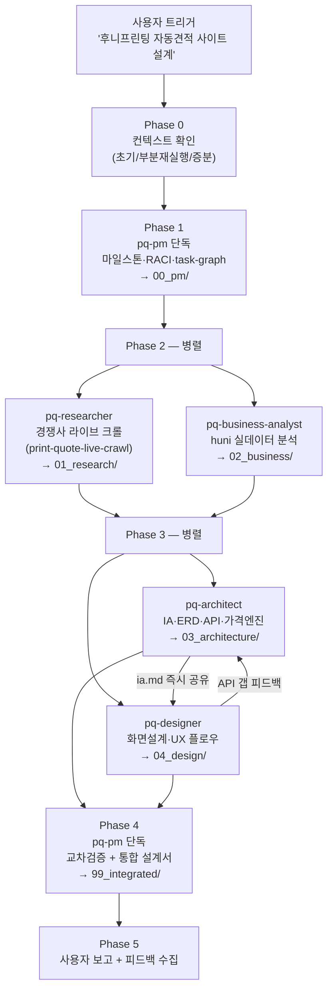
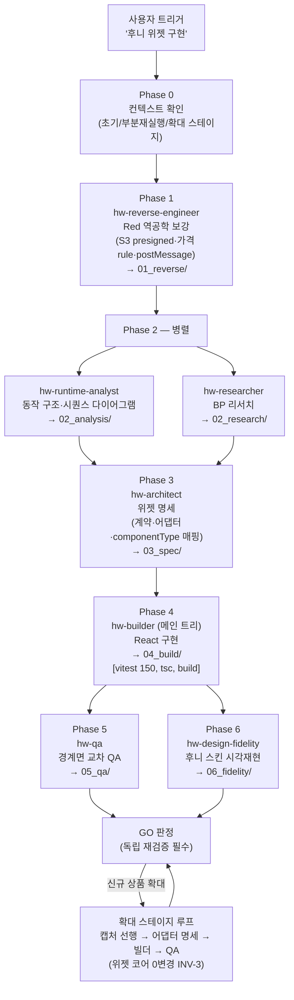
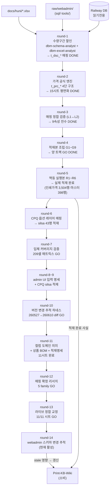
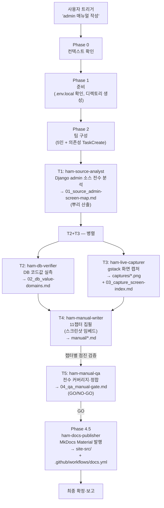
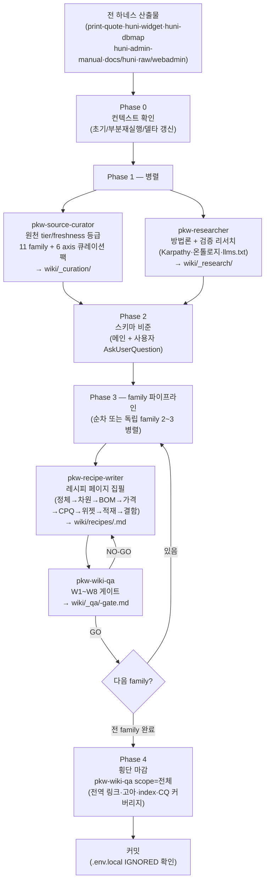
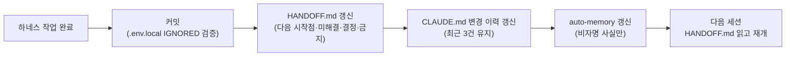

# HuniWeb — 데이터 흐름

> 개요: [overview.md](overview.md) | 모듈: [modules.md](modules.md) | 의존성: [dependencies.md](dependencies.md) | 진입점: [entry-points.md](entry-points.md)

---

## 1. Print-Quote 파이프라인

**입력 자산:** `docs/huni/*.xlsx·pdf`, `_workspace/print-quote/_baseline/` (이전 스키마 7종), buysangsang.com (라이브 크롤)

**산출물:** `_workspace/print-quote/` — 설계 문서 ~30개 파일 (MD, SQL, wireframes)

---

## 2. Huni-Widget 파이프라인

**입력 자산:** `docs/reversing/red_reverse_engineer/` (역공학 4모듈), `raw/widget_monitor/local/` (라이브 테스트베드), `_workspace/print-quote/04_design/DESIGN.md` (14 componentType), `.env.local` (RP_*)

**산출물:** `_workspace/huni-widget/04_build/` — React 위젯 구현 코드 (유일한 1차 앱 코드)

---

## 3. Huni-DBMap 파이프라인 (round 기반 진화)

**입력 자산:** `docs/huni/*.xlsx` (상품마스터·가격표), `raw/webadmin/` (적재 oracle), Railway DB (읽기전용), `.env.local` (RAILWAY_DB_*)

Huni-DBMap은 단일 파이프라인이 아니라 **round 단위로 진화하는 다중 트랙** 구조다. 각 round는 이전 round의 산출물을 입력으로 받는다.

**게이트 체계:**
- round-4: G1~G9 (적재 가능성)
- round-5: R1~R6 (멱등성·실행 가능성)
- round-6: 트리거 reference resolution
- round-7: C1~C8 (입체 커버리지)
- round-10: V1~V8 (변경 추적)
- round-12: M1~M6 (매핑 확정)
- round-13: K1~K6 (라이브 교정)
- round-14: W1~W6 (스키마 변경)

---

## 4. Huni-Admin-Manual 파이프라인

**입력 자산:** `raw/webadmin/` (Django 소스), Railway DB (읽기전용), 라이브 admin 사이트 (읽기 탐색만)

**산출물:** `_workspace/huni-admin-manual/` — 매뉴얼 11챕터·스크린샷 41개·MkDocs 사이트

---

## 5. Print-KB-Wiki 파이프라인

**입력 자산:** 전 하네스 산출물 + `docs/huni/` + `raw/webadmin/` (read-only 전부)

**W-gate 요약:**
- W1: 날조 없음 (출처+badge 전수)
- W2: 뼈대 완전성 (8섹션)
- W3: 라이브 DB 정합 (t_* 행 실측)
- W4: 가격 사슬 추적 (file:§ 인용)
- W5: 위젯 계약 정합 (src/contract/ 일치)
- W6: 결함 현황 양면 표기 (현재값 vs 정답)
- W7: STALE/v03 인용 0
- W8: dry walk-through (위키만으로 등록 절차 완결)

---

## 공통 핸드오프 사이클

모든 하네스가 세션 경계에서 따르는 표준 루틴이다.

**핸드오프 트리거:** "다음세션을 위해 정리" / "핸드오프 정리" / "세션 마무리" → `CLAUDE.md §4` 루틴 자동 실행.

HANDOFF.md 보유 하네스: `huni-widget`, `huni-dbmap`, `huni-admin-manual`
HANDOFF 미보유 (CHANGELOG + CLAUDE.md로 대체): `print-quote`, `print-kb-wiki`
