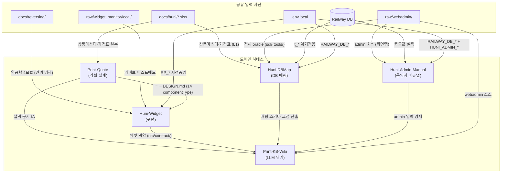

# HuniWeb — 의존성 지도

> 개요: [overview.md](overview.md) | 모듈: [modules.md](modules.md) | 진입점: [entry-points.md](entry-points.md) | 데이터 흐름: [data-flow.md](data-flow.md)

---

## (a) 에이전트↔스킬 바인딩 패턴

모든 하네스 에이전트는 **오케스트레이터 스킬이 스폰 프롬프트에 로드할 스킬을 명시**하는 방식으로 바인딩된다. 에이전트 자체는 범용이고, 스킬이 도메인 전문성을 주입한다.

```
오케스트레이터 스킬
  └─ Agent(subagent_type: "<harness>/<agent-name>", ...)
       ├─ 프롬프트에 메서드 스킬 로드 지시 (예: "huni-widget-build 스킬 사용")
       └─ 에이전트 정의 파일: .claude/agents/<harness>/<agent-name>.md
```

바인딩 패턴 예시:

| 하네스 | 에이전트 | 바인딩 스킬 | 비고 |
|--------|---------|------------|------|
| huni-dbmap | `dbm-mapping-designer` | `dbm-mapping` (round-1) / `dbm-price-formula` (round-2) | round에 따라 스킬 교체 |
| huni-dbmap | `dbm-validator` | round에 따라 `dbm-load-readiness` / `dbm-load-execution` / `dbm-correctness-audit` / `dbm-schema-change-tracking` | 검증 에이전트 단일, 스킬 다중 |
| huni-widget | `hw-builder` | `huni-widget-build` | 메인 트리 실행 (worktree 미사용) |
| huni-widget | `hw-qa` | `huni-widget-qa` | 독립 재검증 전용 |
| huni-admin-manual | `ham-db-verifier` | `dbm-schema-extract` (재사용) | 하네스 간 스킬 재사용 |
| print-kb-wiki | `pkw-wiki-qa` | `pkw-wiki-evaluation` | W1~W8 게이트 |

**핵심 원칙:** 생성자(builder/designer/writer)와 검증자(validator/qa)는 항상 별도 에이전트 — 동일 에이전트의 자기승인 금지.

---

## (b) 하네스 간 데이터 의존성

### Print-KB-Wiki: 전체 소비자

Print-KB-Wiki는 다른 모든 하네스의 산출물을 **읽기 전용**으로 소비한다.

| 소비 원천 | 소비 내용 | freshness 비고 |
|---------|---------|--------------|
| `_workspace/huni-dbmap/` (round-1~14) | 스키마 구조·매핑 설계·적재 현황·교정 매니페스트 | round-14 진단으로 stale 영역 존재 |
| `_workspace/huni-widget/04_build/` | 위젯 계약 (src/contract/), 어댑터 패턴 | v03 인용 금지 |
| `_workspace/print-quote/` | 상품 정의·IA·가격엔진 설계 | 설계 문서, 구현 반영 전 |
| `_workspace/huni-admin-manual/manual/` | admin 입력 경로·화면 구조 | 최신 (2026-06-10 재대조 GO) |
| `docs/huni/` | 원본 엑셀 (상품마스터·가격표) | L1 원천 |
| `raw/webadmin/` | Django 소스 (적재 oracle: sql/·tools/) | 스키마 변경 추적 대상 |

### Huni-Widget: 설계 문서 의존

| 의존 원천 | 내용 | 의존 방향 |
|---------|------|---------|
| `_workspace/print-quote/04_design/DESIGN.md` | 14 componentType 정의 | widget architect가 명세 작성 시 참조 |
| `docs/reversing/red_reverse_engineer/` | Red 역공학 4모듈 (권위 명세) | hw-reverse-engineer·hw-builder 입력 |
| `raw/widget_monitor/local/` | 라이브 위젯 테스트베드 | 라이브 캡처·fixture 생성 기반 |
| `.env.local` (RP_*, Edicus/Shopby) | Red API 자격증명 | 라이브 캡처 시 필요 |

**위젯↔DB 분리 전략:** 위젯은 `src/contract/`(정규화 계약)에만 의존. 후니 DB 미정이므로 Red 구현·검증 후 어댑터 교체로 무손실 컨버전. 위젯 코어 불변.

### Huni-DBMap: 원천 데이터 의존

| 의존 원천 | 내용 | 접근 방식 |
|---------|------|---------|
| `raw/webadmin/` | Django 소스 (sql/·tools/load_master.py = 적재 oracle) | 소스 읽기 전용 |
| Railway DB (.env.local RAILWAY_DB_*) | t_* 34테이블 라이브 DB | 읽기전용 SELECT만 |
| `docs/huni/*.xlsx` | 상품마스터·가격표 원본 | L1 충실추출 대상 |

### Huni-Admin-Manual: 라이브 시스템 의존

| 의존 원천 | 내용 | 접근 방식 |
|---------|------|---------|
| `raw/webadmin/` | Django admin 소스 | 화면 맵 작성 기반 |
| Railway DB (.env.local RAILWAY_DB_*) | 코드값·제약 실측 | 읽기전용 SELECT만 |
| 라이브 admin 사이트 (.env.local HUNI_ADMIN_*) | 실제 화면 캡처 | 읽기 탐색만 (저장/삭제 금지) |

### Print-Quote: 경쟁사 분석 의존

| 의존 원천 | 내용 |
|---------|------|
| `docs/huni/` | huni 실데이터 (xlsx·pdf 5종) |
| `_workspace/print-quote/_baseline/` | 이전 DB 스키마 7종 (read-only) |
| buysangsang.com (라이브 크롤) | `print-quote-live-crawl` 스킬로 접근 |
| docs/wowpress, docs/reversing, docs/shopby | 참조 문서 |

---

## (c) 공유 입력 자산

| 자산 | 경로 | 소비 하네스 |
|-----|------|------------|
| 상품마스터·가격표 엑셀 | `docs/huni/*.xlsx` | huni-dbmap, print-quote, print-kb-wiki |
| Red 역공학 소스 | `docs/reversing/red_reverse_engineer/` | huni-widget |
| 역공학 분석 리포트 | `docs/reversing/*.html` | huni-widget |
| 라이브 위젯 테스트베드 | `raw/widget_monitor/local/` | huni-widget |
| Django admin 소스 | `raw/webadmin/` | huni-dbmap, huni-admin-manual, print-kb-wiki |
| Railway DB | `.env.local` RAILWAY_DB_* | huni-dbmap, huni-admin-manual |
| Red API 자격증명 | `.env.local` RP_*·Edicus·Shopby·Neon | huni-widget |
| Admin 사이트 자격증명 | `.env.local` HUNI_ADMIN_* | huni-admin-manual |

**보안 원칙 [HARD]:** 자격증명은 `.env.local`(chmod 600, gitignore)에만. `_workspace/`(git-tracked)·stdout·스크린샷에 비밀값 절대 노출 금지.

---

## (d) 하네스 간 의존성 Mermaid 그래프



**순환 참조 없음.** 의존 방향은 단방향: 공유 입력 자산 → 도메인 하네스 → Print-KB-Wiki(최종 소비자). Print-KB-Wiki는 출력하지 않고 소비만 한다.

---

## (e) harness:harness 메타 스킬 의존성

`.claude/skills/harness/SKILL.md`는 **새 하네스를 생성하는 메타 스킬**이다. 위 5개 도메인 하네스 모두 이 스킬로 생성되었다.

```
harness:harness 메타 스킬
  └─ 에이전트 정의 파일 생성: .claude/agents/<harness>/
  └─ 스킬 파일 생성: .claude/skills/<skill-name>/SKILL.md
  └─ 오케스트레이터 스킬 생성: .claude/skills/<harness>-orchestrator/SKILL.md
  └─ CLAUDE.md §에 하네스 섹션 등록
```
