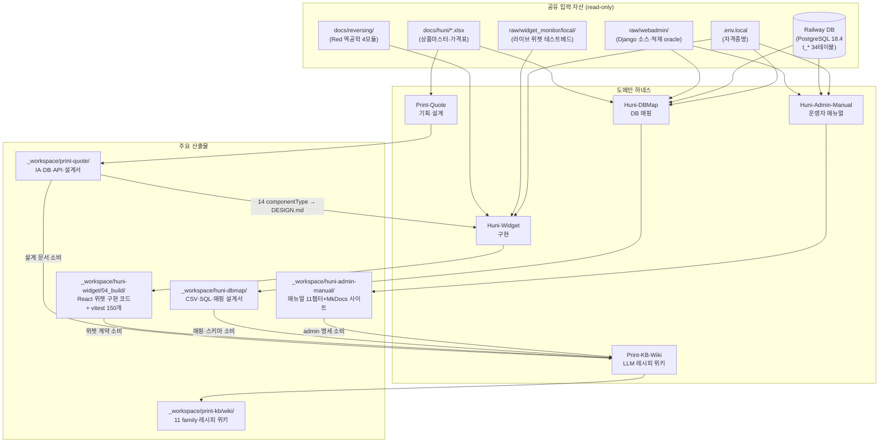

# HuniWeb — 코드맵 개요

> 상세 목록: [modules.md](modules.md) | 의존성: [dependencies.md](dependencies.md) | 진입점: [entry-points.md](entry-points.md) | 데이터 흐름: [data-flow.md](data-flow.md)

---

## 이 리포지토리는 무엇인가

HuniWeb은 **하네스 주도 워크스페이스(harness-driven workspace)** 이다. 리포지토리 루트에 배포 가능한 앱 소스가 없다. 대신 Claude Code 에이전트와 스킬로 구성된 **도메인 하네스**들이 분석·설계·구현·문서 산출물을 `_workspace/` 하위에 생성한다.

- 애플리케이션 코드: 없음(루트 기준). 유일한 1차 구현 코드는 `_workspace/huni-widget/04_build/` 의 React-in-Shadow-DOM 위젯.
- 일반 코드베이스의 "모듈"에 해당하는 단위 = **하네스(harness)**.
- 일반 코드베이스의 "엔트리 포인트"에 해당하는 단위 = **오케스트레이터 스킬(orchestrator skill)**.
- 일반 코드베이스의 "빌드 산출물"에 해당하는 단위 = `_workspace/<harness>/` 하위 Markdown·CSV·SQL·PNG 파일.

프로젝트 지시 권위는 `CLAUDE.md`(§1–§10). 자세한 하네스 목표와 이력은 CLAUDE.md §5–§9 참조.

---

## 5개 도메인 하네스 요약

| 하네스 | 도메인 | 오케스트레이터 스킬 | 에이전트 수 | 워크스페이스 | 상태 |
|--------|--------|---------------------|------------|--------------|------|
| **Print-Quote** | 자동견적 사이트 기획·설계 | `print-quote-orchestrator` | 5 | `_workspace/print-quote/` | 설계 완료·분석 중 |
| **Huni-Widget** | 인쇄 자동견적 위젯 구현 | `huni-widget-orchestrator` | 7 | `_workspace/huni-widget/` | 구현 완료·확대 중 |
| **Huni-DBMap** | Railway DB 데이터 매핑 | `huni-dbmap-orchestrator` | 12 | `_workspace/huni-dbmap/` | round-14 진행 중 |
| **Huni-Admin-Manual** | Django admin 운영자 매뉴얼 | `huni-admin-manual-orchestrator` | 6 | `_workspace/huni-admin-manual/` | 매뉴얼 완료·사이트 발행 완료 |
| **Print-KB-Wiki** | LLM 레시피 위키 | `print-kb-wiki-orchestrator` | 4 | `_workspace/print-kb/` | 배치3 완료·전체 11 family 완성 |

추가로 **MoAI 프레임워크 코어**(22 에이전트, ~50 스킬)가 gated 상태로 설치되어 있다. 상세는 [modules.md](modules.md) §MoAI-코어 참조.

---

## 공통 하네스 패턴

모든 도메인 하네스는 아래 구조를 따른다.

```
오케스트레이터 스킬
  └─ (Phase 0) 컨텍스트 확인 → 실행 모드 판별
       ├─ Phase N: 에이전트 팀 / 서브 에이전트 호출
       │     ├─ 메서드 스킬 로드 (각 에이전트가 도메인 스킬 사용)
       │     └─ 파일 기반 데이터 전달 (_workspace/<harness>/ 공유)
       └─ 최종: HANDOFF.md 갱신 + 커밋
```

핵심 불변 원칙:
- **생성자 ≠ 검증자** — 빌더/설계가와 validator는 별도 에이전트 (독립 게이트)
- **파일 기반 전달** — 에이전트 간 중간 산출물은 `_workspace/` 파일로 전달
- **인간 승인 게이트** — DB 적재·DDL 적용·배포 등 파괴적 조작은 반드시 사람이 승인
- **커밋 병행** — 하네스 작업 완료 시 `.env.local` IGNORED 검증 후 커밋

---

## 전체 시스템 Mermaid 다이어그램



---

## 하네스별 현황 한눈에 보기

| 하네스 | 최근 마일스톤 | 미완료·보류 |
|--------|--------------|------------|
| Print-Quote | As-Is 7축 역공학 + To-Be 아키텍처 확정 | 빌더 구축 단계 미착수 |
| Huni-Widget | S1~S6 확대 완료·동등성 GO·코드 정합 GO(vitest 150) | 후니 DB 어댑터 교체(DB 미정) |
| Huni-DBMap | round-14 webadmin 스키마 변경 추적 완료 | 오적재 교정 실 COMMIT·CPQ 옵션 적재(인간 승인 대기) |
| Huni-Admin-Manual | 11챕터 QA GO + MkDocs 사이트 빌드 | GitHub Pages 호스팅 연결(인간 승인) |
| Print-KB-Wiki | 전체 11 family 레시피 배치3 완료 | 라이브 DB 스키마 변경(round-14) 반영 갱신 |
