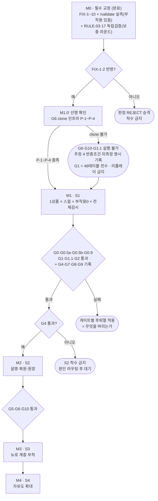

# SPEC-WORLDMODEL-001 — 구현 계획

> 대상 SPEC: `.moai/specs/SPEC-WORLDMODEL-001/spec.md`
> [HARD] 시간 추정 금지 — 순서로만 표현한다. 각 마일스톤은 **이전 마일스톤의 게이트가 통과해야만** 시작한다.
> [HARD] `raw/webadmin/**` 수정 0줄 · 라이브 DDL 0건 · 라이브 INSERT/UPDATE/DELETE 0행.
>
> **[HARD] 좌표 기준 — 두 판본이 섞여 있다.** `design-FINAL.md` 는 교정으로 **804행 → 1,046행**이 됐다. 따라서 이 문서의 `design-FINAL.md:NNN` 좌표는 두 부류다:
> - **M0 의 FIX 작업 행에 적힌 좌표** = **개정 전(804행) 판본**의 좌표다. 그 행들은 *"어디를 고칠 것인가"* 를 지목하므로 교정 대상 좌표를 보존한다.
> - **그 외(근거·인용으로 새로 단 좌표)** = **개정 후(1,046행) 판본**의 좌표다.
>
> 두 부류를 섞어 읽지 않는다. 개정 후 판본의 대조 지도는 `design-FINAL.md:20-29`(FIX-1~8 반영 위치표)와 `:1014-1025`(§14 잔여 미이행 조건표)에 있다.

> **[HARD] 좌표 기준 재갱신 — 2026-08-16 재심 반영** `design-FINAL.md` 는 R-02·R-18 반영으로 1,046행 → 1,123행이 됐고, **R-10 반영으로 1,203행**이 됐다. `gate-rehearing.md` 가 인용한 좌표는 **재심 시점(1,046행) 판본** 기준이고, 이번 라운드가 새로 다는 좌표는 **현행(1,203행) 판본** 기준이다. 판정 기록은 사후 변경하지 않으므로 재심의 좌표는 그대로 두고, 상호 참조는 **절 번호**(§4.0 · §4.1 ★R-02 · §4.6 · §6 T0 · §8 · §8-1 · §14 · §15)로 한다.


---

## 0. 계획의 원칙

| # | 원칙 | 근거 |
|---|---|---|
| PR-1 | **월드모델이 정확한지 먼저 재고, 그 위에 설명·뉴로를 얹는다.** 틀린 월드모델의 설명을 정교하게 만드는 것은 손해다 | `design-FINAL.md:674`(S1 제외 목록) · `:690`(S2 진입 금지 조건) |
| PR-2 | **작은 세계부터 명시화** — 1상품 파일럿 → 동형 전파. 288상품 정합을 기다리지 않는다 | `R3-leejoohwan-local.md:319` |
| PR-3 | **게이트 실패의 처방은 "임계 재설정"이 아니라 "무엇을 버리는가"다** | `design-FINAL.md:722`(G7 행) · `:912`(§11-7) |
| PR-4 | **생성 ≠ 검증** — 게이트 판정은 생성자 주장을 신뢰하지 않고 원본 재실측으로 낸다 | `gate-report.md:26` |
| PR-5 | **문서 교정이 코드보다 먼저다** — M0의 FIX 반영 없이 M1을 착수하면 판정이 REJECT로 승격한다 | `gate-report.md:366`, `design-FINAL.md:1027` |
| PR-6 | **[신규] 검증 출처를 뭉개지 않는다** — 보충 라운드에서 검증된 것을 원 라운드에서 검증된 것처럼 쓰면 **사후 위조**다. 그리고 **명세의 통과는 구현·측정의 통과가 아니다**(`simcore/*`·`gates/*.py` 는 미래 산출물) | `design-FINAL.md:40`, `coverage-supplement.md:425`·`:433` |
| PR-7 | **[신규] 미해소를 닫힌 것처럼 쓰지 않는다** — 교정 과정에서 새로 드러난 미해소 3건(OP-1 G6 clone 미검증 · OP-2 G1 분모 단위 · OP-3 주장 1 강도 약화)은 명시 등재한다 | spec.md §7 |

---

## M0 — 착수 전 필수 교정 (문서·실측) [선행 게이트]

> M0을 완료하지 않고 M1을 착수하면 **재심 트리거가 발동해 판정이 REJECT로 승격**한다(spec.md §4.9).

### M0.1 뼈대 교정 (조건 ① · BLOCKER 규칙 축)

| 단위 | 작업 | 대상 |
|---|---|---|
| M0.1-a | **FIX-1** `selections` 값 도메인 출처를 blanket 1줄에서 **축 부류별 3분류**로 교체 (열거축 5 / 열거축 +1 `print_opt_cd` / 비열거축 6) | `design-FINAL.md:246-249` |
| M0.1-b | **FIX-1** §6 T0 워크스루(`:472`)에 `print_opt_cd` 출처 선언이 선행 조건임을 각주 | `design-FINAL.md:472` |
| M0.1-c | **FIX-1 부기** `print_opt_cd` 열거 SELECT 1개를 "조립 vs 신규작성" 판정 기록에 명시 기입 — 판정은 **재배선**이나 주장 C1의 "조립만으로 성립" 강도는 **약화**로 기록 | 신규 기록 절 |
| M0.1-d | **FIX-2** `Intent.provenance`에 `numeric_spans{qty, budget_krw}` 추가 + span 없는 수치를 스키마 위반으로 규정 | `design-FINAL.md:238-263` |
| M0.1-e | **FIX-2** `IntentValidator.validate()` 내부에 `NumericIntentParser`(symbolic) 신설 명세 — 재산출값이 심볼릭 진입값, 불일치·재파싱 실패 모두 fail-closed | 동일 |
| M0.1-f | **FIX-2** §6 T1(`:479`) 검증항목에 재파싱 대조 추가 + §12 비목표 14번(`:788`)에 "수량" 편입 | `design-FINAL.md:479,788` |

### M0.2 게이트 명세 교정 (조건 ②)

| 단위 | 작업 |
|---|---|
| M0.2-a | **FIX-3** G0.5를 **G0.5a**(ref_dim 파리티 · 7축 × 5표면 = 35쌍)와 **G0.5b**(가격차원 어휘 파리티 · 12축 × 3표면 = 36쌍, 실패 시 판정 거부)로 분할 |
| M0.2-b | **FIX-3** 두 게이트 사이 **projection map** 문서화 → G0.5a의 세 번째 감시 대상으로 편입 + 맵 파일 해시를 산출물에 스탬프 |
| M0.2-c | **FIX-3** `design-FINAL.md` `:352`·`:566`·`:54`·`:432` **4개소 동시 교정** |
| M0.2-d | **FIX-3** §4.5 `:355`에 1문장 추가 — *"감시 대상 5벌(ref_dim 7축)과 실제 import 대상(DIM_META 12축)은 겹치되 동일하지 않으므로, 후자를 덮는 G0.5b가 없으면 §4.5가 선언한 전제 감시는 정작 import 대상에 대해 미충족이다"* |
| M0.2-e | **FIX-4 반전 반영** G6 오라클을 **clone DB 단일 경로**로 확정 — 라이브 대상 리플레이는 `/validate`·`/handoff` **두 축 모두 폐기**. clone 생성·폐기 절차 + clone↔라이브 동일성 검사(`count` + `max(upd_dt)`)를 리플레이 전후로 실행하도록 명시. **[반전 사유]** M0.3 선행 실측이 `/validate` 부작용을 확정했으므로, 원 교정안의 "라이브 = `/validate` 단독" 은 **성립 불가**다(`coverage-supplement.md:335`) |
| M0.2-f | **FIX-4** §0 고정 선언에 **'G6 실행 환경' 행 신설**(`design-FINAL.md:59`) — `:17`·`:776`·`:568`이 G6과 동시 성립하게 함 |
| M0.2-g | **FIX-4 [공통·필수 · 대상 확대]** G1 분모에서 **2테이블**을 명시 제외 — ① `t_wgt_handoff_logs`(clone 리플레이 INSERT/DELETE, `widget_api.py:1677`·`:1733`) ② **`t_wgt_widgets`**(`/validate` 리플레이가 `last_used_dt`/`last_used_org` UPDATE 유발, `widget_api.py:135` → `max(upd_dt)` 해시를 흔든다). 두 제외는 **G1.1 서브게이트와 한 쌍으로만** 성립한다 — 유발 행 수 == 예상 조합 수 · 그 외 증분 0 · 종료 시 undo 후 **원복**(handoff logs 0행 복귀 · `t_wgt_widgets` 원 `last_used_*` 복원). 대체 계측 미실행 = 제외 무효 → **G1 을 46테이블 전수로 되돌리고 리플레이 금지** |
| M0.2-h | **FIX-4** §4.7 O2 의 "파일럿 리플레이로 대체"를 **clone 환경 리플레이 관측 또는 실사용 유입 대기**로 재정의 + §8 RULE-13 행의 "라이브 write 0건이므로 (b)는 공허 충족" 문구를 실체 근거로 교체 |
| M0.2-i | **[신규 · U-5 실측 유래]** **rate-limit 캐시 축은 G1·G1.1 이 구조적으로 못 보는 부작용 축**임을 경계 선언으로 등재(`widget_api.py:195-196` — 스로틀 없이 매 요청, 라이브 DB 밖 LocMem). 분모 재정의는 RULE-05 ④ 재설계이므로 **후속 안건(FU-1)** 으로만 남긴다 |

### M0.3 선행 실측 (조건 ③) [HARD] — **완료 · 결과: 부작용 있음(확정)**

| 단위 | 작업 | 상태 |
|---|---|---|
| M0.3-a | **`/validate` 엔드포인트의 부작용 유무를 라이브 코드로 실측**한다. 미확인 상태로 오라클 채택 시 RULE-13 (a) fail-open 도입에 해당한다 | **완료** — `coverage-supplement.md:261-299` |
| M0.3-b | 부작용이 있으면 `/validate` 경로도 **폐기**하고 G6 오라클을 clone 축 단독으로 축소 | **발동** — M0.2-e 로 반영 |

**실측 결과 (정적 코드 추적 · 라이브 SELECT 미발행)**

부작용은 **핸들러 본문이 아니라 모든 위젯 API 가 공유하는 공통 게이트 `_gate`** 에서 발생한다. 호출 사슬:

```
api_validate                 widget_api.py:1410      (URL 바인딩 config/urls.py:167)
  └─ _gate(request, body)    widget_api.py:1414 에서 호출
       ├─ _rate_ok(...)      widget_api.py:218  →  캐시 mutation
       └─ _touch_used(w, …)  widget_api.py:226  →  DB UPDATE
```

| 축 | 근거 좌표 | 성질 |
|---|---|---|
| **(A) DB WRITE** — `t_wgt_widgets` UPDATE | `widget_api.py:135` `.update(last_used_dt=timezone.now(), last_used_org=org)` (필터 `:133`) | `:119 USE_TOUCH_SEC = 3600` + `:134` 조건으로 **위젯당 최대 1시간 1행**. 단 `.filter().update()` 는 **조건 불일치에도 UPDATE 문 자체를 DB로 발행**한다(0 rows affected 로 끝날 뿐) |
| **(B) 캐시 mutation** — rate limit 카운터 | `widget_api.py:195` `cache.get_or_set(key, 0, timeout=120)` · `:196` `cache.incr(key)` | **스로틀 없음 — 매 요청 실행.** 무효 `site_key` 경로는 `_rate_ok_ip`(`:159`, `:165-166`)가 동일 패턴. 상한 `:140 RATE_LIMIT_PER_MIN = 240` |
| **(C) `/handoff` 로깅은 타지 않음** | `_log_handoff` 호출부 `widget_api.py:1963` (`api_handoff` 내부, **유일**) · `_should_log` 호출부 `:1629` (**유일**) · 로깅 데코레이터 부재 · `api_endpoint`(`:230-254`)는 CORS/csrf_exempt 만 | `/validate` 의 부작용은 `/handoff` 대비 **훨씬 가볍다. 그러나 0 은 아니다** |

**파급 (새 위반 주장 아님 — RULE-13②·RULE-14② 위반은 이미 A2 로 확정, FIX-4 배정 완료)**: 통과 조건 ③의 **실측 의무는 끝났고 교정 의무가 조건 ②로 이월**되어 M0.2-e/g/i 로 닫혔다(`coverage-supplement.md:412`).

**미확인 (회색지대 · 정직 기록)** — 셋 다 "부작용 있음" 결론을 뒤집지 않는다: V-1 `RssLogMiddleware` 본문 미독해(`DEBUG_RSS=1` 일 때만 활성 `[추정]`) · V-2 캐시 백엔드 실체(LocMem vs Redis — Redis 면 **공유 외부 상태**로 성격이 갈린다) · V-3 `ATOMIC_REQUESTS` 미확인. 출처 `coverage-supplement.md:344-350`. → 후속 안건 FU-4.

### M0.4 돈 축 교정 (조건 ④)

| 단위 | 작업 |
|---|---|
| M0.4-a | **FIX-5** `Outcome.price`를 `supply_amount` / `vat_amount` / `payable_total` **3필드로 분리** |
| M0.4-b | **FIX-5** 성질 1(`:306`, `feasible != PROVEN_OK ⇒ None`)과 §5.6-8번(`:622`, 예외 시 0원 대체 금지)을 **3필드 전부**에 적용 — **[좌표 귀속 · 3차]** 두 `:N` 은 **`design-FINAL.md` 개정 전 판본 좌표**이며(위 좌표 기준 블록), 현행 1,203행 판본의 대응 위치는 **성질 1 = §4.3**(현행 450행) · **§5.6-8번**(현행 903행)이다 |
| M0.4-c | **FIX-5** Scorer `budget_penalty`·tie-break ⑤를 `payable_total`로 고정 |
| M0.4-d | **FIX-5** T5 `PhraseRenderer` 고객 대면 토큰 = `payable_total`만 + "(부가세 포함)" 명시, 공급가 노출 시 "공급가(부가세 별도)" 구분 표기, `RenderGuard` 검증 대상도 `payable_total` |
| M0.4-e | **FIX-5** G4 대조 대상을 `price.supply_amount`로 명시(권위 격자 = 공급가 격자) |
| M0.4-f | **FIX-5 G10 신설** — clone 리플레이로 `payable_total` == `/handoff` `total` 대조, 허용오차 0 · 불일치 0건. 실패 시 금액 문구·예산 판정을 고객 경로에서 철거 |
| M0.4-g | **FIX-5** §4.7 O1(공급가 축) / O2(`payable_total` 축) 분리 기재 |

### M0.5 정합·잠재 교정 (조건 ⑤)

| 단위 | 작업 |
|---|---|
| M0.5-a | **FIX-6** `:389` `esc_kind` enum에 `PREMISE_FAIL` 추가(**7종**) + `:601` "6종"→"7종" — **[좌표 귀속 · 3차]** 두 `:N` 은 **`design-FINAL.md` 개정 전 판본 좌표**이며, 현행 판본의 대응 위치는 **§4.7 ★FIX-6 `esc_kind` 7종 절**(현행 639행)이다 |
| M0.5-b | **FIX-6** `:393-399` `route_to`에 게이트별 3행 추가(G0 → webadmin 리팩터 트랙 / G0.5a·b → §33 ref_dim 정합 트랙 / G0.9 → 캐시 전량 무효화 후 재계산, `:565-567` 문언 승계) — **[좌표 귀속 · 3차]** 두 `:N` 은 **`design-FINAL.md` 개정 전 판본 좌표**이며, 현행 대응 위치는 **`route_to` 게이트별 3행 = 현행 656-658행** · **소비 표면 3열 문언 = 현행 647-649행**(둘 다 §4.7)이다 |
| M0.5-c | **FIX-6** `payload_json.gate_id`를 §4.7의 **필수 키**로 명시 (같은 `esc_kind`가 3목적지로 갈리므로 해소 키 필요) |
| M0.5-d | **FIX-6 [권장]** escalation 기록 실패를 fail-closed 전수표 **11번째 행**으로 추가 — 동작은 "기록 실패해도 차단 상태 유지 + 로그 이중화", "기록 실패 시 통과"는 금지 |
| M0.5-e | **FIX-7** `components[].anchor` 폴백 사다리 3단 규정 + `:51`·`:598`의 "미보유 셀은 None 명시"를 3단으로 교체 — **[좌표 귀속 · 3차]** 두 `:N` 은 **`design-FINAL.md` 개정 전 판본 좌표**이며, 현행 대응 위치는 **§4.3 ★FIX-7 폴백 사다리**(현행 454행) 및 **§8 RULE-11 행**(현행 877행)이다 |
| M0.5-f | **FIX-7** F14(`provenance-map`)를 **S2 선행조건부로 강등** — §26 격자 CSV에 `src_file`/`src_sheet`/`src_cell` 3컬럼 추가 전까지 미배선, 그동안 사다리 ②로 서빙. 컬럼 추가는 §26 트랙에 **선행 요청으로 등록**(흡수 시 RULE-15 ③ 위반) |
| M0.5-g | **FIX-7** §8 RULE-11 근거란에 부기 — *"xlsx는 S2 가산분"* |
| M0.5-h | **FIX-8** `zero_reason`을 `matched_row` 1차축 **4분류**로 교체 (TRUE_ZERO / MISSING_PRICE_ROW / UNSELECTED_DIM ∨ UNMATCHED_NO_GAP / ENGINE_ERROR) |
| M0.5-i | **FIX-8** 3a·3b 판별용 **읽기전용 SELECT 1건**을 §4.4 (g) 옆에 추가 (RULE-04 불변) |
| M0.5-j | **FIX-8** §4.3 근거 좌표를 `pricing.py:626-630`에서 **`pricing.py:655-660`**(`_match_entry` no_match 분기)으로 교체하고 `:106-108`·`:599-607` 병기 |
| M0.5-k | **FIX-8** G8 분모에 "0원 구성요소의 `zero_reason` 4분류 정확성" 추가 |

### M0.6 커버리지 보충 (조건 ⑥) [HARD] — **완료 · 두 규칙 모두 위반 없음**

> [HARD] **출처 구분을 뭉개지 않는다** — 아래 판정은 **보충 라운드(`05_gate/coverage-supplement.md`) 산출**이며, **원 검증 라운드(`gate-report.md`)에서 검증된 것이 아니다.** 원 라운드에서 두 규칙은 6개 findings 전체 인용 **0회**로 미검증이었다(`gate-report.md:104`·`:118`).

| 단위 | 작업 | 상태 |
|---|---|---|
| M0.6-a | **FIX-9** RULE-03(BLOCKER) 독립 검증 — 루브릭 시나리오(`evaluation-rubric.md:76`)를 설계 §6 T4에 실제 적용 | **완료 · 위반 없음** (`coverage-supplement.md:150-159`) |
| M0.6-b | **FIX-10** RULE-17(MAJOR) 독립 검증 — (a)(b)(c) 3검사를 G3 명세에 적용 | **완료 · 위반 없음** (`coverage-supplement.md:232-240`) |
| M0.6-c | 다음 라운드의 렌즈 분할표에 **BLOCKER 규칙 5개 전건 배정**을 명시하고, 미배정 규칙이 남으면 산출물에 기록 | **열림** — 다음 라운드 착수 시 이행 (재발 방지 장치) |

**RULE-03 판정 근거 (BLOCKER · 커밋 전 시뮬레이션 루프)**

| 검사 | 결과 | 근거 |
|---|---|---|
| (a) 선택 전 계산 경로 | **위반 없음** — 사슬 추적 완결·끊김 0. `frontier`→`rollout`→`JointTransition` (a)~(g)→`Outcome`→`Scorer`→PICK→관측 5단계 전건 존재. T4가 3후보 각각의 가능여부·가격·결손축을 **선택 전**에 산출. 시나리오의 6번째 축 `proc_cd` 가 `_sim_dim_candidates` 처리 5축 **안에 있음**도 확인 | `coverage-supplement.md:61-92` |
| (b) 부작용 0 | **위반 없음** — 명세 6근거 + **호출 대상 6심볼을 라이브 원본에서 전건 실측**. `pricing.py` 전역 write 패턴 매치 0(유일 매치 `:667` 은 로컬 dict 갱신), 유일 원시 SQL 은 `:308` `SELECT fn_calc_pansu` 이고 그 함수는 `sql/32_fn_calc_pansu.sql:30` 에서 **`STABLE`·DML 0**. `_sim_disallowed`·`_sim_active_rules`·`_sim_dim_candidates`·`qty_rule_error`·`tmpl_combo.resolve`·`_price_gap_errors` 전건 read-only, `lru_cache`/`cache.set` 매치 0 | `coverage-supplement.md:39-51`·`:94-127` |
| (c) 사후통보 잔존 | **위반 없음** — 5검사 전건 부정. 잔존 `/handoff` 422 는 루브릭 §0.4 **심사 대상 밖**(라이브 소유) + 구조상 **커밋 前 거부**(서명 후 통보가 아니다) | `coverage-supplement.md:129-146` |

**RULE-17 판정 근거 (MAJOR · 재현 결정론)**

| 검사 | 결과 | 근거 |
|---|---|---|
| (a) 측정 방법·분모·임계 | **위반 없음** — 7요소 전건 존재: 도구 `gates/repeat_k.py` · 비교 단위 **최종 상태** · k=8 · 임계 8/8 · 분모 **20의도 × 8 = 160회** · 허용오차 **0** · 실패 시 후퇴 | `coverage-supplement.md:174-190` |
| (b) 비교 대상 = 최종 상태 | **위반 없음** — 루브릭 norm 문언(`evaluation-rubric.md:80`)과 **축자 일치**(`선택 옵션 집합` 동일 어휘 · `최종가` ↔ `final_price`). 대화 텍스트 명시 부정. 중간 산출물(`rollout_ms`·`cache_hit`·후보별 중간 Outcome)은 비교 대상에 없다 | `coverage-supplement.md:192-202` |
| (c) 엔진 쪽 확보 | **위반 없음** — 결정론 담지자 **4개 전부 엔진·심볼릭**: ① 결정론 열거(`price_views.py:2698` `return sorted({...})`) ② 사전선언 사전식 채점 ③ 안정 tie-break(`pricing.py:288-291` 사상) ④ `as_of` 세션 핀. `temperature` 는 **부정 문맥 1회**뿐 | `coverage-supplement.md:204-220` |

**[HARD] 이 통과가 뜻하지 않는 것** — `simcore/*`·`gates/*.py`(`repeat_k.py`·`dim_parity.py`·`sideeffect.sh`)는 **미래 산출물**이며 저장소에 실재하지 않는다(U-4). RULE-03(a)(c)와 RULE-17 전 3검사의 판정은 **설계 문서 문언 대조**이고, RULE-03(b)와 M0.3 만이 라이브 원본 실측이다. 골든 의도 20건도 아직 존재하지 않으므로 "20건이 재현성을 실제로 변별하는 표본인가"는 판정 불가 — **RULE-17 통과는 명세의 통과이지 측정의 통과가 아니다**(`coverage-supplement.md:425`·`:433`).

**커버리지 갱신** — 전 18규칙: 검증됨 **14**(기존 12 + RULE-03·17) · 검증됨(약식) 2 · **부분검증 2**(RULE-10·18 — **미해소**) · **미검증 0**. **BLOCKER 5/5 전건 검증 완료 — 80% → 100%**(`coverage-supplement.md:398-404`). RULE-10·18 의 부분검증 해소는 **설계 교정이 아니라 게이트 재실행 사안**이므로 후속 안건(FU-2)이다.

**[HARD] 그리고 사라지지 않은 것** — A1·A2·A4·A7·A8 의 확정 위반 5건과 FIX-1~FIX-8 은 그대로 남아 있다. 보충 라운드는 그것들을 건드리지 않았다(`coverage-supplement.md:419`).

### M0.7 NOTE 기록 + 루브릭 개정 심의 (조건 ⑦⑧)

| 단위 | 작업 |
|---|---|
| M0.7-a | N1~N6 · U-1~U-5를 `design-FINAL.md` §11 감수 위험 목록에 등재 (spec.md §5·§6과 대응) |
| M0.7-b | N1 — G8 임계를 단계별로 분할(S1: 플래그·후보 기록 / S2: `sim_escalation` 큐 적재 및 `route_to` 도달 검증) |
| M0.7-c | N3 — `:393`·`:395`·`:181`에서 `gap_owner` 원용을 실재 착지점으로 교체 + 매핑표에 **소비 표면·소비 주기·소유 트랙** 3열 추가. 미정 행 잔존 시 §11에 "11-10. 에스컬레이션 큐의 소비 표면이 일부 미실체" 추가 — **[좌표 정정 · 3차 · 수동 확정]** 세 `:N` 은 `spec.md` 좌표인데 spec.md 개정으로 밀렸다. 현행 대응 위치는 **`gap_owner` 원용 = `spec.md:529`(RK-11 행)** · **소비 표면 3열 문언 = `spec.md:162`(U-007.3)** 이다 |
| M0.7-d | N4 — 파일럿 기준 ⑤에 단서(260705 재추출 완료본만) + G4 (가) 입력에 (파일 해시·`authority_version`·추출 시점) 스탬프 대조 의무화, 260705 아니면 UNKNOWN 강등 |
| M0.7-e | N5 — T-1 전제 감시에 `as_of != date.today()` 판정 1줄 추가(경계 통과 시 as_of 재핀 + 진행 중 후보 금액 무효화) |
| M0.7-f | N6 — `:178` 간선을 `PICK→PR→RG`(금액 문장) / `PICK→EXP→RG`(비금액 설명)로 분리 + RenderGuard 규약에 *"Explainer 출력에 숫자 토큰이 포함되면 그 자체로 fail-closed"* 명문화 + `:489` 서술 정합화 — **[좌표 정정 · 3차 · 수동 확정]** 두 `:N` 은 `spec.md` 좌표다. **`:489`(RenderGuard 숫자 토큰 서술)의 현행 대응 위치는 `spec.md:86`(U-001.5)·`:124`(U-004.5)** 이다. **`:178` 은 정정하지 않는다** — 인용한 문언 `PICK→PR→RG` 가 현행 `spec.md` 전체에 **0건**(전수 grep)이어서 진타겟을 특정할 수 없기 때문이다. 개정으로 문언 자체가 변형된 것으로 보이며(U-001.5 로 흡수 `[추정]`), **좌표를 지어내지 않고 미해소로 남긴다** |
| M0.7-g | **루브릭 개정 안건 ①②③ 심의**(RULE-04 과세기준 항 / 신설 RULE-19 문서 내부 정합 / RULE-11 (b) 폴백 사다리 순서) — **열림 · 본 트랙 소관 아님.** 설계·SPEC 은 `evaluation-rubric.md` 를 **수정할 권한이 없다**(판정 기록의 사후 변경 금지). 다음 검증 라운드에서 게이트·루브릭 트랙이 심의한다. 개정안이 겨눈 실체 결함(A5·A3/N1/N6·A6)은 FIX-5·FIX-6·FIX-7 로 **설계 쪽에서는 이미 닫혔다** |
| M0.7-h | **[신규]** RK-12(rate-limit 캐시 축 · G1 구조적 미관측) · RK-13(G6 clone 인프라 미검증) · RK-14(캐시 백엔드 실체 미확인)을 감수 위험 목록에 신설 등재 |

### M0 종료 조건 · 통과 조건 8항 현황

**종료 조건**: M0.1~M0.7 전건 반영 + M0.3 실측 결과 기록 + M0.6 두 규칙의 독립 검증 판정문 산출.

| 순서 | 조건 | 상태 | 착지 |
|---|---|---|---|
| ① | 뼈대 교정 (FIX-1 · FIX-2) | **닫힘** | M0.1 |
| ② | 게이트 명세 교정 (FIX-3 · FIX-4) | **닫힘** | M0.2 (FIX-4 는 **반전 반영판**) |
| ③ | 선행 실측 (U-5 `/validate` 부작용) | **닫힘** | M0.3 — **부작용 있음 확정**, 교정 의무가 ②로 이월되어 함께 닫힘 |
| ④ | 돈 축 교정 (FIX-5) | **닫힘** | M0.4 |
| ⑤ | 정합·잠재 교정 (FIX-6·7·8) | **닫힘** | M0.5 |
| ⑥ | 커버리지 보충 (FIX-9 · FIX-10) | **닫힘** | M0.6 — **[출처] 보충 라운드 검증이며 원 라운드 검증이 아니다** |
| ⑦ | NOTE 기록 (N1~N6 · U-1~U-5) | **닫힘** | M0.7 (+ M0.7-h 신설 3건) |
| ⑧ | 루브릭 개정 심의 (개정안 ①②③) | **열림** | M0.7-g — 게이트·루브릭 트랙 소관 |

**요약: 7항 닫힘 · 1항(⑧) 열림.** ⑧은 M1 착수의 차단 조건이 아니다(설계 쪽 실체 결함은 FIX-5·6·7 로 닫혔고, 열린 것은 루브릭이 그 축을 재도록 만드는 개정뿐이다). 차단 조건은 **재심 트리거**(FIX-1·FIX-2 미반영 상태의 M1 착수)와 **M1.0′ 선행 확인**이다.

**[재심 반영 — 2026-08-16]** 게이트가 위 8조건을 독립 재판정했다(`gate-rehearing.md:364-373`). 조건 ①(FIX-1·FIX-2)은 설계 자기평가 "닫힘"에 대해 **"부분 닫힘"** 으로 재판정됐다 — `selections` 축은 닫혔으나 RULE-02 ① 이 **`soft_prefs.axis` 에서 재실패**했기 때문이다. **R-02 반영으로 그 잔여가 교정됐고**(M1.0′ **P-6** · acceptance.md AC-M0-12), 조건 ②③④⑤⑥⑦ 은 재판정에서도 **닫힘**, ⑧ 은 **열림이며 안건이 증가**했다(기존 ①②③ + 개정안 ④ + **개정안 ⑤ 자율성 경계 축**). 조건 ④(FIX-5)에는 *"문서 반영은 확인했으나 이 축은 루브릭 커버리지 밖이라 위반/비위반 등급을 내지 않았다"* 는 단서가 붙었다(`gate-rehearing.md:369`) — 이 구분을 뭉개지 않는다.

---

## M1 — S1 첫 조각: "1상품 × 프론티어 스윕 × 부작용 0 × 전제 감시"

> **첫 조각.** 만드는 것 6개, 넣지 않는 것 6개. 착지 위치는 `_workspace/huni-simcore/`(webadmin 외부 드롭인).

### M1.0′ S1 착수 전 선행 확인 [HARD · 블로커 후보]

> **FIX-4 반전의 부산물.** `/validate`·`/handoff` 두 축이 모두 라이브에서 폐기되면서 **G6 은 clone 단일 경로에만 의존**하게 됐다. 그런데 clone 경로의 실현 가능성은 **게이트도 보충 검증도 확인하지 않았다**(`coverage-supplement.md:435`, `design-FINAL.md:1001` §13-3-a).

| # | 확인 항목 | 판정 기준 | 미충족 시 |
|---|---|---|---|
| **P-1** | **clone DB 생성 절차가 실재하는가** — 라이브 스키마+데이터의 폐기 가능한 사본을 만들 수 있는가(권한·용량·시간) | 절차 문서 + 1회 생성 성공 실증 | 아래 [처방] |
| **P-2** | **clone 폐기 절차가 실재하는가** — 리플레이 오염(DB write + rate-limit 캐시)이 clone 폐기와 함께 완전히 사라지는가 | 폐기 성공 + 잔여 리소스 0 | 아래 [처방] |
| **P-3** | **clone↔라이브 동일성 검사가 가능한가** — 테이블별 `count` + `max(upd_dt)` 대조를 리플레이 **전후로** 실행할 수 있는가 | 대조 스크립트 실행 성공 | 아래 [처방] |
| **P-4** | **테스트 사이트키가 clone 환경에서 유효한가** — `/validate`·`/handoff` 리플레이가 clone 을 향하도록 배선 가능한가 | 리플레이 1건 성공 | 아래 [처방] |
| **P-5** | **[신규] §11.5 자율 레벨 선언과 구현 코드가 일치하는가** — spec.md §11.5 는 *"룰베이스 ~ 플로우 가이드 · 세미 오토노머스 아님"* 을 단정한다. 그 근거 3항(자동 확정 경로 부재 · 확정은 인간 게이트 전용 · LLM 판정권 0)이 **S1 구현 산출물에서 실제로 성립**하는가 | **AC-AUT-02**(`confidence`/`feasible` 만으로 주문 확정에 도달하는 경로 grep·호출그래프 **0건**) + **AC-AUT-03**(`soft_prefs` 가 Scorer 정렬 키 ④ 위치에만 존재 · 차등 테스트에서 ①~③ 역전 0건) 전건 통과. **[W-3 · 3차]** 단 AC-AUT-03 는 ①②③ 전건이 **M3 이연**이므로 **S1 시점에는 실행 불가**이며 **미검증으로 표기**한다 — 이 항의 S1 판정은 **AC-AUT-02 단독**으로 낸다 | 아래 [처방 · P-5] |

**[처방 — P-5 · HARD]** 불일치가 1건이라도 나오면 처방은 **선언을 코드에 맞춰 올리는 것이 아니라 코드를 선언에 맞추는 것**이다. §11.6 (a)~(e)가 전건 충족되지 않은 상태에서 자율 레벨을 올리는 변경은 **SPEC 위반**이므로(AC-AUT-05), 해당 경로를 철거하기 전에는 M1 게이트를 통과로 쓰지 않는다. S1 은 Actor/Explainer LLM 을 넣지 않으므로(M1.2) AC-AUT-03 의 **차등 테스트(②)와 정의역 검사 3항(③)은 M3(뉴로 계층 부착) 시점에 실행**한다.

**[처방 보강 — P-5 · 2026-08-16 3차 · W-3 · ① 도 M3 이연]** 남아 있던 ①(**Scorer 정렬 키의 정적 구조 대조**)도 **M3 이연 대상에 편입**한다. 근거 문장은 §H.4 ① 갈래 (B) 와 **축자 동형**으로 쓴다 — *"① 은 `simcore/` 의 Scorer 구현 실재를 전제하는데, `loop.Scorer` 는 U-010.1 의 S1 6산출물에 없다. 따라서 ①②③ 전건을 M3 에서 실행하며, **S1 에서 AC-AUT-03 를 '통과'로 쓰지 않고 미검증으로 표기**한다."* R3 재판정 §4.1 이 원본 3처(`design-FINAL.md` §7 S1 · spec.md U-010.1 · 아래 M1.1)를 대조해 **`Scorer` 가 S1 산출물이 아님**을 판정했고, `acceptance.md:571` 이 ① 의 실행을 *"`simcore/` 의 Scorer 구현에서 정렬 키 튜플을 읽고"* 로 정의하므로 ① 은 **S1 에서 실행 불가**다(재판정 §5 관찰 2). 실행 불가한 검사를 착수 조건에 남기면 그것이 "통과"로 뭉개지거나 착수를 부당하게 막는다. 대가(§11.6 (e) 가 S1~S2 동안 기계 미검증)는 이미 `spec.md:662`·`acceptance.md:716` 에 기록돼 있으므로 **그 문장의 범위를 ① 까지 확장**한다.

**[처방 보강 — P-5 · 2026-08-16 2차 · 갈래 (B)]** 위 이연 대상에 **③(R-02 정의역 검사 3항 — ③-a 정의처 1곳 / ③-b 비실재 원소 0건 / ③-c 미등록 축 주입 시 되묻기)** 을 명시 편입한다. 근거: 3항 전부가 **`simcore/intent.py` 의 실재를 전제**하는데, 그 파일은 U-010.1 의 S1 6산출물에 없고 **M3-a 산출물**이다(`design-FINAL.md` §7 S3 · 아래 M3 표). 같은 이유로 **spec.md §11.6 (e) 의 3항 기계 확인도 M3 부터** 실행 가능하다.

[HARD] **이연의 대가를 은폐하지 않는다 — S1 동안 `PREF_AXES` 는 기계 미검증으로 남는다.** S1~S2 구간에서 §11.6 (e) 의 성립은 **문서·명세 수준**(acceptance.md AC-M0-12 가 문서 반영을 검사)이며 구현 대조가 아니다. **S1 에서 이 축을 "기계 확인 통과"로 쓰지 않는다.** 다만 이 이연은 **S1 차단 조건을 바꾸지 않는다** — P-6(R-02 문서 반영)이 S1 유일 차단이고 이미 충족이며, 재심이 건 트리거(*"구현 단계에서 이 선언과 어긋나면 트리거는 살아 있다"*)는 M3 에서 그대로 발동한다. 근거·기각한 갈래 (A) 는 spec.md §9 말미 · acceptance.md §H.4 ①.

> **P-1~P-4 현황 갱신 — 판정 FEASIBLE (`g6-clone-feasibility.md:5`·`:253-255`).** 라이브 PG **18.4** · `t_*` 46테이블 · DB 총 **37 MB** 실측 위에서 무료·로컬·반복가능·라이브 무영향 경로(`pg_dump` → 로컬 `createdb`/`pg_restore` → 동일성 검사 → `dropdb`)가 확인됐고, 유일 관문이던 로컬 PG18 부재는 Homebrew `postgresql@18`(`stable 18.4`, 라이브와 major·minor 정확 일치)로 해소된다(`:163`·`:171`·`:287`). **다음 단계 = `brew install postgresql@18`** → clone 실제 생성 1회 리허설(사용자 승인 필요, `:279`·`:300`).
> [HARD] **[W-4 · R3 재판정 반영] 이것은 "해제"가 아니다 — P-1~P-4 는 여전히 미충족이다.** **차단 요인 부재가 전수 실측으로 확인됐다(FEASIBLE). 그러나 AC-M0-10 이 요구하는 생성·폐기·대조·리플레이 각 1회의 실증은 아직 없다 — 리허설 1회가 남았고, 그때까지 P-1~P-4 는 미충족이다.** 안전 규율에 따라 `pg_dump` 를 한 번도 실행하지 않았으므로 이 판정은 **차단 요인 부재의 전수 실측**이지 성공한 생성의 관측이 아니다(`:292`·`:311`). AC-M0-10 의 기대는 *"P-1~P-4 전건에 실증 결과와 근거가 산출물에 존재한다 — '가능할 것이다'는 실증이 아니다"*(`acceptance.md:119`)이므로 **FEASIBLE 은 그 기대를 충족하지 않는다**(R3 재판정 §4.3). **리허설 1회가 그 공백을 닫으며, 그 작업 단위는 아래 P-0 이다.** 리허설 실패 시 아래 [처방]은 그대로 발동한다.

**[처방 — HARD]** P-1~P-4 중 하나라도 불가하면 **G6 자체가 실행 불가**다. 그때의 처방은 **임계 완화가 아니다** — G6 을 "통과"로 쓰지 않고, **주장 4("확정 금액 권위를 위젯에 남기면 루프가 틀려도 고객이 서명하는 금액은 틀리지 않는다")의 반증 조건을 측정 없이 남겨 두는 것을 명시 기록**한다(`design-FINAL.md:1001`). 같은 이유로 **G10**(표시가 vs 서명가, clone 리플레이 의존)과 **G1.1**(제외 2테이블 대체 계측)도 실행 불가가 되므로, G1 은 **46테이블 전수로 되돌리고 리플레이 자체를 금지**한다(M0.2-g).

#### [W-5 · 신설] P-0 clone 리허설 1회 — S1 을 막는 유일 조건의 작업 단위 [HARD]

> **왜 작업 단위로 승격하는가.** R3 재판정이 *"S1 착수를 막는 것 — 1건. `AC-M0-10`(= M1.0′ P-1~P-4)"* 으로 단정했는데(재판정 §4.4), 그 리허설은 지금까지 `g6-clone-feasibility.md` §5 의 "다음에 할 일"에만 있고 **본 계획서의 작업 단위가 아니었다.** S1 을 막는 유일한 조건이 계획서에 작업으로 서 있지 않으면 착수 판단이 그 공백을 못 본다.

| 순서 | 작업 | 근거 |
|---|---|---|
| ① | `brew install postgresql@18` (대안: Docker Desktop 기동 + `postgres:18` 이미지) | `g6-clone-feasibility.md:300` |
| ② | `pg_dump`(라이브 **읽기전용**) → 로컬 `createdb` / `pg_restore` | `:301` |
| ③ | **동일성 검사 — 분모 = `t_*` 46개** (`bak_*` 97 · Django 10 은 제외하고, **제외 근거를 한 쌍으로 기록**한다) | `:302` |
| ④ | **시점 규율** — *"clone 생성 직후 · 리플레이 이전 · 덤프 시각 기준 라이브 스냅샷 대비"* 로 대조 시점을 못 박는다(`fn_upd_dt` 트리거 **45개** 때문에 시점이 어긋나면 `max(upd_dt)` 가 무의미해진다) | `:303` |
| ⑤ | `dropdb` — 폐기 성공 + 잔여 리소스 0 확인 | `:302` |

[HARD] **사용자 승인이 필요하다.** ①~⑤ 는 로컬에 DB 를 만들고 라이브에서 덤프를 뜨는 작업이므로, 실행 전 사용자 승인을 받는다(`g6-clone-feasibility.md:279`·`:300`). 승인 없이 실행하지 않는다.

[HARD] **P-0 완료가 곧 P-1~P-4 충족이다** — ①②가 P-1, ⑤가 P-2, ③④가 P-3, `/validate`·`/handoff` 리플레이 1건 성공이 P-4 다. 각 항의 **실증 결과와 근거**를 산출물에 남기지 않으면 AC-M0-10 은 여전히 미충족이다.

**착지**: P-0 · P-1~P-4 → acceptance.md **AC-M0-10** · spec.md **§7 OP-1** · **§9.1**(FEASIBLE 판정 기록 — *해제가 아니다*) · RK-13. / P-5 → acceptance.md **AC-AUT-02 · AC-AUT-03 · AC-AUT-05** · spec.md **§11.5 · §11.6**.

#### [재심 반영 — 2026-08-16] P-6 · P-7 신설

재심 게이트(`gate-rehearing.md`)가 **S1 착수를 막는 조건을 단 하나로 단정**했다 — *"S1 착수는 `R-02` 1건이 반영된 직후 가능하다. 그 외에 S1 을 막는 것은 없다"*(`:385`). 그 조건과, 재심이 S1 구현 단계에 건 트리거 1건을 선행 확인 항목에 편입한다.

| # | 확인 항목 | 판정 기준 | 미충족 시 |
|---|---|---|---|
| **P-6** | **[신규 · S1 유일 차단] R-02 가 `design-FINAL.md` 에 반영됐는가** — `soft_prefs.axis` 값 도메인 화이트리스트(정의처 1곳) · `IntentValidator` 검증 1행 · §8-1 fail-closed 표 1행(11→12지점) · `:306` blanket 2분류 교체 · 워크스루 `mat_grade` 소속 명시 · `budget_krw` 표기 정확화 | **acceptance.md AC-M0-12 의 6항 + 자기평가표 1행 = 7항 전건** | 아래 [처방 · P-6] |
| **P-7** | **[신규 · 구현 트리거] G0.5a 의 `print_opt_cd` 동일성 감시 1항이 구현에 들어갔는가** — 재심은 FIX-1 이 만든 `print_opt_cd` 열거 로직의 **2곳 병렬 존재**(라이브 클로저 `price_views.py:1775` ↔ 우리 층 SELECT)를 RULE-12 ① 후보로 검토한 뒤 **각하**했는데, 각하 근거 3항 중 (c)가 *"두 산출이 갈리는 사건은 **G0.5a 의 추가 1항**이 빌드 FAIL 로 fail-closed 차단한다"* 였다(`gate-rehearing.md:153`) | `gates/dim_parity.py`(G0.5a)에 `_dim_options` 내부 클로저 산출 집합 ↔ 우리 층 동등 SELECT 결과 집합의 **동일성 대조 1항**이 실재하고, 불일치 시 **빌드 FAIL** 로 동작(`design-FINAL.md` §4.1 FIX-1 "열거축 +1" · §7 G0.5a) | 아래 [처방 · P-7] |

**[처방 — P-6 · HARD]** 미반영 상태로 M1 을 착수하면 판정이 **CONDITIONAL_GO 에서 REJECT 로 승격**한다(`gate-rehearing.md:112` (iii) · `:394`). 교정 비용은 선언 1블록 + 검사 1행 + 표 1행이며 뼈대 변경이 없다.
  **[근거 교체 — 2026-08-16 3차 · W-2 · 차단 지점 S1 → M3]** 개정 전 이 처방의 근거는 *"S1 범위에 `loop.Scorer`(F6)가 포함되고 `soft_prefs` 는 Scorer ④ 의 입력이므로 …"* 였으나, R3 재판정이 그 전제를 **틀린 것으로 판정**했다(재판정 §4.1~4.2). 정정된 근거는 다음과 같다 — ***"`soft_prefs` 는 `Intent` 필드이고 그 생성원 Actor LLM 은 X-010.2 가 S1 에서 제외하므로, 이 결손이 실제 위험이 되는 지점은 M3(뉴로 계층 부착)이다. 문서 반영은 이미 완료(AC-M0-12 7항)이며, 구현 대조는 M3(AC-AUT-03 ③) 소관이다."*** 좌표 참조는 절 번호로 한다(`design-FINAL.md` **§4.6 Scorer**). [HARD] **P-6 자체는 충족 상태로 유지하며 삭제하지 않는다** — 문서 반영 확인 기준으로서 여전히 유효하다. 그리고 **R-02 반영을 되돌리지 않는다**(재판정 §4.2 — 반영 자체가 정확한 교정이며 무해하다).
  **현황: 충족 — 반영 완료**(`design-FINAL.md` §4.1 ★R-02 · §4.1 필드 도메인 출처 2분류 · §4.1 검증 지점 · §4.6 · §6 T0 각주 · §8-1 12번 · §8 RULE-02 개정 이력 2). 다만 이는 **문서 반영의 충족**이며, 구현 대조는 **P-5(AC-AUT-03 (iii) 정의역 검사 3항)** 소관이다.

**[처방 — P-7 · HARD]** 이 1항이 구현에서 빠지면 **RULE-12 ① 각하가 위반으로 승격한다** — 재심이 명시한 재심 트리거다(`gate-rehearing.md:153`: *"구현 단계에서 G0.5a 의 `print_opt_cd` 동일성 감시 1항이 빠지면 위반으로 승격한다"*). 처방은 임계 완화가 아니라 **감시 1항을 넣기 전 `print_opt_cd` 를 `selections` 후보 축에서 제외**하는 것이다 — 감시 없는 병렬 정의는 §5.2 가 경계한 *"정의가 갈리면 화면이 갈린다"* 의 재현이기 때문이다. 이 항은 **M1.1 `gates/premise.py` 산출물의 종료 조건**이며, 빠진 채로 M1 게이트를 통과로 쓰지 않는다.

**착지(추가)**: P-6 → acceptance.md **AC-M0-12** · spec.md **§7 재심 채무표 R-02** · **§9.0**. / P-7 → `design-FINAL.md` §4.1 FIX-1 "열거축 +1" · §7 G0.5a · spec.md §3.2 U-002.4.

### M1.0 파일럿 상품 선정 (라이브 SELECT · 읽기전용)

6기준을 라이브 SELECT로 확정한다(코드값 미단정).

| # | 기준 |
|---|---|
| ① | `t_prd_product_price_formulas` 가격공식 바인딩 있음 |
| ② | `t_prd_product_constraints` 활성 제약규칙 ≥ 1 |
| ③ | `t_prd_product_plate_sizes` 판형 연결 ≥ 2 |
| ④ | `t_siz_pansu` 룩업 **히트와 미스가 둘 다** 존재 |
| ⑤ | 권위 가격표 260705 대조 격자 셀 ≥ 20 (**M0.7-d 단서**: 260705 재추출 완료 시트만) |
| ⑥ | ★ `use_dims`가 빈(판별차원 0) 구성요소 **최소 1개** 보유 |

**완화 순서 [HARD]**: 0건이면 그 사실 자체가 S1의 첫 산출물이며, **⑥을 완화하지 않고 ④를 먼저 완화**한다. ⑥까지 완화해야 하면 2차 파일럿을 `use_dims` NULL 보유 상품으로 잡는 것을 의무로 기록한다.

### M1.1 만드는 것 6개 (의존 순서)

| 순서 | 산출물 | 내용 | 층 |
|---|---|---|---|
| 1 | `simcore/_bindings.py` | 심볼 **12종** import 모음 — `pricing.evaluate_price`(`pricing.py:428`) · `NON_QTY_DIMS`(`:45`) · `TIER_DIMS`(`:52`) · `_component_rows_bulk`(`:284`) · `price_views.DIM_META`(`:31`) · `qty_rule_error`(`:1615`) · `_select_default_plate`(`:2223`) · `_SIM_DIM_CONSTRAINT`(`:2480`) · `_sim_active_rules`(`:2513`) · `_sim_dim_candidates`(`:2683`) · `_sim_disallowed`(`:2701`) · `widget_api._price_gap_errors`(`:455`) · `tmpl_combo.missing_axis_names`/`resolve`(`:204`/`:245`) | worldmodel |
| 2 | `simcore/joint.py` | `JointTransition.step(state, action) -> Outcome` — 호출 조립 (a)~(g) 만. **가격·제약·기하 규칙 신규 정의 0건** | worldmodel |
| 3 | `loop/frontier.py` + `loop/rollout.py` | 후보 결정론 열거 + 배치 롤아웃. `transaction.atomic()` + `SET TRANSACTION READ ONLY` + `SET LOCAL statement_timeout` + **무조건 롤백 예외**(`assistant_tools.py:689-701` 방어선 복제) | worldmodel |
| 4 | `gates/premise.py` | **G0** 바인딩 스모크 · **G0.5a** ref_dim 파리티 · **G0.5b** 가격차원 어휘 파리티 · **G0.9** 원천 다이제스트 | ops |
| 5 | `gates/golden_rollout.py` | **G1 · G1.1 · G2 · G4 · G7 · G8** 측정 | ops |
| 6 | `gates/sql_control.py` | **G9** 순수 SQL 대조군 (루프 순증분 자기 반증) | ops |

`JointTransition` 조립 순서 (a)~(g):

| 순서 | 호출 대상 (전부 기존 코드) | 얻는 것 |
|---|---|---|
| (a) | `price_views.qty_rule_error` (`:1615`) | 수량 규칙 위반 |
| (b) | `price_views._sim_disallowed(prd_cd, sel)` (`:2701`) | 차원별 불가값 → 규칙명 |
| (c) | `tmpl_combo.resolve` + `missing_axis_names` (`:245`/`:204`) | 조합템플릿 미등록(UNREGISTERED) |
| (d) | `pricing.evaluate_price(..., mode="strict", as_of=pinned)` (`:428`) | 금액 + `components[].matched_row` + `data_gap` + 오류코드 |
| (e) | `widget_api._price_gap_errors(res, prd_cd)` (`:455`) | 단가행 부재 **차단** 판정 (가족형 쌍 면제·`proc_cd` 제외를 정의 그대로 재사용) |
| (f) | `SELECT ... FROM t_siz_pansu WHERE ...` 존재 조회 | 판걸이수 권위 룩업 히트 여부 → `confidence` |
| (g) | `components[].data_gap` 판독 + **FIX-8 3a/3b 판별 SELECT 1건** | `zero_reason` 4분류 플래그 (차단 아님) |

> (e)·(g)의 분업이 핵심이다 — (e)는 **차단 권위를 위젯에 남기고**, (g)는 **탐지 폭을 엔진 것으로 넓힌다**. 둘을 한 함수에 합치지 않는 이유는 간격이 보여야 라우팅할 수 있기 때문이다.

### M1.2 S1에 넣지 않는 것 [HARD]

Actor LLM · Explainer LLM · `PhraseRenderer` · `RenderGuard` · Ledger 3테이블 · `ReachabilityProbe`.
**월드모델이 정확한지 먼저 재는 것이 순서다.**

### M1.3 M1 게이트 (종료 조건)

**통과 필수**: G0 · G0.5a · G0.5b · G0.9 · G1 · G1.1 · G2
**실측치 기록 필수**: G4 · G7 · G8 · G9 (임계 미달이 아니라 **미측정이 실패**인 항목 = G7 · G9)

**라이브 무변경 확인**: `raw/webadmin/**` git diff 0줄 · 라이브 DDL 0건 · 라이브 INSERT/UPDATE/DELETE 0행.

---

## M2 — S2: 설명·복원·원장

> **선행 게이트**: M1의 **G4가 실패했으면 M2를 시작하지 않는다.** 틀린 월드모델의 설명을 정교하게 만드는 것은 손해다.

### M2.0 S2 착수 전 선행 조건 — CS2-01 교정 [HARD · S2 전용]

> **왜 S1 이 아니라 S2 인가.** CS2-01(RULE-10 (a) 확정 위반 — `blockers[].id` 의 `rule_cd` 배선 결손, spec.md §7)이 겨눈 소비자는 `TraceReconstructor`(why-not 반환) · `sim_escalation` 라우팅 · 규칙별 재현 집계이며, **셋 다 M2 산출물**이다(M2-a · M2-c). **S1 은 걸리지 않는다** — M1 은 프론티어 스윕·부작용 0·전제 감시까지이고 `blockers[].id` 를 소비하는 산출물이 없다(M1.1 6개 · M1.2 제외 목록).

| 단위 | 작업 | 근거 |
|---|---|---|
| M2.0-a | **`rule_cd ↔ rule_nm` 역인덱스 SELECT 1건 신설** — 우리 층에 읽기전용으로 `t_prd_product_constraints(prd_cd, del_yn='N', use_yn='Y')` 를 조회해 `_sim_disallowed` 산출 `nm`(`price_views.py:2731`)을 `rule_cd` 로 해소한다. `raw/webadmin` 무수정이므로 RULE-04 (c) 보존 | `coverage-supplement-2.md:250`(보충2-FIX-A ①) · 원천 `rule_cd` 실재 `models.py:779` |
| M2.0-b | **이름 충돌 fail-closed** — `rule_nm` 은 유일성 제약 없는 `CharField(200)`(`models.py:780`)이므로 역해소가 다중 매치이면 `id=UNKNOWN_RULE_ID` + `sim_escalation`. **조용한 오식별 금지**(RULE-13 (a) 정합) | 동 ② |
| M2.0-c | **주장 1 반증조건 접점에 기록** — 이 SELECT 신설을 **FIX-1 과 동일한 형식으로** 기록한다. *"새 알고리즘 0" 주장의 강도가 한 칸 더 약화됨을 은폐하지 않는다* (FIX-1 이 OP-3 로 남긴 것과 같은 처리) | 동 ③ · `design-FINAL.md:323` 선례 · spec.md §7 OP-3 |
| M2.0-d | **문구 정정** — `design-FINAL.md:434`("규칙명")와 `:745`("`rule_cd` 보존 · 새 알고리즘 0")를 실제 배선에 맞게 정정 | 동 ④ |

**[상태 — 2026-08-16 2차] M2.0-a~d 의 명세 반영은 완료됐다. 구현은 미착수다.**

| 단위 | 명세 반영 | 구현 | 반영 위치 |
|---|---|---|---|
| M2.0-a 역인덱스 SELECT | **완료** | 미착수 | `design-FINAL.md` §4.4 **(b′) 행** + **★R-10 (1)** — SQL 문 명세 실재. 필터 3항(`prd_cd`·`del_yn='N'`·`use_yn='Y'`)은 `_sim_active_rules`(`price_views.py:2513`) 계약의 복제 |
| M2.0-b 이름 충돌 fail-closed | **완료** | 미착수 | `design-FINAL.md` §4.4 **★R-10 (2)** 3행 판정표 + **§8-1 fail-closed 전수표 13번 행**(12→13지점) · spec.md §3.8 **U-008.1 ⑬** |
| M2.0-c 주장 1 접점 기록 | **완료** | — | `design-FINAL.md` §4.4 **★R-10 (3)** + **§9 주장 1 부기 2**(재배선 판정 · 우리 층 SELECT 1건→**2건** · 강도 약화 명시) |
| M2.0-d 문구 정정 2곳 | **완료** | — | `design-FINAL.md` §4.4 **(b) 행** 정정 + **§8 RULE-10 행** 정정(개정 이력 포함) · §2.1 **P-12 행** 단서 |

**착지(검증)**: acceptance.md **AC-TR-10**(6항 문서 대조 · 미충족 1건이면 M2 착수 금지) · spec.md §7 채무표 **R-10 / CS2-01** 행 · §9.0.

[HARD] **명세 반영이 차단 해제가 아니다.** M2 착수 조건은 **구현 완료**이며, 재심이 못 박은 *"S2 착수 전"*(`gate-rehearing.md:380`)은 유지된다. 그리고 재심의 `STILL_OPEN` 판정은 **다음 재심 라운드가 해제**한다 — plan/spec 이 스스로 해제하지 않는다.

[HARD] **`esc_kind` 채번은 M2-c 와 한 묶음이다.** ★R-10 의 `UNKNOWN_RULE_ID` 에 붙는 esc_kind(제안 명칭 `RULE_ID_UNRESOLVED`)는 **아직 채번되지 않았다**. M2-c(사이드카 Ledger + `sim_escalation`) 시점에 (i) `esc_kind` **7종 → 8종** 갱신, (ii) `route_to` 매핑표 1행 추가(소비 표면·소비 주기·소유 트랙 3열 · **미정 행 0건 유지**), (iii) spec.md §3.7 **U-007.1** 의 "7종" 선언 갱신을 **함께** 수행한다. 채번 없이 종수만 올리면 §4.7 "미정 행 0건" 이 깨지므로 분리 수행을 금지한다.

**[처방 — HARD]** M2.0-a~d 가 **구현에** 반영되지 않은 상태로 M2 를 착수하면 **RULE-10 확정 위반 상태에서 `TraceReconstructor` 와 라우팅이 서는 것**이며, why-not 출력의 규칙 신원이 표시명 또는 문자열 `"제약"` 이 된다(`price_views.py:2526`). 그 상태의 M2 산출물은 **감사 추적·규칙별 집계 근거로 쓰지 않는다.** 처방은 임계 완화가 아니라 배선 완료다.

> **CS2-02(RULE-18 · MINOR · NOTE)는 차단 조건이 아니다.** 층 귀속표에 2행 추가(`F21 projection map`/knowledge · `F22 payable_parity`/ops) + F18 범위 문언 `G0~G8`→`G0~G10` 정정으로 닫히며(`coverage-supplement-2.md:266`), NOTE 이므로 진행을 막지 않는다. 다만 acceptance.md **AC-STR-03** 의 "미표기 구성물 0건" 기대는 **현재 위반 확정 상태**이므로, 그 기준을 통과로 쓰지 않는다.

| 단위 | 산출물 |
|---|---|
| M2-a | `TraceReconstructor` — why-this / why-not / anchor를 **diff로 복원**(재계산 0) |
| M2-b | `provenance-map` 배선 — 단, §26 격자 CSV에 `src_file`/`src_sheet`/`src_cell` 3컬럼이 추가된 **이후에만**. 그 전까지 anchor는 폴백 사다리 ②로 서빙(M0.5-f) |
| M2-c | 사이드카 Ledger 3테이블(`sim_rollout` / `sim_decision` / `sim_observation`) + `sim_escalation`(esc_kind **7종** · `payload_json.gate_id` 필수 키) |
| M2-d | `ReachabilityProbe` — `PROVEN_REACHABLE` / `PROVEN_DEAD` / `UNKNOWN` |
| M2-e | 게이트 **G5**(신뢰도 플래그 정확성) · **G6**(막다른 길 예측 — **clone DB 단일 경로**, 라이브 리플레이 금지) · **G10**(표시가 vs 서명가 — clone 리플레이) 추가. **선행**: M1.0′ P-1~P-4 충족. 미충족이면 G6·G10 은 "통과"로 쓰지 않고 **주장 4 반증 조건 미측정**을 명시 기록한다 |
| M2-f | G8 임계의 S2 단계분 — `sim_escalation(AFFECT_UNDEFINED)` 큐 적재 및 `route_to` 도달 검증(M0.7-b) |

---

## M3 — S3: 뉴로 계층 부착

> **여기서 처음으로 LLM이 들어온다.** 결정론 층의 정확도가 먼저 확정되어야 LLM 기여분/해악분을 분리 측정할 수 있다.

| 단위 | 산출물 |
|---|---|
| M3-a | `Intent` 스키마(`simcore/intent.py`) — FIX-1 3분류 + FIX-2 `numeric_spans` + **★R-02 `PREF_AXES` 화이트리스트(정의처 1곳)** 반영본. **[갈래 (B) 착지]** U-002.1·U-002.2 의 (나) 구현 단계 검증(타입 선언 전건 · `str` 자유 텍스트 0건 · `UNKNOWN` 센티널 1곳 · `None`/`""` 대체 표현 0건)과 **AC-AUT-03 ③ 정의역 검사 3항 · spec.md §11.6 (e) 3항 기계 확인**이 여기서 처음 실행 가능해진다 |
| M3-b | `IntentValidator` + **`NumericIntentParser`**(symbolic 재파싱, fail-closed) |
| M3-c | `PhraseRenderer`(`simcore/phrases.py`) — 금액 포함 문장의 결정론 템플릿 렌더러. 고객 토큰 = `payable_total` + "(부가세 포함)" |
| M3-d | `RenderGuard` — 숫자 = 서버 치환 토큰 대조 + blocker 실재 대조. **Explainer 출력에 숫자 토큰이 있으면 그 자체로 fail-closed** |
| M3-e | Actor / Explainer LLM — 판정권 0, 출력 도착지는 예외 없이 IV·RG |
| M3-f | 게이트 **G3**(재현 결정론 pass^k) 추가 — 골든 의도 20건 × k=8, 비교 대상은 **최종 상태**(선택 옵션 집합 + `final_price`) |

---

## M4 — S4: 자유도 확대

| 단위 | 산출물 |
|---|---|
| M4-a | 2차 파일럿(다른 상품군, **`use_dims` NULL 보유 필수**) → 동형 전파 |
| M4-b | 세트 상품 판단 — 구성원 수량 산출이 뷰 레이어에 있어 조립층 재구현은 RULE-12 위반이므로 별도 판단 |
| M4-c | `assistant_tools` 이관 — HTTP 계약을 `simulate_price`와 동형 파라미터(`only_comps`·`as_of`·`proc_sels`·`skip_plate`)로 **지금 고정**해 후속을 단일 지점 변경으로 만든다. 실제 이관은 후니 측 승인 사안 |

---

## 마일스톤 의존 그래프



---

## 게이트 실패 시 후퇴 규칙 (PR-3 구체화)

| 게이트 | 실패 시 무엇을 버리는가 |
|---|---|
| G0 | 즉시 중단. webadmin 리팩터 대응 전까지 루프 실행 금지 |
| G0.5a / G0.5b | 빌드 FAIL. 갈린 표면을 §33·webadmin 트랙에 라우팅하고 루프 중단. G0.5b 실패는 **판정 거부** |
| G0.9 | 캐시 전량 무효화 후 재계산. 재계산이 G7을 못 지키면 **캐시 계층 자체를 폐기** |
| G1 | 부작용 발견 시 **설계 즉시 폐기**(부작용 0이 전제) |
| G1.1 | 대체 계측 미실행·불일치 시 **G1 분모의 2테이블 제외가 근거를 잃는다**(RULE-13 ② 우회) → G1 을 46테이블 전수로 되돌리고 **리플레이 자체를 금지**. **[경계 선언]** rate-limit 캐시 축은 G1·G1.1 이 **원리적으로 못 보는** 축이며 실질 방어는 clone 폐기다(FU-1) |
| G2 | `Outcome` 직렬화 강제 로직 결함 → 스키마 재설계 |
| G3 | 처방은 temperature가 아니라 **LLM 영향분(Scorer ④)의 결정론 테이블 하강**. 그래도 안 되면 뉴로 계층 폐기, 관리자 도구로 강등 |
| G4 | 불일치 원인이 배선 미완(P-08)이면 그 트랙 종속을 기록하고 대기. **엔진 오차이면 월드모델을 얹을 자격이 없다 → 전면 중단** |
| G5 | `confidence` 축 폐기 → 전건 실무진 라우팅으로 후퇴 |
| G6 | 갈림 1건 = 재사용 목록 불완전 증거. 누락 검증층을 찾을 때까지 **고객 경로 진입 금지**. **clone 경로 자체가 불가하면**(M1.0′ P-1~P-4) 임계 완화가 아니라 **주장 4의 반증 조건을 측정 없이 남겨 두는 것을 명시 기록**한다 |
| G7 | p95 > 2s면 **고객 실시간 루프를 폐기하고 관리자·CS 도구로 강등**. §6 종단 시나리오는 그 시점에 폐기 |
| G8 | 스윕이 `use_dims` 빈 구성요소를 못 잡으면 **P-05 탐지 주장을 철회** |
| G9 | (가)=(나)이면 "루프를 얹으면 달라진다"는 논지가 **부분 반증** — 그 사실을 판정 기록에 남긴다 |
| G10 | 루프의 금액 문구·예산 판정을 **고객 경로에서 철거**하고 관리자 도구로 강등 |

---

## 각 마일스톤 종료 시 검증 거버넌스 적용 (spec.md §4)

각 마일스톤 종료 시 다음을 수행한다.

1. **사전등록 루브릭 고정** — 해당 라운드가 쓰는 루브릭 버전을 명시 고정한다(설계 제출 후 수정은 개정 이력 의무 발동).
2. **렌즈 분할표 사전 고정** — 3렌즈 각각에 배정되는 RULE-ID를 라운드 시작 전에 표로 고정하고, **BLOCKER 5개 전건 배정**을 확인한다.
3. **codex 독립 검증** — `.claude/skills/hqv-codex-cross-verify/scripts/codex-review.sh <prompt_file> gpt-5.5 <workdir> xhigh`. 종료코드 2(미가용)면 **Claude 단독 폴백으로 진행하고 멈추지 않되**, `codex 가용 렌즈 N/3`을 산출물에 명시한다.
4. **원본 재확인** — codex 인용 `파일경로:라인`을 게이트가 직접 재실측하고 재실측 목록을 남긴다. 재확인 실패 건은 FP-2로 집계.
5. **반박 라운드** — 모든 지적에 설계 측 반박 기회를 부여한 뒤 판정한다. 즉결 기각 금지.
6. **오판 감사 집계** — 제기/심리/각하/확정/오판/정밀도를 기록한다. **정밀도 미기록 라운드의 판정은 채택하지 않는다.**
7. **정밀도 < 0.5이면** 그 라운드의 BLOCKER 주장 전부 재심 + 원인 진단(루브릭 커버리지 공백 / 프롬프트 등급 인플레이션 / 설계 품질 순).

---

## 미해결 · 한계

1. **`gates/*.py`·`simcore/*`는 미래 산출물이다.** 현 시점의 모든 게이트 판정은 **문서 문언 대조**이지 구현 검증이 아니다(U-4). 예외는 M0.3 `/validate` 실측과 RULE-03(b) 부작용 실측 두 건 — 이 둘만 라이브 **원본 코드**를 직접 읽었다(단, 라이브 DB 에 `SELECT` 를 보낸 것은 아니다).
2. **라이브 DB를 조회하지 않았다.** A5(VAT) 오차 규모(U-1), FIX-8 3b 경로 발생 건수는 **미측정**이며 코드 구조상 가능한 경로이지 실측된 결함이 아니다(`verification-claim-integrity.md` §1.1 surface 3).
3. **G0.5a의 DB 트리거 대조 방법 미확정** — `fn_chk_opt_item_ref`의 축 집합을 어떤 쿼리로 추출할지는 M1에서 확정한다. `views.py` 4개 파이썬 표면 대조는 정적 파싱으로 가능하나 트리거 본문 파싱 난이도는 `[추정]` 미평가.
4. **G7 임계(300ms/2s/30%)는 `[추정]`** — 후니 데이터 측정값이 아니다.
5. **`only_comps`의 정확한 의미론 미확인** — 판별차원 0 구성요소가 `only_comps`로 배제될 때 실제로 `subtotal`이 달라지는지는 **G8이 첫 실측 대상**이다.
6. **[갱신 · 2026-08-16 3차 · W-4] G6 clone 경로 — 판정 FEASIBLE, 그러나 리허설 미실행이며 P-1~P-4 는 미충족이다** — `g6-clone-feasibility.md:5`·`:253-255` 로 **차단 요인 부재가 전수 실측으로 확인됐다(FEASIBLE)**(무료·로컬 경로 확인 + 유일 관문인 로컬 PG18 부재가 `brew install postgresql@18` = 18.4 정확 일치로 해소). **그러나 AC-M0-10 이 요구하는 생성·폐기·대조·리플레이 각 1회의 실증은 아직 없다 — 리허설 1회가 남았고, 그때까지 P-1~P-4 는 미충족이다.** 개정 전 이 항은 P-1~P-4 가 *"해제됐다"* 로 적었으나, R3 재판정 §4.3 이 그것을 **한 칸 앞서 나간 표현**으로 판정했다 — **clone 을 실제로 만들지 않았으므로**(`pg_dump` 0회 실행, `:292`·`:311`) 이 판정은 차단 요인 부재의 실측이지 성공한 생성의 관측이 아니다. 작업 단위는 **M1.0′ P-0**(신설)이며, 실패 시 G6·G10·G1.1 실행 불가 처방은 그대로 발동한다.
7. **[신규] G1 분모 단위가 부작용 축을 덮지 못한다** — G1·G1.1 모두 테이블 단위라 rate-limit 캐시 축(`widget_api.py:195-196`)은 **원리적으로 미관측**. 근본 해법(분모를 "관측 가능한 부작용 축" 단위로 재정의)은 RULE-05 ④ **재설계**이므로 범위 밖 → FU-1.
8. **[갱신] RULE-10 · RULE-18 의 부분검증은 해소됐고, 그 결과가 확정 위반이다** — 보충 라운드 1차(FIX-9·FIX-10)는 두 규칙을 손대지 않아 "설계의 자기 주장"으로 남아 있었으나(`design-FINAL.md:757`, `coverage-supplement.md:431`), 보충 2차 라운드가 두 규칙의 `violation_test` 를 실제로 적용해 **부분검증 → 검증됨** 으로 갱신했고 **양쪽 모두 위반 확정**이 나왔다(`coverage-supplement-2.md:327-328`) → 아래 10·11.
9. **[신규] `/validate` 실측의 회색지대 3건** — V-1 `RssLogMiddleware` 본문 · V-2 캐시 백엔드 실체(LocMem vs Redis) · V-3 `ATOMIC_REQUESTS`. 셋 다 **"부작용 있음" 결론을 뒤집지 않지만** 부작용의 **범위와 성격**을 완전히 규정하지는 못한다 → FU-4.
10. **[재심 유지] CS2-01 = 채무 R-10 (RULE-10 · MAJOR) 확정 위반이 미교정** — `blockers[].id` 의 `rule_cd` 가 유일 생성원 `_sim_disallowed`(`price_views.py:2731`)에서 산출 불가하며 상위 `_sim_active_rules` 의 `.values(...)` 에 `rule_cd` 가 없다(`:2520`, 폴백 `:2526`). 원천 `t_prd_product_constraints` 에는 실재하므로(`models.py:779`) **배선 결손**이다. 교정은 **M2.0 선행 조건**이며 **S1 은 걸리지 않는다**(`coverage-supplement-2.md:242-252`). **재심이 원본 재확인(전수 grep — `rule_cd` 언급 2곳 · `nm → rule_cd` 해소 기술 0건)으로 STILL_OPEN 을 유지**했고 효과 AMEND · **S2 착수 전**으로 못 박았으며, S1 불차단을 명시 단정했다(`gate-rehearing.md:184-196`·`:388`). **[2026-08-16 2차 갱신] 명세 반영은 완료됐고 구현은 미착수다** — `design-FINAL.md` §4.4 (b′)·★R-10 · §8-1 13번(12→13지점) · §8 RULE-10 정정 · §9 주장 1 부기 2 · §2.1 P-12 단서. 검증 기준은 acceptance.md **AC-TR-10**(6항). **차단 지점(S2 착수 전)과 `STILL_OPEN` 판정은 유지**되며, 해제는 다음 재심 라운드 소관이다. CS2-01 과 R-10 은 **같은 사안**이므로 두 건으로 세지 않는다(spec.md §7).
    - **[HARD] 라이브 미조회로 남는 미측정 2건** — `rule_nm` 중복 실재 여부, `nm` 이 `"제약"` 으로 떨어지는 행 수(`gate-rehearing.md:424`). 둘 다 **S2 실행 시 첫 실측 대상**이며, 미측정을 통과의 증거로도 결함으로도 쓰지 않는다.
11. **[재심 확정 → 교정됨] CS2-02 = 채무 R-18 (RULE-18 · MINOR)** — 층 미표기 구성물 2건(`projection map` · `gates/payable_parity.py`)을 재심이 원본 재확인으로 확정했고(`gate-rehearing.md:198-210`, 효과 **NOTE**), **R-18 로 교정 완료**다 — `design-FINAL.md` §4.0 에 **F21**(`projection map`/knowledge) · **F22**(`payable_parity`/ops) 2행 추가 + F18 범위 문언(`G0~G8` ↔ `:740` `G0~G10`) 내부 불일치 정정 + 자기 선언 갱신. **acceptance.md AC-STR-03 의 분모는 이제 F1~F22**(AC-M0-13). 재심이 건 트리거는 살아 있다 — *"후속 FIX 가 새 구성물을 도입하면서 §4.0 표를 또 갱신하지 않으면(동일 근본원인 3건째) MAJOR 승격 심리 대상"*(`:212`).
12. **[신규] §11.5 자율 레벨 선언은 아직 구현과 대조되지 않았다** — AC-AUT-02·AC-AUT-03 은 `simcore/*` 가 실재해야 실행 가능하므로 **미측정**이며(U-4 동류), M1.0′ **P-5** 로 착수 전 확인 항목에 등재했다. §11.6 은 **(a)~(d) 4항 미충족 · (e) 충족(R-02 교정)** 이므로 전건 충족이 아니고, AC-AUT-05(무단 상향 금지)는 전 마일스톤에 상시 발동한다. (e)는 유지 조건이므로 마일스톤마다 3항 기계 확인을 재실행한다. **[2026-08-16 2차 · 갈래 (B) 갱신]** 단 (e) 의 3항 기계 확인과 AC-AUT-03 ③ 은 `simcore/intent.py` 실재를 전제하므로 **M3 부터** 실행 가능하다 — **S1~S2 구간에서 (e) 는 문서·명세 수준의 성립이며 기계 미검증**이고, 그 구간에서 "기계 확인 통과"로 쓰지 않는다(M1.0′ [처방 보강 · P-5]). **[2026-08-16 3차 · W-3 갱신]** AC-AUT-03 **①(Scorer 정렬 키 정적 구조 대조)도 같은 사유로 M3 이연**이다 — `loop.Scorer` 는 U-010.1 의 S1 6산출물에 없으므로(R3 재판정 §4.1) ① 역시 S1 에서 실행할 수 없다. 따라서 **S1 에서 AC-AUT-03 는 ①②③ 전건이 미검증**이며 이 항의 S1 판정은 AC-AUT-02 단독으로 낸다.
13. **[신규 · 2026-08-16 2차] `esc_kind` 가 7종에서 8종이 될 예정이나 아직 채번되지 않았다** — ★R-10 의 `UNKNOWN_RULE_ID` 에 붙는 esc_kind(제안 명칭 `RULE_ID_UNRESOLVED`)는 미채번 상태다. 채번·`route_to` 1행 추가·spec.md §3.7 U-007.1 "7종" 갱신을 **M2-c 에서 한 묶음으로** 수행한다(M2.0 [HARD] 항). 지금 종수만 올리면 §4.7 "미정 행 0건" 이 깨지므로 앞질러 바꾸지 않았다.

---

## 후속 안건 (본 계획 범위 밖 · 기록만)

> [HARD] 아래는 확정된 교정 범위를 **넘는** 개선 안건이다. 본 계획의 마일스톤이 아니며 다음 라운드 안건으로만 남긴다(`design-FINAL.md:1041-1046`).

| # | 안건 | 왜 이번 범위가 아닌가 |
|---|---|---|
| FU-1 | G1 부작용 분모를 **"관측 가능한 부작용 축" 단위**(DB 행 · 캐시 · 외부 호출 · 파일)로 재정의 | 분모 재정의는 RULE-05 ④의 재설계이며 게이트가 지시한 교정 범위 밖 |
| FU-2 | **RULE-10 · RULE-18 부분검증 해소** (박·에폭시 동시 선택 시나리오 실행 / 미표기 구성물 전수 대조) | **설계 교정이 아니라 게이트 재실행 사안** |
| FU-3 | `_price_gap_errors` 의 함수 본문 주석 도메인 지식(가족형 면제·`proc_cd` 제외)을 기계 판독 가능한 형태로 승격 **요청** | webadmin 트랙 소유. 흡수하면 RULE-04·RULE-15 ③ 위반 |
| FU-4 | 캐시 백엔드 실체 · `ATOMIC_REQUESTS` · `RssLogMiddleware` 본문 확인 | 회색지대이나 **"부작용 있음" 결론을 뒤집지 않으므로** 선행 조건이 아니다 |
| FU-5 | 루브릭 개정 안건 ①②③ 심의 (통과 조건 ⑧) | 설계·SPEC 은 `evaluation-rubric.md` 수정 권한이 없다 — 게이트·루브릭 트랙 소관 |
| FU-6 | **[신규 · 3차] 인용 좌표 드리프트 잔여 74건 미교정** + **다음 라운드 프롬프트 설계**(정밀도 해석 가능성 회복) | 본문은 **spec.md §8 FU-8 · FU-9** 가 소유한다(중복 등재하지 않는다). 요지: 수동 확정되지 않은 후보 좌표를 확정처럼 써넣는 것이 최대 위험이므로 잔여분은 손대지 않았고, 근본 해소는 좌표를 **절 번호 참조로 통일**하는 문서 전반 개정이다 |

Sources: 웹 검색을 사용하지 않았다. 본 문서의 모든 근거는 저장소 내부 `파일경로:라인`이므로 검증된 URL 목록 절을 두지 않는다.
