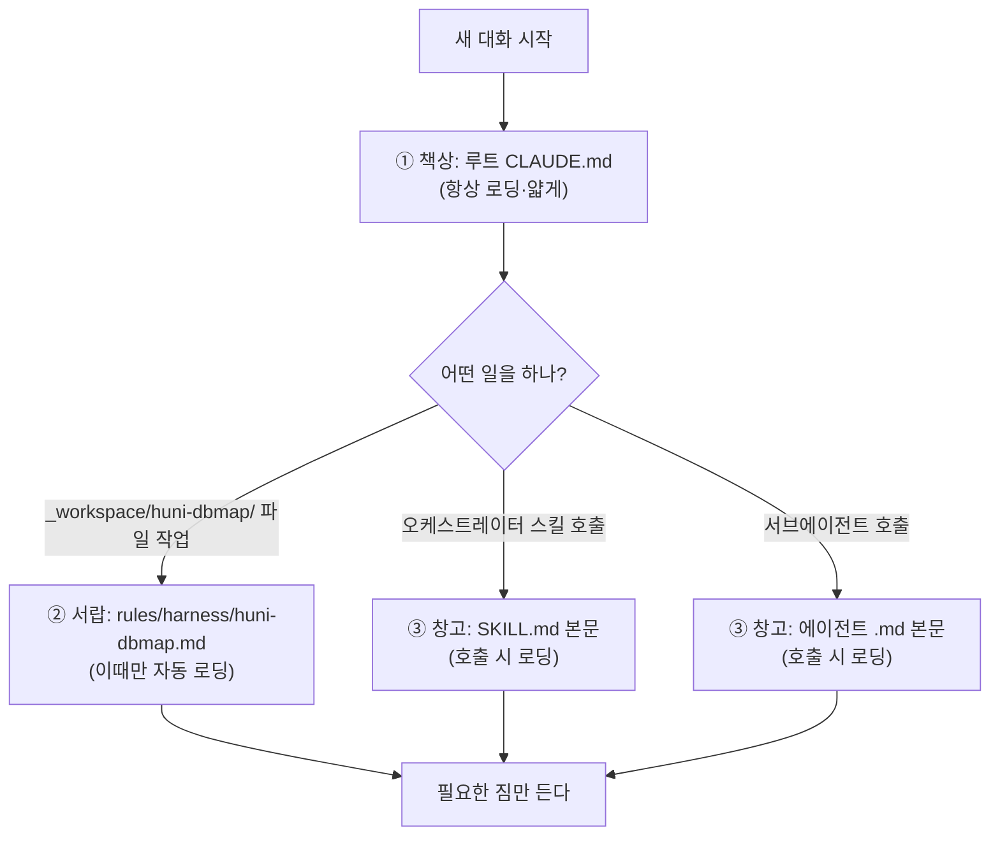

# 하네스 컨텍스트 아키텍처 설계 가이드
### — AI가 매번 읽는 짐을 줄이는 "3층 로딩" 방식

> 작성 2026-07-04 · 대상: 하네스(에이전트 팀+스킬)를 새로 만들거나 고칠 때 참조.
> 이 문서는 **왜 이렇게 설계하는지**를 비전문가도 이해하도록 풀어 쓴 설계 지침이다.
> 규칙 요약본은 루트 `CLAUDE.md §6`에, 기계적 컨벤션은 `harness` 스킬에 들어 있다.

---

## 0. 3분 요약 (바쁘면 여기만)

- **문제:** AI(클로드)는 새 대화를 시작할 때마다 프로젝트의 안내문서를 **처음부터 통째로 다시 읽는다.**
  안내문서가 두꺼워질수록, 사용자가 한 글자 입력하기도 전에 소비되는 양이 커진다(느려지고 비싸진다).
- **원인:** 하네스를 만들 때마다 `CLAUDE.md`에 설명과 변경이력을 계속 덧붙였다 → 34개 쌓이자
  **매 대화 시작 부하가 ~60,000 토큰**까지 불어났다(이 프로젝트 실측).
- **해결:** 안내문을 **3층**으로 나눈다 — ①항상 읽는 얇은 목차 ②필요할 때만 펴보는 서랍 ③부를 때만 여는 창고.
- **결과(이 프로젝트 실측):** 시작 부하 **~60,000 → ~17,000 토큰** (약 72% 감소). 기능 손실 0.

---

## 1. 먼저, 용어 3개만 (쉬운 말로)

| 용어 | 쉬운 뜻 |
|---|---|
| **토큰(token)** | AI가 글을 읽고 쓸 때 세는 "글자 묶음" 단위. 한글은 대략 1토큰 ≈ 1~2글자. **읽는 양 = 돈 + 시간.** |
| **컨텍스트(context)** | AI가 "지금 머릿속에 올려둔" 모든 글. 대화가 시작될 때 자동으로 채워지는 부분 + 우리가 나누는 대화. |
| **description(설명문)** | 에이전트·스킬 파일 맨 위에 적는 한두 줄 소개. AI가 "이 도구를 언제 쓸지" 판단하는 꼬리표. |

**핵심 사실 하나:** description과 CLAUDE.md 같은 "안내문"은 **매 대화 시작마다 자동으로 컨텍스트에 올라간다.**
그래서 안내문이 두꺼우면, 실제 일을 시작하기도 전에 짐이 무거워진다.
(출처: Claude Code 공식 문서 — "CLAUDE.md files are loaded into the context window at the start of every session, consuming tokens." [1])

---

## 2. 핵심 비유 — "책상 · 서랍 · 창고"

일하는 사람의 자리를 떠올리면 쉽다.

```
┌─────────────────────────────────────────────────────────┐
│  ① 책상 위 (항상 눈앞)   →  루트 CLAUDE.md               │
│     · 늘 지켜야 할 규칙, 하네스 "목차 표"                 │
│     · 얇아야 한다 (공식 권고: 200줄 이하)                 │
├─────────────────────────────────────────────────────────┤
│  ② 서랍 (필요할 때 연다)  →  .claude/rules/harness/*.md   │
│     · 하네스별 상세 규칙                                  │
│     · "그 하네스 폴더의 파일을 만질 때만" 자동으로 열림   │
├─────────────────────────────────────────────────────────┤
│  ③ 창고 (부를 때만 간다)  →  스킬 본문 · 에이전트 본문    │
│     · 실행 절차, 에이전트 상세 역할                       │
│     · 그 도구를 실제로 부를 때만 읽힘 → 평소 비용 0       │
└─────────────────────────────────────────────────────────┘
```

**핵심 원리:** 정보를 지우는 게 아니라 **"얼마나 자주 읽히는지"에 따라 층을 나눈다.**
자주 안 보는 건 아래층으로 내려서, 책상 위(매번 읽는 곳)를 비운다.



---

## 3. 무엇을 어느 층에 넣는가 (설계 규칙표)

| 넣을 내용 | 어느 층 (파일) | 언제 읽히나 | 그래서 |
|---|---|---|---|
| 항상 지킬 [HARD] 규칙 | ① 루트 `CLAUDE.md` §1~3 | 매 대화 | 꼭 필요한 것만 |
| 하네스 "목차" (한 줄/하네스) | ① 루트 `CLAUDE.md` 레지스트리 표 | 매 대화 | 1줄만 |
| 하네스별 상세 규칙·변경이력 1줄 | ② `.claude/rules/harness/<slug>.md` | 그 하네스 폴더 파일 작업 시 | 평소 0 비용 |
| 실행 절차·워크플로우 | ③ 오케스트레이터 `SKILL.md` 본문 | 스킬 호출 시 | 평소 0 비용 |
| 에이전트 상세 역할·규칙 | ③ 에이전트 `.md` **본문** | 그 에이전트 호출 시 | 평소 0 비용 |
| 변경이력 **서술 누적** | `_workspace/<하네스>/CHANGELOG.md` | 사람이 찾아볼 때만 | 절대 ①에 쌓지 마라 |
| 다음 세션 재시작 포인터 | `_workspace/<하네스>/HANDOFF.md` | 필요 시 | — |

### 가장 중요한 한 줄
> **변경이력을 루트 `CLAUDE.md`에 쌓지 마라.**
> 매 대화 읽는 곳에 이력을 계속 붙이면, (하네스 수 × 실행 횟수)만큼 짐이 **무한히 불어난다.**
> 이력은 창고(`CHANGELOG.md`)에 쌓고, 책상 위엔 "최신 한 줄"만 둔다.

---

## 4. 두 가지 "예산" 규칙 [HARD]

설계할 때 숫자로 지킬 두 가지.

### (가) 에이전트 description 예산 — "한두 줄이면 충분"
- **형식:** `{하네스명}의 {역할 한 문장}. 트리거: {키워드1~4}. 상세는 본문.` (약 150자)
- **이유:** 모든 에이전트의 description은 **매 대화 시작마다 전부** AI 머릿속에 올라간다.
  Claude Code에는 이 합계에 **약 15,000 토큰 상한**이 있고, 넘으면 잘리거나 경고가 뜬다.
- **상세는 어디에?** 에이전트의 자세한 역할·규칙·전체 트리거 목록은 **파일 본문**에 쓴다.
  본문은 그 에이전트를 **실제로 부를 때만** 읽히므로 평소 비용이 0이다.
- **왜 짧아도 괜찮나?** 서브에이전트는 대개 오케스트레이터(지휘자) 스킬이 **이름을 직접 불러** 실행한다.
  즉 description으로 "고를" 필요가 거의 없어서, 짧아도 라우팅이 망가지지 않는다.

### (나) 루트 CLAUDE.md 예산 — "200줄 이하"
- 공식 권고: `CLAUDE.md`는 **200줄 이하**를 목표로. 길수록 컨텍스트를 더 먹고
  **AI의 규칙 준수율도 떨어진다.** (출처: Claude Code 공식 문서 [1])
- 늘어나면 → 하네스 상세는 ②서랍(rules), 절차는 ③창고(스킬)로 밀어낸다.

> **비유:** description은 명함(앞면 한 줄), 본문은 이력서(부를 때만 건넴).
> 명함에 이력서를 다 적으면 명함첩이 터진다.

---

## 5. 왜 `@import`로는 안 줄어드나? (흔한 오해)

"긴 CLAUDE.md를 여러 파일로 쪼개서 `@파일` 로 불러오면 되지 않나?" → **안 된다.**
`@import`로 불러온 파일도 **대화 시작 시 똑같이 통째로 로딩된다.**
(출처: 공식 문서 — "imported files still load and enter the context window at launch" [1])

**진짜로 줄어드는 방법은 두 가지뿐:**
1. **내용을 삭감**하거나 (덜 중요한 건 창고로),
2. **경로 게이트(`paths:`)를 쓴 rules 파일**로 옮겨서 — 그 폴더를 만질 때만 열리게 한다.

그래서 이 프로젝트는 하네스 상세를 `@import`가 아니라 `.claude/rules/harness/<slug>.md`로 옮겼다.

---

## 6. 경로 게이트(`paths:`)란? — 서랍이 자동으로 열리는 원리

`.claude/rules/` 폴더에 규칙 파일을 두고, 파일 맨 위에 이렇게 적는다:

```markdown
---
paths:
  - "_workspace/huni-dbmap/**"
---

# Huni-DBMap 하네스 상세 규칙
... (이 내용은 위 폴더의 파일을 만질 때만 AI에게 로딩된다) ...
```

- `paths:`에 적은 경로의 파일을 **읽거나 작업할 때만** 이 규칙이 컨텍스트에 들어온다.
- DB매핑 작업 중이 아니면, DB매핑 상세 규칙은 **아예 안 읽힌다** → 평소 비용 0.
- 이것이 Claude Code의 **공식 기능**이다(비공식 편법이 아님).
  (출처: 공식 문서 "Path-specific rules" — `paths` frontmatter [1])

> ⚠️ **주의:** 공식 키는 `paths:` 다. (MoAI 문서 등에서 보이는 `globs:` 는 다른 관례이므로 혼동 주의.)

---

## 7. 설계 체크리스트 (새 하네스 만들 때)

- [ ] 루트 `CLAUDE.md` 레지스트리 표에 **1행만** 추가 (목표 문단·변경이력 금지)
- [ ] `.claude/rules/harness/<slug>.md` 생성 — `paths:` 게이트 + 목표·스킬/트리거·산출물·핵심규칙·변경이력 1줄
- [ ] 에이전트 description = **역할 1문장 + 트리거 ≤4개 + "상세는 본문."** (~150자)
- [ ] 에이전트 상세 역할·규칙·전체 트리거는 **본문**에
- [ ] 스킬 description = 적극적이되 **2~3문장 이내** (절차·배경은 SKILL.md 본문)
- [ ] 변경이력 **서술**은 `_workspace/<하네스>/CHANGELOG.md`에만 누적
- [ ] 루트 `CLAUDE.md` **200줄 이하** 유지 확인

---

## 8. 이 프로젝트에 실제로 적용한 결과 (실측)

| 항목 | 이전 | 이후 | 비고 |
|---|---|---|---|
| 루트 CLAUDE.md | 452줄 / 92.7 KB | **137줄 / 10.5 KB** | 34개 하네스 인라인 → 목차 표 |
| 에이전트 description 합계 | 61,268자 (~16.2k 토큰·한도 초과) | **16,010자 (~5k 토큰)** | 162개 모두 예산 형식으로 |
| 하네스 상세 | CLAUDE.md 인라인 | **rules 게이트 29개** | 평소 0 비용 |
| 대화 시작 부하 | **~60,000 토큰** | **~17,000 토큰** | 약 72% ↓ |

원문 보존: 구 CLAUDE.md 전문 = `.moai/_archive/CLAUDE-full-harness-2026-07-04.md`,
각 에이전트 원래 description = 해당 파일 본문 상단 인용구. **되돌리기 가능·기능 손실 0.**

---

## 9. 출처

**공식 문서 (직접 확인, 2026-07-04):**
- [1] Claude Code — *How Claude remembers your project* (Memory / CLAUDE.md / `.claude/rules` / `paths:` / `@import` / 200줄 권고): https://code.claude.com/docs/en/memory
- [2] Claude Code — *Skills* (progressive disclosure: name+description만 항상 로딩, 본문은 트리거 시): https://code.claude.com/docs/en/skills
- [3] Claude Code — *Subagents*: https://code.claude.com/docs/en/sub-agents
- [4] Claude Code — *Best practices*: https://code.claude.com/docs/en/best-practices

**참고 자료 (커뮤니티·서드파티):**
- [5] `harness` 메타 스킬 (revfactory) — 이 프로젝트가 쓰는 하네스 생성기: https://github.com/revfactory/harness
- [6] Piebald-AI — Claude Code 시스템 프롬프트/서브에이전트 토큰 관측 자료: https://github.com/Piebald-AI/claude-code-system-prompts
- [7] newline — *Claude Skills and Subagents Reduce Prompt Bloat*: https://www.newline.co/@Dipen/claude-skills-and-subagents-reduce-prompt-bloat--f2920804

**이 프로젝트 자체 근거:**
- [8] 실측·컨벤션 메모리: `~/.claude/projects/-Users-innojini-Dev-HuniWeb/memory/context-slim-convention-260704.md`
- [9] 적용 규약: 루트 `CLAUDE.md §6`, `harness` 스킬 Phase 3·4·5-4·7

> 커뮤니티 자료([5]~[7])는 방향을 보강하는 참고이며, 규칙의 근거는 공식 문서([1]~[4])와 이 프로젝트 실측이 우선한다.
