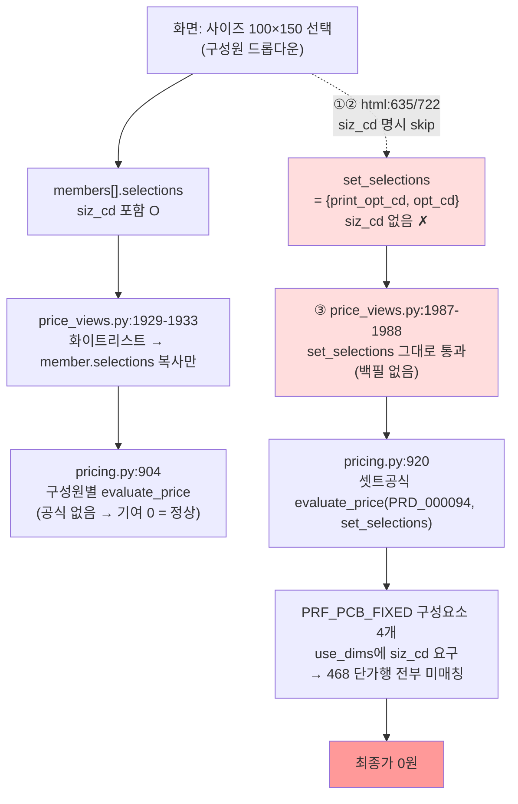

# DEV-REQUEST — 셋트 시뮬레이터 siz_cd 미전파로 엽서북 최종가 0원 (2026-07-02)

- 대상 코드: `raw/webadmin/webadmin/catalog/` (= HuniProductPrice2 레포 `catalog/`)
- 대상 상품: **PRD_000094 엽서북**(셋트 완제품) ← PRD_000095 내지(몽블랑240) · PRD_000096 표지(스노우300)
- 같은 클래스 영향: **PRD_000097 떡메모지 · PRD_000100 포토북** (아래 §5-3)
- 증거 원본: `_workspace/huni-set-product/07_sim_convergence/` (diagnosis.md · menu-map-260702.md · formula-design-verdict-260702.md · data-only-verify-260702.md + json/py/png)
- 이번 문서 작성 과정에서 코드·DB **일절 미수정** (검증은 전부 트랜잭션 ROLLBACK DRY-RUN·시뮬레이터 계산 호출만)

---

## 1. 한 줄 요약

**엽서북 가격 데이터는 권위 엑셀과 한 글자도 다르지 않게 완벽히 적재돼 있는데(468 단가행 verbatim), 가격시뮬레이터의 "셋트" 화면이 사이즈 값(siz_cd)을 서버로 안 보내서 — 부모 가격공식이 사이즈를 필수 조건으로 요구하는데 조건이 하나 비어서 — 최종가가 0원으로 나온다.**

쉽게 말하면: 계산기는 멀쩡한데, 화면이 계산기에 "사이즈" 칸을 안 채워 보낸다. 사이즈만 넣어주면 정확히 **450,000원**(100부 기준)이 나온다(A/B 실증, §3).

- 데이터 결함 아님: 공식 배선·단가행·CPQ 옵션·구성원 기초등록 전 층 건강 (diagnosis.md §R2-0 전수 실측).
- 공식 매핑 결함도 아님: 부모 all-in 공식(PRF_PCB_FIXED)은 권위 가격표("권당 완제품가" 단일표·계산공식집초안 91-92행 고정가형 명시)와 정합. 공식을 자식으로 쪼개는 건 오히려 권위 위반(§5-2).
- 순수 **코드 결함 1건** (내부 추적번호 R1-D3 = R2-D1).

---

## 2. 재현 절차 (엽서북)

1. webadmin 로그인 → 좌측 메뉴 **가격 시뮬레이터** 진입
   - URL: `https://huni-admin-production.up.railway.app/admin/price-simulator/` (라우트: `config/urls.py:62` → `price_views.py:2002 price_simulator`)
   - 계정: `.env.local`의 `HUNI_ADMIN_*` (읽기 탐색 전용)
2. 상품 선택: **엽서북 (PRD_000094)** → 셋트 UI로 분기됨(구성원 내지/표지 패널 표시)
3. 선택값 입력:
   - 부수(수량) = **100**
   - 인쇄 = **단면** (POPT_000001)
   - 페이지수 = **20P** (OPV_000491 · OPT_000082 그룹)
   - 내지/표지 사이즈 = **100×150** (SIZ_000003) — 구성원 드롭다운에는 사이즈가 보이고 선택도 됨
   - 판형은 자동선택(국4절 SIZ_000499·판걸이 9) 정상
4. [가격 계산] 클릭

| 항목 | 값 |
|---|---|
| **기대값(권위)** | **450,000원** (가격표 260527 엽서북떡메 시트: 100부 밴드 4,500원/권 × 100부 — verbatim) |
| **실제값** | **0원** + 경고 4건("셋트공식 선택값에 매칭되는 구성요소가 없습니다" 등) |

- 스크린샷: `07_sim_convergence/round2-01-options-filled.png`(옵션 전부 채운 화면) · `round2-02-calc-result-zero.png`(0원 결과) · `round1-result-zero.png`
- 참고: 구성원 사이즈를 화면에서 선택해도 그 값은 **구성원(member) 계산에만** 쓰이고, **셋트공식 계산(set_selections)으로는 전달되지 않는다** — 이것이 결함의 전부다.

---

## 3. A/B 결정 증거 — siz_cd 하나 차이로 0원 ↔ 450,000원

라이브 API `POST /admin/price-viewer/PRD_000094/simulate-set/` (`config/urls.py:59`)에 동일 페이로드를 **set_selections의 siz_cd 유/무만 바꿔** 두 번 호출했다.

공통 페이로드(두 케이스 동일 — DRY-RUN 재현 스크립트 `data-only-verify-260702-dryrun.py:44-63`과 동형):

```json
{
  "copies": 100,
  "plate_siz_cd": "SIZ_000499",
  "members": [
    {"sub_prd_cd": "PRD_000095", "role": "SEMI_ROLE.01",
     "selections": {"siz_cd": "SIZ_000003", "mat_cd": "MAT_000109", "print_opt_cd": "POPT_000001"},
     "qty_breakdown": {"mode": "derived"}},
    {"sub_prd_cd": "PRD_000096", "role": "SEMI_ROLE.02",
     "selections": {"siz_cd": "SIZ_000003", "mat_cd": "MAT_000092", "print_opt_cd": "POPT_000001"},
     "qty_breakdown": {"mode": "manual", "qty": 100}}
  ]
}
```

차이는 딱 한 줄:

| 케이스 | set_selections | 결과 |
|---|---|---|
| **A (UI가 실제로 보내는 그대로)** | `{"print_opt_cd":"POPT_000001", "opt_cd":"OPV_000491"}` — **siz_cd 없음** | **final = 0** |
| **B (siz_cd 한 키 추가)** | `{"siz_cd":"SIZ_000003", "print_opt_cd":"POPT_000001", "opt_cd":"OPV_000491"}` | **final = 450,000** (base 450000.00) |

결과 원문(`07_sim_convergence/round2-ab-simulate-set-evidence.json` 전문 인용):

```json
{"A_ui_payload_no_setsel_sizcd":
  {"final":0,
   "warnings":["[inner] 가격 소스 없음(직접단가·공식 미구성)",
               "[cover] 가격 소스 없음(직접단가·공식 미구성)",
               "[셋트공식] 선택값에 매칭되는 구성요소가 없습니다(합계 0원).",
               "셋트 합계 0원 — 구성원·셋트공식 모두 매칭 없음(데이터 미적재 가능성)."]},
 "B_with_setsel_sizcd":
  {"final":450000,"base":"450000.00",
   "warnings":["[inner] 가격 소스 없음(직접단가·공식 미구성)",
               "[cover] 가격 소스 없음(직접단가·공식 미구성)"]}}
```

- inner/cover "가격 소스 없음" 경고 2건은 **정상**이다 — 부모 공식이 표지+내지+제본을 전부 포함한 "권당 완제품가"(all-in)라서 구성원은 기여 0원이 맞다(구성원에 공식을 새로 달면 오히려 이중합산). 표출 문구 개선은 저순위 별건(diagnosis.md §R2-D2).
- 로컬 DRY-RUN 하네스로도 동일 재현(S0 베이스라인: A=0원·경고 문구까지 라이브와 동일, B=450,000) — `data-only-verify-260702-evidence.json`.

---

## 4. 원인 3지점 (파일:라인 · `raw/webadmin/webadmin/catalog/`)

| # | 위치 | 내용 |
|---|---|---|
| ① | **`templates/catalog/price_simulator.html:635`** | 셋트 조건 UI 렌더에서 `dims.filter(d => d.name!=="proc_cd" && d.name!=="siz_cd")` — 부모 공식 차원(prod_dims)에 siz_cd 3옵션이 내려와도 **셋트 조건 드롭다운을 아예 안 그림** |
| ② | **`templates/catalog/price_simulator.html:722`** | setSel(=set_selections) 조립 루프에서 `if(d.name==="proc_cd"||d.name==="siz_cd") continue;` — **siz_cd가 서버로 갈 통로 자체가 없음** (print_opt_cd·opt_cd는 정상 전송) |
| ③ | **`price_views.py:1929-1933` + `:1987-1988`** | 서버측 member 복사 화이트리스트 `("siz_cd","mat_cd","print_opt_cd")`는 **member.selections에만** 복사하고, `:1987` `set_selections`는 body 그대로 통과 — **백필(보충) 로직 없음** → `pricing.py:920` 셋트공식 `evaluate_price`에 siz_cd 영구 부재 |

설계 가정의 균열: 셋트 조건 UI는 "셋트공식 = 제본/조립비만(공정·수량 차원만 씀)"을 전제로 siz_cd를 걸렀다. 068 중철(부모공식 use_dims=[proc_cd,min_qty])·072 하드커버([min_qty])는 이 전제에 맞아 정상 동작하지만, 엽서북 부모공식 **PRF_PCB_FIXED는 all-in 완제품가형이라 use_dims=[siz_cd, min_qty, print_opt_cd, opt_cd, opt_grp:OPT_000082]** — siz_cd가 필수 매칭 차원인데 딱 그 하나만 안 온다.



---

## 5. 수정안

### 5-1. 결론 먼저 — 데이터/설정만으로는 해결 불가, **서버 백필 1점 수정(b안)을 권장**

코드 수정을 피하려고 webadmin 메뉴가 읽는 데이터 지점 전수(menu-map-260702.md)를 지도화하고, 떠오르는 데이터 후보 전부를 **라이브 DB 트랜잭션 ROLLBACK DRY-RUN으로 실측**했다(`data-only-verify-260702.md` — 사후 psql 재확인으로 라이브 흔적 0 입증). 전부 탈락:

| 데이터 후보 | 실측 결과 | 탈락 사유 |
|---|---|---|
| 공식을 내지(095)로 재바인딩 | **final = 0** | 화면이 페이지수(20P/30P=opt_cd)를 구성원에게 전달할 통로가 없음(화이트리스트 3키에 opt_cd 없음 + 구성원 UI에 opt 입력 자체 없음 html:742). 통로를 코드로 뚫어도 내지 파생수량 300장 vs 권당가 부수 축 충돌로 **1,035,000원 오답**(2.3배 과대) |
| 구성요소 use_dims에서 siz_cd 제거 | **final = 0** | 매칭 권위는 use_dims가 아니라 **단가행 자신의 차원 값**(`pricing.py:94-103` — 행 NULL만 와일드카드). siz_cd 값을 품은 468행이 전부 no-match. 행을 비우면 권위 날조 |
| 직접단가 4,500원 등록(공식보다 우선 `pricing.py:461`) | 100부=450,000(우연 일치)·**2부=9,000 ← 권위 22,000의 41% 저청구** | 468행 가격표가 단일 단가로 붕괴 + 공식 영구 마스킹(추후 수정 착지해도 안 돌아가는 조용한 회귀 함정). **등록 금지** |
| CPQ 옵션그룹 maps.dims로 siz_cd 주입 | 차단 | `price_views.py:1480` `opt_groups=[]` 하드코딩(2026-06-28 설계 결정) — 서버가 옵션그룹을 안 내려보내 어떤 데이터 등록도 무효 |
| 표지/내지/제본 분해 공식 신설 | 기각(DRY-RUN 무의미) | 권위 가격표에 분해 단가가 없음 — 어떤 값이든 **단가 날조[HARD 금지]** + 기존 all-in 단가행과 이중합산 위험 |
| 셋트 등록 해제(t_prd_product_sets del_yn=Y → 단일상품 경로) | **기술적으론 유일 GO**: 100부=450,000·2부=22,000 정확 | 그러나 "엽서북=셋트 완제품"이라는 상품 분류 정본(SOT [HARD]·역방향 교정 금지) 위반 + 셋트 전수진단/위젯 트랙 회귀 + BOM 소실 → **비권장·채택 안 함**(§7 참고) |

### 5-2. "공식 매핑이 잘못된 것 아닌가?" — 아니다 (구조 판정)

- 권위 가격표(260527 엽서북떡메 시트)는 사이즈3 × 단/양면 × 20P/30P × 수량밴드(2~3,000부)의 **"권당 완제품가" 단일표**이고, 계산공식집초안(상품마스터 260610) 91-92행이 `[고정가형: 엽서북/떡메모지] 판매가=[수량행][옵션열]`로 명시 — 표지/내지/제본 분해가는 권위 어디에도 없다.
- 표본 11셀 verbatim 대조 전부 일치(2부 11,000 · 100부 4,500 · 135×135 양면30P 13,500/6,000 등 — formula-design-verdict-260702.md §1-2).
- 즉 현 라이브 표현(부모 all-in 공식 + 구성원 무공식)이 권위에 맞는 **올바른 매핑**이고, 068/072처럼 "구성원이 각자 계산 + 셋트공식은 제본비만" 구조로 바꾸는 것이 오히려 권위 위반(단가 날조)이다. 고칠 곳은 데이터가 아니라 화면/서버의 전달 코드다.

### 5-3. 코드 수정안 — 택1, **(b) 서버 백필 권장(최소 변경)**

**(b) 서버 백필 — 권장:**

`price_views.py` `price_simulate_set`의 `:1987`(set_selections를 body에서 받는 지점) 직후에 조건부 보충 1블록:

> 부모(셋트 완제품)의 **현재 공식** use_dims에 `siz_cd`가 포함되어 있고, `set_selections`에 `siz_cd`가 없으면 → **내지 구성원(SEMI_ROLE.01)의 `member.selections["siz_cd"]`를 `set_selections`에 복사**한다.

- 근거: 엽서북류는 완제품 사이즈 = 내지 사이즈(구성원 드롭다운에 정보가 이미 있음 — 승격만 부재).
- **★백필 원천은 반드시 내지(SEMI_ROLE.01) — 표지 금지 (권위 도메인 근거, 상품마스터 260610 책자 시트 실측):** 부모(주문) 사이즈 = 완성 사이즈 = 가격표의 사이즈 축이며, **내지 재단 사이즈가 이와 동일**(100×150, 작업지는 블리드 +2mm). 반면 **표지는 앞+책등+뒤 펼침 사이즈**(100×150 상품 → 218×160(20P), 150×100 → 318×110, 135×135 → 288×145, 권위 원문 "*책등에따라다름" = 페이지수 의존)라 가격표 좌표에 존재하지 않음 — 표지 사이즈로 백필하면 여전히 매칭 실패(0원).
- 안전성: 기존 동작 셋트(068/069/070/072/077/082)는 부모 공식 use_dims에 siz_cd가 없어 **백필 조건 자체가 발동하지 않음** → 무영향(§6 회귀 게이트로 확인).
- 기존 이슈와 구분: `:1930` 화이트리스트에 coat_side_cnt가 빠진 기지 C트랙(CODEBUG-set-coat-side-cnt-drop.md)과는 **별건** — 그건 member→member 복사, 이건 셋트공식 차원 수집.

**(a) UI 조건화 — 대안:**

`price_simulator.html:635`·`:722`의 siz_cd 일괄 제외를 "부모 현재공식 use_dims에 siz_cd 포함 시에는 셋트 조건 드롭다운 노출 + setSel 전송"으로 조건화. 사용자가 사이즈를 명시 선택하는 UX가 되지만 변경 표면이 넓다(렌더+조립 2곳·손님 혼동 여지). b안이 더 작고 안전하다.

**같은 클래스 영향 상품 (수정 시 함께 검수):**

| 상품 | 부모 공식이 요구하는 차원 | 현재 증상 | b안 적용 후 |
|---|---|---|---|
| **PRD_000097 떡메모지** | siz_cd + bdl_qty(묶음수) 등 | 화면 0원 (siz_cd 미전달 — 동일 결함) | 백필로 해소. 실증 정답: siz SIZ_000119 + bdl_qty=50 → **135,000** (bdl_qty는 UI 필터가 proc_cd/siz_cd만 걸러 전송됨 — 검수에서 함께 확인) |
| **PRD_000100 포토북** | siz_cd + opt_cd | 화면 0원 (동일 결함) | 백필로 해소. 실증 정답: siz SIZ_000269 + OPV_000484 → **1,500,000** |

(두 상품 모두 "부모 고정가형 공식 + 옵션차원을 set_selections에 채우면 정상"이 라이브 실증 완료 — §23 셋트 19개 전수 진단, 2026-07-02.)

---

## 6. 회귀 게이트 — 수정 후 반드시 확인할 것

**불변 확인(기존 동작 셋트 — 수정 전후 최종가 동일해야 함):**

| 셋트 | 부모 공식 use_dims | 기준값(기존 검증) |
|---|---|---|
| PRD_000068 중철 | [proc_cd, min_qty] — siz_cd 없음 | 최종 158,688 (표지 member 기여 88,688 포함) |
| PRD_000069 무선 | siz_cd 없음 | 138,688 |
| PRD_000070 PUR | siz_cd 없음 | 288,688 |
| PRD_000072 하드커버 | COVERBIND [min_qty] | 968,119 |
| PRD_000077 레더 D링(무선형) | [min_qty] | 34,100(1부) / 796,900(100부) |
| PRD_000082 하드커버 트윈링 | [min_qty] | 44,123 |

→ 전부 부모 공식이 siz_cd를 요구하지 않으므로 **백필 미발동 = 값 변화 0**이 정상. 하나라도 값이 바뀌면 수정 롤백 후 재검토.

**엽서북 검수 기대값(수정 착지 판정 기준):**

| 입력 (시뮬레이터 화면 동일 입력) | 기대 최종가 |
|---|---|
| 부수 100 · 100×150 · 단면 · 20P | **450,000** |
| 부수 2 · 100×150 · 단면 · 20P | **22,000** (2×11,000) |
| 부수 100 · 135×135 · 양면 · 30P | **600,000** (6,000×100) |

+ 같은 클래스: 097 떡메(위 조합 135,000) · 100 포토북(1,500,000) 각 1케이스.
+ 경고 문구: "[셋트공식] 선택값에 매칭되는 구성요소가 없습니다" 소멸 확인. (inner/cover "가격 소스 없음"은 all-in 설계상 잔존 — 별건 저순위 표출 개선.)

---

## 7. (참고) 코드 수정 없이 가능한 유일 경로 — 채택하지 않음

트랜잭션 ROLLBACK DRY-RUN에서 **셋트 등록 해제**(t_prd_product_sets 2행 del_yn=Y → 시뮬레이터가 단일상품 UI로 분기 → 단일 UI는 siz_cd를 정상 전송 `price_simulator.html:452`)만이 데이터-only로 정답을 냈다(100부=450,000·2부=22,000·경고 0). 그러나:

- "엽서북 = 셋트 완제품"이라는 상품 분류 정본(`_workspace/_foundation/product-type-classification-sot.md` [HARD])을 **데이터에 맞춰 거꾸로 깨는 것**이라 금지 방향.
- 셋트 전수진단(§23)·위젯 컨버전 트랙 회귀, 페이지→내지매수 파생·BOM 정보 소실, admin 인라인 삭제 시 물리 DELETE 위험.

따라서 **1안이 아니라 기각 대안**으로만 기록한다. 만약 개발 착지 전 임시조치로 검토하려면 "원복 조건 명시 + 인간 승인"이 전제다. 정공은 §5-3 (b) 서버 백필이다.

---

*작성: 2026-07-02 · 셋트 시뮬레이터 수렴 워크플로(§23) · 라이브 읽기전용 준수(쓰기 0건·ROLLBACK 전용 DRY-RUN·residue check 통과)*
