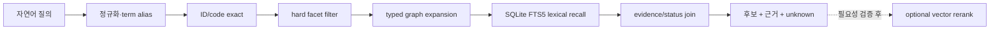
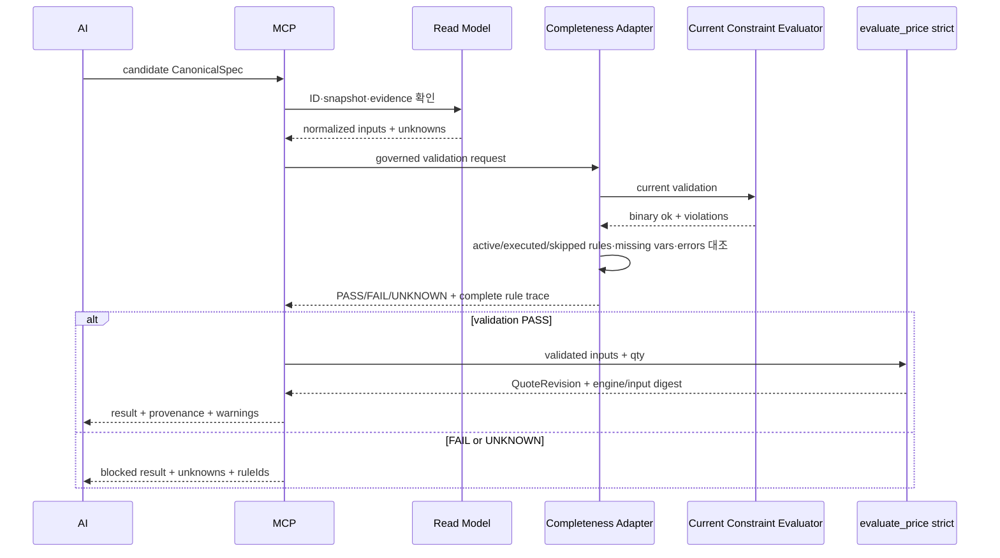

# Huni AI Read Model 계약

> 계약 ID: `AI-READ-MODEL-001`
>
> 문서 버전: `1.0.0`
>
> 기준일: 2026-09-01
>
> 상태: 구현 전 설계 계약 (`PROPOSAL`)
>
> 범위: 라이브 PostgreSQL·권위 Excel·현재 결정론 코드의 **읽기 전용 AI 투영본**

이 문서는 AI가 후니의 상품·구성요소·가격구조·제약을 조회할 때 지켜야 하는 데이터 계약이다. 이 문서가 정의하는 것은 데이터베이스를 대체하는 새 권위가 아니라, 특정 시점의 원천을 안전하게 읽기 위한 불변 read model과 닫힌 도구 입출력이다.

## 0. 적용 범위와 권위 선언

### 확인된 사실

- 현재 상품뷰어의 기존 출력은 [`SPEC-PRICEGRID-001`](../product-worldmodel-viewer/schemas/snapshot.schema.json) 계약을 사용한다.
- 현재 라이브 seed exporter는 [`export_live.py`](../product-worldmodel-viewer/tools/export_live.py)의 `REPEATABLE READ`, `READ ONLY` 패턴을 사용한다. 다만 현재 구현에는 `SELECT *`가 있으므로 AI 운영 계약에 그대로 노출하지 않는다.
- 현재 가격 계산 권위는 [`pricing.py:evaluate_price` 604행](../../raw/webadmin/webadmin/catalog/pricing.py)이다.
- 현재 제약 endpoint는 binary `ok`와 `{msg, typ}` 위반 목록만 반환한다. missing variable이나 평가 예외 규칙은 skip하며 `UNKNOWN`·rule ID·`evaluatedAt`을 제공하지 않는다([`widget_api.py:_eval_violations` 2113행](../../raw/webadmin/webadmin/catalog/widget_api.py), [`api_validate` 2255행](../../raw/webadmin/webadmin/catalog/widget_api.py)). 따라서 아래 `validate_spec`은 현재 응답의 단순 passthrough가 아니라 **미평가 규칙을 fail-closed로 계측하는 목표 adapter 계약**이다.
- 현재 온톨로지 SOT는 [`ontology-schema.md`](../huni-ontology-kb/02_ontology/ontology-schema.md)이며 17개 entity type과 19개 relation type을 정의한다.
- 현재 live seed의 관측 시점과 수치는 상위 레시피 [`AI-READY-LIVE-DB-RECIPE.md`](./AI-READY-LIVE-DB-RECIPE.md)의 §2에 기록되어 있다. 이 문서는 그 값을 새로 권위화하지 않는다.

### 제안

권위에는 모든 질문에 적용되는 단일 순위가 없다. **질문의 종류별 권위**를 선택하며, read model은 어느 원천도 덮어쓰지 않는다.

| 질문 | 권위 | read model의 역할 |
|---|---|---|
| 지금 라이브에 이 상품·배선이 존재하는가 | PostgreSQL snapshot | 시점 고정 관측과 근거 반환 |
| 가격이 얼마인가 | `evaluate_price(..., mode="strict")` | 입력을 만들고 결과 trace 보존 |
| 이 선택 조합이 유효한가 | 현재 constraint evaluator의 실제 실행 + governed completeness adapter | 실행·skip·missing·error를 분리하고 완전성을 증명하지 못하면 `UNKNOWN` |
| 원천 가격의 의미가 단가·합가·고정금액 중 무엇인가 | Excel·DB·가격 설계의 승인된 매핑 | 의미를 재산술하지 않고 표시 |
| “귀돌이”, “라운딩” 등 용어가 같은가 | ontology/term SOT | alias 후보와 근거 반환 |

`raw/webadmin`과 라이브 DB는 이 계약 구현 중 수정하지 않는다. AI Read Model은 새 폴더의 exporter/assembler가 생성하는 별도 산출물이다.

## 1. 계약의 기본 규칙

1. 모든 응답은 하나의 `snapshotId`에 고정한다. 서로 다른 snapshot의 node·edge·price row를 한 응답에 섞지 않는다.
2. 표시명(label)은 식별자가 아니다. ID와 source key를 항상 함께 보존한다.
3. 관측(`OBSERVED`)·파생(`DERIVED`)·추론(`INFERRED`)을 같은 사실로 직렬화하지 않는다.
4. `null`, 빈 문자열, 숫자 `0`, 무료, 미적재, 비활성은 서로 다른 값이다.
5. `PASS`는 결정론 evaluator가 실제로 평가한 결과에만 사용한다. 데이터가 존재한다는 이유로 `PASS`가 되지 않는다.
6. `UNKNOWN`, `NOT_EVALUATED`, `BLOCKED`는 검색 랭킹에서 임의로 `false` 또는 `true`로 바꾸지 않는다.
7. 모든 사실 블록은 최소 한 개의 provenance/evidence를 가져야 한다. 근거가 없으면 `UNKNOWN` 또는 `GAP`으로 기록한다.
8. read model의 가격 숫자는 설명·필터·trace 용도다. 주문 금액과 견적 확정값은 read model에서 꺼내지 않는다.
9. LLM이 만든 ID, relation, amount는 원천 조회 또는 evaluator 결과와 대조되기 전에는 승인된 값이 아니다.
10. 새 entity/relation/enum은 이 계약 버전과 registry를 먼저 변경한 뒤에만 사용할 수 있다.

## 2. 버전과 식별자

### 2.1 버전 규칙

| 버전 | 변경 예 | 호환성 |
|---|---|---|
| `MAJOR` | entity/relation 삭제·의미 변경, 필수 필드 변경, 가격 의미 enum 변경 | 소비자 재검증 필요 |
| `MINOR` | 선택 필드·새 relation 추가, 하위 호환 enum 확장 | 기존 소비자 동작 유지, gate 재실행 |
| `PATCH` | 설명·오탈자·검증 로직 보정, 의미·직렬화 불변 | 동일 schema 소비 가능 |

세 가지 버전을 분리한다.

```text
modelVersion       = AI-READ-MODEL-001@1.0.0
snapshotId         = huni:snapshot:<dbAsOf>:<payloadDigest>
sourceSchemaHash    = sha256:<information_schema canonical digest>
```

- `modelVersion`: 이 문서의 구조 버전이다.
- `snapshotId`: 동일 snapshot을 재현하는 불변 식별자다.
- `sourceSchemaHash`: 해당 추출 시점의 실제 live schema를 식별한다. 과거 문서의 “34/35개 테이블” 표기를 재사용하지 않는다.
- 파일별 SHA-256과 상위 manifest 서명은 [상위 레시피](./AI-READY-LIVE-DB-RECIPE.md)의 manifest 정책을 따른다.

### 2.2 stable ID 규칙

정규 ID는 namespace·entity type·source key의 조합으로 만든다. source key가 없는 KB 전용 노드는 승인된 prefix와 SOT key를 사용한다.

```text
huni:<entity-type>:<source-system>/<natural-key>
```

예:

```text
huni:product:db/PRD_000016
huni:material:db/MAT_000109
huni:price_formula:db/PRF_DGP_A
huni:option_group:db/PRD_000031|OPT_000046
huni:option_item:db/PRD_000031|OPT_000153
huni:price_row:db/123456
huni:term:kb/TERM_corner_round
huni:gap:kb/GAP_031_paper_parent_child
```

규칙:

- 자연키는 대소문자·공백을 정규화한 뒤에도 원문 `sourceKeys`를 보존한다.
- 복합키는 필드 순서를 registry에 고정하고 `|`로 결합한다. join 결과의 행 순서로 ID를 만들지 않는다.
- 가격행은 현재 source PK인 `comp_price_id`를 우선 ID로 사용한다. `naturalKeyDigest`는 registry 순서를 고정한 `comp_cd`, `apply_ymd`, `siz_cd`, `plt_siz_cd`, `clr_cd`, `mat_cd`, `proc_cd`, `opt_cd`, `print_opt_cd`, `coat_side_cnt`, `spot_side_cnt`, `bdl_qty`, `page_cnt`, `siz_width`, `siz_height`, `min_qty`, RFC 8785로 canonicalize한 `dim_vals`를 모두 직렬화해 SHA-256으로 만든다. source PK가 없는 외부 원천에서만 이 승인된 전체 자연키 digest를 ID fallback으로 쓴다.
- 가격행 ID와 `naturalKeyDigest`에 `unit_price`를 포함하지 않는다. 금액이 바뀌어도 같은 source row의 ID가 유지되어 diff가 가능해야 한다.
- source key가 정말 없을 때만 `kb/` ID를 민팅한다. 먼저 live·Excel·KB SOT에서 같은 개념을 검색한다(`search-before-mint`).
- 기존 viewer의 `product-...`, `component-...`, `edge:...` ID는 `legacyIds`로 보존할 수 있지만 정규 ID로 재사용하지 않는다.
- canonical ID collision은 0이어야 한다. collision이 있으면 bundle을 publish하지 않는다.

## 3. 허용 vocabulary

### 3.1 entity type 17종

아래 목록은 현재 ontology SOT의 어휘를 AI Read Model에서 사용할 수 있는 폐쇄 목록으로 옮긴 것이다. 실제 live에 존재하지 않는 개념은 `term`, `rule`, `decision`, `gap`, `intent`의 KB 전용 레이어에만 둘 수 있다.

| entityType | 의미 | 기본 source |
|---|---|---|
| `product` | 판매·생산 상품 | `t_prd_products` |
| `category` | 상품 분류 | `t_cat_categories` |
| `size` | 재단·작업 치수 | `t_siz_sizes`, 상품 junction |
| `material` | 용지·소재 | `t_mat_materials`, 상품 junction |
| `print_option` | 도수·인쇄방식·인쇄면 | `t_prt_print_options`, 상품 junction |
| `process` | 인쇄·후가공 공정 | `t_proc_processes`, 상품 junction |
| `plate_size` | 출력용지 판형 | 판형 테이블/함수 근거 |
| `bundle_qty` | 묶음·최소·최대·증분 수량 | 수량 규칙 source |
| `price_formula` | 상품에 연결된 가격 공식 | `t_prc_price_formulas` |
| `price_component` | 공식의 가격 구성요소 | `t_prc_price_components` |
| `option_group` | 고객 선택 축 | CPQ option group |
| `constraint` | 허용·금지 조합 규칙 | `t_prd_product_constraints` |
| `term` | 표준어·별칭·오표기 | ontology term SOT |
| `rule` | 도메인 규칙·안티패턴 | 승인 문서/KB |
| `decision` | 확정 결정·핸드오프 결론 | 승인 문서 |
| `gap` | 원천 부재·미확정 공백 | GAP registry |
| `intent` | 고객 용도·의도 | KB 전용 |

`option_item`, `price_row`, `evidence`는 v1의 graph node type이 아니라 별도 normalized record다. `gap`은 17종 vocabulary의 node이면서 상세 gap record를 가진다. 특히 구성요소 가격행은 기본 graph node를 무한히 확장하지 않고 `price_row` record로 drill-down한다. `option_item`을 graph node로 승격하려면 계약 `MINOR` 변경과 relation registry 재검증이 필요하다.

### 3.2 relation type 19종

relation은 폐쇄 목록이다. `related_to`, `similar_to`, `maybe_uses` 같은 자유 관계명을 생성하지 않는다.

| relation | source → target | origin |
|---|---|---|
| `in_category` | product → category | `fk` |
| `has_size` | product → size | `fk` |
| `uses_material` | product → material | `fk` |
| `has_print_option` | product → print_option | `fk` |
| `has_process` | product → process | `fk` |
| `has_plate_size` | product → plate_size | `fk`/`derived` |
| `has_qty_rule` | product → bundle_qty | `fk`/`derived` |
| `priced_by` | product → price_formula | `fk` |
| `has_component` | price_formula → price_component | `fk` |
| `has_option_group` | product → option_group | `fk` |
| `option_refs` | option_group → size/material/process/print_option, 실제 item key는 qualifier | `fk` |
| `constrains` | constraint → product/option_group | `fk` |
| `has_member` | product → product | `fk`/`doc` |
| `has_addon` | product → product | `doc`/`derived` |
| `decided_because` | decision → any | `doc` |
| `supersedes` | decision → decision | `doc` |
| `references` | any → any | `doc` |
| `derived_from` | derived field/value → source field/value | `derived` |
| `alias_of` | term → term | `derived` |

`origin`은 관계의 출처 종류이지 신뢰도나 평가 결과가 아니다. 예를 들어 `origin=fk`인 배선도 데이터 상태가 `BROKEN`일 수 있다.

## 4. 상태축과 provenance

### 4.1 세 상태축

세 상태축을 한 `status` 필드로 합치지 않는다.

| 필드 | 허용값 | 질문 |
|---|---|---|
| `authorityStatus` | `OBSERVED_LIVE_SNAPSHOT`, `SOURCE_ASSERTED`, `DERIVED_DETERMINISTIC`, `INFERRED`, `UNKNOWN` | 어디에서 온 값인가 |
| `dataStatus` | `READY`, `MISSING`, `BROKEN`, `UNDECIDED`, `INACTIVE` | 데이터가 어떤 상태인가 |
| `evaluationStatus` | `PASS`, `FAIL`, `UNKNOWN`, `NOT_EVALUATED`, `BLOCKED` | 실제 evaluator가 무엇까지 평가했는가 |

변환 금지:

```text
OBSERVED_LIVE_SNAPSHOT + READY ≠ evaluation PASS
verified source           ≠ orderable
missing                    ≠ false
0원                        ≠ 무료
합가                       ≠ 단가 × 수량
```

`evaluationStatus=PASS`에는 `evaluatorRef`, `evaluatedAt`, `inputDigest`, 전체 대상·실행 `ruleIds`와 skipped rule 0 증거가 필수다. `FAIL`에도 같은 trace를 남긴다. `UNKNOWN`은 evaluator를 호출했지만 missing variable·skip·평가 예외 때문에 완전성을 증명하지 못한 상태이며 `skippedRuleIds`, `skipReasons`, `missingVariables`가 필수다. `NOT_EVALUATED`는 호출하지 않은 상태, `BLOCKED`는 정책·입력 전제 때문에 호출이 금지된 상태다.

### 4.2 Provenance record

```json
{
  "evidenceId": "huni:evidence:snapshot/20260901-001:00000042",
  "sourceKind": "LIVE_DB",
  "sourceRef": "live-snapshot/20260901-010618",
  "sourcePath": "live-snapshot/.../t_prd_products.csv",
  "locator": {
    "table": "t_prd_products",
    "keys": {"prd_cd": "PRD_000016"},
    "columns": ["prd_cd", "prd_nm", "use_yn"]
  },
  "capturedAt": "2026-09-01T01:06:18.71677Z",
  "sourceHash": "sha256:<file-or-workbook-hash>",
  "authorityStatus": "OBSERVED_LIVE_SNAPSHOT",
  "redaction": "NONE"
}
```

필수 규칙:

- `sourceKind`: `LIVE_DB`, `EXCEL_CELL`, `CODE`, `KB_SOT`, `DERIVED`, `HUMAN_DECISION` 중 하나.
- Excel은 `workbookHash`, `sheet`, `cellOrRange`를 추가한다. comment는 `value`와 별도 evidence로 둔다.
- DB는 table·복합 key·projection columns를 기록한다. `SELECT *` 결과를 provenance로 승인하지 않는다.
- 코드 근거는 repo-relative path와 line/function anchor를 기록한다. 실행 시점의 `engineDigest`도 별도 기록한다.
- 비밀·PII·주문상세가 있는 source는 discovery bundle의 evidence에 그대로 복사하지 않고 redaction reference만 둔다.
- provenance가 오래되어도 삭제하지 않는다. `freshness` 판정으로 `STALE`/`EXPIRED`를 표시한다.

### 4.3 Freshness와 시간

모든 bundle은 아래 시점을 구분한다.

| 필드 | 의미 |
|---|---|
| `dbAsOf` | repeatable-read transaction이 관측한 DB 시점 |
| `generatedAt` | bundle이 생성된 시점 |
| `capturedAt` | 개별 evidence를 확인한 시점 |
| `effectiveFrom`/`effectiveTo` | 가격·규칙이 실제 적용되는 업무 기간 |
| `freshness.expiresAt` | 검색용 snapshot의 만료 시점 |

`dbAsOf`가 같아도 Excel `effectiveFrom`이 현재 주문일과 다르면 가격 확정에 사용하지 않는다. 만료 snapshot은 명시적 historical 조회에서만 `STALE/HISTORICAL_ONLY`로 반환하며 새 후보 결정에는 사용하지 않는다. 기본 discovery는 fresh한 승인 snapshot이 없으면 거절한다. `quote_spec`은 discovery snapshot 금액을 쓰지 않고 현재 strict evaluator를 다시 호출하지만, stale discovery에서 만든 미검증 후보를 그대로 입력받지는 않는다.

## 5. Snapshot record

최상위 manifest는 bundle 전체를 고정한다.

```json
{
  "contractId": "AI-READ-MODEL-001",
  "modelVersion": "1.0.0",
  "snapshotId": "huni:snapshot:2026-09-01T01:06:18.71677Z:sha256:<digest>",
  "generatedAt": "2026-09-01T01:07:02Z",
  "dbAsOf": "2026-09-01T01:06:18.71677Z",
  "sourceSchemaHash": "sha256:<information-schema-digest>",
  "transaction": {"isolation": "repeatable read", "readOnly": true},
  "inputs": [
    {"kind": "LIVE_DB", "projectionId": "AI_DB_PROJECTION_001"},
    {"kind": "EXCEL", "version": "260822_1", "hashStatus": "VERIFIED"},
    {"kind": "CODE", "engineRef": "pricing.py:evaluate_price"}
  ],
  "projections": {
    "discovery": "DISCOVERY_001",
    "internalDiagnostic": "INTERNAL_DIAGNOSTIC_001"
  },
  "artifacts": [
    {"path": "tables/products.parquet", "sha256": "<digest>", "rows": 309},
    {"path": "graph/nodes.parquet", "sha256": "<digest>", "rows": 1814, "rowMetric": "uniqueNodeIds"},
    {"path": "graph/edges.parquet", "sha256": "<digest>", "rows": 3009, "rowMetric": "uniqueSourceRelationTargetTriples"},
    {"path": "evidence/evidence.parquet", "sha256": "<digest>", "rows": 0},
    {"path": "search/lexical.sqlite", "sha256": "<digest>", "rows": 0}
  ],
  "counts": {
    "products": 309,
    "activeProducts": 269,
    "nodeOccurrences": 3493,
    "uniqueNodeIds": 1814,
    "edgeOccurrences": 3289,
    "uniqueSourceRelationTargetTriples": 3009
  },
  "gateStatus": "CANDIDATE",
  "signatureContract": {
    "algorithm": "Ed25519",
    "canonicalization": "RFC8785",
    "signedObject": "ENTIRE_IMMUTABLE_MANIFEST_JSON",
    "detachedEnvelope": "manifest.sig",
    "encoding": "base64url-no-pad",
    "runtimeVerificationOutsideManifest": true
  }
}
```

예시의 `rows: 0`과 `<digest>`는 계약 예시 placeholder이며 실제 manifest로 사용하지 않는다. node/edge의 `rows`는 occurrence가 아니라 정규화 후 중복 제거된 canonical record 수다. occurrence 수는 `counts`의 관측 지표로 따로 보존한다. 실제 publish는 모든 artifact의 row count·hash·schema hash·서명 검증이 채워진 경우에만 가능하다.

### Snapshot 불변성

- bundle directory는 content-addressed ID로 만든다.
- build가 모든 immutable field와 gate digest를 채운 후 manifest 전체를 RFC 8785 JCS로 canonicalize한 bytes를 Ed25519로 서명한다. `manifest.sig`는 `keyId`, pinned public-key fingerprint, payload SHA-256, signature encoding/value를 가진 detached envelope다.
- signature 값, verification 결과, publishedAt, current 여부처럼 실행 중 바뀌는 상태는 `manifest.json`에 쓰지 않는다. verifier 결과는 별도 gate/audit record다.
- `current`는 승인된 bundle ID와 monotonic promotion generation만 가리키는 원자적 pointer다.
- 각 promotion record는 `generation`, `previousPromotionDigest`, `previousSnapshotId`, `newSnapshotId`, `manifestDigest`, `action=PUBLISH|ROLLBACK`, `approvedBy`, `approvalPolicyId`, `approvalEvidenceDigest`, `promotedAt`, `policyVersion`을 가진다. RFC 8785 JCS bytes를 Ed25519 detached-sign하며 정상 publish와 승인 rollback 모두 generation을 증가시킨다.
- prefix rollback의 독립 신뢰 앵커는 bundle·ledger·`current`와 다른 OS 계정/ACL·WORM 저장영역의 append-only `promotion-heads/head_<generation>.json`이다. JSON payload는 `generation`, `promotionDigest`, `policyVersion`, `keyId`만 가지며 payload 전체의 RFC 8785 JCS exact bytes를 Ed25519로 서명한다. signature는 `head_<generation>.sig` detached envelope(`keyId`, public-key fingerprint, payload SHA-256, encoding, signature value)에만 두며 JSON payload 안에 중복 저장하지 않는다. 일반 exporter·MCP·bundle publisher는 쓸 수 없고 privileged promotion helper만 새 head pair를 append한다.
- verifier는 head를 먼저 검증한 뒤 signed chain·manifest·`current`를 대조한다. head 누락/변조, 낮은 ledger prefix, head가 가리키는 record/manifest 누락은 자동 fallback·head 재구축 없이 fail-closed다. head보다 높은 ledger tail은 미승인 pending으로 격리한다.
- 복구는 generation을 낮추거나 같은 generation을 덮어쓸 수 없다. 독립 백업의 마지막 trusted head를 기준으로 별도 recovery key와 stable approver 2인의 ID·approval evidence digest를 가진 더 높은 generation의 signed recovery record를 append한다. root/hardware/WORM 관리자 동시 침해는 별도 상위 위협 모델이다.
- 유효한 과거 manifest라도 trusted head와 일치하는 signed promotion chain 없이 `current`가 역행하면 replay/downgrade로 거절한다. 승인 rollback은 `rollbackOf`, 사유, stable `approvedBy`, `approvalPolicyId`, `approvalEvidenceDigest`가 필수다.
- 생성 중인 `.tmp` bundle은 query layer가 볼 수 없다.
- 동일 input·동일 assembler version·동일 projection config를 두 번 빌드하면 canonical artifact hash가 같아야 한다.
- snapshot 내부의 node, edge, evidence, price row는 모두 같은 `snapshotId`를 참조한다.

```json
{
  "generation": 42,
  "previousPromotionDigest": "sha256:<generation-41-promotion-jcs-bytes>",
  "previousSnapshotId": "huni:snapshot:previous",
  "newSnapshotId": "huni:snapshot:approved",
  "manifestDigest": "sha256:<approved-manifest-jcs-bytes>",
  "action": "PUBLISH",
  "rollbackOf": null,
  "approvedBy": ["principal:release-approver-01"],
  "approvalPolicyId": "ai-promotion-approval/v1",
  "approvalEvidenceDigest": "sha256:<approval-artifact>",
  "promotedAt": "2026-09-01T01:10:00Z",
  "policyVersion": "ai-promotion/v1"
}
```

## 6. Node / edge schema

### 6.1 Node record

```json
{
  "nodeId": "huni:product:db/PRD_000016",
  "entityType": "product",
  "legacyIds": ["product:PRD_000016"],
  "sourceKeys": {"prd_cd": "PRD_000016"},
  "label": {"value": "프리미엄엽서", "language": "ko", "raw": "프리미엄엽서"},
  "attributes": {},
  "authorityStatus": "OBSERVED_LIVE_SNAPSHOT",
  "dataStatus": "READY",
  "evaluationStatus": "NOT_EVALUATED",
  "temporal": {
    "snapshotId": "huni:snapshot:...",
    "dbAsOf": "2026-09-01T01:06:18.71677Z",
    "effectiveFrom": null,
    "effectiveTo": null,
    "freshness": "FRESH"
  },
  "evidenceRefs": ["huni:evidence:snapshot/...:00000042"],
  "gapRefs": []
}
```

`attributes`는 entity별 registry가 허용한 typed fields만 가진다. 원본의 모든 열을 자동으로 복사하지 않는다. 원본 보존이 필요한 값은 별도 restricted table 또는 evidence locator에 둔다.

### 6.2 Edge record

```json
{
  "edgeId": "huni:edge:sha256:<canonical-edge-input>",
  "relation": "has_component",
  "sourceNodeId": "huni:price_formula:db/PRF_DGP_A",
  "targetNodeId": "huni:price_component:db/COMP_PAPER",
  "origin": "fk",
  "qualifiers": {
    "addtnYn": "N",
    "optionItemKey": null
  },
  "authorityStatus": "OBSERVED_LIVE_SNAPSHOT",
  "dataStatus": "READY",
  "evaluationStatus": "NOT_EVALUATED",
  "snapshotId": "huni:snapshot:...",
  "evidenceRefs": ["huni:evidence:snapshot/...:00000118"],
  "gapRefs": []
}
```

Edge ID 입력은 `relation`, source ID, target ID, 정렬된 qualifier, snapshot-independent source natural key로 canonicalize한다. 행 번호와 label은 넣지 않는다.

검증 규칙:

- source·target node가 같은 snapshot에 존재해야 한다.
- relation registry의 source/target type과 맞지 않으면 publish FAIL이다. `references`만 any → any 예외다.
- endpoint가 없는 edge는 버리지 않고 `dataStatus=BROKEN`, `gapRefs`를 가진 diagnostic edge로 별도 기록한다.
- `option_refs`는 option group 자체가 아니라 실제 option item의 `ref_dim_cd`, `ref_key1`, `ref_key2`를 qualifier로 보존한다.
- `derived_from`은 계산된 결과를 사실로 승격하지 않고 `origin=derived`, `authorityStatus=DERIVED_DETERMINISTIC`으로 기록한다.

## 7. Price row와 계산 의미 계약

가격은 가장 위험한 오해 지점이다. `price_row`는 숫자 하나가 아니라 출처 의미·적용 차원·런타임 사용법을 함께 가진 record다.

아래 금액과 key 값은 형식을 설명하기 위한 예시이며 실제 상품 가격을 주장하지 않는다. 현재 live source는 `comp_price_id` PK를 가지며, 자연키는 `comp_cd`, 적용일, 전체 고정 가격 차원, 정규화한 `dim_vals`를 포함한다([`models.py` 201-228행](../../raw/webadmin/webadmin/catalog/models.py), [`104_prc_page_cnt.sql` 45-49행](../../raw/webadmin/sql/104_prc_page_cnt.sql)).

### 7.1 Price row schema

```json
{
  "priceRowId": "huni:price_row:db/123456",
  "componentId": "huni:price_component:db/COMP_PAPER",
  "sourceKeys": {
    "compPriceId": 123456,
    "compCd": "COMP_PAPER",
    "applyYmd": "2026-06-01",
    "sizCd": "SIZ_000001",
    "pltSizCd": null,
    "clrCd": null,
    "matCd": "MAT_000109",
    "procCd": null,
    "optCd": null,
    "printOptCd": null,
    "coatSideCnt": null,
    "spotSideCnt": null,
    "bdlQty": null,
    "pageCnt": null,
    "sizWidth": null,
    "sizHeight": null,
    "minQty": 500,
    "dimVals": {}
  },
  "naturalKeyDigest": "sha256:<comp-cd-apply-date-all-fixed-dimensions-and-rfc8785-dim-vals>",
  "amount": {
    "value": 12345.67,
    "currency": "KRW",
    "unit": "tier_total",
    "raw": "12345.67"
  },
  "priceOrigin": "DB_ROW",
  "legacyPriceType": "PRICE_TYPE.02",
  "sourceSemantic": "TIER_TOTAL",
  "runtimeArithmetic": "PRORATE_TIER_TOTAL",
  "dimensions": {
    "useDims": ["mat_cd", "siz_cd", "min_qty"],
    "values": {"mat_cd": "MAT_000109", "siz_cd": "SIZ_000001", "min_qty": 500}
  },
  "runtimeEvaluator": {
    "kind": "CODE",
    "ref": "raw/webadmin/webadmin/catalog/pricing.py:evaluate_price",
    "mode": "strict",
    "engineDigest": "sha256:<runtime-build-digest>"
  },
  "authorityStatus": "OBSERVED_LIVE_SNAPSHOT",
  "dataStatus": "READY",
  "evaluationStatus": "NOT_EVALUATED",
  "evidenceRefs": ["huni:evidence:excel/260822_1:price!<cell>", "huni:evidence:snapshot/...:00000421"],
  "temporal": {"effectiveFrom": null, "effectiveTo": null, "capturedAt": "2026-09-01T01:06:18.71677Z"}
}
```

### 7.2 필드 의미

| 필드 | 허용값 | 뜻 |
|---|---|---|
| `priceOrigin` | `DB_ROW`, `EXCEL_LITERAL`, `EXCEL_FORMULA`, `ADMIN_MANUAL`, `DERIVED`, `UNKNOWN` | 값이 어디에서 만들어졌는가 |
| `legacyPriceType` | 원천 코드 또는 `null` | 현재 코드·DB의 legacy 이름. 의미 enum과 동일시하지 않음 |
| `sourceSemantic` | `UNIT_RATE`, `PRE_SUMMED_AS_IS`, `TIER_TOTAL`, `ABSOLUTE_CHARGE`, `UNKNOWN` | 원천 값이 무엇을 의미하는가 |
| `runtimeArithmetic` | `MULTIPLY_EFFECTIVE_QTY`, `PRORATE_TIER_TOTAL`, `USE_AS_IS`, `UNKNOWN` | 런타임이 값을 어떻게 쓰는가 |
| `amount.unit` | `per_unit`, `pre_summed_total`, `tier_total`, `absolute_charge`, `unknown` | 표시용 단위 |

사용자 정의의 `합가`는 `PRE_SUMMED_AS_IS + USE_AS_IS`로 기록한다. 계산식을 적용하지 않고 이미 합해져 있는 금액이므로 LLM·retrieval·adapter가 다시 합산하거나 수량을 곱할 수 없다. `구간총액 환산형`은 별도 `TIER_TOTAL + PRORATE_TIER_TOTAL`이며 현재 strict evaluator의 실제 환산 trace가 있을 때만 사용한다. 고정금액형은 `ABSOLUTE_CHARGE + USE_AS_IS`다.

현재 코드의 `PRICE_TYPE.02`는 주석상 “합가형”이지만 런타임에서 구간총액 환산을 수행한다. 따라서 legacy label만 보고 사용자 정의 `합가`로 정규화하지 않는다. `legacyPriceType=PRICE_TYPE.02`, `sourceSemantic=TIER_TOTAL`, `runtimeArithmetic=PRORATE_TIER_TOTAL`처럼 원천 명칭과 승인 의미를 분리한다.

다음 조합은 자동으로 허용하지 않는다.

```text
sourceSemantic=PRE_SUMMED_AS_IS
runtimeArithmetic=MULTIPLY_EFFECTIVE_QTY
```

`PRE_SUMMED_AS_IS`는 `USE_AS_IS` 외 산술과 자동 결합하지 않는다. 이 조합은 `dataStatus=BROKEN`, `evaluationStatus=BLOCKED`가 된다. `TIER_TOTAL`도 strict evaluator trace 없이 자체 환산하지 않는다. 반대로 값이 시장가 보정으로 실무자가 수기로 입력된 경우도 임의로 formula로 재구성하지 않는다.

### 7.3 수기·comment 처리

- `ADMIN_MANUAL`과 `EXCEL_LITERAL`은 계산 실패를 뜻하지 않는다. 사람의 시장가 보정이라는 가능한 의미를 보존한다.
- 입력자·승인자·승인일이 원천에 없으면 해당 필드는 `UNKNOWN`이다.
- Excel comment는 `evidence`의 `kind=COMMENT`로 저장한다. 셀 값과 comment를 같은 필드로 합치지 않는다.
- comment가 실행 가능한 공식이라는 승인 evidence가 없으면 `runtimeArithmetic`을 comment만으로 결정하지 않는다.
- 가격 변환·반올림·시장가 보정은 current evaluator trace에 없으면 `DERIVED`가 아니라 `UNKNOWN`으로 둔다.

## 8. Evidence / gap schema

### 8.1 Evidence record

다음 raw 값은 형식 예시다. 실제 Excel 인용이나 comment가 아니다.

```json
{
  "evidenceId": "huni:evidence:excel/260822_1/price:00000421",
  "kind": "CELL",
  "sourceKind": "EXCEL_CELL",
  "sourceRef": "xlsx:price:260822_1",
  "workbookHash": "sha256:<64-hex>",
  "sourcePath": "docs/huni/<verified-price-workbook>.xlsx",
  "locator": {"sheet": "<sheet>", "cellOrRange": "<cell-or-range>"},
  "rawValue": "<source-value>",
  "rawFormula": null,
  "rawComment": "<source-comment-or-null>",
  "capturedAt": "2026-09-01T01:06:18Z",
  "redaction": "NONE"
}
```

`rawValue`, `rawFormula`, `rawComment`는 각각 optional이지만, 어떤 값도 없으면 evidence 자체를 만들지 않고 GAP으로 보낸다. 내부 진단 bundle에서만 원문 comment를 노출할 수 있다.

### 8.2 Gap record

```json
{
  "gapId": "huni:gap:kb/GAP_031_paper_parent_child",
  "entityType": "gap",
  "whatIsMissing": "option item의 부모 material code가 실제 child price row로 환원되는지 미확인",
  "affectedNodeIds": ["huni:product:db/PRD_000031"],
  "status": "OPEN",
  "fillFrom": "실무진 확인 + strict quote simulation",
  "owner": "staff",
  "authorityStatus": "UNKNOWN",
  "dataStatus": "UNDECIDED",
  "evaluationStatus": "BLOCKED",
  "evidenceRefs": ["huni:evidence:snapshot/...:00000512"],
  "createdAt": "2026-09-01T01:06:18Z"
}
```

GAP은 누락을 숨기지 않는 1급 record다. 검색 결과에는 영향 범위와 함께 반환하되, 후보를 자동 주문 가능으로 승격하지 않는다.

## 9. Hybrid retrieval 계약

검색은 vector 유사도 하나로 처리하지 않는다. 비용·정확성·근거의 순서가 고정되어 있다.



우선순위:

1. canonical ID/source code exact match
2. prefLabel·altLabel exact match
3. 수량·규격·재질·인쇄면 같은 hard facet filter
4. registry에 허용된 typed graph expansion
5. SQLite FTS5 lexical recall
6. 필요성이 측정된 경우에만 vector rerank

vector/embedding 규칙:

- exact match와 hard facet 결과를 제거할 수 없다.
- embedding score는 존재·가격·제약 `PASS`의 근거가 아니다.
- embedding index는 snapshotId를 저장하고 snapshot 간 벡터를 섞지 않는다.
- 초기 MVP는 vector 없이 FTS5로 시작한다. Korean tokenizer 품질이 gate를 통과하지 못했다는 실측이 있을 때만 선택한다.

retrieval 결과 item의 최소 envelope:

```json
{
  "nodeId": "huni:product:db/PRD_000016",
  "match": {"kind": "ALIAS_EXACT", "score": 1.0, "matchedText": "엽서"},
  "authorityStatus": "OBSERVED_LIVE_SNAPSHOT",
  "dataStatus": "READY",
  "evaluationStatus": "NOT_EVALUATED",
  "snapshotId": "huni:snapshot:...",
  "evidenceRefs": ["huni:evidence:snapshot/...:00000042"],
  "unknowns": ["finish_parameter"]
}
```

## 10. MCP resource/tool I/O envelope

MCP는 read model을 대체하는 서비스가 아니라, AI가 호출할 수 있는 닫힌 읽기 표면이다. 초기 transport는 로컬 stdio다.

### 10.1 공통 request envelope

```json
{
  "requestId": "req_01J...",
  "snapshotId": "huni:snapshot:...",
  "input": {},
  "limits": {"maxResults": 20, "maxHops": 2, "maxBytes": 65536}
}
```

`principal`, `tenant`, `role`, 권한 범위는 tool argument나 위 request JSON에 들어가지 않는다. local stdio profile에서는 승인 launcher가 allowlisted executable/parent digest와 OS principal을 검증한 뒤 별도의 immutable server session context로 주입한다. 이 identity를 증명하지 못하면 Internal Diagnostic과 Governed R4 tool을 등록하지 않는다. bearer token·issuer·audience·scope는 미래 HTTP profile에서만 별도 계약하며 현재 MVP gate와 섞지 않는다.

### 10.2 공통 response envelope

```json
{
  "requestId": "req_01J...",
  "contractId": "AI-READ-MODEL-001",
  "modelVersion": "1.0.0",
  "snapshot": {
    "snapshotId": "huni:snapshot:...",
    "dbAsOf": "2026-09-01T01:06:18.71677Z",
    "contentHash": "sha256:<digest>",
    "freshness": "FRESH"
  },
  "result": {},
  "provenance": [],
  "evaluation": {
    "status": "NOT_EVALUATED",
    "evaluatorRef": null,
    "evaluatedAt": null,
    "inputDigest": null,
    "engineDigest": null,
    "ruleIds": []
  },
  "warnings": [],
  "unknowns": [],
  "errors": []
}
```

응답은 error가 있어도 가능한 근거와 unknown을 숨기지 않는다. 하지만 `errors`가 있으면 주문 가능성이나 가격 확정으로 해석할 수 없다.

### 10.3 Resource

초기 resource는 정적·읽기 전용이다.

| Resource URI | 반환 |
|---|---|
| `huni://snapshot/current` | current pointer가 가리키는 manifest |
| `huni://schema/ai-read-model/1.0.0` | 계약 schema·registry |
| `huni://product/{productId}/context` | 한 상품의 node·typed edges·GAP |
| `huni://term/{termId}` | 표준어·alias·근거 |
| `huni://evidence/{evidenceId}` | redaction 정책을 적용한 근거 |

Resource URI에 임의 filesystem path, URL, SQL을 받지 않는다.

### 10.4 Closed tools

`validate_spec`과 `quote_spec`은 기본 Discovery tool registry에 포함하지 않는다. R4에서 별도 scope·감사·strict parity gate를 통과한 governed adapter surface로만 연다. 정확 내부 가격행은 Internal Diagnostic 저장소에 존재하더라도 기본 tool 응답에서 제외한다. `quote_spec`은 고객용 QuoteRevision과 선택 row ID/digest를 반환하며, 내부 unit price 원문을 노출하려면 별도의 인간 승인 diagnostic 계약이 필요하다.

| Tool | Surface | 입력 핵심 | 출력 | 계산 권위 |
|---|---|---|---|---|
| `snapshot_status` | Discovery bootstrap | 없음 또는 requested snapshot | freshness·hash·gate | manifest |
| `resolve_term` | Discovery | text, entityType?, limit | 표준어 후보·alias·evidence | ontology/lexical |
| `search_products` | Discovery | text, facets, limit | 후보 product IDs·match·unknown | read model |
| `get_product_context` | Discovery | productId, projectionScope | node·edges·redacted price structure·GAP | read model |
| `expand_product_graph` | Discovery | nodeId, relations, maxHops | typed subgraph | read model |
| `get_evidence` | Discovery | evidenceIds | redacted evidence | source projection |
| `compare_snapshots` | Discovery | leftId, rightId, scope | 구조 diff·GAP | read model |
| `validate_spec` | Governed R4 | canonical spec | PASS/FAIL/UNKNOWN + 대상·실행·skip rule trace | current validator + fail-closed completeness adapter |
| `quote_spec` | Governed R4 | validated spec, qty | 고객용 QuoteRevision + selected row ID/digest | current strict price engine |

금지 tool:

```text
execute_sql, query_database, fetch_url, read_file, shell,
insert_*, update_*, delete_*, create_order, pay_order, release_to_production
```

모든 tool schema는 `additionalProperties=false`를 사용한다. `maxResults`, `maxHops`, 문자열 길이, enum, ID prefix를 서버가 다시 검증한다.

### 10.5 `validate_spec` / `quote_spec` 경계

`validate_spec`과 `quote_spec`은 discovery snapshot을 계산기로 사용하지 않는다.



- AI는 `CanonicalSpec` 후보를 만들 수 있지만 `PASS`를 만들 수 없다.
- 현재 endpoint는 missing variable·평가 예외 규칙을 skip할 수 있으므로 binary `ok=true`만으로 `PASS`를 만들지 않는다.
- `validate_spec`는 current evaluator를 호출한 뒤 대상·실행·skip rule ID, missing variables, 평가 예외와 시각을 대조한다. 하나라도 계측할 수 없거나 skip되면 `UNKNOWN/BLOCKED`이며, 이 completeness 계측과 parity test가 없으면 tool 자체를 열지 않는다.
- `quote_spec`는 [`evaluate_price` 604행](../../raw/webadmin/webadmin/catalog/pricing.py)을 strict mode로 호출한다.
- snapshot 가격행은 선택된 row/evidence를 설명하는 데 사용하고, 금액을 재합산하는 데 사용하지 않는다.
- evaluator 결과와 snapshot의 `dbAsOf`가 다르면 `evaluatedAt`·`engineDigest`를 반드시 표시한다.
- 두 도구 모두 주문 생성·결제·생산 전송을 하지 않는다.

## 11. CanonicalSpec 입력 최소 계약

```json
{
  "productId": "huni:product:db/PRD_000016",
  "selections": [
    {"dimension": "material", "valueId": "huni:material:db/MAT_000109"},
    {"dimension": "print_option", "valueId": "huni:print_option:db/PRINTOPT_..."},
    {"dimension": "size", "valueId": "huni:size:db/SIZ_000001"}
  ],
  "quantity": {"value": 500, "unit": "piece"},
  "source": {"kind": "AI_CANDIDATE", "requestId": "req_01J..."}
}
```

정규화 규칙:

- label만 있는 selection은 evaluator로 보내기 전에 `resolve_term` 또는 exact lookup을 거친다.
- 하나의 dimension에 후보가 여러 개면 `UNKNOWN` 질문으로 되돌린다.
- `quantity`의 min/max/increment는 read model이 추정하지 않고 `validate_spec`에서 판정한다.
- 사진 업로드·파일 품질·출력면·후가공 세부 파라미터가 계약에 없으면 missing field로 반환한다.

## 12. 구현 파일과 매핑

이 계약을 구현할 때의 권장 별도 폴더는 상위 레시피의 [`_workspace/ai-access/` 구조](./AI-READY-LIVE-DB-RECIPE.md) (§8)를 따른다.

| 계약 영역 | 구현 산출물 | 기존 권위 |
|---|---|---|
| projection | `config/ai-views.json`, `config/ai-columns.json` | live `information_schema` + 승인 |
| extraction | `exporter/export_bundle.py` | viewer [`export_live.py`](../product-worldmodel-viewer/tools/export_live.py) 패턴 |
| normalization | `exporter/normalize.py` | ontology SOT·relation registry |
| manifest | `contracts/snapshot-manifest.schema.json` | workbook/db/code hashes |
| query | `query/queries.py`, DuckDB/SQLite FTS5 | Parquet/SQLite 파생물 |
| MCP | `mcp/server.py`, `mcp/tools.py` | official SDK + closed schema |
| validate | `adapters/constraint.py` | current evaluator + fail-closed completeness 계측(현재 endpoint passthrough 금지) |
| quote | `adapters/price.py` | [`pricing.py:evaluate_price` 604행](../../raw/webadmin/webadmin/catalog/pricing.py) |
| tests | `tests/acceptance`, `tests/adversarial`, `tests/golden` | read-only snapshot + approved fixtures |

`SPEC-PRICEGRID-001` 출력과 AI-READ-MODEL-001 출력은 같은 extract의 형제 산출물로 둘 수 있지만 schema를 합치지 않는다.

## 13. Versioning과 변경 전파

변경은 다음 순서로 전파한다.

```text
live schema / Excel / code 변경
        ↓
sourceSchemaHash·workbookHash·engineDigest 변경 감지
        ↓
candidate bundle 생성
        ↓
schema + stable ID + provenance + price/constraint gate
        ↓
manifest 서명 및 승인
        ↓
current pointer 원자 교체
```

변경별 처리:

- label 변경: same source key면 node ID 유지, evidence와 snapshot만 갱신한다.
- source natural key 변경/재명명: 자동 merge하지 않고 `GAP` 또는 human review로 보낸다.
- relation 제거: downstream edge 삭제가 아니라 snapshot diff에서 `REMOVED`로 기록한다.
- price row amount 변경: 같은 `priceRowId`에 새 snapshot record를 만들고 effective time을 보존한다.
- price meaning 변경(`PRE_SUMMED_AS_IS` ↔ `TIER_TOTAL` ↔ `UNIT_RATE` ↔ `ABSOLUTE_CHARGE`): `MAJOR` semantic review와 strict quote golden 재실행이 필요하다.
- schema column 추가: allowlist에 명시되지 않으면 AI bundle에 유입되지 않는다.
- ontology alias 변경: `MINOR`로 가능하지만 exact/alias golden set을 다시 실행한다.

## 14. 수용 조건(acceptance conditions)

아래는 “문서가 존재한다”가 아니라 실제 bundle과 tool에서 확인해야 하는 조건이다.

| ID | 시나리오·호출 | binary observable | 캡처 산출물(권장) |
|---|---|---|---|
| AC-01 | 동일 source로 `export_bundle.py --config ...` 2회 실행 | canonical artifact SHA-256 set 동일 | `tests/evidence/AC-01-reproducibility.json` |
| AC-02 | `snapshot_status` 호출 | response의 `snapshotId`, `dbAsOf`, `contentHash`, signature verification 모두 존재·검증 | `tests/evidence/AC-02-snapshot-status.json` |
| AC-03 | exporter에서 주문/고객 테이블 접근 시도 | projection allowlist 밖 table/column은 0행이 아니라 query 자체가 거부 | `tests/evidence/AC-03-projection-deny.log` |
| AC-04 | DB role로 `INSERT/UPDATE/DELETE/DDL/SET ROLE/COPY PROGRAM` 시도 | 모두 non-zero/permission denied, 성공 0 | `tests/evidence/AC-04-readonly-role.log` |
| AC-05 | 상품 code exact `search_products` | Top-1 canonical ID가 expected ID와 일치 | `tests/evidence/AC-05-exact.json` |
| AC-06 | 잘못된 material alias + 규격 facet 검색 | hard facet 밖 후보 0, 후보마다 evidence·status 존재 | `tests/evidence/AC-06-facet.json` |
| AC-07 | dangling edge bundle build | dangling 0 또는 edge에 `BROKEN`+`gapRef` 100% | `tests/evidence/AC-07-graph-integrity.json` |
| AC-08 | 사용자 정의 합가 `PRE_SUMMED_AS_IS` | `USE_AS_IS`, LLM/local arithmetic 호출 0, 재합산·재곱셈 0 | `tests/evidence/AC-08-pre-summed-as-is.json` |
| AC-08B | 구간총액 `TIER_TOTAL` `quote_spec` | current strict evaluator의 `PRORATE_TIER_TOTAL` trace 존재, adapter 자체 환산 0 | `tests/evidence/AC-08b-tier-total.json` |
| AC-09 | 수기/Excel literal price row 조회 | `priceOrigin`, locator, comment evidence가 각각 보존 | `tests/evidence/AC-09-manual-price.json` |
| AC-10 | unknown option parameter로 `validate_spec` | `PASS`가 아닌 `UNKNOWN` 또는 `BLOCKED`, 질문/Gap ref 존재 | `tests/evidence/AC-10-unknown.json` |
| AC-11 | `quote_spec` 입력 변조·다른 snapshot ID | request 거부, response snapshot 혼합 0 | `tests/evidence/AC-11-snapshot-pin.json` |
| AC-12 | tool input에 `execute_sql`, URL, path, shell 문자열 주입 | tool catalog 권한 변경·파일/DB 접근 0 | `tests/evidence/AC-12-adversarial.log` |
| AC-13 | stale manifest로 기본 discovery 요청, 이어서 명시적 historical 조회 | 기본 요청은 `STALE/EXPIRED`와 data result 0, historical은 `HISTORICAL_ONLY`로만 반환, 새 후보 결정 0 | `tests/evidence/AC-13-freshness.json` |
| AC-14 | 성공 bundle 직후 새 bundle gate 실패 | `current` pointer가 이전 bundle 유지 | `tests/evidence/AC-14-atomic-publish.json` |
| AC-15 | product context 호출 | node·edge·price structure·GAP·evidence가 동일 snapshot으로 연결 | `tests/evidence/AC-15-context.json` |
| AC-16 | `current`와 ledger를 함께 이전 valid prefix로 수동 역행 | 분리된 WORM trusted head의 generation/digest와 불일치해 startup/query 거절, 자동 downgrade/head 재생성 0 | `tests/evidence/AC-16-promotion-replay.json` |
| AC-17 | signing key overlap·revocation fixture | 승인 overlap key는 정책대로 허용, revoked/unknown key는 거절, verification evidence 존재 | `tests/evidence/AC-17-key-rotation.json` |
| AC-18 | trusted head 누락·변조·record 누락·unanchored tail fixture | 데이터 응답 0, 낮은 prefix 복구 0, tail은 pending 격리, 2인 signed recovery evidence 없이는 복구 거절 | `tests/evidence/AC-18-trust-head-recovery.json` |
| AC-19 | `test_sibling_projection --input <one-approved-immutable-extract> --viewer-golden <pre-change-SPEC-PRICEGRID-001>` | 기존 `assemble()`과 새 `assemble_ai_read_model()`이 같은 input ID/`dbAsOf` 사용, viewer canonical bytes·contentHash가 golden과 byte-identical, AI output만 `AI-READ-MODEL-001`, 기존 viewer 파일 변경 0 | `tests/evidence/AC-19-sibling-projection.json` |

GO 판정:

- AC-01~AC-04, AC-07~AC-19는 전건 PASS가 필수다.
- AC-05·AC-06의 exact/hard facet golden은 false-positive 0을 요구한다.
- strict quote golden은 원 단위 오차 0이어야 한다. 합가를 단가로 다시 곱한 결과는 즉시 FAIL이다.
- evidence가 없는 사실, `UNKNOWN → PASS` 승격, `dataStatus=READY → orderable` 자동 변환은 0이어야 한다.
- 어느 하나라도 실패하면 `current` pointer를 교체하지 않고 운영 AI 연결은 `CONDITIONAL NO-GO`다.

## 15. 구현 전 체크리스트

### 필수

- [ ] 현재 `information_schema`를 전용 physical read-only role로 재측정
- [ ] table/column allowlist와 Discovery/Internal/Excluded classification 승인
- [ ] 기존 exporter의 `SELECT *` 제거
- [ ] canonical ID·relation registry·entity field registry 고정
- [ ] manifest schema·file hash·Ed25519 signature, signed promotion chain, 분리 WORM trusted head와 fail-closed recovery 구현
- [ ] `PASS`/`FAIL` evaluator trace contract 구현
- [ ] 합가·단가·고정금액 golden fixtures 확보
- [ ] PII·주문·credential scan을 build gate로 고정
- [ ] MCP arbitrary SQL/path/write tool 0 확인

### 구현하지 않은 것

- 라이브 DB 직접 write/DDL
- 가격 엔진 재구현
- ontology가 DB 가격 권위를 대체하는 것
- vector DB 또는 graph server를 필수 중심으로 도입
- 주문 생성·결제·생산 릴리즈

## 16. 최종 계약 판정

이 계약의 추천 형태는 **file-first immutable read model + embedded query + local stdio MCP**다. AI가 쉽게 접근하는 이유는 raw SQL을 허용해서가 아니라, 상품·관계·가격 의미·근거·시간·불확실성을 ID 기반으로 정규화해 제한된 질문으로 제공하기 때문이다.

운영 연결은 다음 세 가지가 닫히기 전까지 `CONDITIONAL NO-GO`다.

1. 명시적 table/column projection (`SELECT *` 0)
2. DB role 자체의 physical SELECT-only 검증
3. private ACL·manifest/promotion signature·분리 WORM trusted head·freshness gate

그 이후에도 `validate_spec`과 `quote_spec`은 별도의 strict golden과 인간 승인 경계를 통과해야 한다. 이 문서는 그 승인을 대신하지 않는다.
