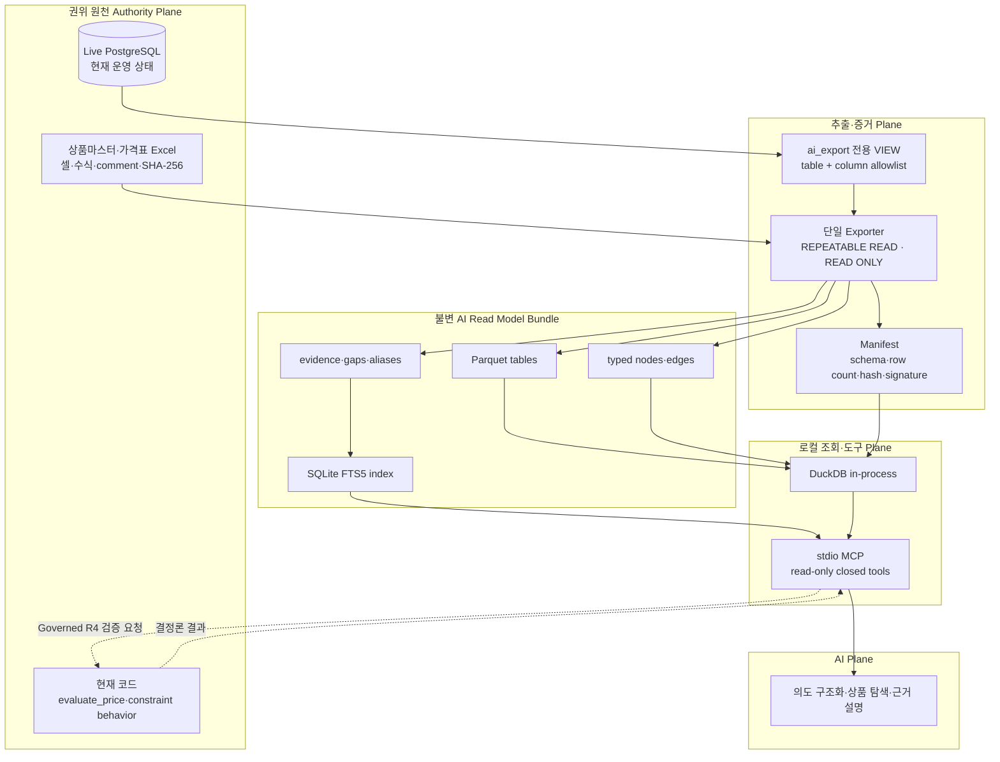
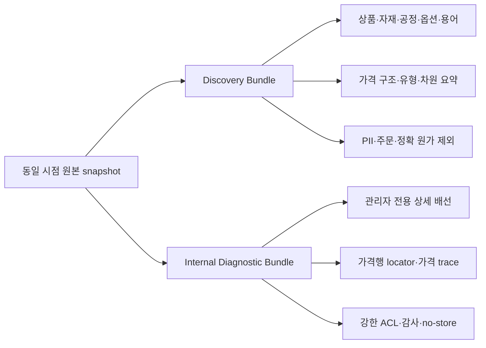
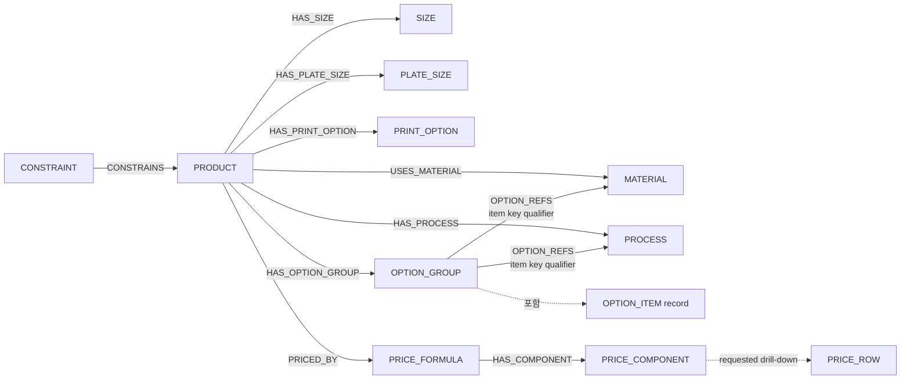
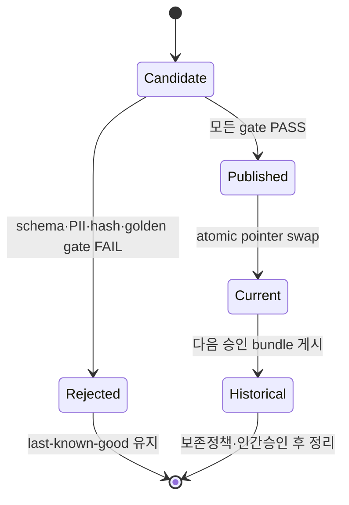
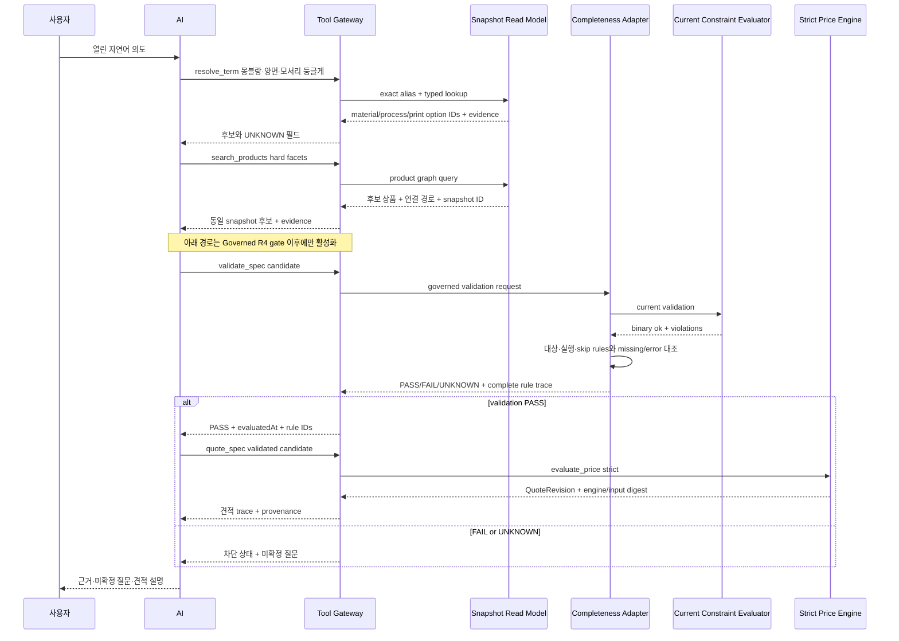

# Huni 라이브 DB를 AI-ready 상태로 만드는 오픈소스 레시피

> 문서 버전: `AI-READY-RECIPE-001`
>
> 기준일: 2026-09-01
>
> 성격: 전략·분석·설계·도입 레시피
>
> 상태: `PROPOSAL` · 운영 연결 `CONDITIONAL NO-GO`
>
> 변경 경계: 라이브 DB와 `raw/webadmin` 무수정

## 0. 결론

후니의 경우 AI가 라이브 PostgreSQL에 직접 접속하도록 만드는 방식은 추천하지 않는다. 가장 적합한 형태는 **권위 원천을 그대로 유지하고, AI 전용 읽기 투영본을 불변 파일 번들로 만드는 것**이다.

```text
PostgreSQL / Excel / 현재 코드
        ↓ 읽기 전용 시점 고정
서명된 불변 AI Read Model Bundle
        ↓ 프로세스 내부 조회
DuckDB + SQLite FTS5
        ↓ 닫힌 도구 계약
로컬 stdio MCP
        ↓
AI의 검색·설명·후보 생성
```

이 구조의 중심은 특정 서비스나 벡터 DB가 아니다. 중심은 다음 세 가지 계약이다.

1. **Authority contract**: 무엇이 원천 사실이고 무엇이 파생·추론인지 구분한다.
2. **Snapshot contract**: 어느 시점의 어떤 열을 어떤 코드로 투영했는지 고정한다.
3. **Tool contract**: AI가 할 수 있는 질문을 좁고 검증 가능한 읽기 도구로 제한한다.

AI는 상품 후보 탐색, 의도 구조화, 관계 경로 설명, 누락 탐지 보조를 맡는다. 가격 계산은 현재 strict 엔진에, 제약 판정은 현재 evaluator와 fail-closed completeness adapter에, 주문 생성·생산 지시는 인간 승인 경계에 남긴다. 현재 제약 endpoint는 미입력·평가불가 규칙을 skip할 수 있으므로 R4 adapter가 완전성을 증명하기 전에는 `PASS` 권위로 열지 않는다.

---

## 1. 왜 이 방식이 후니에 맞는가

후니의 데이터는 일반적인 상품 카탈로그보다 복잡하다.

- 상품 하나가 자재, 사이즈, 판형, 도수, 공정, 옵션, 제약, 가격공식, 가격구성요소, 구성요소 가격행으로 이어진다.
- `단가형`, `합가형`, `고정금액형`처럼 원천 가격의 의미와 런타임 산술이 다르다.
- Excel의 값·수식·comment와 라이브 DB의 현재값이 항상 같은 층위의 권위는 아니다.
- 실무 수기 가격은 “계산 실패”가 아니라 시장가 보정을 반영한 의도적 값일 수 있다.
- `별색`, `색`, `사이즈`, `판형`, `공정 상세`는 비슷한 문구라도 서로 다른 축이다.
- 미적재, 미평가, 단선, 비활성, 인간 결정 대기는 서로 다른 상태다.

이 구조에서 LLM에 raw schema와 임의 SQL 권한을 주면 다음 오류가 생기기 쉽다.

- 이름이 비슷한 행을 같은 개념으로 합친다.
- `null`, 0원, 미적재, 무료를 혼동한다.
- Excel comment를 공식 규칙으로 승격한다.
- 합가를 단가처럼 다시 곱한다.
- 조회 시점이 다른 테이블을 한 사실처럼 섞는다.
- 검색 유사도를 상품 가능 여부나 견적으로 오인한다.

따라서 “AI가 DB에 쉽게 접근”한다는 말은 **SQL을 쉽게 실행한다**는 의미가 아니라, **근거·시점·관계·불확실성이 보존된 안전한 질의 표면을 제공한다**는 의미로 정의해야 한다.

---

## 2. 현재 상태에서 확인된 출발점

### 2.1 현재 관측 가능한 라이브 seed

현재 독립 상품뷰어에는 이미 안전한 시작점이 있다.

- [export_live.py](../product-worldmodel-viewer/tools/export_live.py)는 18개 `t_*` 테이블을 한 번의 `REPEATABLE READ, READ ONLY` 트랜잭션으로 추출한다.
- [live_tables.json](../product-worldmodel-viewer/config/live_tables.json)은 현재 18개 테이블을 닫힌 목록으로 관리한다.
- [snapshot schema](../product-worldmodel-viewer/schemas/snapshot.schema.json)는 `SPEC-PRICEGRID-001` JSON 계약을 사용한다.
- [authority.json](../product-worldmodel-viewer/config/authority.json)은 상품마스터·가격표 260822_1의 SHA-256과 dbmap manifest를 고정한다.
- [live-product-graph.json](../product-worldmodel-viewer/public/data/live-product-graph.json)은 견적·제약 통과 여부를 계산하지 않지만, active filtering·가격 의미/범위 요약·시각화용 추론 geometry를 포함한 결정론 projection이다. 각 파생·추론 상태는 원천 관측과 구분해 읽어야 한다.

2026-09-01 01:06:18 UTC snapshot의 확인값은 다음과 같다.

| 항목 | 관측값 | 해석 |
|---|---:|---|
| 트랜잭션 | `repeatable read`, `readOnly=true` | 한 시점에서 일관된 18테이블 읽기 |
| export 상품행 | 309 | `t_prd_products` 전체 추출행 |
| 활성 상품 그래프 | 269 | 활성 필터 이후 상품 수 |
| 구성요소 가격행 | 25,090 | 단가형·합가형·고정금액형 등을 포함하며 그래프 노드가 아니라 구성요소별 요약 대상으로 접음 |
| 가격 공식 | 121 | 현재 snapshot 내 전체 행 수 |
| 가격 구성요소 | 219 | 현재 snapshot 내 전체 행 수 |
| 상품 제약 | 101 | snapshot에 관측되지만 통과 여부는 별도 평가 필요 |
| content hash | `sha256:73e5d646…e86b4` | 동일 payload 검출용, 전자서명은 아님 |
| Excel hash | 상품·가격 모두 `VERIFIED` | 고정된 260822_1 파일과 일치 |

이 snapshot은 **현재 읽기 seed**로 재사용할 수 있다. 다만 AI 운영 경계로는 아직 충분하지 않다.

### 2.2 현재 seed의 세 가지 운영 차단점

1. 테이블 이름은 `t_*` 형식만 검사하므로, 설정이 변조되면 주문·사용자 계열 테이블도 형식상 통과할 수 있다.
2. 허용 테이블에서 `SELECT *`를 사용하므로, 이후 민감 열이 추가되면 자동 유입될 수 있다.
3. 내부 `contentHash`는 JSON과 hash를 함께 변조하는 공격을 막는 서명이 아니다.

따라서 기존 exporter는 버릴 대상이 아니라 **핵심 안전 패턴을 재사용하되, DB view·열 projection·서명·freshness를 보강할 대상**이다.

### 2.3 아직 확정하면 안 되는 숫자

초기 dbmap 문서는 라이브 도메인을 34개 `t_*`로 기술한다. 2026-06-11 실측 문서는 `t_prd_template_prices` 추가 후 35개라고 기록한다. 이후 코드·DB가 계속 변했기 때문에, 현재 전체 테이블 수를 34 또는 35로 단정하면 안 된다.

구현의 첫 명령은 static 문서를 읽는 일이 아니라, 전용 read-only 계정으로 아래를 재측정하는 일이다.

- 실제 `public.t_*` 테이블 목록
- 각 테이블 column·type·nullability·default
- PK·UK·FK·index·trigger
- row count와 active/inactive 분포
- 후보 민감 열과 데이터 분류
- 기존 18-table whitelist와의 차이

이 결과가 승인되기 전에는 “전체 DB AI화”를 시작하지 않는다.

---

## 3. 권장 전체 구조

### 3.1 논리 계층



### 3.2 권위와 파생물의 역할

| 층 | 역할 | 권위 여부 | AI 사용 방식 |
|---|---|---|---|
| Excel | 상품·가격 원천, 셀·수식·comment 보존 | 원천 권위 | evidence locator로만 참조 |
| Live PostgreSQL | 현재 운영 배선·상태 | 현재 권위 | exporter만 접근 |
| 현재 코드 | 가격·제약 평가 | 계산 권위 | 좁은 adapter tool 호출 |
| Snapshot bundle | 특정 시점의 관측 증거 | 권위의 시점 투영 | 검색·설명 기준 |
| Ontology/KB | 용어·관계·intent·GAP | 의미 층 | DB 값을 덮어쓰지 않음 |
| DuckDB/FTS | 파생 조회 인덱스 | 비권위 | 언제든 재생성 가능 |
| Embedding/vector | 후보 재정렬 | 비권위 | 초기 미도입, 필요성 입증 후 선택 |
| LLM | 파싱·후보·질문·설명 | 비권위 | ID·근거·상태를 그대로 반환 |

### 3.3 두 개의 번들로 분리

하나의 snapshot을 모든 AI에 똑같이 노출하지 않는다.



- **Discovery Bundle**: 상품 탐색과 의도 분석에 필요한 최소 정보. 고객·주문·계정·정확 내부 가격행은 제외한다. 금액 최소·최대 범위도 영업기밀 분류가 끝나기 전에는 노출하지 않는다.
- **Internal Diagnostic Bundle**: 관리자에게 배선·가격행·오류 근거를 보여주는 제한 자료. 익명 정적 파일로 배포하지 않는다.

가격 표면은 더 엄격하게 나눈다. Discovery는 가격 구조·유형·적용 차원만 반환한다. Internal Diagnostic bundle은 분류와 ACL 승인을 받은 원천 가격행을 **저장할 수는 있지만**, 일반 AI tool로 그 금액을 반환하지 않는다. 별도 diagnostic tool 정책이 승인되기 전 기본 응답은 row ID·locator·digest로 제한한다. R4의 `quote_spec`은 고객에게 제시할 최종 계산 결과를 반환하며, 내부 가격행 원문을 자동 공개하는 도구가 아니다.

이 분리는 동일 데이터를 두 번 권위화하는 것이 아니다. 동일 snapshot ID에서 projection policy만 다르게 적용한 파생물이다.

---

## 4. 추천 오픈소스 스택

### 4.1 MVP 핵심

| 용도 | 선택 | 배치 방식 | 선택 이유 |
|---|---|---|---|
| 원천 DB | PostgreSQL | 기존 라이브 유지 | 현재 권위 변경 없음 |
| exporter | Python 3.11+ | 단일 CLI/job | 기존 Python exporter 재사용 가능 |
| 컬럼형 파일 | Apache Arrow/Parquet | 불변 snapshot 파일 | 압축·타입 보존·projection/filter 효율 |
| 분석 조회 | DuckDB | 프로세스 내부 | 별도 서버 없이 Parquet 직접 조회 |
| 문자 검색 | SQLite FTS5 | 번들 내부 단일 파일 | 서버 없이 alias·설명 검색 가능 |
| 계약 | JSON Schema 2020-12 + Pydantic | build·MCP 입출력 검증 | 구조와 추가 필드를 fail-closed 처리 |
| AI 경계 | 공식 MCP Python SDK | 로컬 `stdio` | 포트·공용 gateway 없이 닫힌 tool 제공 |
| 해시 | SHA-256 | 모든 파일·최상위 manifest | 재현성과 변경 탐지 |
| 서명 | Ed25519 detached signature | `manifest.sig` | hash와 manifest 동시변조 탐지 |

오픈소스·라이선스 기준도 배포 manifest에 고정한다.

| 구성 | 라이선스 기준 | 배포 시 확인사항 |
|---|---|---|
| PostgreSQL | PostgreSQL License | 서버 버전과 extension 목록 기록 |
| Apache Arrow·Parquet | Apache-2.0 중심 | `LICENSE`·`NOTICE`와 사용 모듈 확인 |
| DuckDB | MIT | binary·Python package 버전 고정 |
| SQLite FTS5 | SQLite public domain | 실제 build의 FTS5 활성화 확인 |
| Pydantic | MIT | major/minor version 고정 |
| MCP Python SDK | MIT | protocol·SDK version을 함께 고정 |
| SQLGlot | MIT | 선택 도입 시 parser version 고정 |
| OpenLineage | Apache-2.0 | 선택 도입 시 file transport만 초기 허용 |

의존성은 “latest”가 아니라 승인된 tag 또는 commit SHA로 pin하고, 해당 버전의 `LICENSE`·`NOTICE` 사본과 SBOM을 bundle build 산출에 남긴다.

공식 근거:

- PostgreSQL Repeatable Read는 한 트랜잭션의 연속 SELECT가 같은 snapshot을 보게 한다. [PostgreSQL 공식 문서](https://www.postgresql.org/docs/current/transaction-iso.html)
- Apache Parquet는 효율적 저장·조회용 공개 column-oriented 포맷이다. [Apache Parquet 공식 문서](https://parquet.apache.org/docs/)
- DuckDB는 Parquet filter/projection pushdown을 지원한다. [DuckDB Parquet 문서](https://duckdb.org/docs/lts/data/parquet/overview)
- SQLite FTS5는 애플리케이션 내부 full-text virtual table을 제공한다. [SQLite FTS5 공식 문서](https://www.sqlite.org/fts5.html)
- JSON Schema Draft 2020-12는 독립적인 계약 표준으로 사용할 수 있다. [JSON Schema 공식 문서](https://json-schema.org/draft/2020-12)
- 공식 MCP Python SDK에서 `stdio`는 로컬 subprocess용 기본 transport다. [MCP Python SDK 문서](https://github.com/modelcontextprotocol/python-sdk/blob/main/docs/run/index.md)

### 4.2 보조 도구

| 도구 | 초기 판정 | 사용 위치 | 주의 |
|---|---|---|---|
| SQLGlot | 선택 | build-time SQL AST lint | untrusted SQL을 안전하게 만드는 보안 경계가 아님 |
| OpenLineage | 선택 | 파일 기반 lineage JSONL | 중앙 Marquez 서버 없이 file transport만 고려 |
| dbt Core | 보류 | 변환 모델 수가 크게 늘 때 | MVP에는 Python/SQL이 더 단순 |
| SQLMesh | 보류 | 대규모 환경·배포 계획 필요 시 | 현재 read model에는 과도함 |
| embedded vector extension | 보류 | FTS 품질 실패가 입증된 뒤 | 사실 저장소나 1차 검색기로 사용 금지 |

SQLGlot은 SQL AST를 만들 수 있지만, 모델이 만든 임의 SQL을 허용하는 근거가 되어서는 안 된다. 내부 템플릿 질의의 허용 테이블·컬럼을 점검하는 보조 수단으로만 사용한다. [SQLGlot 공식 저장소](https://github.com/tobymao/sqlglot)

OpenLineage는 file transport를 지원하므로 중앙 계보 서비스를 도입하지 않고도 표준 호환 이벤트를 남길 수 있다. 초기에는 자체 JSONL도 충분하며, 필요할 때만 OpenLineage 호환으로 확장한다. [OpenLineage file transport](https://openlineage.io/docs/client/python/configuration/)

### 4.3 중심에 두지 않을 것

초기 구조의 중심에서 다음을 제외한다.

- Neo4j와 같은 별도 graph server
- Qdrant·Weaviate·Milvus 같은 별도 vector server
- DataHub·OpenMetadata 같은 중앙 metadata platform
- Kafka·Debezium 같은 CDC backbone
- Airflow 같은 workflow server
- Kubernetes 기반 상시 운영
- 공용 HTTP MCP gateway
- AI가 실행하는 임의 SQL endpoint

필요성이 실측되면 adapter로 추가할 수 있지만, 이들 없이는 동작하지 않는 구조로 만들지 않는다.

---

## 5. 단계별 실행 레시피

### Phase 0 — 실제 라이브 표면 재측정

목표는 “무엇을 AI에 줄지”보다 먼저 “라이브에 실제 무엇이 있는지”를 현재 시점에 고정하는 것이다.

산출:

- `live-schema-inventory.json`
- `table-classification.csv`
- `column-classification.csv`
- `projection-decision.md`
- `schema-drift-report.md`

필수 분류:

| 분류 | 예 | 기본 처리 |
|---|---|---|
| PRODUCT_STRUCTURE | product, category, material, process | Discovery 허용 후보 |
| CPQ | option group/item, constraint | 허용하되 다형참조 보존 |
| PRICE_STRUCTURE | formula, component, use_dims | Discovery에 구조·유형·적용 차원만 허용 |
| PRICE_VALUE_INTERNAL | component price row, direct/pre-summed amount | Discovery 제외, Diagnostic ACL 저장과 tool 노출은 별도 승인 |
| PRICE_VALUE_PUBLIC | 고객 공개가로 승인된 값 | 승인된 값만, 최종 견적은 R4 `quote_spec` |
| ORDER | order, cart, item, handoff | 전면 제외 |
| CUSTOMER_PII | name, phone, email, address | 전면 제외 |
| AUTH_SECRET | token, key, credential | 전면 제외 |
| OPERATIONS | internal memo, audit content | 별도 승인 전 제외 |

Gate `G0`:

- live `information_schema` 재측정 완료
- table·column마다 data classification 존재
- 34/35/현재 count 차이가 명시됨
- 전체 `SELECT *` 계획 0건
- 승인되지 않은 주문·사용자·고객 열 0건

### Phase 1 — DB 자체에서 읽기 경계 고정

애플리케이션 config만 믿지 않고 DB 권한이 먼저 막아야 한다.

권장 구조:

```text
public.t_* 원본
   ↓ 명시적 열 projection
ai_export.v_products
ai_export.v_materials
ai_export.v_product_relations
ai_export.v_price_structure
   ↓ SELECT only
huni_ai_snapshot_ro
```

전용 role 요구사항:

- `NOSUPERUSER`, `NOCREATEDB`, `NOCREATEROLE`, `NOREPLICATION`, `NOBYPASSRLS`
- write role membership 0
- `public` 원본 table 직접 SELECT 0
- `ai_export` schema의 승인 view에만 `SELECT`
- `default_transaction_read_only=on`
- `statement_timeout`, `lock_timeout`, `idle_in_transaction_session_timeout`
- `SET ROLE`, `CREATE`, `TEMP`, `COPY PROGRAM`, FDW/dblink 경로 차단

주의: 현재 `BEGIN ... READ ONLY`는 exporter 한 번의 쓰기를 막지만, 계정 자체가 다른 세션에서 쓸 수 없다는 증거는 아니다. role 권한을 독립적으로 시험해야 한다.

Gate `G1`:

- 전용 role로 승인 view SELECT만 성공
- INSERT/UPDATE/DELETE/DDL/SET ROLE/COPY PROGRAM 전부 실패
- exporter 외 AI/MCP 환경에 DB credential 0개

### Phase 2 — 불변 snapshot bundle 생성

기존 [export_live.py](../product-worldmodel-viewer/tools/export_live.py)의 한 트랜잭션 추출과 원자적 publish 패턴을 재사용한다. 기존 `SPEC-PRICEGRID-001` 출력은 변경하지 않고, 동일 임시 CSV를 입력으로 별도 assembler를 병렬 실행한다.

```mermaid
sequenceDiagram
    participant S as Scheduler/Operator
    participant E as Exporter
    participant P as PostgreSQL RO Views
    participant B as Bundle Builder
    participant G as Gate Runner
    participant C as current pointer

    S->>E: refresh requested
    E->>P: BEGIN REPEATABLE READ READ ONLY
    P-->>E: dbAsOf + allowed rows
    E->>E: explicit columns to temp files
    E->>P: COMMIT
    E->>B: one immutable input set
    B->>B: Parquet + graph + evidence + FTS
    B->>B: file hashes + top manifest + signature
    B->>G: candidate bundle
    G->>G: schema/FK/PII/price/constraint/security tests
    alt all gates pass
        G->>C: atomic pointer swap
    else any gate fails
        G-->>S: reject; keep last-known-good
    end
```

권장 bundle 구조:

```text
snapshots/
└─ snap_<dbAsOf>_<digest>/
   ├─ manifest.json
   ├─ manifest.sig
   ├─ schemas/
   │  ├─ live-schema.json
   │  └─ ai-read-model.schema.json
   ├─ tables/
   │  ├─ products.parquet
   │  ├─ materials.parquet
   │  ├─ relationships.parquet
   │  └─ price-structure.parquet
   ├─ graph/
   │  ├─ nodes.parquet
   │  └─ edges.parquet
   ├─ evidence/
   │  ├─ sources.parquet
   │  ├─ evidence.parquet
   │  └─ gaps.parquet
   ├─ search/
   │  └─ lexical.sqlite
   └─ audit/
      └─ lineage.jsonl

promotions/
├─ promotion_<generation>.json
└─ promotion_<generation>.sig
current                       # snapshot ID + promotion generation만 보유

[bundle root 밖 별도 OS-protected WORM trust store]
└─ promotion-heads/
   └─ head_<generation>.json + .sig  # append-only, 최고 generation이 신뢰 앵커
```

각 bundle은 수정하지 않는다. build가 모든 immutable field와 gate digest를 채운 뒤 `manifest.json` 전체를 RFC 8785 JCS로 canonicalize하고, 그 **정확한 bytes**를 Ed25519 detached signature(`manifest.sig`)로 서명한다. signature 값과 runtime verification 결과는 manifest 안에 다시 쓰지 않는다.

`current`는 데이터가 아니라 승인된 bundle ID와 monotonic promotion generation을 가리키는 원자적 포인터다. promotion record는 `generation`, `previousPromotionDigest`, `previousSnapshotId`, `newSnapshotId`, `manifestDigest`, `action`, `rollbackOf`, `reasonCode`, `approvedBy`, `approvalPolicyId`, `approvalEvidenceDigest`, `promotedAt`, `policyVersion`을 가지며 RFC 8785 JCS bytes를 별도 Ed25519 서명한다. 정상 게시와 rollback 모두 generation을 증가시킨다.

prefix rollback을 막는 신뢰 앵커는 bundle·ledger·`current`와 **다른 OS 계정/ACL·WORM 저장영역**의 append-only `promotion-heads/head_<generation>.json`으로 고정한다. head JSON payload는 `generation`, `promotionDigest`, `policyVersion`, `keyId`만 가지며, payload 전체를 RFC 8785 JCS로 canonicalize한 exact bytes를 Ed25519로 서명해 `head_<generation>.sig` detached envelope(`keyId`, fingerprint, payload SHA-256, encoding, signature value)에 둔다. JSON 안에 signature를 중복 저장하지 않는다.

일반 exporter·MCP·bundle publisher는 이 store를 쓸 수 없고, 승인된 privileged promotion helper만 새 head pair를 append한다. verifier는 서명 유효한 최고 generation/digest를 먼저 읽고 signed chain·manifest·`current`를 대조한다. head store가 없거나 서명 불일치, head보다 낮은 prefix, head가 가리키는 record/manifest 누락이면 자동 fallback·ledger 재구축 없이 fail-closed한다. head보다 높은 ledger tail은 미승인 pending으로 격리한다. 복구도 generation을 낮추거나 같은 generation을 덮어쓰지 않으며, 독립 백업의 마지막 trusted head를 기준으로 별도 recovery key와 2인 승인 evidence가 결속된 **더 높은 generation**의 signed recovery record를 append해야 한다. root/hardware/WORM 관리자 동시 침해는 이 레시피의 별도 상위 위협 모델로 남긴다.

승인 rollback은 `action=ROLLBACK`, `rollbackOf`, stable `approvedBy`, `approvalPolicyId`, `approvalEvidenceDigest`를 요구한다. AI 세션은 시작 시 검증된 `current`를 실제 snapshot ID로 해석한 뒤 세션 끝까지 같은 ID를 사용한다.

Gate `G2`:

- 동일 입력 두 번 빌드 시 canonical file hash 동일
- 모든 파일 SHA-256과 schema hash 존재
- workbook hash 불일치 시 publish 중단
- schema drift 또는 민감 열 탐지 시 publish 중단
- 부분 `.tmp`가 소비자에게 노출되는 경우 0
- `manifest.sig` 검증 성공 전 bundle 사용 0
- signed promotion generation 역행·재사용 0, 승인 없는 과거 bundle rollback 0
- 분리된 WORM `promotion-head` 누락·변조·체인 불일치 시 데이터 응답 0, 자동 head 재생성 0
- 하나의 승인 immutable extract를 기존 `assemble()`과 새 `assemble_ai_read_model()`에 동시에 넣어 양쪽 `dbAsOf`가 같고, 기존 `SPEC-PRICEGRID-001` canonical bytes/contentHash가 pre-change golden과 완전히 같은 sibling-projection integration test 통과

### Phase 3 — 의미를 잃지 않는 정규화

Raw row를 문장 chunk로만 쪼개지 않는다. 최소한 `node`, `edge`, `evidence`, `gap`, `price_row`의 구조를 유지한다.

대표 경로:



정규화 원칙:

- ID는 label이 아니라 실제 code와 전체 자연키로 만든다.
- junction·option item은 전체 복합키를 보존한다.
- `size`와 `plate_size`를 합치지 않는다.
- `option_refs`는 option group이 아니라 실제 option item의 다형참조에서 만든다.
- 구성요소 가격행 25,090건을 기본 그래프 노드로 펼치지 않는다.
- 가격 구성요소에는 row count, use_dims, 적용일, 적용 차원을 요약하고 상세는 drill-down한다. 금액의 최소·최대 범위를 뜻하지 않는다.
- 원문, 정규화값, source locator를 함께 보존한다.
- `null`, 빈 문자열, 0, 무료, 미적재를 서로 다른 값으로 유지한다.

#### 가격 의미 계약

최소 필드:

```json
{
  "priceOrigin": "DB_ROW",
  "sourceSemantic": "PRE_SUMMED_AS_IS",
  "runtimeArithmetic": "USE_AS_IS",
  "authorityRef": "xlsx:price:260822_1#시트!셀",
  "runtimeEvaluator": "raw/webadmin/.../pricing.py:evaluate_price",
  "evaluationStatus": "NOT_EVALUATED"
}
```

- `단가`: `UNIT_RATE + MULTIPLY_EFFECTIVE_QTY`. 원천 단가와 유효수량 산술을 구분한다.
- 사용자 정의의 `합가`: `PRE_SUMMED_AS_IS + USE_AS_IS`. 이미 합해져 있어 계산식을 다시 적용하지 않는 금액이며 LLM·retrieval·adapter가 재합산·재곱셈하지 않는다.
- `구간총액 환산형`: `TIER_TOTAL + PRORATE_TIER_TOTAL`. 구간 총액을 현재 결정론 엔진이 환산하는 별도 의미다.
- `고정금액형`: `ABSOLUTE_CHARGE + USE_AS_IS`. 수량과 무관하게 그대로 쓰는 고정 charge다.
- 현재 코드의 legacy `PRICE_TYPE.02`는 주석상 “합가형”이지만 런타임은 구간총액 환산을 수행하므로, 사용자 정의 `합가`로 이름만 보고 매핑하지 않는다. `legacyPriceType`과 승인된 `sourceSemantic`을 별도 필드로 보존한다.
- 수기 입력: `ADMIN_MANUAL` 또는 `EXCEL_LITERAL`로 기록하고 입력자·승인자 정보가 없으면 `UNKNOWN`으로 남긴다.
- Excel comment: 값과 별도 evidence이며, 승인 근거 없이는 공식 규칙으로 승격하지 않는다.

#### 상태를 한 필드에 섞지 않기

| 축 | 값 예 | 의미 |
|---|---|---|
| `authorityStatus` | `OBSERVED_LIVE_SNAPSHOT`, `SOURCE_ASSERTED`, `DERIVED_DETERMINISTIC`, `INFERRED`, `UNKNOWN` | 어디서 나온 사실인가 |
| `dataStatus` | `READY`, `MISSING`, `BROKEN`, `UNDECIDED`, `INACTIVE` | 데이터 상태는 무엇인가 |
| `evaluationStatus` | `PASS`, `FAIL`, `UNKNOWN`, `NOT_EVALUATED`, `BLOCKED` | evaluator가 무엇까지 평가했는가 |

금지 변환:

- `READY → PASS`
- `verified badge → PASS`
- `관측됨 → 유효함`
- `UNKNOWN → false 또는 0`
- `미적재 → 존재하지 않음`

Gate `G3`:

- stable ID collision 0
- dangling edge 0 또는 명시적 GAP 100%
- 등록되지 않은 node/relation type 0
- PASS/FAIL에는 evaluator rule ID와 evaluatedAt 100%
- 가격행에는 price origin과 locator 100%
- Excel 근거에는 workbook hash·sheet·cell/range 100%

### Phase 4 — embedded query layer

DuckDB를 서버로 만들지 않는다. MCP 프로세스 안에서 승인된 bundle을 읽는 in-process query engine으로만 사용한다.

검색 순서:

1. canonical ID / source code exact match
2. prefLabel / alias exact match
3. typed facet filter
4. graph expansion
5. SQLite FTS5 후보 보강
6. vector rerank — 필요성이 검증된 뒤에만


vector는 exact·hard facet 결과를 제거할 수 없다. embedding 점수는 사실성, 가격 유효성, 제약 통과의 근거가 아니다.

DuckDB 보안 설정:

- 모델 입력을 SQL 문자열로 실행하지 않는다.
- prepared parameter와 고정 query template만 사용한다.
- file path, table, column, sort key는 enum/allowlist로 제한한다.
- community extension, auto-install, auto-load를 끈다.
- 허용 bundle directory 외 파일 접근을 막는다.
- memory, thread, temp directory, timeout을 제한한다.
- root 권한으로 실행하지 않는다.

DuckDB 공식 문서는 untrusted SQL을 shell/Python 코드처럼 취급하고 OS 수준 sandbox가 필요하다고 경고한다. [DuckDB 보안 문서](https://duckdb.org/docs/current/operations_manual/securing_duckdb/overview)

Gate `G4`:

- 임의 SQL·임의 file path가 tool catalog에 없음
- 한 query가 접근 가능한 table·column이 contract와 일치
- 기본 결과 limit, graph hop, 응답 bytes, 실행 timeout 강제
- exact code MRR@1 = 1.00
- hard facet precision = 1.00

### Phase 5 — read-only MCP

MCP는 데이터베이스가 아니라 AI와 read model 사이의 **좁은 도구 계약**이다. 초기에는 로컬 `stdio`만 사용한다.

#### Discovery tools

| Tool | 용도 | 권위 경계 |
|---|---|---|
| `snapshot_status` | snapshot freshness·hash·gate 상태 | manifest 관측 |
| `resolve_term` | 표준어·별칭·오표기 해석 | 용어 후보 반환 |
| `search_products` | exact/facet/graph/FTS 후보 검색 | 가능 여부 확정 금지 |
| `get_product_context` | 상품의 구조·상태·근거 조회 | 같은 snapshot만 |
| `expand_product_graph` | 관계 whitelist 기반 N-hop | 최대 hop 제한 |
| `get_evidence` | DB PK·Excel cell·KB claim 근거 조회 | projection별 redaction을 적용한 locator·상태 반환 |
| `compare_snapshots` | 두 시점의 구조 변화 비교 | 자동 merge 금지 |

#### Deterministic adapter tools

아래 두 도구는 기본 Discovery MCP catalog에 넣지 않는다. R4에서 별도 scope·감사·골든 검증을 통과한 내부 adapter catalog로만 연다.

| Tool | 실제 수행자 | 필수 반환 |
|---|---|---|
| `validate_spec` | 현재 서버 evaluator + 별도 completeness adapter | 대상·실행·skip rule IDs, missing variables, PASS/FAIL/UNKNOWN, evaluatedAt |
| `quote_spec` | `evaluate_price(..., mode="strict")` | engine digest, input digest, selected row ID/digest, warnings/errors, 고객용 QuoteRevision |

현재 제약 endpoint는 binary `ok`와 위반 문장만 반환하고 missing variable·평가 예외 규칙을 skip할 수 있다. 따라서 `validate_spec`은 단순 passthrough가 아니다. 대상 규칙과 실제 실행/skip 규칙을 대조해 skip·missing·error가 하나라도 있으면 `UNKNOWN/BLOCKED`로 닫으며, 이 계측과 parity test가 없으면 tool을 열지 않는다.

`quote_spec`은 snapshot에 복사한 금액을 LLM이 계산하는 도구가 아니다. 현재 런타임 가격엔진을 호출하고 고객에게 제시할 결과를 별도의 evaluation envelope로 반환한다. 선택된 내부 가격행은 기본적으로 ID·digest만 추적하며 원문 금액 공개는 별도 diagnostic 정책을 요구한다. discovery snapshot 시점과 평가 시점이 다르면 둘을 명시하고 자동으로 같은 사실처럼 합치지 않는다.

모든 MCP 입력은 다음을 따른다.

- `additionalProperties: false`
- `snapshotId` 필수
- ID·enum·문자열 길이·limit·hop 제한
- principal/tenant/role은 모델 인자가 아니다. local stdio에서는 승인 launcher가 검증한 OS principal·parent executable·불변 session context에서 주입한다.
- 원본 DB credential, arbitrary SQL, arbitrary URL, shell, write tool 없음

응답 기본 envelope:

```json
{
  "snapshot": {
    "id": "huni:snapshot:...",
    "dbAsOf": "2026-09-01T01:06:18Z",
    "contentHash": "sha256:..."
  },
  "result": {},
  "provenance": [],
  "evaluation": {
    "status": "NOT_EVALUATED",
    "engineDigest": null,
    "ruleIds": []
  },
  "warnings": [],
  "unknowns": []
}
```

Gate `G5`:

- mutation tool 0
- generic SQL·URL·filesystem tool 0
- local stdio는 승인되지 않은 parent executable·OS principal·환경·bundle ACL 요청을 전부 거절
- network listener로 기동하면 fail-closed. 향후 HTTP profile에만 TLS·issuer·expiry·audience·scope gate를 별도로 적용
- 모든 응답에 snapshot ID·dbAsOf·contentHash 존재
- prompt injection 문자열이 tool 권한을 변경하는 경우 0

### Phase 6 — 운영 refresh와 품질 게이트

초기 refresh는 daemon·CDC보다 CLI batch가 적합하다.

실행 계기:

- 승인된 DB COMMIT 직후
- 상품마스터/가격표 SHA-256 변경 시
- 필요하면 하루 1회 외부 scheduler
- 운영자가 수동 재검증할 때

refresh 결과는 성공 또는 거절뿐이다. 일부 파일만 새 버전으로 섞지 않는다.



운영 기본 제안값은 권위 결정이 아니라 시작점이다.

- exporter concurrency: 1
- search result: 최대 20
- tool 응답: 최대 64KB
- graph hop: 기본 2, 최대 5
- 한 turn tool loop: 최대 3
- discovery freshness: 24시간부터 시작
- 임시 CSV: publish 성공·실패 후 즉시 삭제
- snapshot 보존: 최근 7개 또는 30일 중 짧은 쪽부터 검토

가격·주문은 discovery TTL에 기대지 않고 매번 현재 결정론 서비스를 다시 호출한다. 실제 보존기간과 TTL은 운영·개인정보 책임자 승인이 필요하다.

---

## 6. AI 질의가 처리되는 실제 흐름

예시 고객 의도: “몽블랑 240g으로 양면 엽서 500장, 모서리는 둥글게.”



AI가 직접 하지 않는 일:

- `몽블랑`을 이름 유사도만으로 임의 material code에 연결
- 양면을 spot side나 작업면으로 바꿈
- 500장을 단가에 임의 곱함
- 귀돌이를 무료라고 추정
- `NOT_EVALUATED`를 주문 가능으로 승격
- 주문·결제·생산 전송 실행

---

## 7. 기존 자산 재사용·교체 판단

| 자산 | 판단 | 이유 |
|---|---|---|
| `product-worldmodel-viewer/tools/export_live.py` | 핵심 패턴 재사용 | 단일 read-only transaction, 원자적 publish |
| `live_snapshot.py` | 기존 viewer용 그대로 유지 | 현재 UX 계약과 가격 요약 경계 보존 |
| `SPEC-PRICEGRID-001` | 기존 viewer 계약 유지 | AI용 전체 read model과 목적이 다름 |
| viewer tests | 회귀 테스트 재사용 | deterministic hash·진단·가격 semantics |
| `huni-ontology-kb` schema | adapter로 재사용 | 17 entity·19 relation·GAP·intent·근거 모델 |
| ontology materialized graph | 재생성 | 2026-07 산출이므로 현재 live 사실이 아님 |
| constraint rule 문서·fixture | 의미·테스트로 재사용 | 현재 런타임과 재대조 필요 |
| price engine/design 문서 | 설계 근거로 재사용 | 계산 권위는 현재 `evaluate_price` 코드 |
| `raw/webadmin` | 참조·권위, 무수정 | AI 접근 계층을 별도 폴더에 둠 |

기존 viewer와 AI read model의 관계는 다음과 같다.

```text
한 번의 승인된 live extract
   ├─ 기존 assemble() → SPEC-PRICEGRID-001 → 화면 시각화
   └─ 새 assemble_ai_read_model() → AI-READ-MODEL-001 → MCP 조회
```

두 출력은 같은 `dbAsOf`를 가져야 하지만 서로 schema를 억지로 합치지 않는다.

---

## 8. 권장 구현 폴더

현재 작업을 오염시키지 않도록 독립 폴더로 둔다.

```text
_workspace/ai-access/
├─ README.md
├─ contracts/
│  ├─ ai-read-model.schema.json
│  ├─ snapshot-manifest.schema.json
│  ├─ evidence-ref.schema.json
│  └─ mcp-response.schema.json
├─ config/
│  ├─ ai-views.json
│  ├─ ai-columns.json
│  ├─ data-classification.json
│  └─ relation-registry.json
├─ exporter/
│  ├─ export_bundle.py
│  ├─ normalize.py
│  └─ sign_manifest.py
├─ query/
│  ├─ read_model.py
│  ├─ queries.py
│  └─ lexical_index.py
├─ mcp/
│  ├─ server.py
│  └─ tools.py
├─ tests/
│  ├─ fixtures/
│  ├─ golden/
│  ├─ adversarial/
│  └─ acceptance/
└─ snapshots/
   └─ .gitignore
```

구현 시에도 `raw/webadmin`을 수정하지 않는다. 가격·제약 adapter는 현재 코드를 복사하지 않고 API/CLI 경계를 통해 호출한다. 직접 import가 불가피하면 engine digest와 dependency pin을 기록하고, 재구현은 금지한다.

---

## 9. 도입 순서와 승인점

### R0 — Inventory only

- live schema/column 재측정
- data classification
- projection allowlist 승인
- DB write 없음

승인점: AI에 노출 가능한 table·column 목록.

### R1 — Offline bundle

- 기존 18-table seed로 bundle contract 구현
- Parquet, graph, evidence, manifest, signature
- MCP 없음

승인점: 재현성·민감정보·authority 상태.

### R2 — Local discovery MCP

- stdio read-only MCP
- exact/facet/graph/FTS 검색
- 가격 계산·주문 없음

승인점: 검색 품질·근거 완전성·prompt injection.

### R3 — Full approved projection

- current live table set 중 승인된 product/CPQ/price structure 확장
- 동일 immutable extract로 기존 viewer와 AI read model을 함께 조립하고 `dbAsOf` 일치
- 18-table `SPEC-PRICEGRID-001` canonical bytes/contentHash의 pre-change golden 대비 회귀 없음([계약 AC-19](./AI-READ-MODEL-CONTRACT.md))

승인점: schema drift·FK·GAP·column coverage.

### R4 — Deterministic validate/quote adapter

- `validate_spec`
- `quote_spec` strict
- golden price 0원 오차

승인점: AI 권위 침범 0, 평가 trace 완전성.

### R5 — Intent exploration pilot

- 제한 상품군 1개
- 실제 실무 질의 corpus
- 인간 확인 화면
- 주문 생성 없음

승인점: hard facet precision, unknown 처리, 사용자 설명 가능성.

### R6 — Order integration은 별도 프로젝트

이 레시피의 완료가 주문 자동화 승인을 뜻하지 않는다. 주문은 별도의 CanonicalSpec, 확인 digest, idempotency, 상거래 주문 생성, `/order/register` 사후 바인딩 설계가 필요하다.

---

## 10. 최종 GO 조건

### 구조·재현성

- live schema 재측정 완료
- stable ID collision 0
- dangling edge 0 또는 GAP 전환 100%
- 동일 입력 두 번 빌드 hash 일치 100%
- 응답 내 snapshot 혼합 0
- sibling projection test에서 viewer `SPEC-PRICEGRID-001` bytes/hash 변화 0, 양 output `dbAsOf` 불일치 0

### 권위·가격

- AI가 가격을 직접 산술하는 경로 0
- strict price golden 오차 0원
- 합가·단가·고정금액 의미 보존 100%
- 수기값의 origin·locator 보유 100%
- comment를 승인 없이 사실로 채택 0
- 제약 대상·실행·skip rule ID 계측 100%, missing/error가 있는데 `PASS`인 경우 0

### 보안

- DB physical read-only test 전건 PASS
- 생성 SQL AST·승인 projection·`information_schema`·Parquet schema의 column 집합 정확 일치, wildcard 0
- AI/MCP 프로세스 내 DB credential 0
- PII/주문/계정 열 유입 0
- generic SQL·write tool 0
- snapshot signature 검증률 100%
- 익명 static URL로 internal bundle 접근 0

### 검색·AI

- code exact MRR@1 = 1.00
- hard facet precision = 1.00
- curated alias Top-1 ≥ 0.98
- 범위 밖 질문의 무근거 답변 0
- UNKNOWN을 PASS로 승격 0
- 모든 답변에 사용 snapshot과 evidence trace 존재

### 운영

- 실패 refresh 시 last-known-good 유지
- kill switch로 MCP launch/surface·exporter role·publish pointer를 독립 차단
- 임시 CSV 삭제 증거 존재
- 보존·삭제 정책 승인

---

## 11. 가장 먼저 실행할 실제 작업 10개

1. 현재 live `information_schema`를 read-only로 다시 추출한다.
2. table/column을 Discovery, Internal, Excluded로 분류한다.
3. `ai_export` view의 명시적 column 목록을 작성한다.
4. physical SELECT-only role의 권한 실패 테스트를 만든다.
5. 기존 18-table snapshot과 같은 시점의 AI manifest contract를 만든다.
6. CSV를 유지하면서 Parquet projection을 병행 생성한다.
7. canonical node/edge/evidence/gap ID 규칙을 적용한다.
8. DuckDB 고정 query와 SQLite FTS5 exact/alias 검색을 만든다.
9. `snapshot_status`, `search_products`, `get_product_context`, `get_evidence` 네 도구만 먼저 연다.
10. 독립 security/price/constraint gate가 통과한 뒤에만 `validate_spec`, `quote_spec`을 연다.

이 순서에서는 Neo4j도, vector DB도, 상시 중앙 서비스도 필요하지 않다. 가장 먼저 필요한 것은 **깨끗한 원천, 닫힌 projection, 불변 snapshot, 근거 추적, 결정론 도구 경계**다.

---

## 12. 판정

### 추천안

**Artifact-centered, file-first AI Read Model**을 채택한다.

- PostgreSQL·Excel·현재 코드가 계속 권위를 가진다.
- snapshot bundle은 특정 시점의 증거다.
- DuckDB·SQLite는 서버가 아닌 재생성 가능한 로컬 인덱스다.
- MCP는 read-only tool contract다.
- AI는 탐색·구조화·설명 역할만 가진다.
- 가격·제약은 결정론 코드가 평가한다.
- 주문·결제·생산은 이 단계에서 물리적으로 제외한다.

### 현재 판정

설계 착수는 `GO`, 운영 AI 연결은 `CONDITIONAL NO-GO`다. 다음 세 가지가 해결되기 전에는 현재 `public/data` 경로의 snapshot을 운영 MCP에 바로 연결하지 않는다. 이 경로명만으로 인터넷 공개 상태를 뜻하지는 않는다.

1. `SELECT *` 제거와 column allowlist
2. DB role 자체의 physical read-only 증명
3. private ACL·manifest/promotion signature·분리 WORM trusted head·freshness gate

이 세 조건을 먼저 닫으면, 후니의 복잡한 상품·가격·제약 구조를 서비스 종속 없이 AI가 안전하게 탐색할 수 있는 기반이 만들어진다.

---

## 공식 오픈소스 참고문서

- [PostgreSQL Transaction Isolation](https://www.postgresql.org/docs/current/transaction-iso.html)
- [PostgreSQL License](https://www.postgresql.org/about/licence/)
- [Apache Parquet Documentation](https://parquet.apache.org/docs/)
- [Apache Arrow Documentation](https://arrow.apache.org/docs/index.html)
- [DuckDB Parquet](https://duckdb.org/docs/lts/data/parquet/overview)
- [DuckDB Security](https://duckdb.org/docs/current/operations_manual/securing_duckdb/overview)
- [DuckDB License](https://github.com/duckdb/duckdb/blob/main/LICENSE)
- [SQLite FTS5](https://www.sqlite.org/fts5.html)
- [SQLite Copyright](https://www.sqlite.org/copyright.html)
- [JSON Schema Draft 2020-12](https://json-schema.org/draft/2020-12)
- [RFC 8785 JSON Canonicalization Scheme](https://www.rfc-editor.org/rfc/rfc8785.html)
- [RFC 8032 Ed25519/EdDSA](https://www.rfc-editor.org/rfc/rfc8032.html)
- [Pydantic JSON Schema](https://docs.pydantic.dev/latest/concepts/json_schema/)
- [MCP Python SDK](https://github.com/modelcontextprotocol/python-sdk)
- [SQLGlot](https://github.com/tobymao/sqlglot)
- [OpenLineage](https://openlineage.io/docs/client/python/configuration/)
