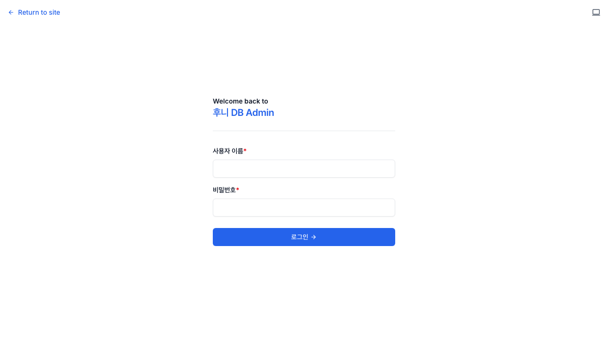
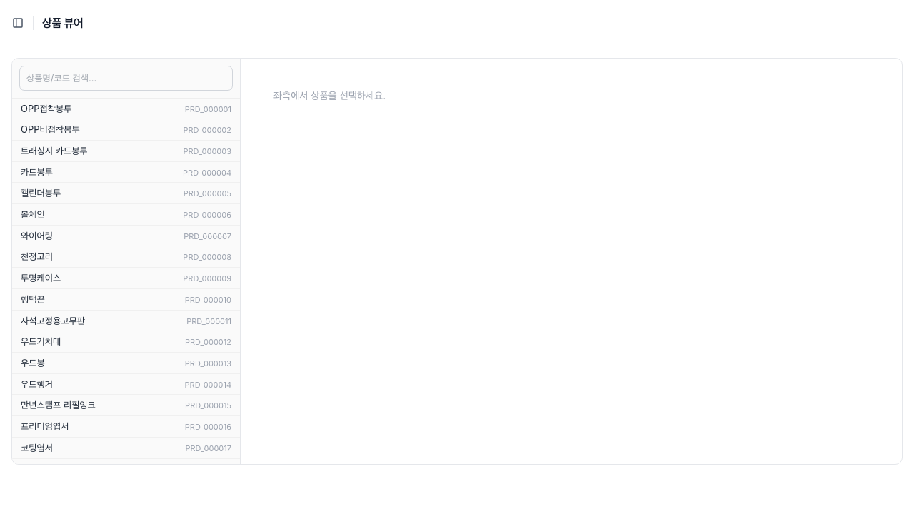
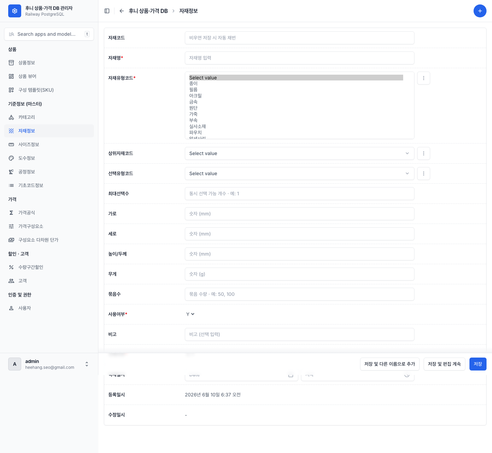

# 00 시작하기

[← 목차로](00_index.md)

이 챕터는 한 번만 읽으면 됩니다. 로그인하는 법, 화면이 어떻게 생겼는지, 그리고 **모든 화면에서 똑같이 동작하는 규칙**(검색·추가·저장·자동채번·삭제)을 익힙니다. 이 규칙을 알아두면 뒤의 업무 챕터가 훨씬 쉬워집니다.

---

## 0-1. 로그인하기

**언제** 관리자 작업을 시작할 때마다.

1. 웹 브라우저에서 관리자 주소(`/admin/`)로 들어갑니다. 로그인되어 있지 않으면 자동으로 로그인 화면으로 넘어갑니다.

   
   *로그인 화면. ① "사용자 이름"(필수) ② "비밀번호"(필수) ③ "로그인 →" 버튼 ④ "← Return to site" 링크.*

2. **사용자 이름** 과 **비밀번호** 를 입력합니다. *둘 다 필수입니다.*
3. **"로그인 →"** 을 클릭합니다.

> ℹ️ 로그인에 성공하면 홈(`/admin/`)이 자동으로 **"상품 뷰어"** 화면으로 넘어갑니다. 이 시스템의 첫 화면은 상품 목록 대시보드가 아니라 상품 뷰어입니다.
> ⚠️ 로그인 직후 잠깐 "Not Found"(찾을 수 없음) 같은 화면이 보일 수 있습니다. 이는 알려진 표시 문제이며 **로그인 자체는 정상 처리** 됩니다. 그대로 관리자 주소(`/admin/`)로 다시 들어가면 정상 화면이 나옵니다.

---

## 0-2. 화면 둘러보기

로그인 후 보이는 화면은 크게 세 부분입니다.

- **좌측 사이드바** — 메뉴(아래 그룹별 정리). 맨 위에 상품·모델 검색박스가 있습니다.
- **상단 바** — 현재 위치(브레드크럼)와 우측 상단 **⊕(추가)** 버튼, 하단 저장 버튼 바.
- **본문** — 목록 또는 입력 폼.

   
   *로그인 후 도착하는 상품 뷰어. ① 상단 "상품 뷰어" 제목 ② "상품명/코드 검색…" 검색박스 ③ 좌측 전 상품 목록(상품명 + 코드) ④ 우측 "좌측에서 상품을 선택하세요" 안내.*

### 좌측 메뉴 (5개 그룹)

메뉴는 아래 13개 항목으로 고정되어 있습니다. (등록된 데이터 중 일부는 메뉴에 없습니다 — [09 화면 레퍼런스](09_screen-reference.md) 참조.)

| 그룹 | 메뉴 항목 | 무엇을 관리하나 |
|------|----------|----------------|
| **상품** | 상품정보 | 상품 한 건 한 건의 기본 정보 목록 |
| | 상품 뷰어 | 상품을 펼쳐 사이즈·자재·옵션 등 모든 구성을 편집 |
| | 구성 템플릿(SKU) | 미리 짜둔 조합 상품(SKU) |
| **기준정보 (마스터)** | 카테고리 | 상품 분류 트리 |
| | 자재정보 | 종이·필름·아크릴 등 자재 |
| | 사이즈정보 | 작업·재단 치수 |
| | 도수정보 | 인쇄 색상 수(흑백/CMYK 등) |
| | 공정정보 | 인쇄·후가공 공정 |
| | 기초코드정보 | 시스템 전반의 코드값(상품유형·자재유형 등) |
| **가격** | 가격공식 | 가격 계산 공식 |
| | 가격구성요소 | 공식에 들어가는 비용 항목 |
| | 구성요소 다차원 단가 | 사이즈·도수·자재별 단가표 |
| **할인·고객** | 수량구간할인 | 수량 구간별 할인표 |
| | 고객 | 고객·고객등급 |
| **인증 및 권한** | 사용자 | 관리자 계정(개발/관리 담당 영역) |

> 💡 **상품의 세부 구성(사이즈·자재·공정·옵션·제약·SKU)은 거의 모두 "상품 뷰어" 에서** 다룹니다. 좌측 "상품정보" 메뉴는 상품의 **기본 정보**(이름·유형 등)만 다루고, 세부 구성 편집은 상품 뷰어로 연결됩니다.

---

## 0-3. 모두에게 공통인 동작

아래 동작은 **거의 모든 화면에서 똑같이** 작동합니다. 한 번 익혀두면 됩니다.

### 목록 보기 · 검색 · 필터

- 좌측 메뉴를 클릭하면 그 데이터의 **목록 화면** 이 열립니다.
- 목록 상단의 **"Type to search"**(검색) 칸에 이름이나 코드를 입력하면 걸러집니다.
- **"Filters"** 버튼으로 사용여부·유형 같은 기준으로 목록을 좁힐 수 있습니다.
- 목록은 한 페이지에 **50건** 씩 보이며, 하단에 페이지 번호가 있습니다.

### 추가하기

- 목록 화면 **우측 상단의 ⊕(추가)** 버튼을 누르면 **빈 입력 폼** 이 열립니다.
- 폼에 값을 채우고 하단 **"저장"** 을 누르면 등록됩니다.

### 수정하기

- 목록에서 **행을 클릭** 하면 그 항목의 **수정 폼** 이 열립니다(같은 폼, 값이 채워진 상태).
- 값을 고치고 **"저장"** 을 누릅니다.

### 저장하기

폼 하단에는 저장 버튼이 세 가지 있습니다.

| 버튼 | 동작 |
|------|------|
| **"저장"** | 저장하고 목록으로 돌아갑니다. (보통 이것을 씁니다) |
| **"저장 및 편집 계속"** | 저장하고 같은 화면에 머뭅니다. 이어서 더 고칠 때. |
| **"저장 및 다른 이름으로 추가"** | 저장하고 곧바로 새 빈 폼을 엽니다. 비슷한 항목을 연달아 등록할 때. |

### 필수 항목 (별표 `*`)

- 라벨 옆에 **빨간 별표(`*`)** 가 붙은 항목은 **반드시 입력** 해야 합니다. 비우면 저장되지 않고 빨간 오류 메시지가 뜹니다.
- 별표가 없는 항목은 선택입니다(비워도 됩니다).

### 코드는 비워 두면 자동 생성 (자동채번)

- 상품·자재·사이즈·도수·공정·카테고리·구성템플릿의 **코드 칸**(예: 자재코드 `mat_cd`)에는 **"비우면 저장 시 자동 채번"** 이라는 안내가 회색으로 보입니다.
- 이 칸은 **비워 두세요.** 저장하는 순간 `MAT_000123` 같은 코드가 자동으로 만들어집니다(가장 큰 번호 + 1).
- 직접 코드를 입력해도 되지만, 보통은 비워서 시스템이 채번하게 둡니다.

   
   *자재 추가 폼. ① "자재코드"는 "비우면 저장 시 자동 채번" 안내(비워 둠) ② "자재명*"은 필수 ③ "자재유형코드*" 드롭다운을 펼친 모습(종이·필름·아크릴·금속·원단·가죽·부속·실사소재·파우치…) ④ "사용여부*"는 Y/N 선택. 숫자 칸엔 "숫자 (mm)" 같은 안내가 보입니다.*

> ℹ️ **기초코드** 의 코드는 형식이 다릅니다: 상위 그룹을 고르고 코드를 비우면 `MAT_TYPE.12` 처럼 **그룹 안에서 순번** 이 붙습니다. ([06 기초정보 마스터](07_masters.md) 참조)

### 사용여부 · 삭제여부 (Y/N 선택)

- **"사용여부"**(`use_yn`) 는 Y(사용)/N(중지) 중 선택합니다. **N으로 바꾸면** 그 항목은 다른 화면의 드롭다운·목록에서 **더 이상 선택되지 않습니다**(데이터는 남습니다).
- Y 또는 N 외의 값은 저장되지 않습니다.

### 삭제하면 어떻게 되나 (논리삭제)

- 이 시스템 대부분의 삭제는 **"논리삭제"** 입니다. 즉 데이터를 실제로 지우지 않고 **"삭제됨" 표시만** 하여 목록에서 숨깁니다. 기록은 데이터베이스에 남습니다.
- 따라서 잘못 삭제해도 데이터 자체는 보존되지만, 화면에서는 사라져 보입니다. 되살리려면 개발 담당자에게 요청하세요.

### 표시순서 (disp_seq)

- **"표시순서"** 칸을 비우면, 저장할 때 **같은 그룹의 맨 뒤** 번호가 자동으로 매겨집니다. 보통 비워 두면 됩니다.
- 순서를 바꾸고 싶을 때만 숫자를 직접 넣습니다(작은 숫자가 먼저).

### 상위 항목 선택 (트리 드롭다운)

- 카테고리·자재·공정·기초코드에는 **"상위코드"** 칸이 있습니다(예: "상위카테고리코드"). 이건 트리(계단식) 구조의 부모를 고르는 칸입니다.
- 드롭다운을 열면 **들여쓰기로 상·하위가 구분** 되어 보입니다. 최상위로 만들려면 비워 둡니다.

### 등록일시 · 수정일시 (자동, 수정 불가)

- 폼 맨 아래 **"등록일시"·"수정일시"** 는 시스템이 자동으로 기록하며 **읽기 전용** 입니다(직접 못 고침). 건드리지 마세요.

---

## 0-4. 안전 수칙 (꼭 읽어주세요)

> ⚠️ **이 화면은 실제 운영 중인 데이터베이스에 직접 연결되어 있습니다.** 저장하는 순간 실제 상품·가격 데이터가 바뀝니다.

- **저장 전에 한 번 더 확인** 하세요. 특히 사용여부를 N으로 바꾸거나 삭제할 때.
- **참조 중인 데이터는 삭제·중지가 거부될 수 있습니다.** 예를 들어 어떤 상품이 쓰고 있는 자재유형 코드는 지울 수 없습니다("사용 중이면 삭제 불가"). 오류가 나면 무리하게 우회하지 말고, 먼저 그 코드를 쓰는 곳을 정리하세요.
- **할인율과 할인액은 동시에 입력하면 저장이 거부** 됩니다(둘 중 하나만).
- 잘 모르는 항목은 **비워 두는 편이 안전** 합니다(선택 항목이면). 필수 항목만 정확히 채우세요.
- 무엇을 입력해야 할지 모르겠으면, 같은 종류의 **기존 행을 열어 참고** 하세요(읽기만 하고 저장은 안 함).

---

[← 목차로](00_index.md) · [다음: 01 상품 등록·수정하기 →](02_product-register.md)
