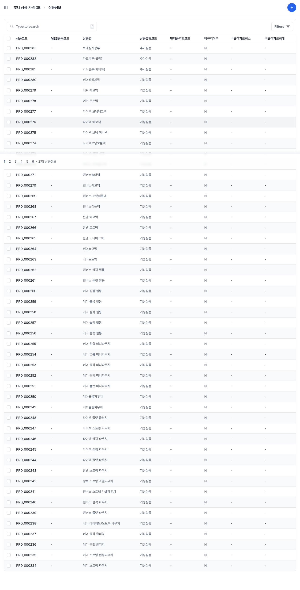
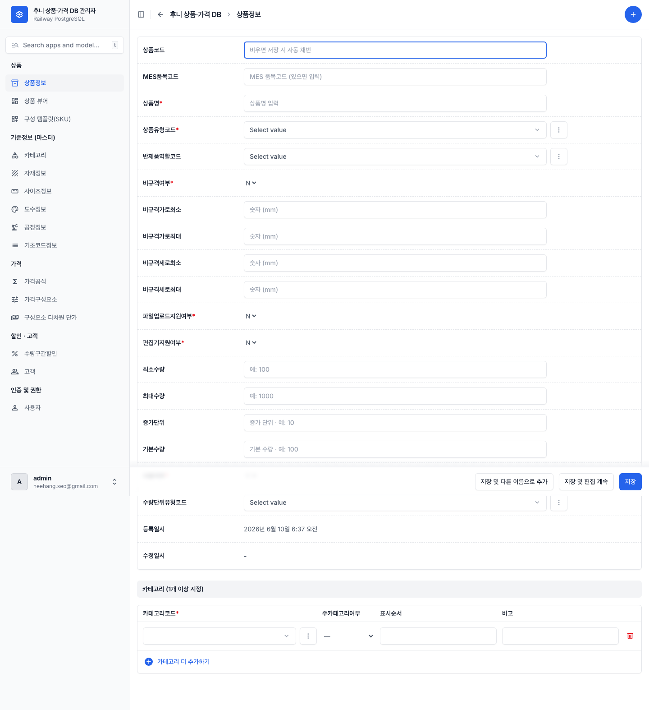
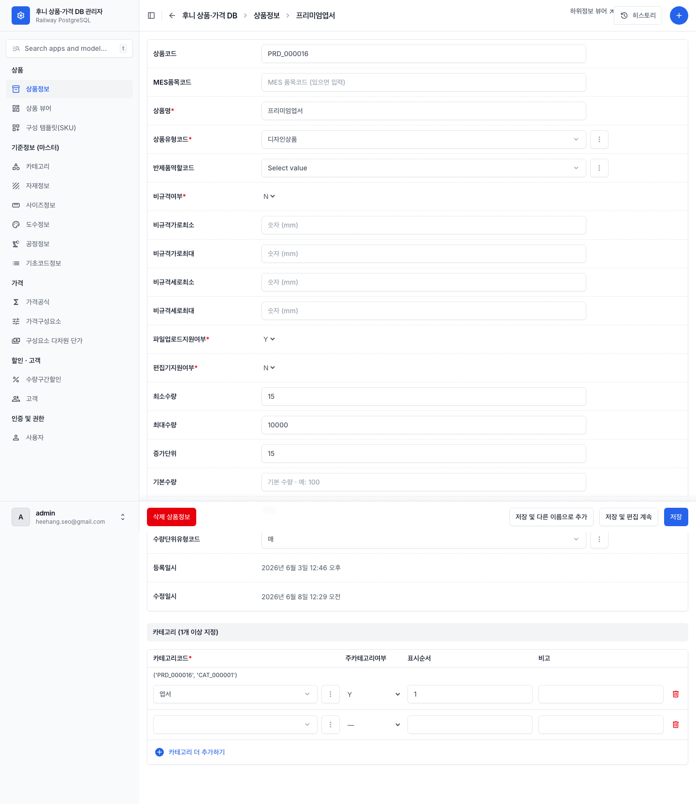
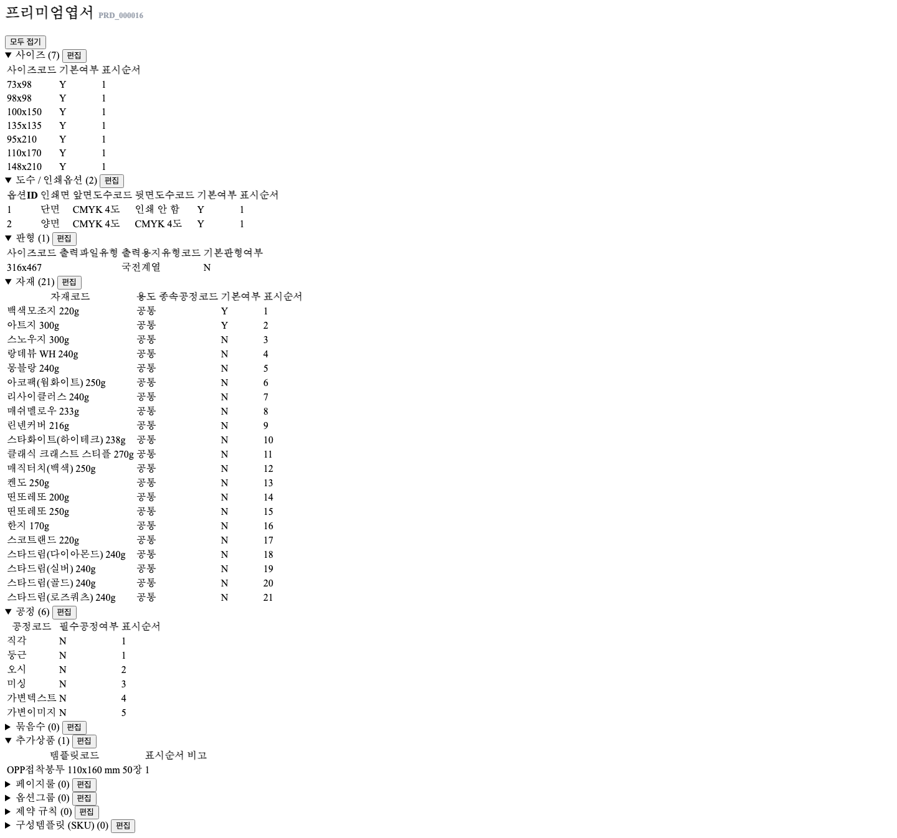

# 01 상품 등록·수정하기

[← 목차로](00_index.md)

상품은 이 시스템의 중심입니다. 이 챕터에서는 **새 상품을 만드는 법**, **상품의 기본 정보를 고치는 법**, 그리고 **상품 뷰어에서 상품을 찾아 여는 법** 을 다룹니다. 상품의 세부 구성(사이즈·자재·공정 등)은 다음 챕터 [02 상품 하위정보 다루기](03_product-sections.md) 에서 이어집니다.

---

## 1-1. 상품 목록 보기

**언제** 등록된 상품을 확인하거나, 고칠 상품을 찾을 때.

1. 좌측 메뉴 **상품 › "상품정보"** 를 클릭합니다.

   
   *상품정보 목록. ① 상단 브레드크럼(후니 상품·가격 DB › 상품정보) + 우상단 ⊕추가 ② 검색칸 + "Filters" 버튼 ③ 컬럼: 상품코드·MES품목코드·상품명·상품유형코드·반제품역할코드·비규격여부·비규격가로최소·비규격가로최대 ④ 행 체크박스 + 페이지네이션.*

- 현재 등록된 상품은 **275건** 입니다. 한 페이지에 50건씩 보입니다.
- 검색칸에 상품명 또는 상품코드를 넣어 빠르게 찾습니다.

---

## 1-2. 새 상품 등록하기

**언제** 새 상품을 카탈로그에 추가할 때.
**미리** 상품이 속할 **카테고리** 가 카테고리 마스터에 있어야 나중에 연결할 수 있습니다. 상품유형·수량단위 같은 코드값은 이미 시스템에 등록되어 있습니다.

1. 상품 목록 화면 우측 상단 **⊕(추가)** 를 클릭합니다.

   
   *상품 추가 폼. ① 좌측 도메인 사이드바 ② 상단 제목 + 저장 바 ③ "상품코드"는 "비우면 저장 시 자동 채번" ④ "상품명*" 필수 ⑤ "상품유형코드"·"반제품역할코드" 드롭다운 ⑥ 비규격 여부/가로min·max ⑦ 등록·수정일시 읽기전용.*

2. **상품코드**(`prd_cd`)는 **비워 둡니다.** 저장하면 `PRD_000276` 형식으로 자동 생성됩니다.
3. **상품명**(`prd_nm`)을 입력합니다. *필수.* (예: "프리미엄엽서")
4. **상품유형코드**(`prd_typ_cd`)를 고릅니다. *필수.* 아래 중 하나:

   | 코드 | 의미 | 라이브 사용 |
   |------|------|------|
   | 완제품 | 그 자체로 완성된 판매 상품 | (현재 미사용) |
   | 반제품 | 다른 상품의 부품(내지·표지 등) | 28건 |
   | 기성상품 | 규격이 정해진 기성 상품 | 123건 |
   | 디자인상품 | 디자인 편집형 상품 | 121건 |
   | 추가상품 | 옵션처럼 덧붙는 상품 | 3건 |

5. **반제품역할코드**(`semi_role_cd`)는 **상품유형이 "반제품"일 때만** 고릅니다(내지/표지/면지/간지/투명커버). 그 외에는 비워 둡니다.
6. **비규격여부**(`nonspec_yn`)를 Y/N 중 고릅니다. *필수.* 크기가 정해지지 않고 가로·세로를 자유 입력받는 상품이면 **Y**, 규격 상품이면 **N**.
   - **Y로 했을 때만** "비규격가로최소/최대"·"비규격세로최소/최대"를 입력합니다.
7. **파일업로드여부**(`file_upload_yn`)·**에디터여부**(`editor_yn`)를 Y/N 중 고릅니다. *둘 다 필수.* (고객이 파일을 올리는 상품인지, 편집기를 쓰는 상품인지)
8. **수량단위**(`qty_unit_typ_cd`)를 고릅니다(EA/매/권/세트). 선택.
9. 최소수량·최대수량·수량증가단위·기본수량은 필요할 때만 입력합니다(선택).
10. **사용여부**(`use_yn`)는 보통 **Y** 로 둡니다. *필수.*
11. **"저장"** 을 클릭합니다.

> ⚠️ 저장이 안 되면: "상품명"·"상품유형코드"·"비규격여부"·"파일업로드여부"·"에디터여부"·"사용여부" 중 빠진 필수 항목이 있는지 확인하세요. 이들은 비우면 저장되지 않습니다.
> 💡 상품을 등록한 직후엔 사이즈·자재·공정 같은 세부 구성이 비어 있습니다. 이어서 [02 상품 하위정보 다루기](03_product-sections.md) 로 채웁니다.

### 상품 입력 항목 사전

| 라벨 (항목명) | 필수 | 입력값 | 의미 / 비우면 |
|---------------|------|--------|---------------|
| 상품코드 (`prd_cd`) | 자동 | 비움 | 비우면 `PRD_000000` 자동 생성 |
| MES품목코드 (`MES_ITEM_CD`) | 선택 | 자유 텍스트 | 외부 연동용. 대부분 비어 있음 |
| 상품명 (`prd_nm`) | **필수** | 자유 텍스트 | 상품 이름 |
| 상품유형코드 (`prd_typ_cd`) | **필수** | 드롭다운(완제품/반제품/기성상품/디자인상품/추가상품) | 상품 분류 |
| 반제품역할코드 (`semi_role_cd`) | 선택 | 드롭다운(내지/표지/면지/간지/투명커버) | 반제품일 때만 |
| 비규격여부 (`nonspec_yn`) | **필수** | Y / N | 크기 자유입력 상품이면 Y |
| 비규격가로·세로 최소/최대 | 선택 | 숫자 | 비규격여부=Y일 때만 |
| 파일업로드여부 (`file_upload_yn`) | **필수** | Y / N | 고객 파일 업로드 상품 |
| 에디터여부 (`editor_yn`) | **필수** | Y / N | 편집기 사용 상품 |
| 수량단위 (`qty_unit_typ_cd`) | 선택 | 드롭다운(EA/매/권/세트) | 주문 수량 단위 |
| 최소·최대수량, 수량증가단위, 기본수량 | 선택 | 숫자 | 주문 가능 수량 범위 |
| 사용여부 (`use_yn`) | **필수** | Y / N | N이면 노출 중지 |

---

## 1-3. 상품의 기본 정보 수정하기

**언제** 상품명·상품유형·사용여부 등 **기본 정보** 만 고칠 때.

1. 상품 목록에서 고칠 상품의 **행을 클릭** 합니다.

   
   *상품 편집 화면. 표준 입력 폼 상단에 "상품 뷰어 / 하위정보 뷰어 ↗" 링크가 보입니다. 사이즈·자재 같은 세부 구성 칸은 여기에 없습니다.*

2. 값을 고치고 **"저장"** 을 누릅니다.

> ℹ️ **중요:** 이 표준 편집 화면에는 **상품의 세부 구성(사이즈·자재·공정 등) 입력칸이 없습니다.** 상품 편집 화면 상단의 **"상품 뷰어" 링크** 를 누르면 세부 구성을 다루는 상품 뷰어로 이동합니다. 세부 구성은 다음 챕터에서 다룹니다.

---

## 1-4. 상품 뷰어에서 상품 찾기·열기

상품 뷰어는 한 상품의 모든 구성을 한 화면에 펼쳐 보여주는 특수 화면입니다. 세부 구성 작업의 출발점입니다.

**언제** 한 상품의 사이즈·자재·공정·옵션·제약·SKU를 보거나 편집할 때.

1. 좌측 메뉴 **상품 › "상품 뷰어"** 를 클릭합니다. (또는 로그인 직후 홈이 바로 이 화면입니다.)
2. 좌측 목록에서 상품을 찾습니다. 상단 **"상품명/코드 검색…"** 칸으로 빠르게 찾을 수 있습니다.
3. 상품을 클릭하면 우측에 **상품 상세** 가 펼쳐집니다.

   
   *상품 상세(프리미엄엽서 PRD_000016). ① 상단 상품명 + 코드, "모두 접기" ② 11개 섹션 카드(접이식): 사이즈(7)·도수/인쇄옵션(2)·판형(1)·자재(21)·공정(6)·묶음수(0)·추가상품(1)·페이지룰(0)·옵션그룹(0)·제약규칙(0)·구성템플릿SKU(0) ③ 각 카드 헤더의 "편집" 버튼 + 행 테이블.*

- 각 섹션 제목 옆 괄호 숫자는 **그 섹션에 등록된 행 수** 입니다(예: "사이즈 (7)"=사이즈 7개 등록됨, "묶음수 (0)"=아직 없음).
- 각 섹션의 **"편집"** 버튼을 누르면 그 섹션을 편집하는 화면이 열립니다. → [02 상품 하위정보 다루기](03_product-sections.md)
- 옵션그룹·제약규칙·구성템플릿(SKU) 카드의 "편집"은 각각 옵션·제약·SKU 화면으로 갑니다. → [03 옵션](04_options.md) · [04 SKU](05_sku-templates.md) · [05 제약](06_constraints.md)

> 💡 섹션이 (0)이면 아직 데이터가 없는 것입니다. "편집"을 눌러 "+ 추가"로 채우면 됩니다.

---

[← 목차로](00_index.md) · [다음: 02 상품 하위정보 다루기 →](03_product-sections.md)
