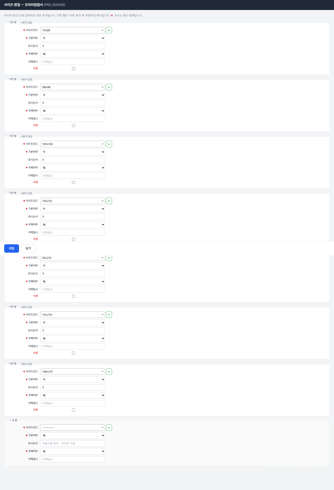

# 02 상품 하위정보 다루기

[← 목차로](00_index.md)

한 상품에는 사이즈·자재·공정 같은 **세부 구성** 이 딸립니다. 이 챕터는 그 9가지 구성을 **상품 뷰어의 섹션 편집 화면** 에서 등록·수정하는 법을 다룹니다. 9가지 모두 편집 방식이 똑같으므로, 먼저 공통 방식을 익히고 각 섹션의 입력 항목만 따로 봅니다.

> ℹ️ 이 세부 구성들은 좌측 메뉴에 따로 없습니다. 반드시 **상품 뷰어 → 상품 선택 → 섹션 "편집"** 으로 들어갑니다. ([01 상품 등록·수정하기](02_product-register.md) 의 1-4 참조)

---

## 2-1. 섹션 편집 공통 방식

**언제** 한 상품의 사이즈·자재·공정 등 한 가지 구성을 채울 때.

1. 상품 뷰어에서 상품을 엽니다([1-4](02_product-register.md) 참조).
2. 원하는 섹션 카드(예: "사이즈")의 **"편집"** 버튼을 누릅니다.

   
   *섹션 편집 화면(사이즈 예시). ① 상단 브레드크럼(상품 › 섹션) ② 섹션 행 폼(각 등록 행이 한 줄) ③ "+ 추가" 빈 행 ④ 사용처 배지.*

3. **기존 행** 을 고치려면 값을 바꿉니다. **새로 추가** 하려면 맨 아래 **"+ 추가"** 빈 행에 값을 채웁니다.
4. **"저장"** 을 누릅니다.

공통 규칙:
- **표시순서**·내부 순번(`item_seq` 등)은 비우면 자동으로 매겨집니다. 비워 두세요.
- **삭제** 는 논리삭제입니다(목록에서만 숨김, 기록은 남음).
- 드롭다운으로 고르는 코드(사이즈코드·자재코드 등)는 **먼저 해당 마스터에 등록되어 있어야** 선택지에 뜹니다. 없으면 [06 기초정보 마스터](07_masters.md) 에서 먼저 등록하세요.
- 행 옆에 **"사용처"** 배지가 보일 수 있습니다. 이 행이 옵션·SKU 등 다른 곳에서 쓰이고 있다는 표시입니다(→ [05 제약 - 사용처 보기](06_constraints.md)).

> ⚠️ 알 수 없는 섹션 이름으로 들어가면 "알 수 없는 섹션" 오류가 납니다. 반드시 상품 뷰어의 섹션 "편집" 버튼으로 진입하세요.

---

## 2-2. 9개 섹션별 입력 항목

아래는 각 섹션에서 채우는 항목입니다. 모두 같은 "+ 추가 / 저장" 방식입니다.

### ① 카테고리 (categories) — 상품별카테고리

상품이 어떤 분류에 속하는지 연결합니다.

| 라벨 (항목명) | 필수 | 입력값 | 의미 |
|---------------|------|--------|------|
| 카테고리코드 (`cat_cd`) | **필수** | 드롭다운(카테고리 마스터) | 연결할 분류 |
| 주카테고리여부 (`main_cat_yn`) | **필수** | Y / N | 대표 분류면 Y |

### ② 사이즈 (sizes) — 상품별사이즈

이 상품이 제공하는 크기 목록입니다.

| 라벨 (항목명) | 필수 | 입력값 | 의미 |
|---------------|------|--------|------|
| 사이즈코드 (`siz_cd`) | **필수** | 드롭다운(사이즈 마스터) | 제공 크기 |
| 기본여부 (`dflt_yn`) | **필수** | Y / N | 기본 선택 크기면 Y |

> ℹ️ 사이즈 자체(73x98 같은 치수)는 [06 기초정보 마스터 - 사이즈정보](07_masters.md) 에 먼저 등록합니다. 여기서는 등록된 사이즈를 상품에 **연결** 만 합니다.

### ③ 도수/인쇄옵션 (print_options) — 상품별인쇄옵션

인쇄면(단면/양면 등)과 앞·뒷면 색상 수 조합입니다.

| 라벨 (항목명) | 필수 | 입력값 | 의미 |
|---------------|------|--------|------|
| 옵션ID (`opt_id`) | 자동 | 비움 | 자동 순번 |
| 인쇄면 (`print_side`) | **필수** | **자유 텍스트** | 현재 5가지가 쓰임(단면 / 양면 / 투명테두리 / 배면양면 / 풀빼다) — 고정 아님, 직접 입력 |
| 앞면도수코드 (`front_colrcnt_cd`) | **필수** | 드롭다운(도수 마스터) | 앞면 색상 수 |
| 뒷면도수코드 (`back_colrcnt_cd`) | **필수** | 드롭다운(도수 마스터) | 뒷면 색상 수 |
| 기본여부 (`dflt_yn`) | **필수** | Y / N | 기본 조합이면 Y |

> ⚠️ **인쇄면(`print_side`)은 드롭다운이 아니라 직접 입력하는 칸** 입니다. 현재 라이브에는 "단면·양면·투명테두리·배면양면·풀빼다" 5가지 표현이 쓰입니다. **표기를 통일** 하세요(예: "단면"을 누구는 "단면", 누구는 "1면"으로 쓰면 데이터가 갈립니다).
> 💡 도수(색상 수)는 5가지로 고정: 인쇄 안 함 / 1도(흑백) / 2도 / 3도 / CMYK 4도. ([06 마스터 - 도수정보](07_masters.md))

### ④ 판형 (plate_sizes) — 상품별판형사이즈

출력에 쓰는 인쇄 판형(전지 규격) 정보입니다.

| 라벨 (항목명) | 필수 | 입력값 | 의미 |
|---------------|------|--------|------|
| 사이즈코드 (`siz_cd`) | **필수** | 드롭다운(사이즈 마스터) | 판형 크기 |
| 출력용지유형코드 (`output_paper_typ_cd`) | 선택 | 드롭다운(국전계열/46계열/기타) | 전지 계열 |
| 출력파일유형 (`output_file_typ`) | 선택 | **자유 텍스트** | JPG / PDF / AI / AI(칼선) 등 |
| 기본판형여부 (`dflt_plt_yn`) | **필수** | Y / N | 기본 판형이면 Y |

> ⚠️ **출력파일유형(`output_file_typ`)도 직접 입력 칸** 입니다. 라이브에는 `JPG`·`PDF`·`AI`·`*AI(칼선)`·`AI_CS5 (칼선)` 등 **16종의 표기 변형** 이 섞여 있습니다. 같은 뜻은 같은 표기로 통일해 입력하세요.

### ⑤ 자재 (materials) — 상품별자재

이 상품에 쓸 수 있는 종이·필름 등 자재 목록입니다.

| 라벨 (항목명) | 필수 | 입력값 | 의미 |
|---------------|------|--------|------|
| 자재코드 (`mat_cd`) | **필수** | 드롭다운(자재 마스터) | 사용 자재 |
| 용도 (`usage_cd`) | **필수** | 드롭다운(내지/표지/면지/간지/투명커버/표지타입/공통) | 자재의 쓰임. 대부분 "공통" |
| 종속공정코드 (`dep_proc_cd`) | 선택 | 드롭다운(공정 마스터) | 이 자재에 딸린 공정 |
| 기본여부 (`dflt_yn`) | **필수** | Y / N | 기본 자재면 Y |

> ℹ️ 자재 행의 PK는 "상품 + 자재 + 용도" 조합입니다. 그래서 같은 자재라도 용도가 다르면 별도 행으로 등록됩니다. **용도는 필수** 입니다.

### ⑥ 공정 (processes) — 상품별공정

이 상품에 적용되는 인쇄·후가공 공정입니다.

| 라벨 (항목명) | 필수 | 입력값 | 의미 |
|---------------|------|--------|------|
| 공정코드 (`proc_cd`) | **필수** | 드롭다운(공정 마스터) | 적용 공정 |
| 필수공정여부 (`mand_proc_yn`) | **필수** | Y / N | 반드시 거치는 공정이면 Y |

### ⑦ 묶음수 (bundle_qtys) — 상품별묶음수

이 상품이 제공하는 묶음(포장) 수량입니다.

| 라벨 (항목명) | 필수 | 입력값 | 의미 |
|---------------|------|--------|------|
| 묶음수 (`bdl_qty`) | **필수** | 숫자 | 한 묶음 수량(예: 50, 100) |
| 묶음단위유형코드 (`bdl_unit_typ_cd`) | 선택 | 드롭다운(EA/매/권/세트) | 묶음 단위 |
| 기본여부 (`dflt_yn`) | **필수** | Y / N | 기본 묶음이면 Y |

### ⑧ 추가상품 (addons) — 상품별추가상품

이 상품에 함께 권하는 추가상품(SKU)입니다.

| 라벨 (항목명) | 필수 | 입력값 | 의미 |
|---------------|------|--------|------|
| 템플릿코드 (`tmpl_cd`) | **필수** | 드롭다운(다른 상품의 SKU) | 함께 권할 추가상품 |
| 표시순서 (`disp_seq`) | 선택 | 숫자(비우면 자동) | 노출 순서 |

> ℹ️ 추가상품 칸의 템플릿 드롭다운은 **현재 상품이 아닌 다른 상품의 SKU** 만 보입니다(자기 자신은 추가상품이 될 수 없음). "+ 추가" 버튼이 없을 수 있습니다.

### ⑨ 페이지룰 (page_rules) — 상품별페이지룰

책자류 상품의 페이지 수 규칙입니다. 상품당 **한 줄만** 있습니다.

| 라벨 (항목명) | 필수 | 입력값 | 의미 |
|---------------|------|--------|------|
| 최소페이지 (`page_min`) | **필수** | 숫자 | 최소 페이지 수 |
| 최대페이지 (`page_max`) | **필수** | 숫자 | 최대 페이지 수 |
| 페이지증가단위 (`page_incr`) | **필수** | 숫자 | 페이지 증가 단위(예: 2, 4) |

> ⚠️ 페이지룰은 세 항목 모두 필수입니다. 하나라도 비우면 저장되지 않습니다.

---

## 2-3. 세부 구성을 채우는 순서 권장

새 상품의 세부 구성을 처음 채울 때 권장 순서:

1. **카테고리** 연결 (분류)
2. **사이즈** (제공 크기)
3. **도수/인쇄옵션** (인쇄면·색상)
4. **자재** (사용 자재)
5. **공정** (적용 공정)
6. 필요 시 **판형 · 묶음수 · 페이지룰 · 추가상품**
7. 그다음 [03 옵션](04_options.md), [04 SKU](05_sku-templates.md), [05 제약](06_constraints.md)

> 💡 각 섹션의 코드(사이즈·자재·공정 등)가 드롭다운에 안 보이면, 해당 [06 기초정보 마스터](07_masters.md) 에 먼저 등록하세요.

---

[← 이전: 01 상품 등록·수정](02_product-register.md) · [목차](00_index.md) · [다음: 03 옵션 구성하기 →](04_options.md)
