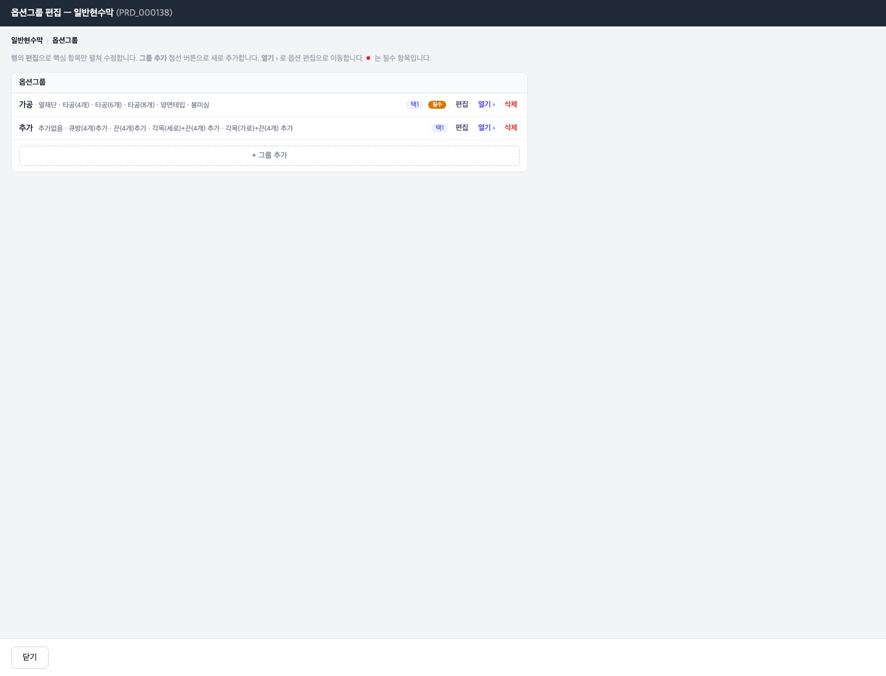
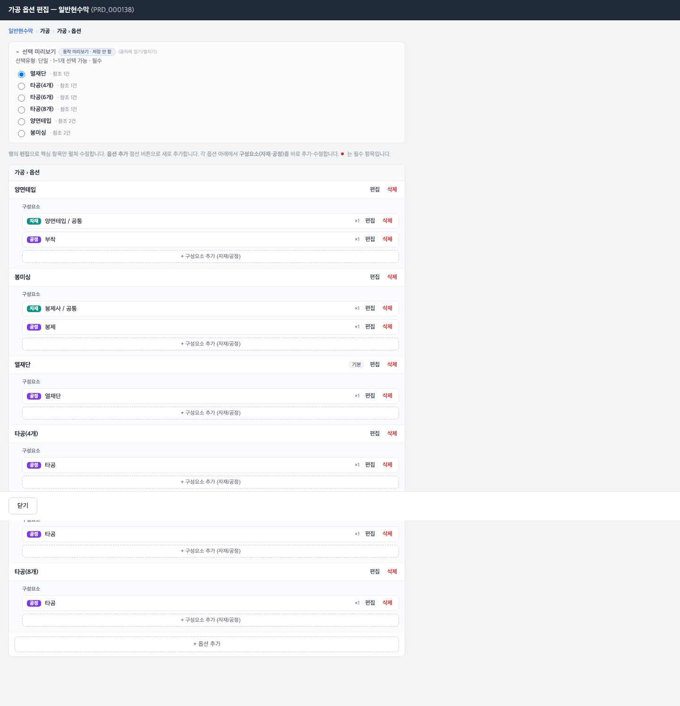

# 03 옵션 구성하기

[← 목차로](00_index.md)

옵션은 고객이 주문 시 고르는 **선택 항목**(예: 가공 방식, 코팅 종류)입니다. 옵션은 3계층으로 구성됩니다.

```
옵션그룹  (예: "가공")          ← 1계층: 선택 묶음
  └ 옵션  (예: "양면테입", "열재단", "타공(4개)")   ← 2계층: 고객이 고르는 항목
      └ 구성요소  (자재 · 공정)   ← 3계층: 그 옵션이 실제로 무엇으로 만들어지나
```

> ℹ️ **핵심 개념:** 옵션 하나는 보통 **자재 + 공정의 묶음** 입니다. 예를 들어 "양면테입" 옵션은 「양면테입(자재)」 + 「부착(공정)」으로 이루어집니다. 그래서 3계층(구성요소)에서 자재와 공정을 함께 등록합니다.

옵션은 좌측 메뉴에 없습니다. **상품 뷰어 → 상품 → "옵션그룹" 카드 "편집"** 으로 들어갑니다.

---

## 3-1. 옵션그룹 만들기 (1계층)

**언제** 상품에 새 선택 묶음(예: "가공", "코팅")을 만들 때.

1. 상품 뷰어에서 상품을 열고, **"옵션그룹"** 카드의 **"편집"** 을 누릅니다.

   
   *옵션그룹 편집(일반현수막 PRD_000138). ① 제목 "옵션그룹 편집 — 일반현수막" ② 안내문 ③ 옵션그룹 행(편집 / 열기 › / ● 필수 표시) ④ "+ 그룹 추가" 점선.*

2. 기존 그룹을 고치려면 행의 **"편집"** 을, 새로 만들려면 **"+ 그룹 추가"** 를 누릅니다.
3. 아래 항목을 채우고 저장합니다.

| 라벨 (항목명) | 필수 | 입력값 | 의미 |
|---------------|------|--------|------|
| 옵션그룹코드 (`opt_grp_cd`) | 자동 | 비움 | 비우면 `OPT-` 형식 자동 생성 |
| 옵션그룹명 (`opt_grp_nm`) | **필수** | 자유 텍스트 | 묶음 이름(예: "가공") |
| 선택유형코드 (`sel_typ_cd`) | 선택 | 드롭다운(단일/다중) | 하나만 고를지(단일), 여럿 고를지(다중) |
| 최소·최대선택수 (`min_sel_cnt`/`max_sel_cnt`) | 선택 | 숫자 | "다중"일 때 몇 개까지 |
| 필수여부 (`mand_yn`) | 선택 | Y / N | 반드시 골라야 하면 Y |
| 사용여부 (`use_yn`) | **필수** | Y / N | 기본 Y |

4. 그룹 안의 옵션을 채우려면 그룹 행의 **"열기 ›"** 를 눌러 2계층으로 들어갑니다.

> 💡 "선택유형 = 단일"이면 고객은 그 그룹에서 **하나만** 고릅니다(라디오 버튼). "다중"이면 여러 개를 고를 수 있습니다(체크박스).

---

## 3-2. 옵션과 구성요소 만들기 (2계층 + 3계층)

**언제** 옵션그룹 안에 실제 선택 항목(옵션)을 넣고, 그 옵션이 어떤 자재·공정으로 만들어지는지 묶을 때.

1. 옵션그룹 행에서 **"열기 ›"** 를 누릅니다.

   
   *가공 옵션 편집(일반현수막). ① 제목 "가공 옵션 편집" ② "선택 미리보기" 패널(라디오/단일·필수 동작을 미리 보여줌·저장 안 함) ③ 옵션별 카드(양면테입·봉미싱·열재단·타공4/6/8개) ④ 각 옵션 안의 "구성요소" 행(자재/공정 배지 + ×수량 + 편집/삭제) ⑤ "+ 구성요소 추가 (자재/공정)" ⑥ "+ 옵션 추가".*

2. **옵션 추가:** 맨 아래 **"+ 옵션 추가"** 를 눌러 새 옵션을 만듭니다.

   | 라벨 (항목명) | 필수 | 입력값 | 의미 |
   |---------------|------|--------|------|
   | 옵션코드 (`opt_cd`) | 자동 | 비움 | 자동 생성 |
   | 옵션명 (`opt_nm`) | **필수** | 자유 텍스트 | 고객에게 보일 이름(예: "양면테입") |
   | 기본여부 (`dflt_yn`) | 선택 | Y / N | 기본 선택 옵션이면 Y(화면에 "기본" 배지) |
   | 사용여부 (`use_yn`) | **필수** | Y / N | 기본 Y |

3. **구성요소 추가(3계층):** 옵션 카드 안의 **"+ 구성요소 추가 (자재/공정)"** 를 눌러, 그 옵션이 실제로 무엇으로 만들어지는지 자재·공정을 넣습니다.

   | 라벨 (항목명) | 필수 | 입력값 | 의미 |
   |---------------|------|--------|------|
   | 참조차원유형 (`ref_dim_cd`) | **필수** | 자재 / 공정 (이 화면에선 둘) | 자재인지 공정인지 |
   | 참조대상 (`ref_key1`) | **필수** | 드롭다운(이 상품에 등록된 자재 또는 공정) | 어떤 자재/공정인지 |
   | (자재일 때) 용도 (`ref_key2`) | 선택 | 자재의 용도 | 자재일 때 함께 지정 |
   | 수량 (`qty`) | 선택 | 숫자 | 몇 개 들어가나(기본 1) |
   | 사용여부 (`use_yn`) | **필수** | Y / N | 기본 Y |

4. **"저장"** 을 누릅니다.

> ⚠️ **구성요소의 자재·공정은 그 상품에 미리 등록되어 있어야** 드롭다운에 뜹니다. 즉 [02 상품 하위정보](03_product-sections.md) 의 자재·공정 섹션에 먼저 그 자재/공정을 추가하세요. 등록 안 된 자재/공정을 참조하면 시스템이 저장을 **거부** 합니다("그 차원행에 실재해야 함" — 무결성 검사).
> 💡 예시(라이브): "양면테입" 옵션 = 자재 「양면테입」 + 공정 「부착」. "봉미싱" 옵션 = 자재 「봉제사」 + 공정 「봉제」. "열재단" 옵션 = 공정 「열재단」(자재 없음). 공정만으로 된 옵션(열재단·타공)도 정상입니다.

### "선택 미리보기" 패널

옵션 편집 화면 상단의 **"선택 미리보기"** 는 고객 사이트(POD)에서 이 옵션 묶음이 라디오/체크박스로 어떻게 보일지 **미리 보여주는 참고용** 입니다. 여기서 클릭해도 **저장되지 않습니다.** 동작 확인용입니다.

---

## 3-3. 옵션 계층 한눈에 정리

| 계층 | 화면 | 무엇을 하나 | "다음 계층 열기" |
|------|------|------------|------------------|
| 1 옵션그룹 | 옵션그룹 편집 | 선택 묶음 만들기(단일/다중·필수) | 그룹 "열기 ›" |
| 2 옵션 | 옵션 편집 | 고객이 고르는 항목 만들기 | (같은 화면 안) |
| 3 구성요소 | 옵션 편집 화면 안 인라인 | 옵션 = 자재 + 공정 묶기 | (옵션 카드 안) |

> ℹ️ **2계층과 3계층은 같은 화면** 입니다. 옵션 편집 화면에서 옵션을 추가하고, 그 옵션 카드 바로 아래에서 구성요소(자재·공정)를 함께 다룹니다. 별도 페이지로 넘어가지 않습니다.

---

[← 이전: 02 상품 하위정보](03_product-sections.md) · [목차](00_index.md) · [다음: 04 구성 템플릿(SKU) →](05_sku-templates.md)
