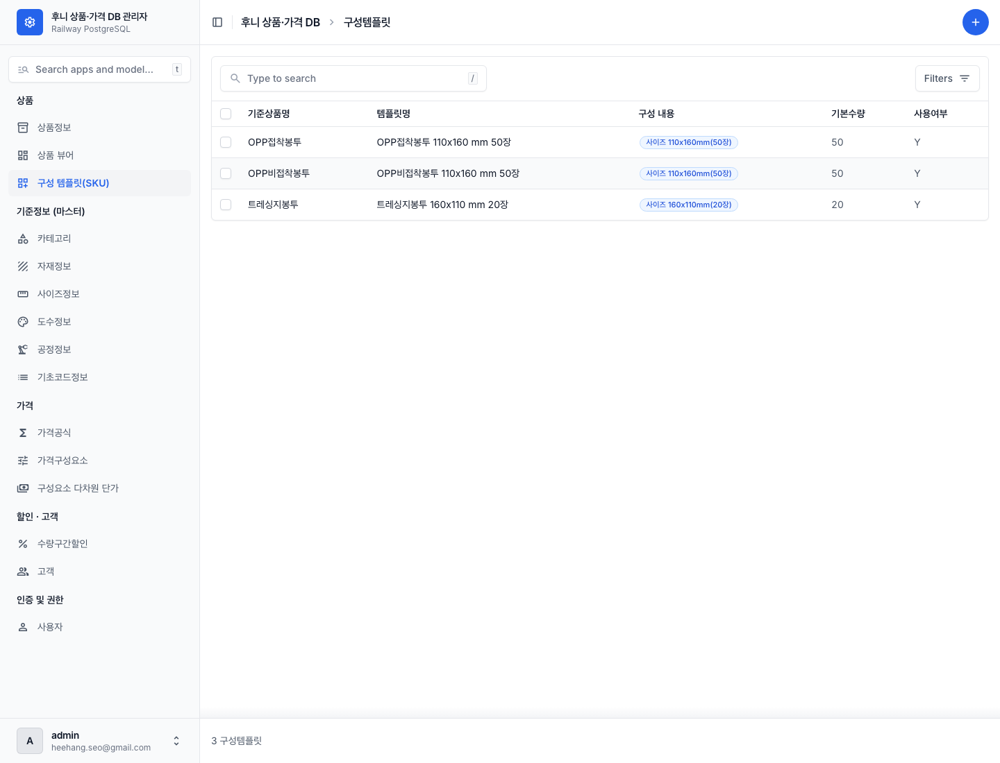
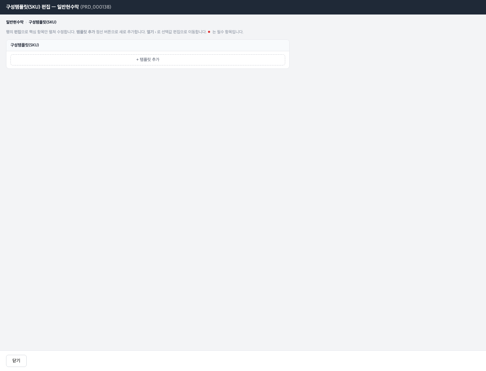
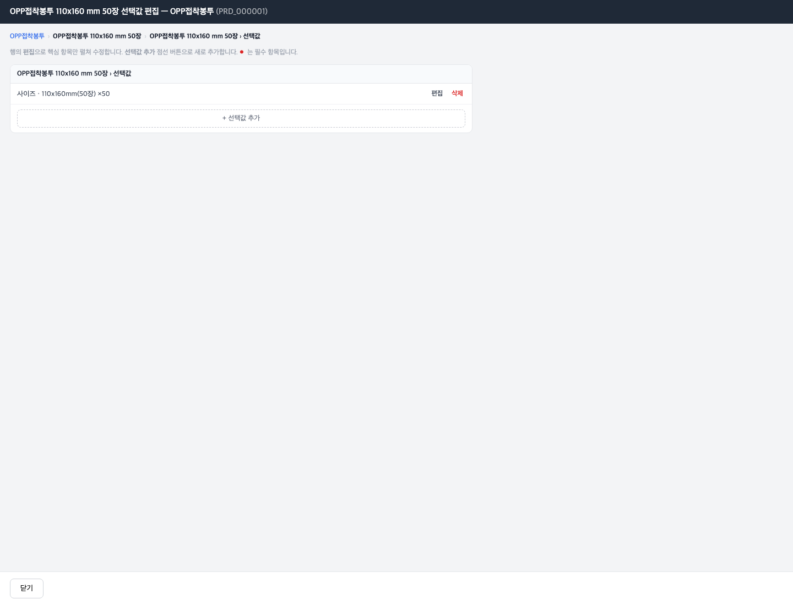

# 04 구성 템플릿(SKU) 만들기

[← 목차로](00_index.md)

**구성 템플릿(SKU)** 은 자주 팔리는 **옵션 조합을 미리 짜둔 상품** 입니다. 예를 들어 "OPP접착봉투 110x160 mm 50장"처럼 사이즈·묶음수가 고정된 조합을 하나의 판매 단위로 만들어 둡니다.

SKU는 2계층입니다.

```
SKU(구성템플릿)  (예: "OPP접착봉투 110x160 mm 50장")   ← 1계층
  └ 선택값  (사이즈=110x160mm(50장) ×50 …)             ← 2계층: 어떤 차원을 어떤 값으로 고정했나
```

SKU는 두 경로로 접근합니다.

- **상품별로 만들 때:** 상품 뷰어 → 상품 → **"구성템플릿(SKU)"** 카드 "편집" (이 챕터)
- **전체 SKU를 둘러볼 때:** [05 제약 - SKU 카탈로그](06_constraints.md) 의 전체 카탈로그

> ℹ️ 좌측 메뉴 **"구성 템플릿(SKU)"** 도 있지만, 그 목록에서 행을 클릭하면 곧바로 해당 상품의 SKU 선택값 화면으로 넘어갑니다(표준 편집 폼은 나오지 않음). 실질 편집은 상품 뷰어 경로와 같습니다.

   
   *좌측 메뉴 "구성 템플릿(SKU)" 목록. ① 컬럼: 템플릿명·기준상품·구성요약·기본수량·사용여부 ② 행(예: "OPP접착봉투 110x160 mm 50장"). 행을 클릭하면 SKU 선택값 화면이 팝업으로 열립니다.*

---

## 4-1. 상품의 SKU 목록 보기·추가 (1계층)

**언제** 한 상품에 미리 짜둔 조합 상품을 만들 때.

1. 상품 뷰어에서 상품을 열고, **"구성템플릿(SKU)"** 카드의 **"편집"** 을 누릅니다.

   
   *구성템플릿(SKU) 편집(일반현수막 PRD_000138). ① 제목 "구성템플릿(SKU) 편집" ② 안내문(템플릿 추가·"열기 ›"로 선택값 편집) ③ "+ 템플릿 추가" 점선. (이 상품은 아직 SKU가 없어 추가 버튼만 보입니다.)*

2. **"+ 템플릿 추가"** 를 눌러 새 SKU를 만들고, 아래 항목을 채웁니다.

| 라벨 (항목명) | 필수 | 입력값 | 의미 |
|---------------|------|--------|------|
| 템플릿코드 (`tmpl_cd`) | 자동 | 비움 | 비우면 `TMPL_` 형식 자동 생성 |
| 기준상품 (`base_prd_cd`) | **필수** | (현재 상품 자동) | 이 SKU의 바탕 상품 |
| 템플릿명 (`tmpl_nm`) | **필수** | 자유 텍스트 | SKU 이름(예: "OPP접착봉투 110x160 mm 50장") |
| 기본수량 (`dflt_qty`) | 선택 | 숫자 | 기본 주문 수량 |
| 사용여부 (`use_yn`) | **필수** | Y / N | 기본 Y |

3. 만든 SKU의 **"열기 ›"** 를 눌러 선택값(2계층)을 채웁니다.

> ℹ️ 실제 적재된 SKU 코드는 `TMPL-000005` 처럼 **하이픈** 으로 되어 있는 경우가 있습니다. 새로 자동 생성되는 코드와 표기가 다를 수 있으나, 동작에는 문제없습니다.

---

## 4-2. SKU 선택값 채우기 (2계층)

**언제** SKU가 어떤 차원(사이즈·묶음수·옵션 등)을 어떤 값으로 고정하는지 지정할 때.

1. SKU 목록에서 SKU의 **"열기 ›"** 를 누릅니다.

   
   *선택값 편집(OPP접착봉투 PRD_000001). ① 제목 "…선택값 편집 — OPP접착봉투" ② 브레드크럼(상품 › SKU › 선택값) ③ 선택값 행("사이즈 · 110x160mm(50장) ×50" + 편집/삭제) ④ "+ 선택값 추가" 점선. ● 는 필수 항목.*

2. **"+ 선택값 추가"** 를 눌러 선택값 행을 추가합니다.

| 라벨 (항목명) | 필수 | 입력값 | 의미 |
|---------------|------|--------|------|
| 참조차원유형 (`ref_dim_cd`) | 선택 | 드롭다운(사이즈/판형/자재/공정/묶음수/도수/셋트) | 어떤 차원을 고정하나 |
| 참조대상 (`ref_key1`) | 선택 | 드롭다운(그 차원의 등록 행) | 어떤 값으로 |
| (자재일 때) 용도 (`ref_key2`) | 선택 | 자재 용도 | 자재일 때 함께 |
| 옵션코드 (`opt_cd`) | 선택 | 드롭다운(상품 옵션) | 옵션을 고정할 때 |
| 선택값 (`sel_val`) | 선택 | 자유 텍스트 | 표시용 값 |
| 수량 (`qty`) | 선택 | 숫자 | 수량 고정 |
| 사용여부 (`use_yn`) | **필수** | Y / N | 기본 Y |

3. **"저장"** 을 누릅니다.

> 💡 라이브 예시: "사이즈 · 110x160mm(50장) ×50" — 사이즈 차원을 「110x160mm(50장)」으로, 수량을 50으로 고정한 선택값입니다.
> ⚠️ **저장 직후 제약 검사가 자동으로 실행** 됩니다. 이 SKU의 선택 조합이 그 상품의 [제약 규칙](06_constraints.md) 을 위반하면 **경고 배너** 가 뜹니다. 경고가 떠도 저장은 되지만, 조합이 규칙에 맞는지 확인하세요.

---

## 4-3. SKU 작업 순서 요약

1. 상품 뷰어 → 상품 → "구성템플릿(SKU)" "편집"
2. "+ 템플릿 추가" → 템플릿명·사용여부 입력 → 저장
3. 그 SKU "열기 ›"
4. "+ 선택값 추가" → 차원·값·수량 고정 → 저장
5. 제약 경고가 뜨면 조합 확인

> ℹ️ 차원 값(사이즈·옵션 등)이 선택값 드롭다운에 안 보이면, 그 상품의 [세부 구성](03_product-sections.md) 또는 [옵션](04_options.md) 에 먼저 등록되어 있어야 합니다.

---

[← 이전: 03 옵션 구성](04_options.md) · [목차](00_index.md) · [다음: 05 제약 규칙 설정 →](06_constraints.md)
