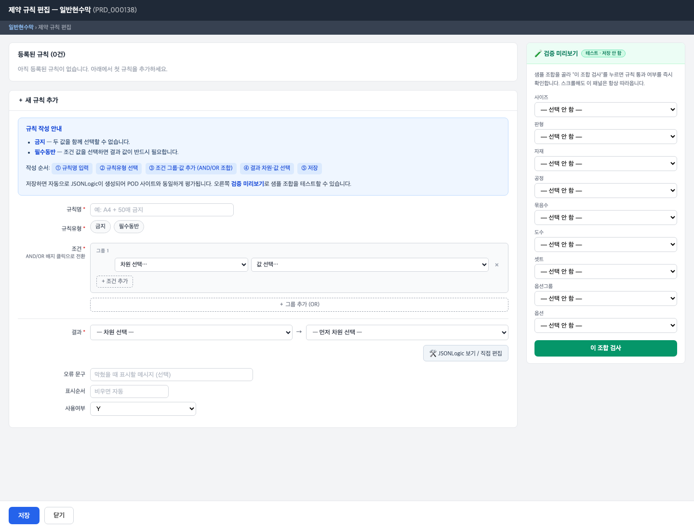
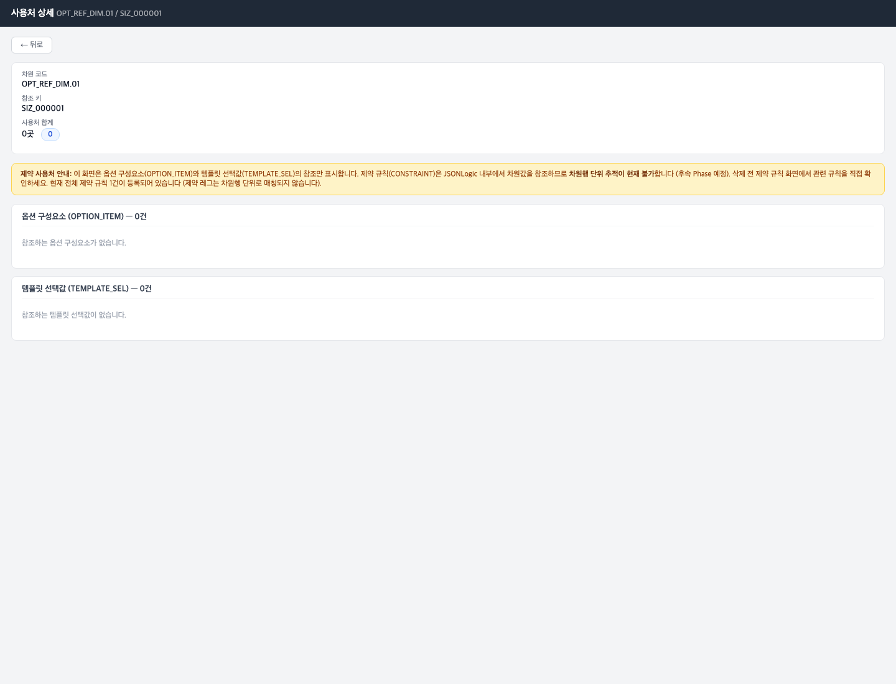
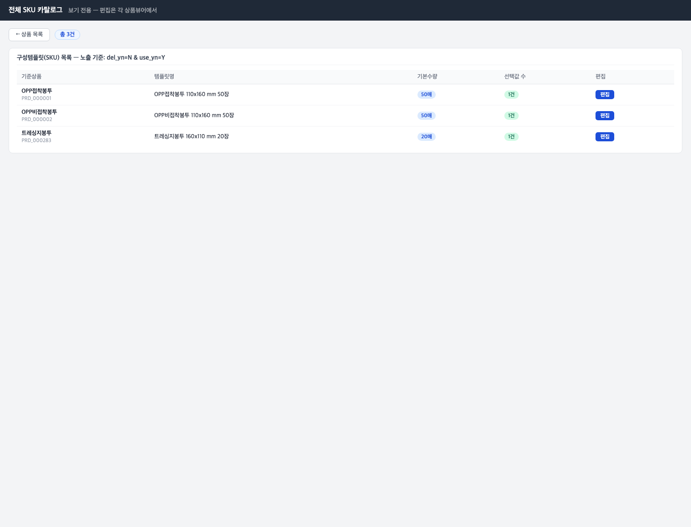

# 05 제약 규칙 설정하기

[← 목차로](00_index.md)

**제약 규칙** 은 고객이 옵션을 고를 때의 **선택 제한** 입니다. 예를 들어 "이 사이즈에는 이 자재 금지", "이 옵션을 고르면 저 옵션을 반드시 함께 골라야 함" 같은 규칙입니다. 규칙은 화면의 **폼빌더(만들기 도구)** 로 만들며, 시스템이 자동으로 내부 논리(JSONLogic)를 생성합니다.

이 챕터는 제약 규칙 만들기와, 함께 알아두면 좋은 **사용처 조회** · **전체 SKU 카탈로그** 를 다룹니다.

제약은 좌측 메뉴에 없습니다. **상품 뷰어 → 상품 → "제약규칙" 카드 "편집"** 으로 들어갑니다.

---

## 5-1. 제약 규칙 만들기

**언제** 한 상품의 옵션 선택에 제한을 걸 때.

1. 상품 뷰어에서 상품을 열고, **"제약규칙"** 카드의 **"편집"** 을 누릅니다.

   
   *제약 규칙 편집(일반현수막 PRD_000138). ① "등록된 규칙 (0건)" 기존 규칙 목록 ② "+ 새 규칙 추가" 폼빌더 ③ 우측 "검증 미리보기" 패널. 폼빌더 안: 규칙명·규칙유형·조건(차원·값)·결과(차원·값)·오류문구·표시순서·사용여부.*

2. 폼빌더의 안내 순서대로 채웁니다.

   - **규칙명**(`rule_nm`) *필수* — 규칙 이름(예: "A4 + 50매 금지").
   - **규칙유형**(`rule_typ_cd`) *필수* — **"금지"** 또는 **"필수동반"** 중 클릭.
     - **금지** = 두 값을 함께 선택할 수 없음.
     - **필수동반** = 조건 값을 고르면 결과 값도 반드시 선택해야 함.
   - **조건** *필수* — "차원 선택…" 에서 차원(사이즈·자재·공정 등)을 고르고, "값 선택…" 에서 값을 고릅니다. **"+ 조건 추가"** 로 조건을 더하면 AND/OR로 묶입니다. **"+ 그룹 추가 (OR)"** 로 OR 그룹을 만듭니다.
   - **결과** — "차원 선택" → 값 선택. (금지/필수동반의 대상)
   - **오류문구**(`err_msg`) 선택 — 규칙에 걸렸을 때 고객에게 보일 메시지.
   - **표시순서** 선택 — 비우면 자동.
   - **사용여부**(`use_yn`) — 기본 Y.

3. **"저장"** 을 누릅니다. 저장하면 시스템이 자동으로 내부 논리를 만들어 고객 사이트(POD)와 동일하게 평가합니다.

> ℹ️ **규칙유형은 라이브에서 "금지"·"필수동반" 두 가지만** 보입니다. 예전에 있던 "호환" 유형은 현재 사용 중지(`use_yn=N`)되어 드롭다운에 뜨지 않습니다.
> 💡 고급 사용자는 폼빌더 대신 **"JSONLogic 보기 / 직접 편집"** 으로 논리를 직접 작성할 수 있습니다(일반 운영자는 폼빌더만 써도 충분).

### 검증 미리보기로 규칙 테스트하기

폼빌더 우측 **"검증 미리보기"** 패널에서 샘플 조합(사이즈·판형·자재·공정·묶음수·도수·셋트·옵션그룹·옵션)을 골라 **"이 조합 검사"** 를 누르면, 그 조합이 규칙에 걸리는지 **즉시 확인** 할 수 있습니다. **저장되지 않는** 테스트 도구입니다.

| 라벨 (항목명) | 필수 | 입력값 | 의미 |
|---------------|------|--------|------|
| 규칙명 (`rule_nm`) | **필수** | 자유 텍스트 | 규칙 이름 |
| 규칙유형 (`rule_typ_cd`) | **필수** | 금지 / 필수동반 | 제한 종류 |
| 조건 (차원·값) | **필수** | 드롭다운 + AND/OR | 어떤 선택일 때 |
| 결과 (차원·값) | 선택 | 드롭다운 | 제한 대상 |
| 오류문구 (`err_msg`) | 선택 | 자유 텍스트 | 위반 시 메시지 |
| 표시순서 | 선택 | 숫자(비우면 자동) | 순서 |
| 사용여부 (`use_yn`) | **필수** | Y / N | 기본 Y |

### 규칙 켜고 끄기·삭제

- 기존 규칙 목록에서 규칙을 **사용여부 전환**(켜기/끄기) 하거나 **삭제**(논리삭제) 할 수 있습니다.
- 삭제해도 기록은 남고 목록에서만 사라집니다.

---

## 5-2. 사용처 보기 (어디에 쓰이고 있나)

**언제** 어떤 사이즈·자재·공정 행을 고치거나 지우기 전에, 그 값이 **어디에 쓰이고 있는지** 확인할 때.

상품 뷰어의 세부 구성 행 옆에 **"사용처" 배지** 가 보이면 클릭합니다. 그러면 사용처 상세 화면이 열립니다.

   
   *사용처 상세(차원 OPT_REF_DIM.01 / SIZ_000001). ① 제목 "사용처 상세" + 차원코드·참조키 ② "사용처 합계" 건수 ③ "옵션 구성요소(OPTION_ITEM)" 그룹 ④ "템플릿 선택값(TEMPLATE_SEL)" 그룹 ⑤ 하단 제약 사용처 안내.*

- 이 화면은 그 값이 **옵션 구성요소** 와 **SKU 선택값** 에서 몇 번 쓰이는지 보여줍니다.
- **"사용처 합계"** 가 0이면 어디서도 안 쓰이는 값이라 안전하게 고칠 수 있습니다. 0이 아니면 고치거나 지울 때 영향이 있으니 주의하세요.

> ⚠️ **안내 박스의 한계:** 사용처 화면은 옵션 구성요소·SKU 선택값만 셉니다. **제약 규칙** 이 그 값을 쓰는지는 이 화면이 자동으로 추적하지 못합니다. 제약 규칙 관련 영향은 [5-1](#5-1-제약-규칙-만들기) 의 제약 규칙 화면에서 직접 확인하세요.

---

## 5-3. 전체 SKU 카탈로그 보기

**언제** 등록된 모든 상품의 SKU를 한눈에 둘러볼 때.

전체 SKU 카탈로그는 좌측 메뉴에 없고, 주소(`/admin/sku-catalog/`)로 직접 들어가거나 다른 화면의 링크로 갑니다.

   
   *전체 SKU 카탈로그. ① 제목 "전체 SKU 카탈로그" + "보기 전용 — 편집은 각 상품뷰어에서" + 총 건수 ② 컬럼: 기준상품·템플릿명·기본수량·선택값 수 ③ 행별 "편집" 링크(해당 상품의 SKU 화면으로 이동).*

- 이 화면은 **사용 중(`use_yn=Y`)이고 삭제되지 않은(`del_yn=N`)** SKU만 보여줍니다.
- **보기 전용** 입니다. 여기서는 편집할 수 없고, 행의 **"편집"** 을 누르면 해당 상품의 SKU 화면([04 SKU](05_sku-templates.md))으로 이동합니다.

---

[← 이전: 04 구성 템플릿(SKU)](05_sku-templates.md) · [목차](00_index.md) · [다음: 06 기초정보 마스터 관리 →](07_masters.md)
