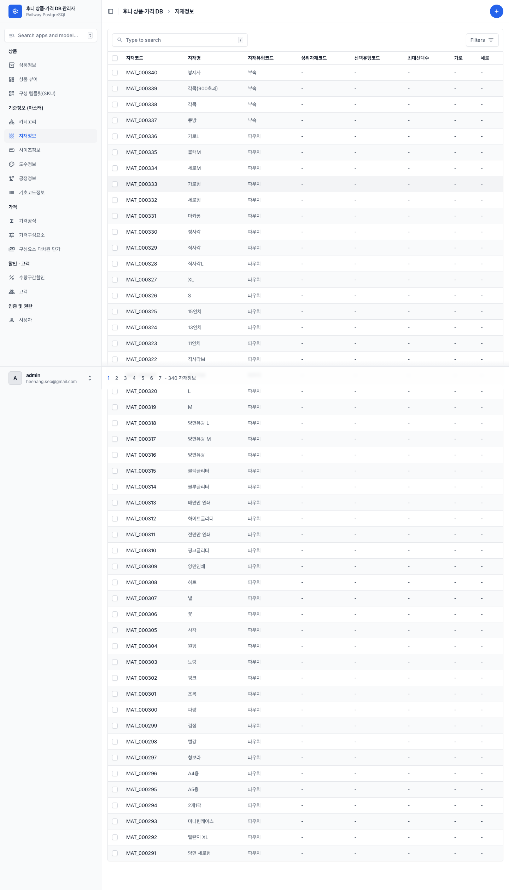
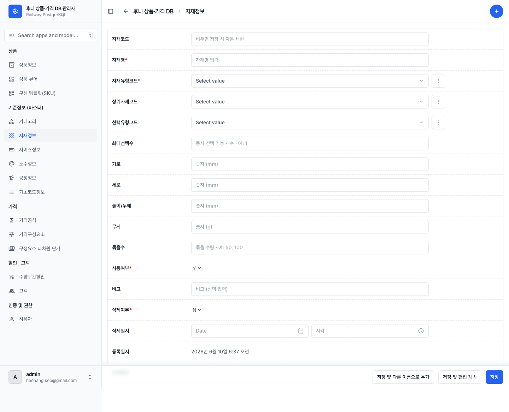
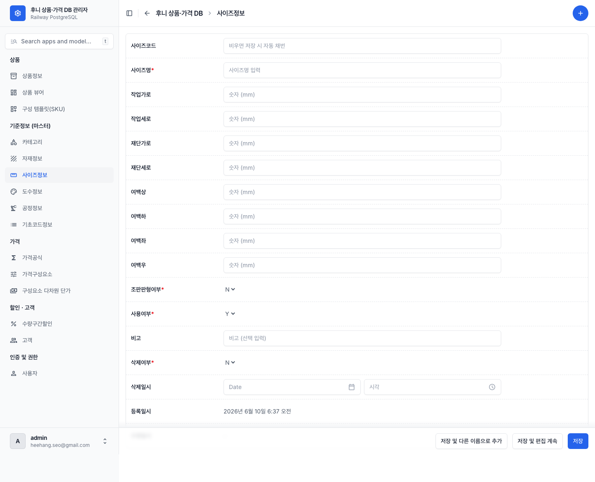
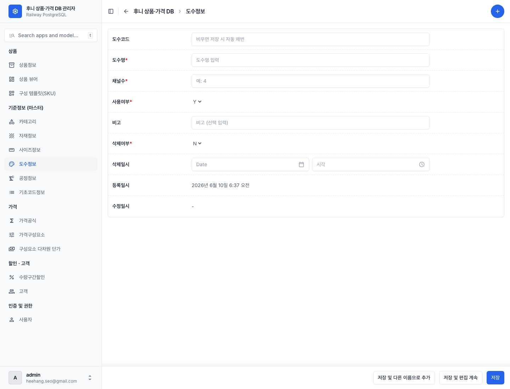
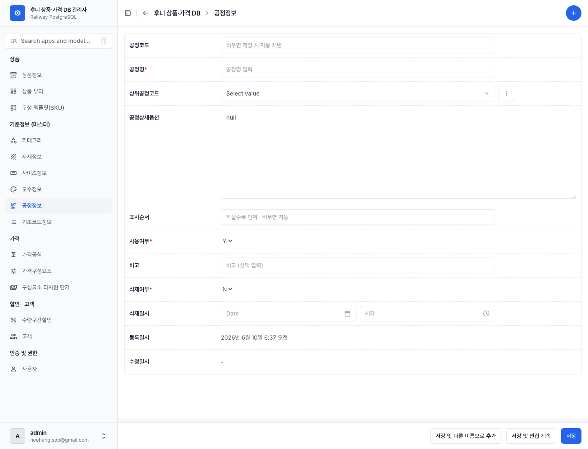
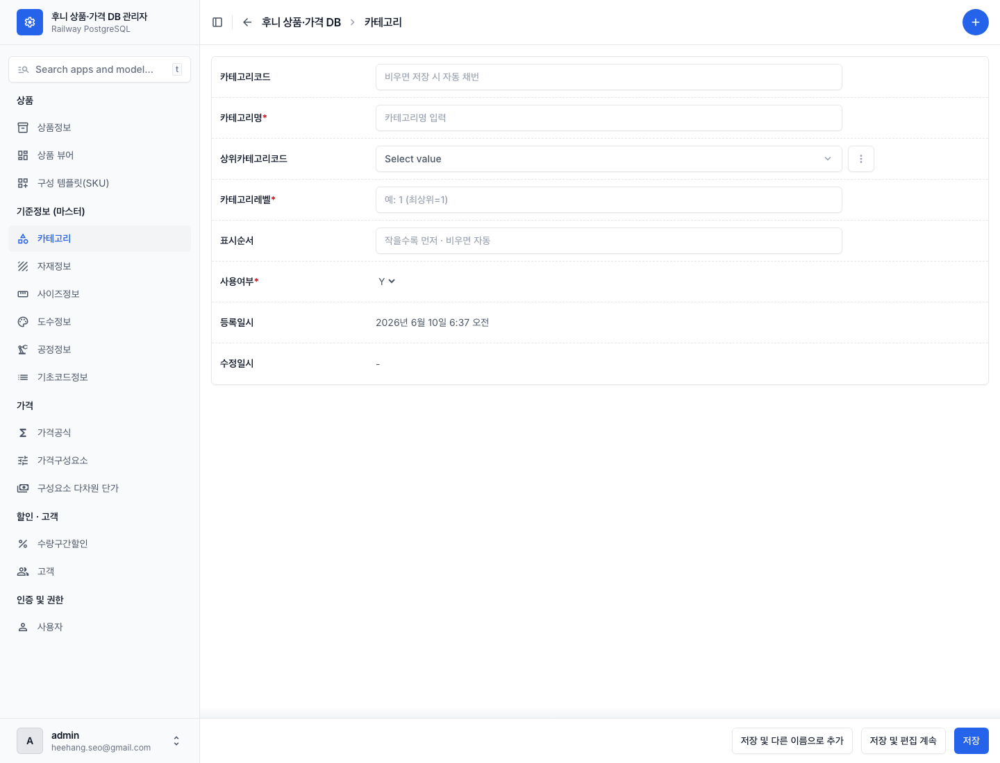
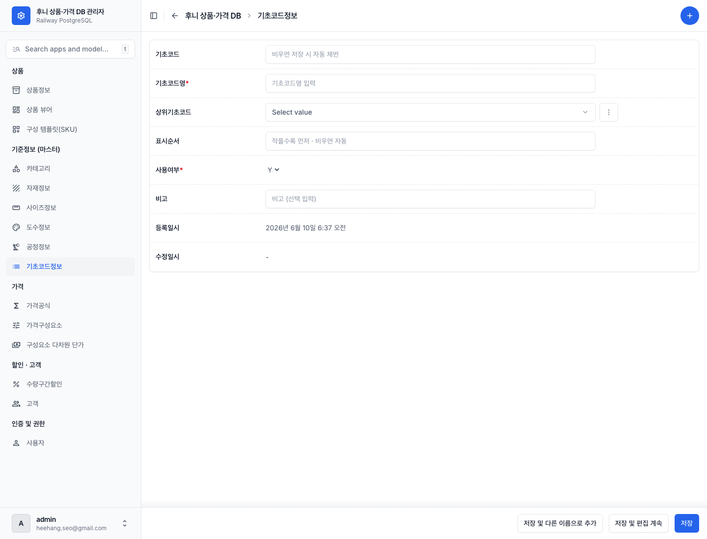

# 06 기초정보 마스터 관리하기

[← 목차로](00_index.md)

**기초정보 마스터** 는 모든 상품이 공유하는 **기준 데이터** 입니다. 카테고리·자재·사이즈·도수·공정·기초코드가 여기 속합니다. 상품의 세부 구성([02 상품 하위정보](03_product-sections.md))에서 자재·사이즈를 고르려면, **먼저 이 마스터에 등록되어 있어야** 합니다.

이 화면들은 모두 좌측 **"기준정보 (마스터)"** 그룹에 있고, [00 시작하기](01_getting-started.md) 의 공통 동작(목록·추가·저장·자동채번·트리)이 그대로 적용됩니다.

> 💡 마스터는 한 번 등록하면 여러 상품이 재사용합니다. 이름·코드를 신중히 정하세요. 사용 중인 마스터는 삭제·중지가 거부될 수 있습니다.

---

## 6-1. 자재정보 (자재 마스터)

**언제** 새 종이·필름·아크릴 등 자재를 등록할 때.

1. 좌측 메뉴 **"자재정보"** → 목록 → **⊕(추가)**.

   
   *자재정보 목록. ① 컬럼: 자재코드·자재명·자재유형·상위자재·선택유형·최대선택수·가로·세로 ② 검색칸 + 자재유형·선택유형 필터 ③ 우상단 ⊕추가. (마스터 목록 화면들은 모두 이 형태 — 컬럼만 다릅니다.)*

   
   *자재 추가 폼. ① 자재코드 자동채번 ② 자재명* ③ 자재유형코드* 드롭다운 ④ 상위자재코드 트리 ⑤ 선택유형코드 ⑥ 최대선택수·가로·세로·높이/두께·무게·묶음수 ⑦ 사용여부·비고.*

| 라벨 (항목명) | 필수 | 입력값 | 의미 |
|---------------|------|--------|------|
| 자재코드 (`mat_cd`) | 자동 | 비움 | `MAT_` 자동 생성 |
| 자재명 (`mat_nm`) | **필수** | 자유 텍스트 | 자재 이름(예: "화이트면지") |
| 자재유형코드 (`mat_typ_cd`) | **필수** | 드롭다운(아래 11종) | 자재 분류 |
| 상위자재코드 (`upr_mat_cd`) | 선택 | 트리 드롭다운 | 부모 자재(계층) |
| 선택유형코드 (`sel_typ_cd`) | 선택 | 단일 / 다중 | 선택 방식 |
| 최대선택수 (`max_sel_cnt`) | 선택 | 숫자 | 다중일 때 |
| 가로·세로·높이/두께 (`width`/`height`/`depth`) | 선택 | 숫자(mm) | 치수 |
| 무게 (`weight`) | 선택 | 숫자(g) | 무게 |
| 묶음수 (`bdl_qty`) | 선택 | 숫자 | 묶음 수량 |
| 사용여부 (`use_yn`) | **필수** | Y / N | N이면 선택 불가 |

**자재유형코드 11종:** 종이 · 필름 · 아크릴 · 금속 · 원단 · 가죽 · 부속 · 실사소재 · 파우치 · 악세사리 · 스티커.

---

## 6-2. 사이즈정보 (사이즈 마스터)

**언제** 새 작업 크기(치수)를 등록할 때.

1. 좌측 메뉴 **"사이즈정보"** → **⊕(추가)**.

   
   *사이즈 추가 폼. ① 사이즈코드 자동채번 ② 사이즈명* ③ 작업/재단 가로·세로 ④ 여백(상/하) ⑤ 사용여부.*

| 라벨 (항목명) | 필수 | 입력값 | 의미 |
|---------------|------|--------|------|
| 사이즈코드 (`siz_cd`) | 자동 | 비움 | `SIZ_` 자동 생성 |
| 사이즈명 (`siz_nm`) | **필수** | 자유 텍스트 | 크기 이름(예: "73x98", "100x150") |
| 작업가로·세로 (`work_width`/`work_height`) | 선택 | 숫자 | 작업 치수 |
| 재단가로·세로 (`cut_width`/`cut_height`) | 선택 | 숫자 | 재단 치수 |
| 여백 상/하/좌/우 (`margin_top`/`bot`/`lft`/`rgt`) | 선택 | 숫자 | 여백 |
| 조판판형여부 (`impos_yn`) | **필수** | Y / N | 조판(판형) 사이즈면 Y |
| 사용여부 (`use_yn`) | **필수** | Y / N | N이면 선택 불가 |

---

## 6-3. 도수정보 (도수 마스터)

**언제** 인쇄 색상 수 항목을 보거나 추가할 때. (현재 5종 고정.)

1. 좌측 메뉴 **"도수정보"** → 목록.

   
   *도수 추가 폼. ① 도수코드 자동채번 ② 도수명* ③ 채널수(chnl_cnt) ④ 사용여부·비고.*

현재 등록된 도수(인쇄옵션에서 이 5개 중 고름):

| 도수명 | 채널 수 |
|--------|--------|
| 인쇄 안 함 | 0 |
| 1도(흑백) | 1 |
| 2도 | 2 |
| 3도 | 3 |
| CMYK 4도 | 4 |

| 라벨 (항목명) | 필수 | 입력값 | 의미 |
|---------------|------|--------|------|
| 도수코드 (`clr_cd`) | 자동 | 비움 | `CLR_` 자동 생성 |
| 도수명 (`clr_nm`) | **필수** | 자유 텍스트 | 색상 수 이름 |
| 채널수 (`chnl_cnt`) | **필수** | 숫자 | 색상 채널 수 |
| 사용여부 (`use_yn`) | **필수** | Y / N | |

---

## 6-4. 공정정보 (공정 마스터)

**언제** 인쇄·후가공 공정을 등록할 때.

1. 좌측 메뉴 **"공정정보"** → **⊕(추가)**.

   
   *공정 추가 폼. ① 공정코드 자동채번 ② 공정명* ③ 상위공정코드 트리 드롭다운 ④ 공정상세옵션(JSON) ⑤ 표시순서·사용여부·비고.*

| 라벨 (항목명) | 필수 | 입력값 | 의미 |
|---------------|------|--------|------|
| 공정코드 (`proc_cd`) | 자동 | 비움 | `PROC_` 자동 생성 |
| 공정명 (`proc_nm`) | **필수** | 자유 텍스트 | 공정 이름(예: "UV", "옵셋", "디지털", "별색인쇄") |
| 상위공정코드 (`upr_proc_cd`) | 선택 | 트리 드롭다운 | 부모 공정(예: "인쇄" 아래 UV/옵셋/디지털) |
| 공정상세옵션 (`prcs_dtl_opt`) | 선택 | JSON 텍스트 | 상세 설정(전문 항목) |
| 표시순서 (`disp_seq`) | 선택 | 숫자(비우면 자동) | 순서 |
| 사용여부 (`use_yn`) | **필수** | Y / N | |

> ⚠️ "공정상세옵션"은 JSON 형식의 전문 항목입니다. 형식을 모르면 비워 두세요(선택 항목).

---

## 6-5. 카테고리 (분류 트리)

**언제** 상품 분류를 추가·정리할 때.

1. 좌측 메뉴 **"카테고리"** → **⊕(추가)**.

   
   *카테고리 추가 폼. ① 카테고리코드 자동채번 ② 카테고리명* ③ 상위카테고리코드 트리 드롭다운(깊이 들여쓰기) ④ 카테고리레벨·표시순서·사용여부.*

| 라벨 (항목명) | 필수 | 입력값 | 의미 |
|---------------|------|--------|------|
| 카테고리코드 (`cat_cd`) | 자동 | 비움 | `CAT_` 자동 생성 |
| 카테고리명 (`cat_nm`) | **필수** | 자유 텍스트 | 분류 이름 |
| 상위카테고리코드 (`upr_cat_cd`) | 선택 | 트리 드롭다운 | 부모 분류(최상위면 비움) |
| 카테고리레벨 (`cat_lvl`) | **필수** | 숫자(1·2·3) | 깊이(1=대분류, 3=소분류) |
| 표시순서 (`disp_seq`) | 선택 | 숫자(비우면 자동) | 순서 |
| 사용여부 (`use_yn`) | **필수** | Y / N | |

---

## 6-6. 기초코드정보 (시스템 코드값)

**언제** 상품유형·자재유형 같은 **드롭다운 선택지 자체** 를 추가·수정할 때. (자주 건드리지 않는 영역입니다.)

기초코드는 다른 모든 화면의 드롭다운(상품유형·수량단위·자재유형·용도 등)에 나타나는 **선택지의 원천** 입니다.

1. 좌측 메뉴 **"기초코드정보"** → **⊕(추가)**.

   
   *기초코드 추가 폼. ① 기초코드(비우고 상위 선택 시 GROUP.NN 채번) ② 코드명* ③ 상위기초코드 드롭다운(루트 그룹만) ④ 표시순서·사용여부·비고.*

| 라벨 (항목명) | 필수 | 입력값 | 의미 |
|---------------|------|--------|------|
| 기초코드 (`cod_cd`) | 조건부 | 비움 또는 직접 | 상위 선택 + 비움 → `GROUP.NN` 자동 |
| 코드명 (`cod_nm`) | **필수** | 자유 텍스트 | 선택지에 보일 이름 |
| 상위기초코드 (`upr_cod_cd`) | 선택 | 드롭다운(루트 그룹만) | 어느 그룹에 속하나 |
| 표시순서 (`disp_seq`) | 선택 | 숫자(비우면 자동) | 순서 |
| 사용여부 (`use_yn`) | **필수** | Y / N | |

> ⚠️ **기초코드는 특수 규칙이 있습니다:** 기초코드와 상위기초코드를 **둘 다 비우면 폼 오류** 가 납니다. 새 선택지를 그룹 안에 추가하려면, **상위기초코드(그룹)를 고르고 기초코드는 비워** 두면 `MAT_TYPE.12` 처럼 그룹 내 순번이 자동으로 붙습니다.

### 기초코드 그룹 사전 (현재 선택지)

운영자가 각 드롭다운에서 보게 될 선택지의 원천입니다. **이 코드값이 권위** 입니다(라이브 기준).

| 그룹 (한글) | 선택지 | 쓰이는 곳 |
|-------------|--------|-----------|
| **PRD_TYPE** (상품유형) | 완제품 · 반제품 · 기성상품 · 디자인상품 · 추가상품 | 상품의 상품유형 |
| **QTY_UNIT** (수량단위) | EA · 매 · 권 · 세트 | 상품·묶음 수량단위 |
| **SEMI_ROLE** (반제품역할) | 내지 · 표지 · 면지 · 간지 · 투명커버 | 반제품 상품 |
| **MAT_TYPE** (자재유형) | 종이 · 필름 · 아크릴 · 금속 · 원단 · 가죽 · 부속 · 실사소재 · 파우치 · 악세사리 · 스티커 | 자재 |
| **SEL_TYPE** (선택유형) | 단일 · 다중 | 자재·옵션그룹 |
| **USAGE** (용도) | 내지 · 표지 · 면지 · 간지 · 투명커버 · 표지타입 · 공통 | 상품별자재 용도 |
| **OUTPUT_PAPER_TYPE** (출력용지유형) | 국전계열 · 46계열 · 기타 | 판형 |
| **OPT_REF_DIM** (옵션참조차원) | 사이즈 · 판형 · 자재 · 공정 · 묶음수 · 도수 · 셋트 | 옵션·SKU 구성요소 |
| **FRM_TYPE** (공식유형) | 합산형 · 단순형 | 가격공식 |
| **PRC_COMPONENT_TYPE** (가격구성요소유형) | 인쇄비 · 코팅비 · 용지비 · 후가공비 · 박형압비 · 완제품비 | 가격구성요소 |
| **DSC_TYPE** (할인유형) | 정률 · 정액 | 할인 |
| **RULE_TYPE** (제약규칙유형) | 호환*(중지)* · 금지 · 필수동반 | 제약 규칙 |
| **CUS_GRADE** (고객등급) | VIP · 일반 | 고객 |

> ℹ️ "호환" 규칙유형은 현재 사용 중지되어 제약 폼빌더 드롭다운에 안 보입니다.

---

[← 이전: 05 제약 규칙](06_constraints.md) · [목차](00_index.md) · [다음: 07 가격·할인·고객 →](08_pricing.md)
