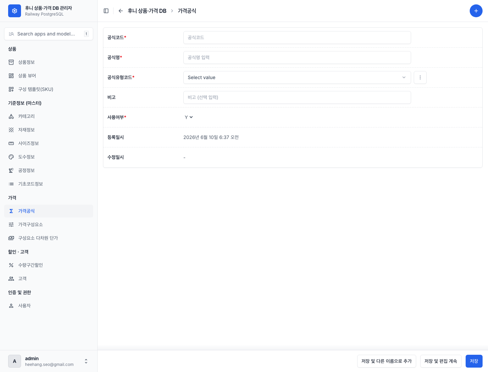
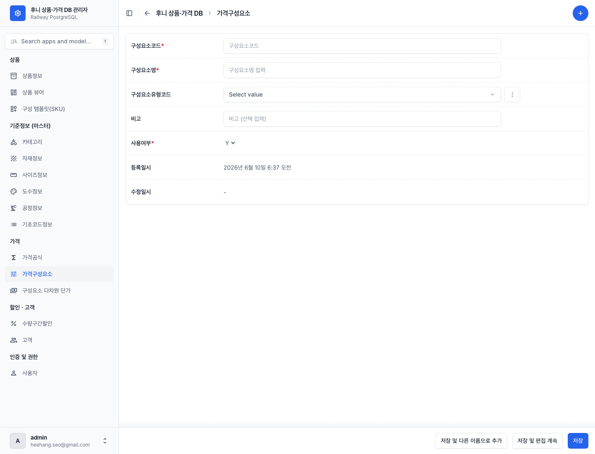
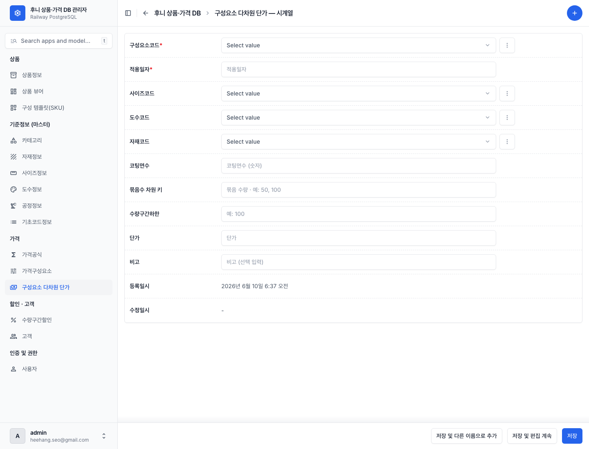
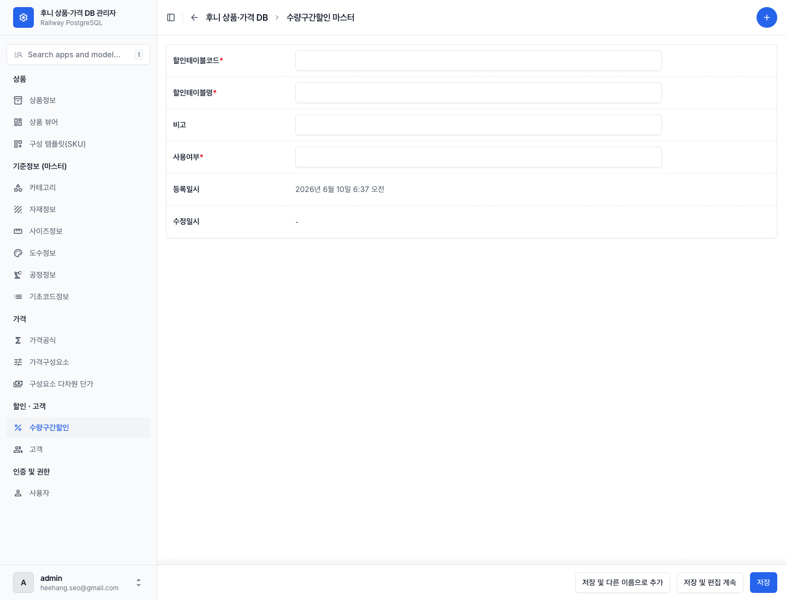
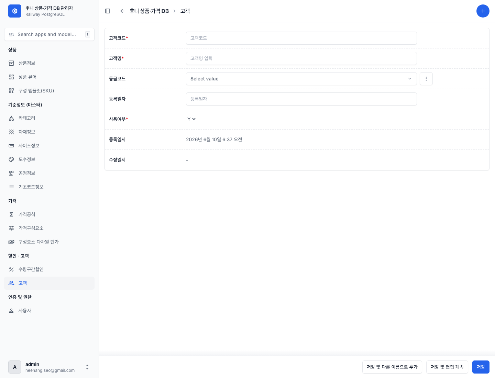

# 07 가격·할인·고객 관리하기

[← 목차로](00_index.md)

가격은 **공식 → 구성요소 → 단가** 의 3단으로 이루어집니다. 좌측 **"가격"** 그룹의 세 화면과, **"할인·고객"** 그룹(수량구간할인·고객)을 다룹니다.

> ⚠️ **중요·먼저 읽으세요:** 가격을 **상품과 연결** 하는 데이터(상품별 가격공식·상품단가·공식별 구성요소 등)는 **이 관리자 화면에 없습니다.** 가격 계산이 실제로 작동하려면 그 연결이 필요한데, 그 부분은 화면 편집이 불가능하고 데이터베이스 직접 작업 영역입니다([09 화면 레퍼런스 - 화면이 없는 데이터](09_screen-reference.md) 참조). 이 챕터의 세 화면은 가격 계산에 쓰이는 **재료(공식·구성요소·단가)** 를 관리하는 곳입니다. 가격이 안 맞으면 개발 담당자에게 문의하세요.

---

## 7-1. 가격공식

**언제** 가격 계산 공식을 추가·수정할 때. (현재 16건. 전문 영역입니다.)

1. 좌측 메뉴 **"가격공식"** → **⊕(추가)**.

   
   *가격공식 추가 폼. ① 공식코드 ② 공식명* ③ 공식유형코드 드롭다운 ④ 비고·사용여부.*

| 라벨 (항목명) | 필수 | 입력값 | 의미 |
|---------------|------|--------|------|
| 공식코드 (`frm_cd`) | **필수** | 직접 입력 | 공식 코드(예: `PRF_DGP_A`). **자동채번 아님** |
| 공식명 (`frm_nm`) | **필수** | 자유 텍스트 | 공식 이름(예: "디지털인쇄 원자합산형A") |
| 공식유형코드 (`frm_typ_cd`) | **필수** | 합산형 / 단순형 | 공식 종류 |
| 사용여부 (`use_yn`) | **필수** | Y / N | |

> ⚠️ 가격공식의 코드는 **자동채번이 아니라 직접 입력** 입니다. 기존 명명 규칙(`PRF_...`)을 따라 입력하세요.

---

## 7-2. 가격구성요소

**언제** 공식에 들어가는 비용 항목(인쇄비·코팅비 등)을 추가·수정할 때. (현재 144건.)

1. 좌측 메뉴 **"가격구성요소"** → **⊕(추가)**.

   
   *가격구성요소 추가 폼. ① 구성요소코드 ② 구성요소명* ③ 구성요소유형코드 드롭다운 ④ 비고·사용여부.*

| 라벨 (항목명) | 필수 | 입력값 | 의미 |
|---------------|------|--------|------|
| 구성요소코드 (`comp_cd`) | **필수** | 직접 입력 | 코드. 자동채번 아님 |
| 구성요소명 (`comp_nm`) | **필수** | 자유 텍스트 | 항목 이름 |
| 구성요소유형코드 (`comp_typ_cd`) | 선택 | 인쇄비/코팅비/용지비/후가공비/박형압비/완제품비 | 비용 종류 |
| 사용여부 (`use_yn`) | **필수** | Y / N | |

---

## 7-3. 구성요소 다차원 단가

**언제** 사이즈·도수·자재 조합별 단가를 등록할 때. (현재 3,481건. 대량 데이터.)

이 화면은 "어떤 구성요소를, 어떤 사이즈·도수·자재·코팅면수·묶음수·수량구간일 때, 얼마"인지를 적는 단가표입니다.

1. 좌측 메뉴 **"구성요소 다차원 단가"** → **⊕(추가)**.

   
   *다차원 단가 추가 폼. ① 구성요소코드 ② 적용일자 ③ 사이즈코드·도수코드·자재코드·코팅면수·묶음수(차원 키) ④ 단가.*

| 라벨 (항목명) | 필수 | 입력값 | 의미 |
|---------------|------|--------|------|
| 단가ID (`comp_price_id`) | 자동 | 비움 | 시스템 자동 번호 |
| 구성요소코드 (`comp_cd`) | **필수** | 드롭다운(가격구성요소) | 어떤 비용 항목 |
| 적용일자 (`apply_ymd`) | **필수** | YYYYMMDD 형식 텍스트 | 단가 적용 시작일 |
| 사이즈코드 (`siz_cd`) | 선택 | 드롭다운(사이즈) | 차원 키 |
| 도수코드 (`clr_cd`) | 선택 | 드롭다운(도수) | 차원 키 |
| 자재코드 (`mat_cd`) | 선택 | 드롭다운(자재) | 차원 키 |
| 코팅면수 (`coat_side_cnt`) | 선택 | 숫자 | 차원 키 |
| 묶음수 (`bdl_qty`) | 선택 | 숫자 | 차원 키 |
| 수량하한 (`min_qty`) | 선택 | 숫자 | 수량 구간 하한 |
| 단가 (`unit_price`) | 선택 | 숫자 | 가격 |

> ⚠️ **같은 차원 조합은 중복 등록할 수 없습니다.** 구성요소·적용일자·사이즈·도수·자재·코팅면수·묶음수·수량하한의 **8가지 조합** 이 똑같은 행이 이미 있으면 저장이 거부됩니다. 단가를 바꾸려면 기존 행을 수정하세요.

---

## 7-4. 수량구간할인 마스터

**언제** 수량 구간별 할인표(예: 100매 이상 5% 할인)의 **표 제목** 을 관리할 때.

1. 좌측 메뉴 **"수량구간할인"** → **⊕(추가)**.

   
   *수량구간할인 마스터 추가 폼. ① 할인테이블코드 ② 할인테이블명* ③ 비고·사용여부.*

| 라벨 (항목명) | 필수 | 입력값 | 의미 |
|---------------|------|--------|------|
| 할인테이블코드 (`dsc_tbl_cd`) | **필수** | 직접 입력 | 코드. 자동채번 아님 |
| 할인테이블명 (`dsc_tbl_nm`) | **필수** | 자유 텍스트 | 할인표 이름 |
| 사용여부 (`use_yn`) | **필수** | Y / N | |

> ℹ️ 이 화면의 사용여부는 다른 화면과 달리 **Y/N 드롭다운이 아니라 직접 입력 칸** 으로 보일 수 있습니다(시스템 설정상). 그래도 **Y 또는 N만** 입력하세요. 그 외 값은 저장이 거부됩니다.
> ⚠️ **할인표의 실제 구간·할인율 상세(예: "100~199매 5%")는 이 관리자 화면에 없습니다.** 마스터(표 제목)만 여기서 관리하고, 구간 상세는 데이터베이스 직접 작업 영역입니다([09 화면 레퍼런스](09_screen-reference.md)). 할인율 조정이 필요하면 개발 담당자에게 요청하세요.

---

## 7-5. 고객

**언제** 고객·고객등급을 관리할 때. (현재 라이브 0건 — 빈 목록.)

1. 좌측 메뉴 **"고객"** → **⊕(추가)**.

   
   *고객 추가 폼. ① 고객코드 ② 고객명* ③ 등급코드·등록일자·사용여부.*

| 라벨 (항목명) | 필수 | 입력값 | 의미 |
|---------------|------|--------|------|
| 고객코드 (`cus_cd`) | **필수** | 직접 입력 | 고객 코드. 자동채번 아님 |
| 고객명 (`cus_nm`) | **필수** | 자유 텍스트 | 고객 이름 |
| 등급코드 (`grade_cd`) | 선택 | VIP / 일반 | 고객 등급 |
| 등록일자 (`reg_ymd`) | 선택 | YYYYMMDD 텍스트 | 등록일 |
| 사용여부 (`use_yn`) | **필수** | Y / N | |

> ℹ️ 현재 고객은 **0건** 입니다. 목록을 열면 비어 있습니다. 등급별 할인율 데이터도 현재 비어 있습니다.

---

[← 이전: 06 기초정보 마스터](07_masters.md) · [목차](00_index.md) · [다음: 09 화면 레퍼런스 →](09_screen-reference.md)
