# 스키마 설계의도 지도 (Schema Design Intent Map) — 1회성 권위·재사용 문서

> **작성** 2026-06-10 · round-9 directive 응답 · round-11 결합. **DB 미적재·미접속 분석 종합 문서**.
>
> **왜 이 문서인가:** round-9 사용자 directive [HARD] — **CPQ/데이터 매핑을 기계적으로 하지 말 것.** 같은 엑셀 값을 잘못된 t_*에 매핑하는 위험이 실증됐다(카드봉투 색이 `t_siz_sizes`에 인코딩 — PRD_000004의 `SIZ_000104`="화이트165x115mm(10장)"·`SIZ_000105`="블랙165x115mm(10장)"). **적재 전에 각 t_* 엔티티가 *왜* 그렇게 설계됐는지 + 인쇄상품 구성요소의 삼중 바인딩을 정립**해야 한다. round-11이 **엑셀 측 입력**(11 상품시트 컬럼 의미·상품 BOM·적재명세)을 완성했으므로, 이 문서가 **t_* 측 설계의도**를 정립해 둘을 결합 → "무엇을 어디 넣나"가 추측이 아닌 **도출**이 되게 한다.
>
> **이 문서의 지위:** 다운스트림 매핑(L1 차원 적재 / L2 CPQ 옵션 레이어)의 **권위 입력**. "이 구성요소는 이 t_*에 이렇게 귀속(삼중바인딩 근거)"이 한눈에 도출되게 한다. 07_domain 의미축·round-11 산출은 **인용**(재유도 금지) — 본 문서는 그것들을 **t_* 측에서 종합**한다.
>
> **권위 순서 [HARD]:** ① 후니 PDF/라이브 DB 실측(`ref-*.csv`·`cpq-schema`·`schema-relationship-analysis`) → ② 07_domain KB·round-11 산출 → ③ RedPrinting 역공학(UI 바인딩) → ④ 국내외 표준. **추정 0** — 미지는 명시 가설 + 출처 + 컨펌ID. 표준 충돌 시 후니 권위.
>
> **언어:** 서술 한국어, 식별자/컬럼/코드/t_*/SQL = English. 라이브 행수 = `00_schema/ref-*.csv` + `schema-relationship-analysis.md`(2026-06-06 재실측) 인용. **추가 DB 접속 불요**(ref-*.csv가 라이브 덤프).

---

## 0. 행수 권위 주석 (두 스냅샷 차이)

라이브 행수는 두 시점 덤프가 있다. **2026-06-06 재실측(`schema-relationship-analysis.md`)이 최신 권위**이고, `ref-*.csv`(2026-06-04)는 보조다. 차이는 소프트삭제(`del_yn`)·CPQ 마이그레이션 반영분이다.

| 테이블 | ref-csv(06-04) | 재실측(06-06) | 본 문서 인용값 |
|--------|---------------:|--------------:|---------------:|
| `t_prd_products` | 280 | **275** | 275 |
| `t_siz_sizes` | 497 | **500** | 500 |
| `t_prd_product_plate_sizes` | 509 | **494** | 494 |
| `t_prd_product_sizes` | 444 | **436** | 436 |
| `t_prd_product_materials` | 406 | **402** | 402 |
| `t_prd_product_print_options` | 172 | **166** | 166 |
| `t_prd_product_processes` | 196 | **198** | 198 |
| `t_proc_processes` | 83 | 83 | 83 |
| `t_mat_materials` | 336 | 336 | 336 |
| `t_cod_base_codes` | 58 | **71** | 71 |
| `t_prd_product_discount_tables` | — | **98** | 98 |

> ⚠️ **stale 주의:** `option_items` 행수는 자료마다 갈린다 — `ref-*.csv`·`schema-relationship-analysis`는 **0행**, 메모리(`dbmap-code-identifier-strategy`)는 silsa CPQ **43행 COMMIT**(2026-06-09)을 기록. 본 문서는 "**옵션 레이어는 대부분 미적재(silsa 파일럿 일부만 적재)**"로 다루되, 정확한 현재 행수는 **라이브 재확인 대상**(§4 진단 D-6).

---

# ① t_* 도메인 클러스터 ERD (Mermaid)

라이브 34 t_* 엔티티를 6개 도메인 클러스터로 본다. FK 관계 + **polymorphic `ref_dim_cd`**(option_items → 차원행) + **트리거**(`fn_chk_opt_item_ref`) + **가격사슬**(product → price_formula → component → component_price)을 표현한다.

> Mermaid `erDiagram`은 polymorphic 참조·트리거를 정식 FK로 그릴 수 없으므로, 그 두 가지는 ERD 다음의 **§1.2 polymorphic 디스패치**·**§1.3 가격사슬**에서 텍스트로 보강한다.

```mermaid
erDiagram
    %% ===== 클러스터 A: 마스터 코드/차원 =====
    t_cod_base_codes {
        string cod_cd PK
        string upr_cod_cd FK "self-ref, 13 parent groups"
        string cod_nm
    }
    t_siz_sizes {
        string siz_cd PK
        decimal work_width "출력(작업) 치수"
        decimal work_height
        decimal cut_width "완성(재단) 치수"
        decimal cut_height
        string impos_yn "조판가능여부"
    }
    t_mat_materials {
        string mat_cd PK
        string mat_typ_cd FK "MAT_TYPE 11종"
        string mat_nm
    }
    t_proc_processes {
        string proc_cd PK
        string upr_proc_cd FK "self-ref (별색/박 family)"
        string prcs_dtl_opt "JSON param"
    }
    t_clr_color_counts {
        string clr_cd PK
        string clr_nm "도수 5종"
    }
    t_cat_categories {
        string cat_cd PK
        string upr_cat_cd FK "self-ref tree lvl1-3"
    }

    %% ===== 클러스터 B: 상품 마스터 + 9속성 차원 =====
    t_prd_products {
        string prd_cd PK
        string prd_typ_cd FK
        string semi_role_cd FK "반제품 역할"
        string qty_unit_typ_cd FK
        int min_qty
        int max_qty
        int incr_qty
        decimal nonspec_w_min "비규격 가로하한"
        decimal nonspec_w_max
        decimal nonspec_h_min
        decimal nonspec_h_max
        jsonb constraint_json "제약 compile 캐시"
    }
    t_prd_product_categories {
        string prd_cd PK, FK
        string cat_cd PK, FK
        string main_cat_yn
    }
    t_prd_product_sizes {
        string prd_cd PK, FK
        string siz_cd PK, FK "완성품 주문 사이즈"
    }
    t_prd_product_plate_sizes {
        string prd_cd PK, FK
        string siz_cd PK, FK "출력판형"
        string output_paper_typ_cd FK "국전/46/기타"
    }
    t_prd_product_materials {
        string prd_cd PK, FK
        string mat_cd PK, FK
        string usage_cd "내지/표지/면지/공통"
        string dep_proc_cd FK "자재의존 공정 (SET NULL)"
    }
    t_prd_product_print_options {
        string prd_cd FK
        int opt_id PK
        string print_side
        string front_colrcnt_cd FK
        string back_colrcnt_cd FK
    }
    t_prd_product_processes {
        string prd_cd PK, FK
        string proc_cd PK, FK
        string mand_proc_yn "필수공정"
    }
    t_prd_product_page_rules {
        string prd_cd PK, FK
        int page_min
        int page_max
        int page_incr
    }
    t_prd_product_bundle_qtys {
        string prd_cd PK, FK
        int bdl_qty PK
        string bdl_unit_typ_cd FK "QTY_UNIT.03 권"
    }
    t_prd_product_sets {
        string prd_cd PK, FK
        string sub_prd_cd FK "반제품 self-ref"
    }

    %% ===== 클러스터 C: CPQ 옵션 레이어 =====
    t_prd_product_option_groups {
        string prd_cd PK, FK
        string opt_grp_cd PK
        string sel_typ_cd FK "SEL_TYPE 단일/다중"
        string mand_yn
    }
    t_prd_product_options {
        string prd_cd PK, FK
        string opt_cd PK
        string opt_grp_cd FK
        string dflt_yn
    }
    t_prd_product_option_items {
        string prd_cd PK, FK
        string opt_cd PK, FK
        int item_seq PK
        string ref_dim_cd FK "OPT_REF_DIM 7종 (polymorphic)"
        string ref_key1 "차원행 키"
        string ref_key2 "usage_cd 등"
    }
    t_prd_templates {
        string tmpl_cd PK
        string base_prd_cd FK "=SKU 기준상품"
        int dflt_qty
    }
    t_prd_template_selections {
        string tmpl_cd PK, FK
        int sel_seq PK
        string ref_dim_cd FK
        string opt_cd
        string sel_val
    }
    t_prd_product_constraints {
        string prd_cd PK, FK
        string rule_cd PK
        string rule_typ_cd FK "RULE_TYPE 호환/금지/필수동반"
        jsonb logic "JSONLogic"
    }
    t_prd_product_addons {
        string prd_cd PK, FK
        string tmpl_cd PK, FK "→ templates (addon_prd_cd 교체)"
    }

    %% ===== 클러스터 D: 가격 엔진 =====
    t_prc_price_formulas {
        string frm_cd PK
        string frm_typ_cd FK "FRM_TYPE 합산/단순"
    }
    t_prc_price_components {
        string comp_cd PK
        string comp_typ_cd FK "PRC_COMPONENT_TYPE 01-06"
    }
    t_prc_formula_components {
        string frm_cd PK, FK
        string comp_cd PK, FK
        string addtn_yn "합산여부"
    }
    t_prc_component_prices {
        string comp_price_id PK
        string comp_cd FK
        string siz_cd FK "ON DELETE CASCADE"
        string clr_cd FK
        string mat_cd FK
        int coat_side_cnt
        int bdl_qty
        int min_qty
        decimal price
    }
    t_prd_product_price_formulas {
        string prd_cd PK, FK
        string frm_cd PK, FK
    }
    t_prd_product_prices {
        string prd_cd PK, FK
        date apply_ymd PK
        decimal price "직접단가"
    }

    %% ===== 클러스터 E: 할인 =====
    t_dsc_discount_tables {
        string dsc_tbl_cd PK
    }
    t_dsc_discount_details {
        string dsc_tbl_cd FK
        int min_qty
        int max_qty
        decimal rate "rate XOR amt"
    }
    t_prd_product_discount_tables {
        string prd_cd PK, FK
        string dsc_tbl_cd PK, FK
    }

    %% ===== FK 관계 =====
    t_cod_base_codes ||--o{ t_cod_base_codes : "upr_cod_cd"
    t_cat_categories ||--o{ t_cat_categories : "upr_cat_cd"
    t_proc_processes ||--o{ t_proc_processes : "upr_proc_cd"

    t_prd_products ||--o{ t_prd_product_categories : "has"
    t_prd_products ||--o{ t_prd_product_sizes : "has"
    t_prd_products ||--o{ t_prd_product_plate_sizes : "has"
    t_prd_products ||--o{ t_prd_product_materials : "has"
    t_prd_products ||--o{ t_prd_product_print_options : "has"
    t_prd_products ||--o{ t_prd_product_processes : "has"
    t_prd_products ||--o{ t_prd_product_page_rules : "has"
    t_prd_products ||--o{ t_prd_product_bundle_qtys : "has"
    t_prd_products ||--o{ t_prd_product_sets : "has"

    t_cat_categories ||--o{ t_prd_product_categories : "ref"
    t_siz_sizes ||--o{ t_prd_product_sizes : "ref (RESTRICT)"
    t_siz_sizes ||--o{ t_prd_product_plate_sizes : "ref (RESTRICT)"
    t_mat_materials ||--o{ t_prd_product_materials : "ref"
    t_clr_color_counts ||--o{ t_prd_product_print_options : "ref"
    t_proc_processes ||--o{ t_prd_product_processes : "ref"
    t_prd_products ||--o{ t_prd_product_sets : "sub_prd self-ref"

    t_prd_products ||--o{ t_prd_product_option_groups : "has"
    t_prd_product_option_groups ||--o{ t_prd_product_options : "groups"
    t_prd_product_options ||--o{ t_prd_product_option_items : "items"
    t_prd_products ||--o{ t_prd_templates : "base_prd"
    t_prd_templates ||--o{ t_prd_template_selections : "selects"
    t_prd_products ||--o{ t_prd_product_constraints : "rules"
    t_prd_products ||--o{ t_prd_product_addons : "addons"
    t_prd_templates ||--o{ t_prd_product_addons : "tmpl"

    t_prc_price_formulas ||--o{ t_prc_formula_components : "comprises"
    t_prc_price_components ||--o{ t_prc_formula_components : "used-in"
    t_prc_price_components ||--o{ t_prc_component_prices : "priced-by"
    t_siz_sizes ||--o{ t_prc_component_prices : "siz dim (CASCADE)"
    t_clr_color_counts ||--o{ t_prc_component_prices : "clr dim"
    t_mat_materials ||--o{ t_prc_component_prices : "mat dim"
    t_prd_products ||--o{ t_prd_product_price_formulas : "binds"
    t_prc_price_formulas ||--o{ t_prd_product_price_formulas : "bound-to"
    t_prd_products ||--o{ t_prd_product_prices : "direct-price"

    t_dsc_discount_tables ||--o{ t_dsc_discount_details : "rows"
    t_prd_products ||--o{ t_prd_product_discount_tables : "applies"
    t_dsc_discount_tables ||--o{ t_prd_product_discount_tables : "applied-by"
```



### 1.1 클러스터 요약

| 클러스터 | 엔티티 | 역할 |
|----------|--------|------|
| **A 마스터/차원** | `t_cod_base_codes`(71) · `t_siz_sizes`(500) · `t_mat_materials`(336) · `t_proc_processes`(83) · `t_clr_color_counts`(5) · `t_cat_categories`(306) | 전역 코드 사전 + 사이즈/자재/공정/도수/카테고리 마스터. **사이즈가 공유 허브** |
| **B 상품 core + 9속성** | `t_prd_products`(275) + sizes(436)·plate_sizes(494)·materials(402)·print_options(166)·processes(198)·page_rules(11)·bundle_qtys(4)·sets(28) + categories(274) | 상품 정의 + 주문 가능한 9개 차원축 |
| **C CPQ 옵션 레이어** | option_groups(13)·options(0)·option_items(≈0)·templates(11)·template_selections(0)·constraints(0)·addons(34) | 차원행을 **선택 가능하게** 만드는 레이어(polymorphic 포인터). **대부분 미적재** |
| **D 가격 엔진** | price_formulas(0)·price_components(0)·formula_components(0)·component_prices(0)·product_price_formulas(0)·product_prices(0) | 4단 가격 사슬. **전부 0행 = 적재 대상**(GO분 일부 라이브 적재됨, 메모리 참조) |
| **E 할인** | dsc_discount_tables(7)·dsc_discount_details(35)·product_discount_tables(98) | 수량구간 할인(round-1 적재) |

### 1.2 polymorphic 디스패치 (`option_items.ref_dim_cd` → 차원행)

ERD가 그릴 수 없는 핵심 메커니즘. `t_prd_product_option_items`는 **이미 적재된 차원행을 가리키는 포인터**다(차원값 복사 아님). 라이브 트리거 `fn_chk_opt_item_ref`가 BEFORE INSERT/UPDATE로 무결성을 강제한다(권위 `cpq-schema.md §2`).

| `ref_dim_cd` | 의미 | 검사 대상 차원행 (prd_cd + 키) |
|--------------|------|------------------------------|
| `OPT_REF_DIM.01` | 사이즈 | `t_prd_product_sizes` (siz_cd = ref_key1) |
| `OPT_REF_DIM.02` | 판형 | `t_prd_product_plate_sizes` (siz_cd = ref_key1) |
| `OPT_REF_DIM.03` | 자재 | `t_prd_product_materials` (mat_cd = ref_key1, **usage_cd = ref_key2**) |
| `OPT_REF_DIM.04` | 공정 | `t_prd_product_processes` (proc_cd = ref_key1) |
| `OPT_REF_DIM.05` | 묶음수 | `t_prd_product_bundle_qtys` (bdl_qty = ref_key1::int) |
| `OPT_REF_DIM.06` | **도수** | `t_prd_product_print_options` (**opt_id** = ref_key1::int, **NOT clr_cd**) |
| `OPT_REF_DIM.07` | 셋트 | `t_prd_product_sets` (sub_prd_cd = ref_key1) |

> [HARD] **8번째 addon ref_dim 없음** — 추가상품은 `t_prd_templates`로 간다(option_items 아님). 도수=`opt_id`(설계 MISMATCH-1 정정이 라이브 반영).

### 1.3 가격 사슬 (4단, ERD 보강)

```
t_prd_products
   │ (prd_cd, frm_cd)
   ▼
t_prd_product_price_formulas ── frm_cd ──▶ t_prc_price_formulas (frm_typ_cd → FRM_TYPE 합산/단순)
                                              │ (frm_cd, comp_cd) + addtn_yn
                                              ▼
                                        t_prc_formula_components ── comp_cd ──▶ t_prc_price_components (comp_typ_cd → PRC_COMPONENT_TYPE 01~06)
                                                                                   │ comp_cd
                                                                                   ▼
                                                                             t_prc_component_prices  ★ 6차원 단가
                                                                               siz_cd(CASCADE)·clr_cd·mat_cd·coat_side_cnt·bdl_qty·min_qty → price
```

- **공식 유형**(FRM_TYPE): `.01` 합산형(Σ components, `addtn_yn='Y'`) · `.02` 단순형(단일/고정가).
- **구성요소 유형**(PRC_COMPONENT_TYPE): `.01` 인쇄비 · `.02` 코팅비 · `.03` 용지비 · `.04` 후가공비 · `.05` 박형압비 · `.06` 완제품비.
- **[HARD] `component_prices.siz_cd` = `ON DELETE CASCADE` FK → `t_siz_sizes`** → 가격 siz_cd는 **반드시 마스터에 선존재**. placeholder(`SIZ_PENDING_*`)는 적재 시 100% FK 위반.
- **직접단가 경로**: `t_prd_product_prices`(prd_cd, apply_ymd) — 차원 무관 완제품 고정가용.

---

# ② 각 핵심 t_*의 WHY (설계 의도 + 담으면 안 되는 것)

각 엔티티가 **무엇을 담도록 설계됐고, 무엇을 담으면 안 되는가**(anti-pattern). "담으면 안 되는 것"은 §4 오모델 목록의 근거가 된다.

## 2.1 상품 core + 사이즈 허브

| 엔티티 (행수) | 무엇을 담는가 (설계 의도) | 무엇을 담으면 안 되나 (anti-pattern) | 라이브 실측·예시 |
|---|---|---|---|
| `t_prd_products` (275) | 상품 1행. 유형(prd_typ)·반제품 역할(semi_role)·수량범위(min/max/incr)·비규격 범위(nonspec_*)·제약 캐시(constraint_json) | **옵션성 variant를 상품으로 폭증시키지 말 것**(디자인 50종 → 50상품 ✗, Q6 확정: 1상품+에디터 템플릿). 비규격 가로/세로는 `nonspec_*`에 — 사이즈 행 열거 ✗ | prd_cd PK. 굿즈파우치는 round-10에서 별상품 추가 0(전부 옵션 재분류) |
| `t_siz_sizes` (500) | **완성품 치수(`cut_*`)와 출력판형 치수(`work_*`)를 한 마스터에 공존**. `impos_yn`=조판가능 | **색상·형상·수량을 `siz_nm`에 인코딩하지 말 것** — siz는 *치수*만. (카드봉투 색=siz가 대표 위반·§4 오모델 1) | work=출력(작업), cut=완성(재단), margin=재단여백 |
| `t_prd_product_sizes` (436) | 고객이 고르는 **완성품 주문 사이즈**(prd_cd+siz_cd) | **옵션성 variant(폰기종·사이즈등급 M/L)를 무차별 size 행으로 적재하지 말 것**(굿즈파우치 size→option·§4 오모델 2). 단 **기계적 size 삭제도 금지**(가격사슬 파손) | dflt_yn/disp_seq |
| `t_prd_product_plate_sizes` (494) | **출력판형(인쇄 절수)** — 한 판에 앉히는 출력 치수. `output_paper_typ_cd`(국전/46/기타)로 분류 | 완성품 사이즈와 혼동 ✗(완성품 7종 ↔ 판형 1종이 정상). 80%가 paper_typ=NULL(치수로만 식별) | PRD_000016 판형=SIZ_000499 316x467(국4절) |

## 2.2 자재·인쇄·공정 차원

| 엔티티 (행수) | 무엇을 담는가 | 무엇을 담으면 안 되나 | 라이브 실측·예시 |
|---|---|---|---|
| `t_prd_product_materials` (402) | 상품별 자재 + **usage_cd 슬롯**(.01내지/.02표지/.03면지/.07공통). **자재 권위는 항상 parent + usage_cd** | **두께를 일괄 단일 자재로 평면화 ✗**(아크릴 두께 소실·§4 오모델 4). **복합표기(`아트250+무광코팅`)를 단일 자재로 ✗** — 코팅(공정) 분해. **박 포일·코팅을 자재로 ✗**(Q2/Q9 확정: 공정) | usage_cd=ref_key2. dep_proc_cd는 SET NULL |
| `t_prd_product_print_options` (166) | **인쇄면 도수**(단/양면, 앞/뒷면 color count). opt_id PK | **별색을 도수칸에 ✗**(별색=공정 PROC_000007, clr_cd=NULL). **UV 변형을 print_side에 ✗**(UV=PROC_000002 param·§4 오모델 5) | front/back_colrcnt_cd → CLR(5종) |
| `t_proc_processes` (83) | 공정 마스터. self-ref family(별색 PROC_000007·박 PROC_000033). `prcs_dtl_opt`(JSON param) | — (마스터) | 별색 5자식(008~012)·박색상 16종 |
| `t_prd_product_processes` (198) | 상품별 공정 + `mand_proc_yn`(필수공정). 코팅·제본·박·형압·완칼·봉제·타공·도무송 | **공정 파라미터(타공 구수·오시 줄수·조각수)를 공정 행 분리로 비대화 ✗** → 1 공정행 + param(GAP-PARAM, `ref_param_json` 미구현). **합판도무송 칼틀(모양)을 `prcs_dtl_opt`에 중복 입력 ✗**(Q7: siz가 칼틀 식별자) | clr_cd=NULL(별색은 공정) |
| `t_clr_color_counts` (5) | 도수 사전(인쇄안함/1도/2도/3도/CMYK4도) | **별색(화이트/클리어/금/은)을 여기 추가 ✗** — 별색은 도수가 아니라 공정 | CLR_000001~005 |

## 2.3 페이지·묶음·셋트

| 엔티티 (행수) | 무엇을 담는가 | 무엇을 담으면 안 되나 | 라이브 실측·예시 |
|---|---|---|---|
| `t_prd_product_page_rules` (11) | **내지 페이지 규칙**(min/max/incr). 책자·노트 내지 전용 | **떡제본·낱장에 page_rule 적재 ✗**(page 무의미=잡음). **캘린더 장수를 page_rule로 단정 ✗**(Q12: 고객선택 옵션+공식, CONFIRM-CL-3) | 중철 4배수·무선 24~300 |
| `t_prd_product_bundle_qtys` (4) | **묶음수**(권/세트). 떡제본 50장=1권 | **페이지와 혼동 ✗**(다른 도메인). QTY_UNIT.03(권)만 실사용 | bdl_unit_typ_cd=QTY_UNIT.* |
| `t_prd_product_sets` (28) | **반제품 셋트**(표지/면지=빈 껍데기 sub_prd, self-ref). 하드커버·포토북 | **B 셋트라도 자재 권위를 sub_prd에 ✗** — 자재는 여전히 parent+usage_cd. sub_prd 9속성 0행이 *정상*(빈 껍데기) | 하드커버 표지 반제품 |

## 2.4 CPQ 옵션 레이어 (L2)

| 엔티티 (행수) | 무엇을 담는가 | 무엇을 담으면 안 되나 | 라이브 실측·예시 |
|---|---|---|---|
| `t_prd_product_option_groups` (13) | 옵션그룹(택1/택N). `sel_typ_cd`(SEL_TYPE)·mand_yn. **excl_groups 흡수처** | — | GRP-BOOK-제본(10)·GRP-CAL-가공(3) |
| `t_prd_product_options` (0) | 옵션. opt_grp_cd 소속 | — | (미적재) |
| `t_prd_product_option_items` (≈0) | **차원행 포인터**(polymorphic ref_dim_cd + ref_key) | **[HARD] 차원 데이터(L1)를 여기 재적재 ✗** — option_item은 *이미 적재된 차원행을 가리킬* 뿐. L2≠L1 | (silsa 파일럿 일부, §0 stale 주의) |
| `t_prd_templates` (11) | 추가상품 SKU(base_prd_cd). 봉투·거치대 add-on | — | template_selections로 siz freeze |
| `t_prd_product_constraints` (0) | 교차축 제약(`logic` jsonb=JSONLogic). rule_typ_cd | **모든 불가조합을 enumerate ✗** — 최종 가격유효성은 가격엔진(비가격조합=주문불가) | (미적재) |

## 2.5 가격 엔진 + 마스터 코드 + 할인

| 엔티티 (행수) | 무엇을 담는가 | 무엇을 담으면 안 되나 | 라이브 실측·예시 |
|---|---|---|---|
| `t_prc_price_formulas` (0) | 상품 가격 공식(frm_typ 합산/단순) | 면적함수를 enum 좌표로 풀어 폭증 ✗(면적매트릭스는 component_prices siz 차원) | (적재 대상) |
| `t_prc_price_components` (0) | 가격 구성요소(comp_typ 인쇄/코팅/용지/후가공/박/완제품) | — | 6종 |
| `t_prc_component_prices` (0) | **6차원 단가**(siz·clr·mat·coat·bdl·min) | **placeholder siz_cd ✗**(CASCADE FK 위반). **중간계산(판수·박등급)을 차원으로 ✗**(앱 런타임) | siz_cd 선존재 필수 |
| `t_siz_sizes`→가격 | — | **앱 계산값(판걸이수·박 면적등급)을 DB에 ✗** — DB는 룩업, 앱이 계산 | 판수=임포지션 런타임 |
| `t_dsc_discount_*` (7/35/98) | 수량구간 할인(round-1 적재) | — | min/max_qty → rate XOR amt |

---

# ③ 인쇄상품 구성요소 → t_* 귀속 + 삼중 바인딩 decision table

각 구성요소를 **① UI 바인딩(RedPrinting componentType) · ② 생산 바인딩(자재/공정 BOM·MES) · ③ 가격 바인딩(가격엔진)** 세 측면이 정합하는 t_*로 귀속한다. 한 값을 잘못된 t_*에 넣지 않는 것이 핵심.

> **입력 권위:** `10_configurator/attribute-entity-map.md`(13시트 속성→엔티티 기존 지도, **재사용**) · round-11 11시트 `mapping-info.md` · `entity-semantic-model.md`(의미축) · `componenttype-mapping-matrix.md`(UI) · 가격공식 유형([[dbmap-price-formula-types-authority]]·[[dbmap-digitalprint-atomic-formula-unbuilt]]).

| # | 구성요소 | 목표 t_* (엔티티·컬럼) | ① UI 바인딩 (componentType) | ② 생산 바인딩 (BOM·MES) | ③ 가격 바인딩 |
|---|---|---|---|---|---|
| 1 | **사이즈(완성품)** | `t_prd_product_sizes`(siz_cd) → `t_siz_sizes.cut_*` | `option-button`(이산 ≤6) / `dimension-matrix-input`(면적형) | 재단치수 = 작업지시 컷 | 면적매트릭스형은 siz=가격 격자 셀 / 고정가형은 siz=직접단가 키 |
| 2 | **출력판형** | `t_prd_product_plate_sizes`(siz_cd, output_paper_typ_cd) → `t_siz_sizes.work_*` | (보통 미노출, `OPT_REF_DIM.02`) | 임포지션·판걸이 = MES 생산판 | **디지털인쇄 절수가격의 siz_cd = 판형**(완성품 아님). 국4절=SIZ_000499 |
| 3 | **소재(자재)** | `t_prd_product_materials`(mat_cd, **usage_cd**) | `select-box`(값 多) / `color-chip`(본체색 hex 보유 시) / `image-chip`(썸네일) | 자재 입고·BOM. **본체색=재질행 합성**(과분할 금지). 두께=별 mat_cd | 원자합산형 용지비(COMP_PAPER, PRC_COMPONENT_TYPE.03) |
| 4 | **인쇄방식/도수** | 도수=`t_prd_product_print_options`(opt_id, front/back_colrcnt) / 인쇄방식(UV·실사)=`t_prd_product_processes` | `option-button`(단/양면) | 단/양면 인쇄 = 인쇄팀. UV평판=PROC_000002 | 인쇄비(PRC_COMPONENT_TYPE.01) |
| 5 | **별색** | `t_prd_product_processes`(PROC_000007 family, **clr_cd=NULL**) | `large-color-chip`(팔레트 hex 보유 시) / `finish-button` | 별색 = 후공정 잉크(화이트 underbase·금/은). 다중 선택 | 인쇄비 추가 또는 별 component (별색=공정, 도수칸 아님) |
| 6 | **후가공** | `t_prd_product_processes`(코팅·커팅·접지·모서리·오시/미싱·박/형압) + param | `finish-button` / `finish-select-box`(값 多) | 후가공팀 공정. **타공 구수·오시 줄수=공정 param**(GAP-PARAM). **박/코팅=공정**(Q2/Q9, 자재 아님) | 후가공비(.04)·박형압비(.05)·코팅비(.02). 박등급=앱 면적계산 |
| 7 | **제본** | `t_prd_product_processes`(PROC_000017 family) + **GRP-BOOK-제본 택일그룹**(option_groups) | `option-button`(택1) | 제본팀. 중철/무선/PUR/트윈링(Q10: PUR만). **반제품=표지+내지 결합 완성 전체관점**(Q3) | (제본 공정비 또는 완제품가 포함) |
| 8 | **추가상품** | `t_prd_templates`(base_prd_cd) + `t_prd_product_addons`(tmpl_cd) | (별 add-on 선택 UI) | **봉투·거치대=별 SKU**. **우드거치대=자재**(Q13, 가공컬럼에 있으나 자재) | template 추가가격(미구현 GAP) 또는 base_prd 가격 |
| 9 | **수량/묶음수** | 수량범위=`t_prd_products`(min/max/incr) / 묶음수=`t_prd_product_bundle_qtys`(bdl_qty) | `counter-input`(자유) / `page-counter-input`(내지) | 주문 단위. 떡제본 권·세트 | 수량구간 단가(component_prices.min_qty) + 구간할인(t_dsc_*). **묶음수=권/세트, 조각수=판당개수+제한**(Q8, 둘 다) |
| 10 | **가격** | `t_prc_*` 4단 사슬 / 직접단가 `t_prd_product_prices` | `summary`(PriceSummary, componentType 무관) | — (가격은 생산 입력 아님) | **4유형: 면적매트릭스형**(실사/현수막/아크릴 포스터사인) · **고정가형**(굿즈·문구 수량×옵션) · **원자합산형**(디지털인쇄 PRF_DGP_A~F + COMP_PAPER) · **구간할인**(t_dsc_*) |
| 11 | **제약** | `t_prd_product_constraints`(logic jsonb) → `t_prd_products.constraint_json` 캐시 | (캐스케이드로 옵션 disable) | — | 비가격조합=주문불가(최종판정=가격엔진) |

### 3.1 가격공식 유형 4종 상세 (③ 가격 바인딩 권위)

| 유형 | 적용 상품군 | 모델 | siz_cd 의미 | 권위 |
|------|-----------|------|-------------|------|
| **면적매트릭스형** | 실사·현수막·아크릴·포스터사인 | `[가로][세로]` 매트릭스 + off-grid ceiling(앱) | 면적 좌표 또는 매트릭스 셀 | [[dbmap-silsa-price-via-poster-sign]]·[[dbmap-price-formula-types-authority]] |
| **고정가형** | 굿즈·문구·포토북(가격포함) | 수량×옵션 직접단가 | 완성품 사이즈 또는 차원무관(`t_prd_product_prices`) | [[dbmap-price-formula-types-authority]] |
| **원자합산형** | 디지털인쇄(엽서·전단·리플렛) | Σ(인쇄비+용지비+후가공+코팅) PRF_DGP_A~F + COMP_PAPER | **출력판형**(국4절/3절) | [[dbmap-digitalprint-atomic-formula-unbuilt]] |
| **구간할인** | 전 상품군(수량구간) | min/max_qty → rate XOR amt | — | round-1, [[dbmap-discount-authority]] |

### 3.2 삼중 바인딩이 귀속을 가르는 실례 (기계적 매핑 방지)

- **단/양면 vs 별색**: 둘 다 "인쇄 색상"이나 ① 단/양면=`option-button`/도수(opt_id) · 별색=`large-color-chip`/공정(PROC_000007, clr_cd=NULL). ②③가 달라 환원 t_*가 갈린다.
- **합판도무송 형상**: ① 빠른선택 size UI · ② 물리 칼틀 1:1(siz_cd=칼틀 식별자) · ③ 형상별 가격 아닌 면적/사이즈 가격(C3 대조 대기) → **size 유지**(Q7). 반칼/완칼 규격형은 형상=공정 param(칼틀 없음). **"형상은 무조건 공정" 일률규칙이 틀림** — 칼틀 물리존재 여부로 귀속이 갈린다.
- **본체색 vs 잉크색**: 본체색(파우치 블랙)=① color-chip ②재질행 합성(자재) / 잉크색(만년스탬프)=도수 vs 자유옵션 **설계 결정 필요**(CONFIRM, §4).

---

# ④ 라이브 현재 진단 + 오모델 목록

## 4.1 라이브 적재 현황 진단

| 클러스터 | 적재 상태 | 비고 |
|----------|-----------|------|
| 상품 core + 9속성 | **대부분 적재**(products 275·sizes 436·materials 402 등) | GO분 적재됨(메모리 [[dbmap-no-db-load-file-first]] 갱신: "GO분 적재됨, 차단/결정분만 미적재") |
| CPQ 옵션 레이어 | **대부분 미적재**(option_groups 13·templates 11 헤더만, options/option_items/constraints/template_selections ≈0) | silsa 파일럿 일부 적재(§0 stale). **횡단 D-6** |
| 가격 엔진 | ref-csv 시점 0행 → **GO분 라이브 적재됨**(인쇄가격 3,504행·디지털 308행 등, 메모리 [[dbmap-digitalprint-atomic-formula-unbuilt]]) | 잔존 차단=3절/투명/박/포스터·아크릴 면적 |
| 할인 | round-1 적재(GO·tables 7·details 35) | — |

## 4.2 확인된 오모델 목록 (무엇이 잘못·올바른 모델·근거·해소 경로)

| # | 오모델 | 무엇이 잘못 | 올바른 모델 | 근거(라이브 실증) | 해소 경로 |
|---|--------|------------|------------|------------------|-----------|
| **OM-1** | **카드봉투 색=siz** | 색상(화이트/블랙)이 `siz_nm`에 인코딩 — `t_siz_sizes`는 치수 전용 | 색상→자재(또는 옵션 variant), siz=치수(165x115)만 | PRD_000004 `SIZ_000104`="화이트165x115mm(10장)"·`SIZ_000105`="블랙165x115mm(10장)" (실측) | round-9 escalate + 본 문서 §2.1 anti-pattern. 별도상품 PRD_000281/282(round-10 발견)는 사이즈 미적재 |
| **OM-2** | **굿즈파우치 size→option** | 옵션성 variant(폰기종·사이즈등급)가 `t_prd_product_sizes`에 size로 적재 | 치수형 22→size·옵션형 202→CPQ option(`option_items` ref_dim_cd). **기계적 삭제 금지** | round-10 변경추적: 448셀(224쌍·58상품) `사이즈(필수)`→`상품(옵션)` 재분류 ([[dbmap-change-tracking-round10]]) | CONFIRM-GP-1(미회신). size/price 사슬 보존하며 점진 재분류 |
| **OM-3** | **실사 입력UX≠가격격자** | 비규격 연속범위를 가격 차원으로 오판(이산 매트릭스를 연속으로) | 비규격 범위=입력 UX 한계(`t_prd_products.nonspec_*`) / 가격·유효성=포스터사인 이산 면적매트릭스 셀 + off-grid ceiling(앱) | banner-walkthrough §5.2(c) + [[dbmap-l2-requires-l1-price-table]] | CONFIRM-SL-1(미회신). 면적매트릭스형 가격(round-2) |
| **OM-4** | **아크릴 두께 소실** | 22상품 전부 MAT_000192(두께 없음) 일괄 — 두께가 자재 식별자인데 평면화 | 코롯토/포카코롯토→MAT_000044(8mm)·미니파츠→MAT_000042(1.5mm)·나머지 3mm→MAT_000043 | round-3 라이브 13 SELECT(`08_remediation/acrylic.md` G-AC-3). 두께코드 042/043/044 마스터 존재 | CONFIRM-AC-2(미회신) |
| **OM-5** | **UV 인쇄방식 / 별색 위치 혼동** | UV 변형(`배면양면/풀빼다`)이 print_side에·별색이 도수칸에 갈 위험 | UV=PROC_000002 process+`변형` param / 별색=PROC_000007 family(clr_cd=NULL) | entity-semantic §3(G-AC-5·C-11). round-11 정정: 별색=공정(Q2 박·Q9 코팅 동류) | CONFIRM-AC-4·CONFIRM-DP-4(별색 핑크/금/은 proc_cd 정합) |
| **OM-6** | **CPQ 옵션 레이어 전면 미적재** | option_items 전역 ≈0(silsa 파일럿만), constraints/template_selections 0 | option_groups→options→option_items(polymorphic) 전 상품군 적재. constraints JSONLogic 적재 | round-7 R7 FAIL([[dbmap-coverage-matrix-roundup]]) + cpq-schema §5 | round-6 dbm-cpq-option-mapping. 차원행 선적재 후 L2(인간 승인) |
| **OM-7** | **공정 param 보존 부재(GAP-PARAM)** | 타공 구수·오시 줄수·조각수·박 크기를 공정 행 분리로 비대화 위험 | 1 공정행 + param(`ref_param_json` 또는 prcs_dtl_opt) | cpq-schema §4 🔴8(`ref_param_json` 미구현) | dbm-ddl-proposer(컬럼 추가 vs qty 재사용) |

## 4.3 횡단 컨펌 정리 (round-11 11시트 domain-research-notes)

### 4.3.1 실무진 회신으로 확정된 항목 (5시트: 디지털·스티커·책자·포토북·캘린더 — `_review/실무진-검토질문.md` 권위)

| 영역 | 확정 결정 | 대응 t_* 귀속 |
|------|-----------|--------------|
| 생산용 파일표기(Q1) | **견적 제외**(파일명약어·폴더·메모=내부/MES) | 견적 DB 밖 |
| 박(Q2) | **공정**(박 그룹→색상). 자재 아님 | `t_prd_product_processes` PROC_000033 + 색상 16종 |
| 반제품(Q3 ★) | **표지+내지 결합완성·제본 전체관점**(단순접근 금지) | `t_prd_product_sets` + parent usage_cd |
| 자재 용도(Q4) | **자재 등록 + 상품별 자재 용도 명기**. 레더도 용도=표지 | `t_prd_product_materials.usage_cd` |
| 부속품(Q5 ★) | **보류 — 시트별 컬럼 옵션 확인 후 귀속** | 시트별 결정 |
| 디자인(Q6) | **1상품 + 에디터 디자인 템플릿** | `t_prd_products` 1행 + 에디터 자산 |
| 합판도무송 형상(Q7 ★) | **형상=칼틀(사이즈 1:1)·size 유지·칼선 자동 도출** | `t_prd_product_sizes`(siz_cd=칼틀) + 공정 "도무송" 1줄 |
| 조각수(Q8) | **둘 다** — 묶음수(권/세트) ≠ 조각수(판당개수+제한) | bundle_qtys + 공정 param |
| 코팅스티커(Q9 ★) | **코팅=공정**(자재 아님) | `t_prd_product_processes` |
| 레이플랫(Q10) | **PUR만**(현행). 레이플랫 추후 | PROC_000020(PUR), PROC_000025 미운영 |
| 표지타입(Q11) | **현행 3종**(확장 없음) | 하드/레더하드/소프트 |
| 캘린더 장수(Q12) | **고객 선택 옵션 + 가격 계산공식** | CPQ option + 가격엔진 |
| 우드거치대(Q13 ★) | **자재**(가공컬럼에 있으나 자재) | `t_prd_product_materials` |
| 블리드(Q14) | **자동 도출**(작업−재단). impos 사이즈=인쇄영역 여백 | 별 컬럼 불요 |
| 포토북 가격(Q15) | **맞음**(기본24P+2P당) | 가격포함(round-2) |

### 4.3.2 미회신 컨펌 (5시트: 실사·아크릴·굿즈파우치·문구·악세사리 — 본 문서가 다루지 못함)

| 시트 | 미회신 핵심 컨펌 | 상태 |
|------|-----------------|------|
| 실사 | SL-1(사이즈=비규격 vs 포스터사인 매트릭스)·SL-3(가공 택일그룹 GRP-SL 신규)·SL-2(화이트별색 범위)·SL-7(아크릴스티커 UV 라우팅) | 🟡 미회신 |
| 아크릴 | AC-1(완칼 모델)·AC-2(두께 OM-4)·AC-3(가공 부속자재+부착공정)·AC-4(UV변형 위치 OM-5) | 🟡 미회신 |
| 굿즈파우치 | GP-1(사이즈 재분류 OM-2)·GP-3(가공 택일그룹)·GP-7(인쇄방식 PROC 트리·외주) | 🟡 미회신 |
| 문구 | ST2-2(만년다이어리 커버 별상품 vs variant)·ST2-4(떡메모지 3축)·ST2-5(미싱제본 신규자식) | 🟡 미회신 |
| 악세사리 | PA-1(부자재 이중등록 prd+tmpl)·PA-2(사이즈 3축 분해)·PA-3(색상 variant 귀속) | 🟡 미회신 |

> **일괄 결정 후보**(전 시트 공통): 파일명약어 견적 귀속(DP-2/ST-5/BK-6/PB-6/CL-6 → Q1 확정 = 견적 제외, 미회신 5시트에도 적용 권고) · 박칼라 공정(DP-1/BK-1 → Q2 확정) · 화이트별색 투명 underbase(SK-1/SL-2/G-SL-2).

---

## 5. 이 문서가 다루지 못한 / 컨펌 필요 항목

1. **미회신 5시트 컨펌**(§4.3.2) — 실사/아크릴/굿즈파우치/문구/악세사리의 SL/AC/GP/ST2/PA 컨펌은 실무진 미회신. 본 문서는 가설+컨펌ID만 기록.
2. **`option_items` 실제 라이브 행수** — 자료마다 0행 vs silsa 43행 COMMIT으로 갈림(§0 stale). 라이브 재확인 필요(읽기전용 SELECT).
3. **가격 siz_cd 면적함수 vs 좌표** — POSTER 113·ACRYL 149 placeholder의 운명(면적함수면 등록 급감 / 좌표면 262종 등록). `schema-relationship-analysis §5` open question.
4. **`ref_param_json` 미구현**(OM-7/GAP-PARAM) — 공정 파라미터 보존 메커니즘(컬럼 추가 vs qty 재사용)은 dbm-ddl-proposer 결정.
5. **잉크색·용량·면지 설계 결정**(attribute-entity-map §5) — 만년스탬프 잉크색(도수 vs 자유옵션)·머그 용량(비치수 siz)·booklet 면지(자재 vs 공정)는 침묵 선택 금지, 컨펌 대기.
6. **GO분 라이브 적재 현재 행수** — ref-*.csv(0행 시점) 이후 GO분 가격·CPQ가 라이브에 일부 COMMIT됨(메모리). 본 문서는 행수를 ref-csv/06-06 재실측 기준으로 인용하므로, 가격·CPQ 클러스터의 *현재* 행수는 라이브 권위(git log·라이브 SELECT)가 최신.

---

> **다음 단계:** 본 문서를 권위 입력으로 ① 미회신 5시트 실무진 회신 → ② 각 시트 매핑(L1/L2) 확정 → ③ 적재본 조립(round-4/5) → ④ 인간 승인 후 COMMIT. **추정 0·기계적 매핑 0** — 모든 귀속은 삼중 바인딩으로 도출.
>
> **관련 메모리:** [[dbmap-schema-design-intent-first]] · [[dbmap-column-domain-loadspec-round11]] · [[dbmap-cpq-option-layer-mapping]] · [[dbmap-price-formula-types-authority]] · [[dbmap-compute-in-app-db-stores-lookup]] · [[dbmap-material-option-normalization]].
