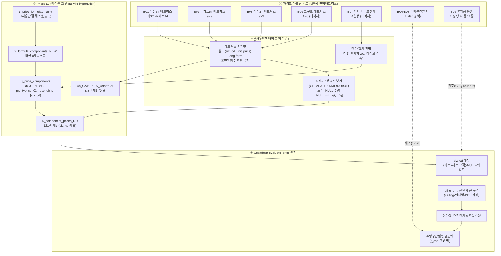
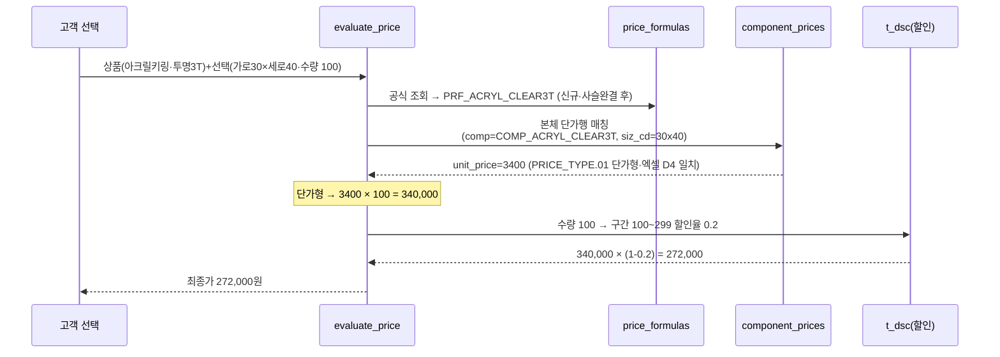
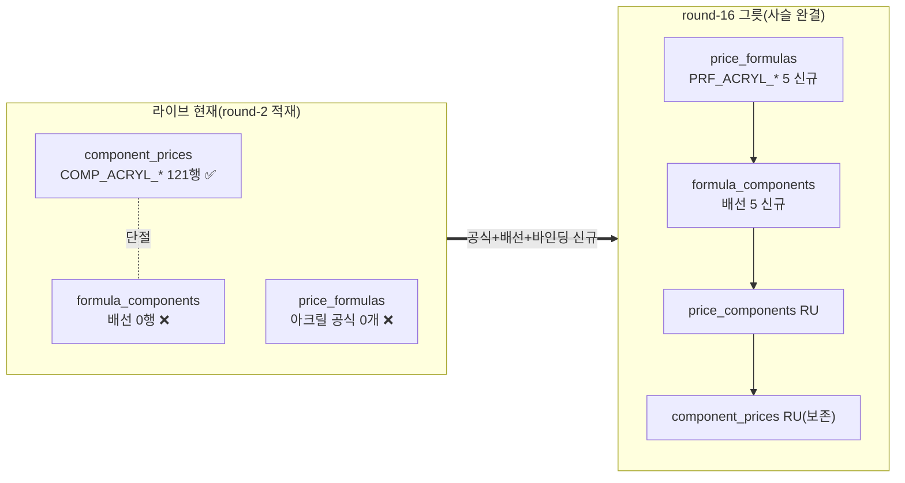

# 아크릴 가격표 → DB 매핑 절차 (acrylic-mapping-flow) — round-16 (면적매트릭스형)

> **작성** 2026-06-13 · round-16. 아크릴 시트(면적매트릭스·복합셀)를 webadmin Phase11 가격엔진 `t_prc_*` 4테이블 그릇으로 매핑하는 **절차 시각화**. 산출물 = `acrylic-import.xlsx`(11시트·RU 121행 재현 + GAP 96 + 코롯토 21 + 카라비너 4). **DB 미적재 — 절차/그릇 준비.** mermaid는 실제 분해 결과 반영(샘플 날조 금지).

---

## 1. 전체 매핑 절차 (flowchart) — 가격표 시트 → 그릇 → 엔진

---

## 2. 엔진 계산 흐름 (sequenceDiagram) — 면적매트릭스가 어떻게 쓰이나

off-grid 예시: 선택 25×25mm → 매트릭스 부재 → **ceiling 30×30(3100원)** 적용(런타임·DB 미저장).

---

## 3. 분해 매핑 표 (시트 블록 → 그릇 컬럼)

| 가격표 요소 | → 그릇 컬럼 | 변환 |
|------------|-----------|------|
| 매트릭스 제목 자재(투명3T/1.5T/미러) | `comp_cd`(별 구성요소) | CLEAR3T/CLEAR15T/MIRROR3T 분기(mat_cd 미사용) |
| 좌표 (가로 g, 세로 s) | `component_prices.siz_cd` | 가로×세로 규격코드(예 30x40→siz_cd) |
| 셀 단가 | `component_prices.unit_price` | numeric(개당 면적단가) |
| 제목 "양면9도/단면7도 통용" | `clr_cd=NULL` | 도수 무관(통용 단가) |
| (수량축 없음) | `min_qty=NULL` | 면적매트릭스 특성 |
| 후가공 추가단가(키링고리 등) | (컨펌 Q-ACR-1) | component 합산 vs CPQ add_price |
| 카라비너 형상(자물쇠/하트 등) | `opt_cd`(고정가) | 형상별 고정단가 |
| 수량구간할인(0~50%) | (제외·t_dsc) | round-1 영역 |

---

## 4. webadmin 복붙 사용법 (실무진용)

`acrylic-import.xlsx`는 11시트. 각 시트:
- **1행 = 빨강 안내(note)** — 시트 성격(_RU 재현 / _NEW 신규 / _GAP 미적재 / 제외·참조)
- **2행 = DB 컬럼명**(영문·파랑) — 복붙 타깃과 정확히 일치
- **3행 = 한국어 설명**(연파랑) — 복붙 시 제외
- **4행~ = 데이터** — 이 범위를 복사해 DB/적재 도구에 붙여넣기

적재 순서(FK·사슬완결): `1_price_formulas_NEW` → `2_formula_components_NEW` → `3_price_components` → `4_component_prices` → `1b_바인딩`.

**색 범례**:
- 🟩 초록(_RU) = 라이브 기존 121행 재현(**재적재 금지**·대조용)
- 🟨 노랑(_NEW) = 코롯토/카라비너/공식 신규 후보(컨펌 후 적재)
- 🟧 주황(_GAP/제외/참조) = siz 미채번·t_dsc·CPQ 영역(별 트랙)

---

## 5. 🔴 가격사슬 단절 해소 (이 시트의 결정적 발견)

> 라이브는 아크릴 단가행만 있고 **공식·배선이 없어 엔진이 가격을 조회할 수 없는 상태**(가격사슬 단절·메모리 [[dbmap-price-chain-dwire-per-product-formula]]). round-16 그릇이 공식 정의/배선/상품바인딩을 신규 제안해 사슬을 완결한다. **단가행은 재현만(재적재 금지)**.

---

## 6. 한 줄 현황

아크릴 매핑 절차 mermaid(flowchart 시트→분해→그릇→엔진 + sequence 면적매트릭스 계산흐름 + 가격사슬 단절 해소 diagram) + 분해 매핑 표 + 복붙 사용법 완료. 그릇 `acrylic-import.xlsx` 11시트(RU 121·GAP 96·코롯토 21·카라비너 4). **다음 = validator P1~P6 독립검증.**
