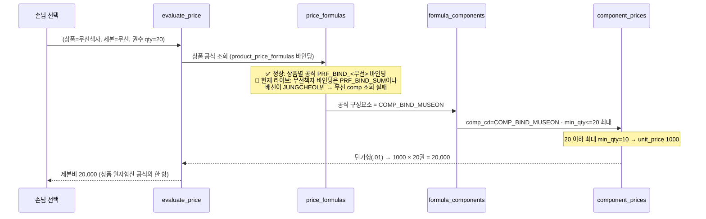
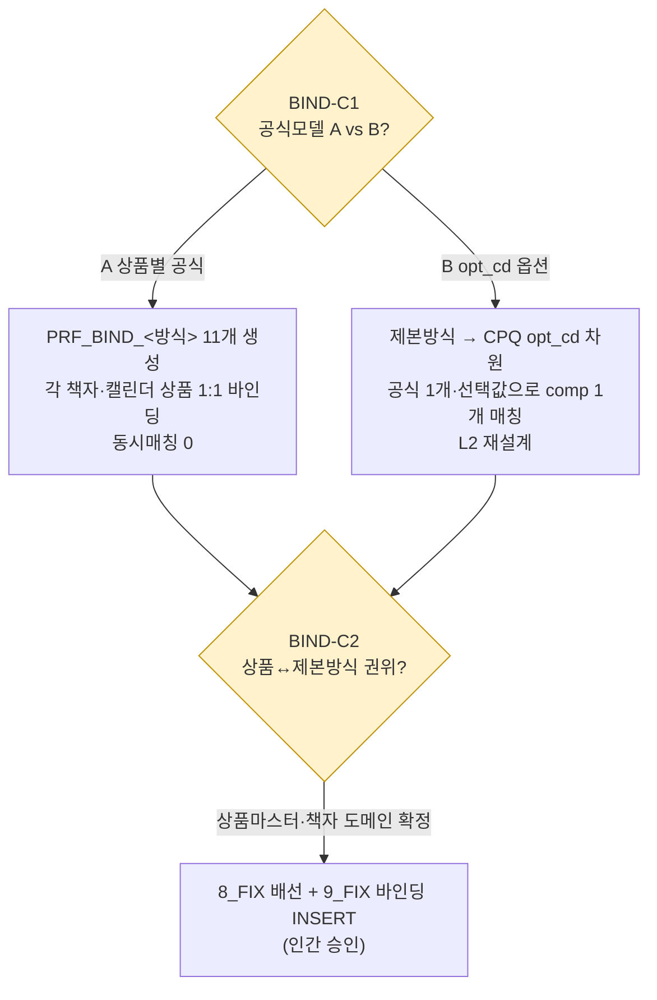

# 제본 매핑 절차 (binding-mapping-flow) — round-16

> **작성** 2026-06-13 · round-16. 가격표 `제본` 시트 → Phase11 가격엔진 `t_prc_*` 4테이블 그릇 → `evaluate_price` 흐름. 노드 라벨 = 실제 comp_cd·use_dims·단절 위치(샘플 날조 0).

---

## 1. flowchart — 시트 블록 → 그릇 → 엔진

```mermaid
flowchart LR
  subgraph SHEET["제본 시트 (232×25, 데이터=rows 1~32)"]
    B1["B1 제본비<br/>중철·무선·트윈링·PUR × 8수량구간<br/>32셀"]
    B2["B2 하드커버 제본비<br/>HC무선·HC트윈링·싸바리 × 6구간<br/>18셀 · 표지비 따로"]
    B3["B3 캘린더 제본비<br/>벽걸이·탁상220·130·미니 × 6구간<br/>24셀 · 삼각대 포함"]
  end

  subgraph DIM["제본방식 차원 = comp_cd 분리 (proc_cd 아님)"]
    direction TB
    D1["11 제본방식 → 11 COMP_BIND_*<br/>use_dims=[min_qty] · proc_cd=NULL"]
  end

  subgraph GRID["t_prc_* 4테이블 그릇 (라이브 기존 적재·RU)"]
    F["price_formulas<br/>PRF_BIND_SUM (1)<br/>합산형"]
    BIND["product_price_formulas<br/>책자4종만 (4)<br/>🔴 단절2"]
    FC["formula_components<br/>JUNGCHEOL만 (1)<br/>🔴 단절1"]
    PC["price_components<br/>11종 · 전건 .01 단가형"]
    CP["component_prices<br/>74행 · use_dims=[min_qty]"]
  end

  B1 --> D1
  B2 --> D1
  B3 --> D1
  D1 -->|언피벗 (제본방식,min_qty,단가)| CP
  F --> BIND
  F --> FC
  FC -.->|🔴 10/11 미배선| PC
  PC --> CP

  classDef brk fill:#FCE4D6,stroke:#C00000;
  class BIND,FC brk;
```

- **핵심 시각화**: `D1`(제본방식 차원)이 `proc_cd`가 아니라 **comp_cd 분리**로 그릇에 들어감. `FC`(배선)에서 11종 중 1종만 연결 = 🔴 단절1, `BIND`(바인딩)가 책자4종만 = 🔴 단절2.

## 2. sequenceDiagram — evaluate_price 계산 흐름 (정상 모델 가정)



- **합가형 환산 없음** — 전건 단가형(.01). `unit_price × 권수` 직접.
- **🔴 현재 라이브로 실행하면**: 무선책자 선택 시 배선에 MUSEON이 없어 제본비 조회 실패 또는 0. → 단절1·2 교정(`8_FIX`/`9_FIX`) + 공식모델 컨펌(BIND-C1) 후 정상.

## 3. 단절 교정 절차 (인간 승인·컨펌 선결)



- **⚠️ `8_FIX`를 PRF_BIND_SUM 1개에 그대로 INSERT 금지** — 11 comp 합산 = 동시매칭 오류. 반드시 (A) 상품별 공식 또는 (B) opt_cd 선택 모델 확정 후 frm_cd 채워 INSERT.

---

## 4. 그릇 → webadmin 복붙 매핑

| 그릇 엑셀 시트 | 라이브 테이블 | 행수 | 복붙 시 |
|---------------|--------------|------|---------|
| `1_price_formulas_RU` | t_prc_price_formulas | 1 | 기존(재현)·대조용 |
| `1b_product_price_formulas_RU` | t_prd_product_price_formulas | 4 | 기존(단절2 상태) |
| `2_formula_components_RU` | t_prc_formula_components | 1 | 기존(단절1 상태) |
| `3_price_components_RU` | t_prc_price_components | 11 | 기존(재현) |
| `4_component_prices_RU` | t_prc_component_prices | 74 | 기존(무손실 원천) |
| `8_FIX_wiring_chain` | t_prc_formula_components | +10 | 🔴 교정 후보·컨펌 선결 |
| `9_FIX_binding_chain` | t_prd_product_price_formulas | +5? | 🔴 교정 후보·추정·컨펌 선결 |
