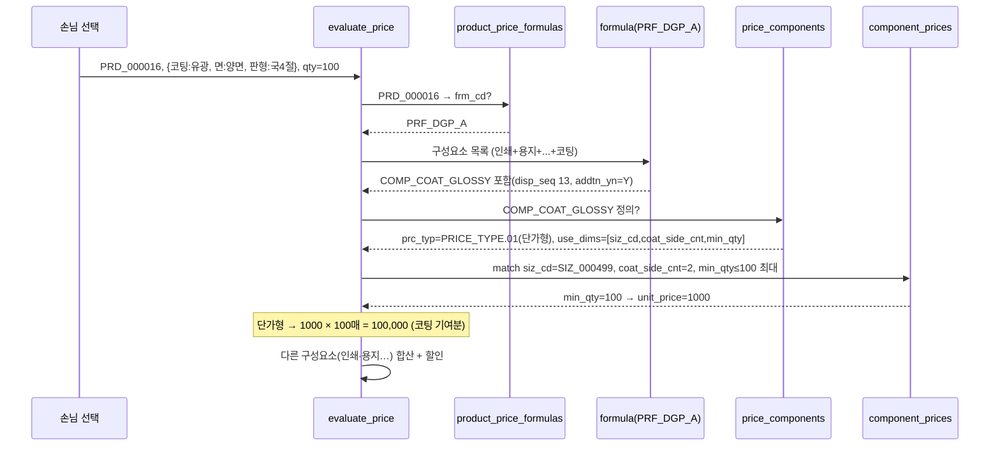
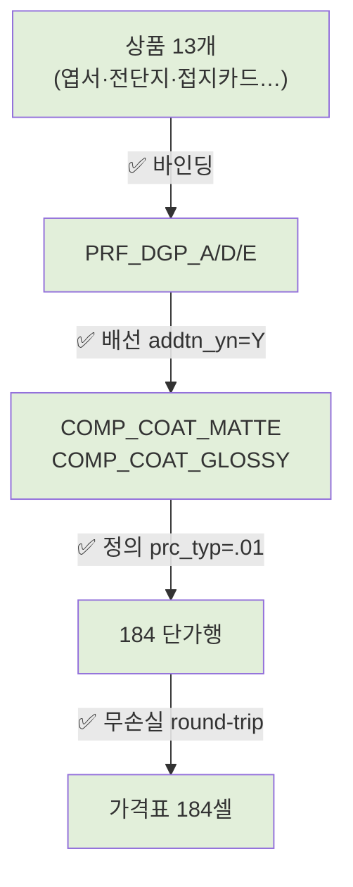

# 코팅 매핑 절차 (coating-mapping-flow) — round-16

> mermaid 시각화. 가격표 시트 → t_prc_* 4테이블 그릇 → 엔진 계산. **실제 분해 결과 반영**(라이브 실측 comp_cd·use_dims·siz_cd 표기). **DB 미적재.**

---

## 1. flowchart — 가격표 블록 → 그릇 → 엔진

```mermaid
flowchart LR
  subgraph 가격표["코팅 시트 (밴드 단가표 2블록)"]
    B01["B01 코팅(국4절)<br/>수량23 × 무광/유광 × 단/양면<br/>92셀"]
    B02["B02 코팅(3절)<br/>수량23 × 무광/유광 × 단/양면<br/>92셀"]
  end

  subgraph 그릇["t_prc_* 4테이블 (라이브 실재)"]
    PPF["t_prd_product_price_formulas<br/>13상품 → PRF_DGP_A/D/E"]
    F["t_prc_price_formulas<br/>PRF_DGP_A·D·E (합산)"]
    FC["t_prc_formula_components<br/>+COMP_COAT_MATTE/GLOSSY<br/>addtn_yn=Y"]
    PC["t_prc_price_components<br/>COMP_COAT_MATTE / COMP_COAT_GLOSSY<br/>prc_typ=PRICE_TYPE.01 단가형<br/>use_dims=[siz_cd,coat_side_cnt,min_qty]"]
    CP["t_prc_component_prices<br/>184행 (10차원·7 NULL)"]
  end

  B01 -->|무광 → COMP_COAT_MATTE<br/>siz_cd=SIZ_000499| CP
  B01 -->|유광 → COMP_COAT_GLOSSY<br/>siz_cd=SIZ_000499| CP
  B02 -->|무광 → COMP_COAT_MATTE<br/>siz_cd=SIZ_000077| CP
  B02 -->|유광 → COMP_COAT_GLOSSY<br/>siz_cd=SIZ_000077| CP
  B01 -.단/양면.->|coat_side_cnt=1/2| CP
  B01 -.수량.->|min_qty 23구간| CP

  PPF --> F --> FC --> PC --> CP
```

> 차원 매핑 요약: 코팅종류→`comp_cd` · 인쇄면→`coat_side_cnt` · 출력판형→`siz_cd` · 수량→`min_qty`. (clr/mat/proc/opt/bdl = NULL)

---

## 2. sequenceDiagram — evaluate_price 코팅 계산 흐름

예: 상품 PRD_000016(엽서·PRF_DGP_A 바인딩), 손님이 **유광 양면 코팅 + 국4절 + 100매** 선택.



> **round-trip 확인:** 가격표 국4절 유광 양면 100매 = 1000원/매(행13 D열). 라이브 SIZ_000499 glossy side2 min_qty=100 = 1000 ✅. 엔진 손계산 일치.

---

## 3. 가격사슬 상태 (한눈에)



→ **전 구간 연결(초록)**. 코팅은 아크릴 트랙의 가격사슬 단절과 달리 끝까지 살아있는 정상 사슬.
