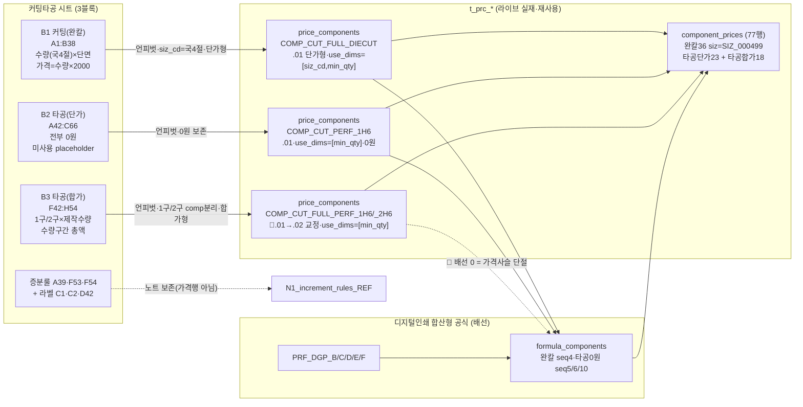
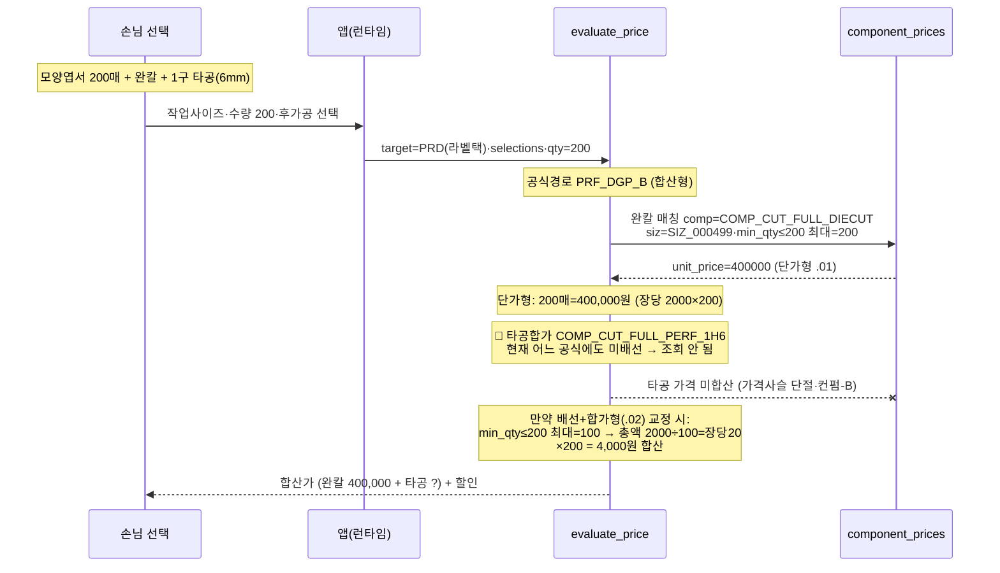
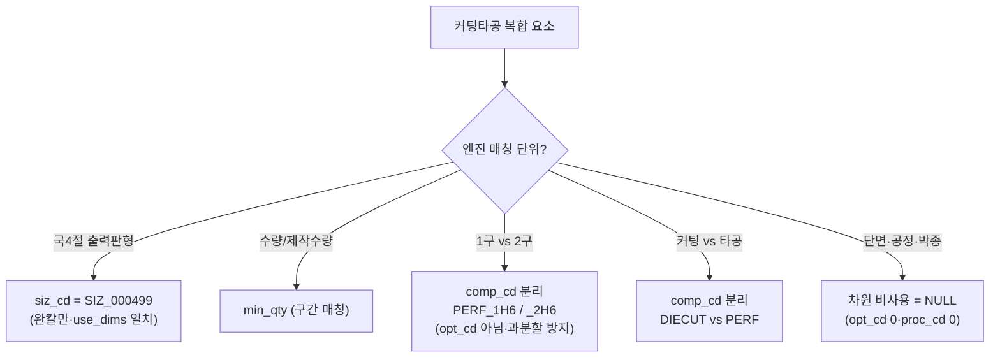

# 커팅타공 → t_prc_* 매핑 절차 mermaid — round-16

> 실제 분해 결과 반영(샘플 날조 0). 노드 라벨 = 실제 comp_cd·use_dims·siz_cd.

## 1. 분해 flowchart — 가격표 블록 → 그릇 → 엔진

## 2. evaluate_price 계산 흐름 (sequence) — 완칼 + 타공 예시

## 3. 차원 매핑 핵심 (엔진 매칭 규칙 §2)

## 4. 그릇 권위 메모

- price_formulas 라이브 컬럼 = `frm_cd·frm_nm·note·use_yn·reg_dt·upd_dt` (frm_typ_cd·prd_cd **부존재** — 개념설계와 다름).
- component_prices 10차원 = `comp_cd·siz_cd·clr_cd·mat_cd·proc_cd·coat_side_cnt·opt_cd·bdl_qty·min_qty·apply_ymd` + unit_price.
- 커팅타공은 **proc_cd·opt_cd 둘 다 NULL**(라이브 0행 유지) — 1구/2구는 comp 분리, 완칼/타공 공정도 comp 분리로 처리.
- 🔴 **가격사슬 단절** = 타공합가 18행 적재됨 + 배선 0(아크릴 시트 동형 결함).
