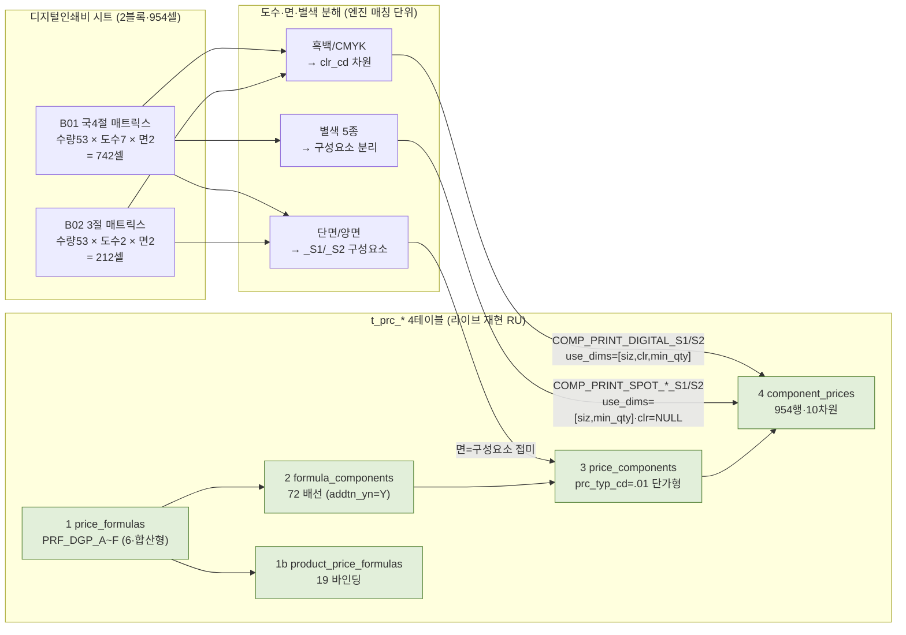
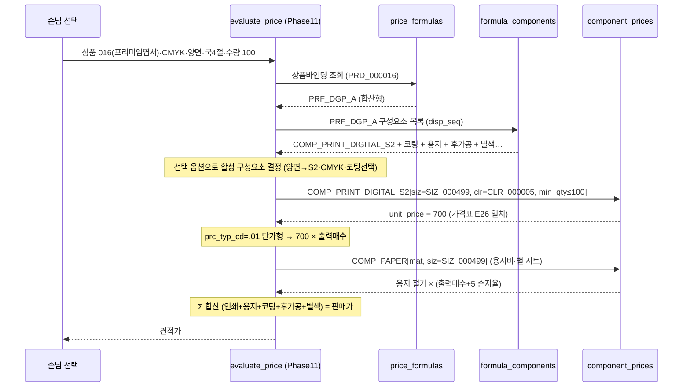
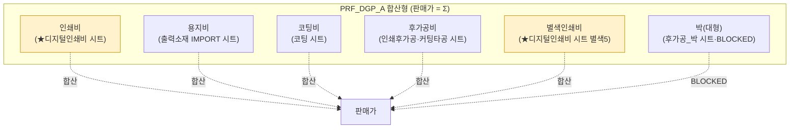

# 디지털인쇄비 매핑 절차 (digital-print-mapping-flow) — round-16

> **작성** 2026-06-13 · round-16. 가격표 `디지털인쇄비` 시트 → Phase11 가격엔진 그릇 → `evaluate_price` 흐름. **mermaid는 실제 분해 결과 반영(샘플 날조 금지·라이브 실측 comp_cd/use_dims 표기).** DB 미적재.

---

## 1. flowchart — 가격표 블록 → 그릇 (합산형)

**핵심**: 디지털인쇄비 시트 = 합산형 공식의 **인쇄비 부품**만 공급. 용지비(COMP_PAPER)·코팅(COMP_COAT_*)·후가공(COMP_PP_*) 등은 별 시트/트랙이 같은 공식에 합산됨(아래 §3).

---

## 2. sequenceDiagram — evaluate_price 계산 흐름 (CMYK 양면 국4절 100매)

- **출력매수 = 주문수량 ÷ 판걸이수**(앱 런타임·DB 미저장). **손지율 +5장**(앱). DB는 [수량행단가] lookup만([[dbmap-compute-in-app-db-stores-lookup]]).
- **min_qty 매칭**: 주문수량 100 → min_qty 100 행(상향구간 매칭). 동시매칭 0(자연키 유일).

---

## 3. 디지털인쇄비 위치 (합산형 공식 안에서) — 시트 경계

> **★ 표시 = 이 round-16 디지털인쇄비 시트 산출 범위**(인쇄비 + 별색인쇄비). 노란색 외 부품(용지·코팅·후가공·박)은 별 시트 산출이 같은 합산형 공식에 합쳐진다. 디지털인쇄비 시트 단독으로는 견적이 안 나오고, 6공식이 부품들을 Σ해야 완성.

---

## 4. 한 줄 현황

매핑 절차 mermaid 3종 완성 — ① 블록→그릇 flowchart(흑백CMYK=차원·별색=구성요소·단양면=_S1_S2) ② evaluate_price sequence(CMYK양면100매·인쇄비700 일치) ③ 합산형 공식 내 시트 경계(인쇄비+별색만 이 시트·용지/코팅/후가공은 별 시트). 라이브 실측 comp_cd·use_dims 반영(날조 0).
