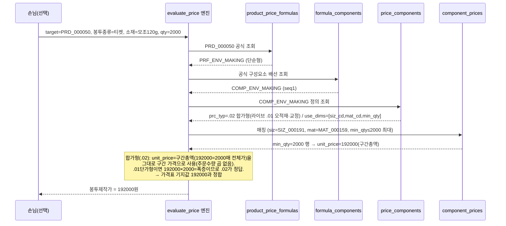

# 봉투제작 매핑 절차 (envelope-mapping-flow) — round-16

> **작성** 2026-06-13 · round-16. 가격표 `봉투제작` 시트 → Phase11 가격엔진 `t_prc_*` 4테이블 그릇 → `evaluate_price` 흐름. **mermaid는 실제 분해 결과 반영(라이브 실측·날조 0). DB 미적재.**

---

## 1. flowchart — 가격표 블록 → 그릇 분해

```mermaid
flowchart LR
  subgraph PT["가격표 봉투제작 시트 (8×9·1블록)"]
    M["B01 MATRIX 단가표<br/>봉투종류4 × 소재2 × 수량5<br/>= 40 데이터셀"]
    CX["복합셀 C3계열<br/>'레자크체크 / 레자크줄무늬'<br/>(2소재 동일가)"]
    NOTE["A1 타이틀 '봉투제작'<br/>(부유·note 보존)"]
  end

  subgraph G["t_prc_* 4테이블 그릇 (라이브 RU·단절 0)"]
    F["t_prc_price_formulas<br/>PRF_ENV_MAKING<br/>(단순형·구성요소1)"]
    B["t_prd_product_price_formulas<br/>PRD_000050 봉투제작<br/>(상품바인딩·별테이블)"]
    FC["t_prc_formula_components<br/>PRF_ENV_MAKING→COMP_ENV_MAKING<br/>(배선 seq1)"]
    PC["t_prc_price_components<br/>COMP_ENV_MAKING<br/>prc_typ=.02 합가형(라이브 .01 오적재·교정) / use_dims=[siz,mat,min_qty]"]
    CP["t_prc_component_prices<br/>40행 (자연키 8차원 + comp_cd + apply_ymd)<br/>siz_cd·mat_cd·min_qty만 값·나머지 NULL"]
    FIX["4b_FIX 레자크줄무늬<br/>MAT_000169 20행 (🟠 미적재·컨펌 선결)"]
  end

  M -->|봉투종류 4 → siz_cd 191~194| CP
  M -->|소재 2 → mat_cd 159·168| CP
  M -->|수량 5 → min_qty 1000~5000| CP
  CX -->|체크168 적재| CP
  CX -->|줄무늬169 누락 collapse| FIX
  NOTE -.note 보존.-> F

  B --> F --> FC --> PC --> CP
```

**핵심 분해**:
- 봉투종류(티켓/소/자켓/대) → `siz_cd`(SIZ_000191~194) — opt_cd/별상품 아님(라이브 모델).
- 소재(모조120g·레자크체크·레자크줄무늬) → `mat_cd`(159·168·169) — "/" 복합셀 개별 분해(스티커 교훈).
- 수량(1000~5000) → `min_qty` 5구간.
- 안 쓰는 차원(clr_cd·coat_side_cnt·bdl_qty·proc_cd·opt_cd) = **NULL 와일드카드**(과분할 0).

---

## 2. sequenceDiagram — evaluate_price 계산 흐름 (그릇 검증)

**손계산 검증(P6용)**: 티켓봉투·모조120g·2000매 → 가격표 B5 = **192,000원**. 라이브 단가행 (SIZ_000191, MAT_000159, min_qty=2000) unit_price = **192,000** 일치. **합가형(.02)** 으로 구간총액=구간가 그대로 192,000원 정합(단가형 .01이면 폭증). prc_typ 평결 = .02 종결.

---

## 3. 다른 시트와의 패턴 비교

| 시트 | 봉투종류/주축 차원 | 단가/합가 | 가격사슬 | 비고 |
|------|-------------------|----------|---------|------|
| 스티커 | opt_cd·coat_side_cnt + 소재 mat_cd | .01 | (소재 개별분해 보정) | "/" 복합셀 분해 권위 |
| 박(소형) | opt_cd(등급) | .01 | — | 등급 차원 |
| 제본 | comp_cd 분리(11종) | .01 | 🔴 단절2(배선1/11·바인딩4) | proc_cd 미사용 |
| 아크릴 | 면적매트릭스(siz) | .01 | 🔴 단절(배선0) | 가격사슬 끊김 |
| **봉투제작** | **siz_cd(봉투종류) + mat_cd** | **.02 합가형(라이브 .01 오적재·교정)** | **🟢 완전 정합** | **유일 완전체·세트형 부재 결론** |

봉투제작이 round-16에서 유일하게 그릇이 엔진에서 즉시 작동하는 완전체(사슬 단절 0). prc_typ 평결 = **.02 합가형 종결**(라이브 .01 오적재 → 그릇 교정 반영). 잔여 = 복합셀 줄무늬 누락(부분·ENV-C1)·prc_typ 실 교정 적재(인간 승인)·siz_nm 라벨(ENV-C2).
