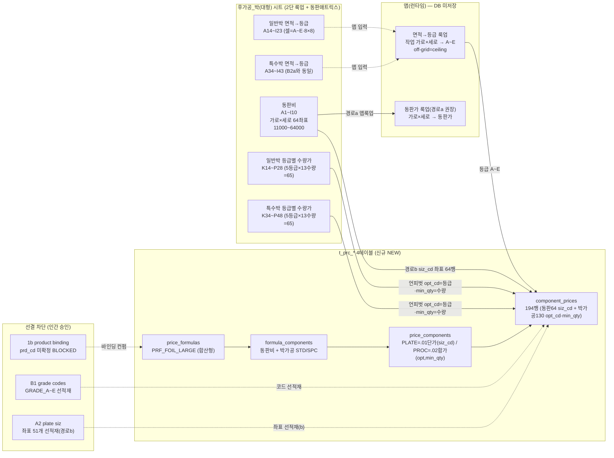
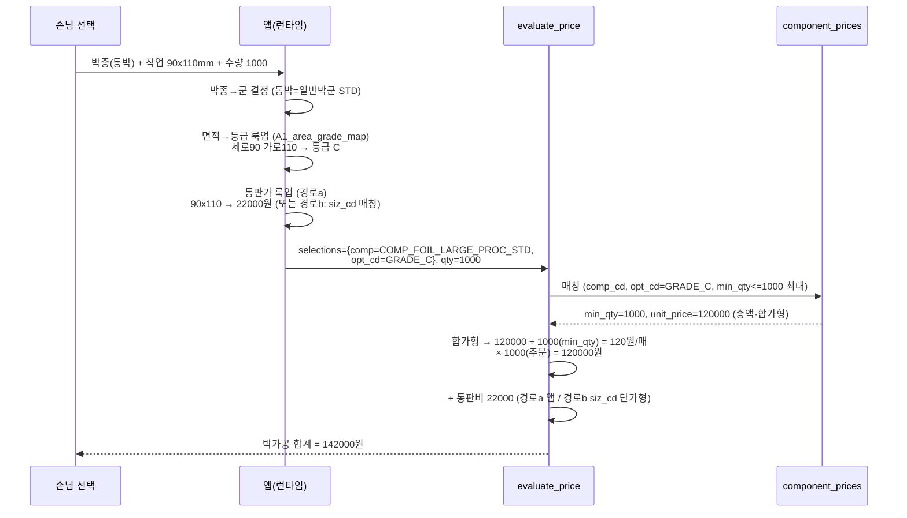

# 후가공_박(대형) → t_prc_* 매핑 절차 (mermaid)

> 박대형 = **2단 룩업**(박소형 동형) + **동판비 면적매트릭스**(박소형과 다름).
> 1단(면적→등급)=앱, 2단(등급×수량→총액)=DB. 동판비=좌표 직접단가(siz_cd 또는 앱).

## 1. 가격표 블록 → 그릇 분해 (flowchart)



## 2. 엔진 계산 흐름 (sequenceDiagram) — evaluate_price



> [주의 1] 합가형(.02) 환산은 명함박 라이브가 .01로 등록된 것과 충돌 — prc_typ_cd 최종 확정은 P4 컨펌 후.
> [주의 2] 위 시뮬은 가격표 기지값(일반박 GRADE_C 1000매=120,000 총액·동판 90x110=22,000)을 합가형 규칙으로 검산한 것.

## 3. 무손실 round-trip

- 동판 64셀(8×8 면적매트릭스) → 64행 ✅
- 일반박 65셀(5등급×13수량) → 65행 ✅
- 특수박 65셀 → 65행 ✅
- **합계 194 = 194** ✅ (자연키 중복 0 검산 완료)
- 면적→등급 128셀(64×2 일반/특수 동일) → A1_area_grade_map_REF 64행 공통 보존(가격 그릇 외) ✅
- 동판 미등록 좌표 51개 → A2_plate_siz_proposal 51행 보존(경로b 선적재) ✅
```
