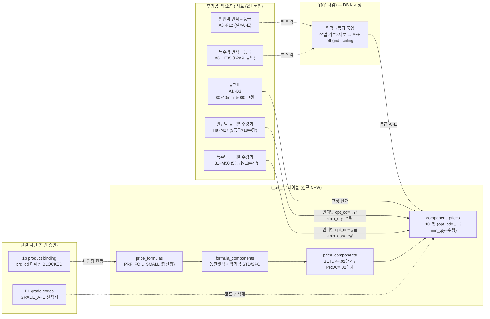
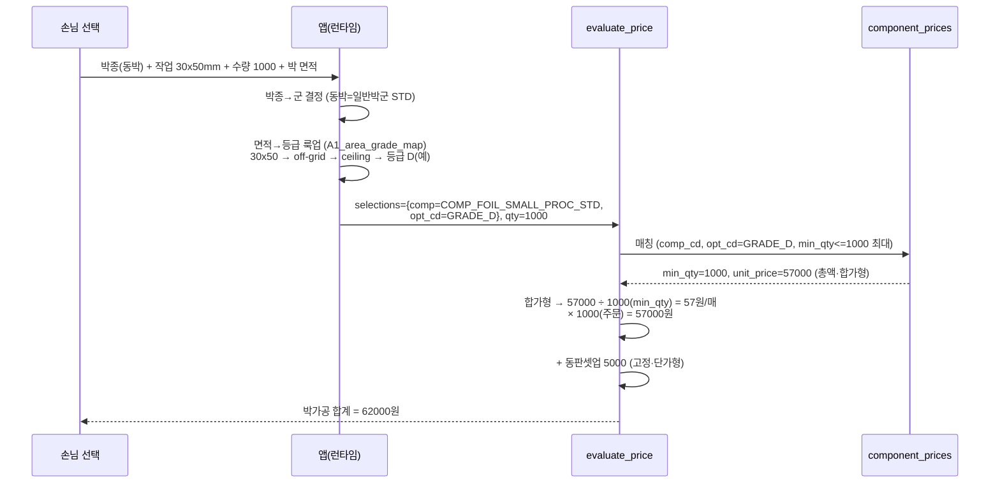

# 후가공_박(소형) → t_prc_* 매핑 절차 (mermaid)

> 박 = **2단 룩업** 구조. 1단(면적→등급)은 앱, 2단(등급×수량→총액)은 DB.

## 1. 가격표 블록 → 그릇 분해 (flowchart)

## 2. 엔진 계산 흐름 (sequenceDiagram) — evaluate_price

> [주의] 합가형(.02) 환산은 명함박 라이브가 .01로 등록된 것과 충돌 — prc_typ_cd 최종 확정은 P4 컨펌 후.
> 위 시뮬은 가격표 기지값(GRADE_D 1000매=57,000 총액)을 합가형 규칙으로 검산한 것.

## 3. 무손실 round-trip

- 동판 1셀(5000) → 1행 ✅
- 일반박 90셀(5등급×18수량) → 90행 ✅
- 특수박 90셀 → 90행 ✅
- **합계 181 = 181** ✅
- 면적→등급 28셀 → A1_area_grade_map_REF 별 시트 보존(가격 그릇 외) ✅
