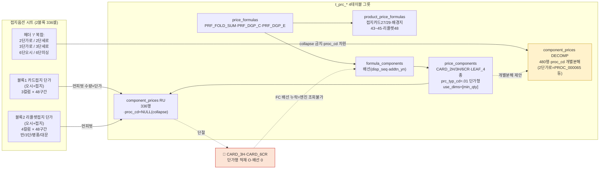
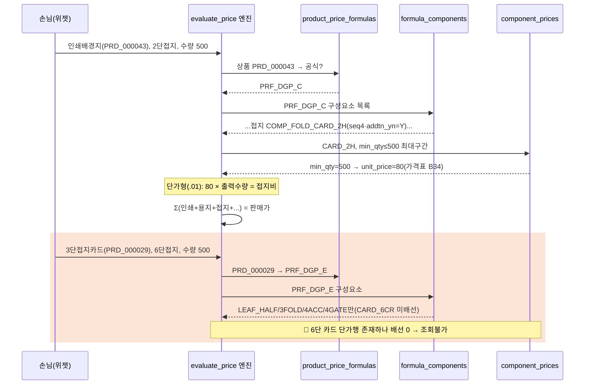

# 접지옵션 매핑 절차 (folding-mapping-flow) — round-16

> **작성** 2026-06-13 · round-16. 가격표 `접지옵션` 시트 → Phase11 가격엔진 4테이블 그릇 → `evaluate_price` 흐름. 노드 라벨에 실제 comp_cd·proc_cd·use_dims 표기(샘플 날조 금지). **DB 미적재.**

---

## 1. flowchart — 가격표 블록 → 분해 → t_prc_* 그릇

- **핵심**: 가격표 단가컬럼 → `component_prices`. 헤더 "/" 개별 접지옵션은 RU(collapse·proc_cd NULL)와 DECOMP(proc_cd 명시) 두 그릇으로 병기(택1 컨펌 Q-FOLD-1).
- **🔴 단절**: CARD_3H·CARD_6CR은 단가행 있으나 `formula_components` 배선 0 → 카드 3/6단 접지 엔진 조회불가.

---

## 2. sequenceDiagram — evaluate_price 계산 흐름 (RU 경로)

- **단가형 환산**: 셀=장당가 → `unit_price × 주문수량`(합가형 환산 없음).
- **단절 시나리오**(빨강): 카드 6단 선택 시 PRF_DGP_E에 CARD_6CR 미배선이라 엔진이 접지비 0 또는 누락.

---

## 3. 한 줄 현황

접지옵션 매핑 절차 = 가격표 2블록 336셀 → `component_prices`(RU collapse 336 / DECOMP proc_cd 480) → `price_components`(단가형·[min_qty]) → `formula_components` 배선 → `price_formulas`(FOLD_SUM·DGP_C·DGP_E) ← `product_price_formulas` 바인딩. **🔴 CARD_3H/6CR 배선 단절** 시각화. evaluate_price = 단가형 곱셈 합산.
