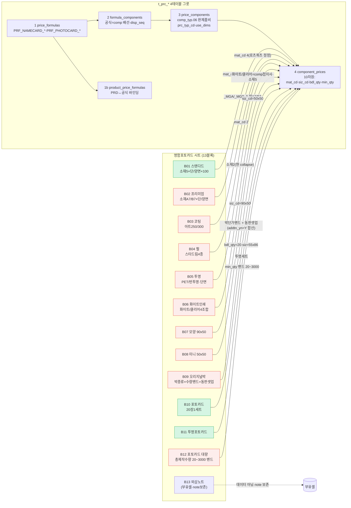
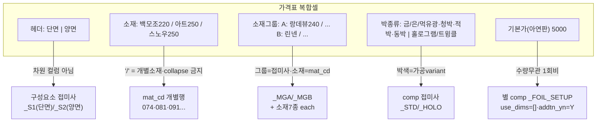
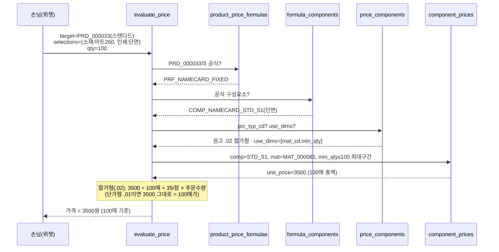
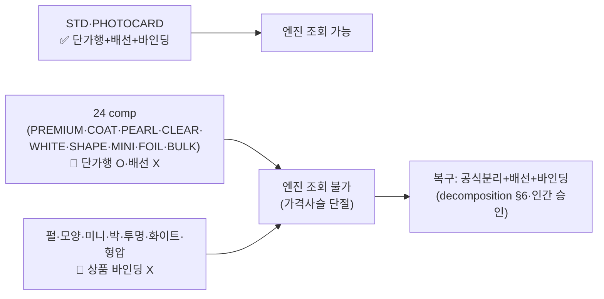

# 명함포토카드 매핑 절차 (namecard-photocard-mapping-flow) — round-16

> **작성** 2026-06-13 · round-16. 가격표 시트 → Phase11 가격엔진 `t_prc_*` 4테이블 그릇 → `evaluate_price` 계산 흐름. mermaid는 실제 분해 결과 반영(라이브 실측 comp_cd·use_dims). **DB 미적재.**

---

## 1. flowchart — 가격표 13블록 → 그릇 4테이블

> 🟢 = 가격사슬 완결(배선+바인딩). 🔴 = **단가행 적재됐으나 미배선/미바인딩**(24 고아 comp·7 미바인딩 상품 — `decomposition §4`).

---

## 2. 인쇄면·소재 분해 매핑 (복합셀 → 차원)

---

## 3. sequenceDiagram — evaluate_price 계산 (B01 스탠다드 예·합가형 가정)

> 🔴 **현행 라이브 결함**: ① STD만 배선이라 PRD_000031(프리미엄)을 골라도 `FC`가 STD_S1 반환 → 스탠다드 단가 오출. ② prc_typ=.01이면 합가형 환산 미발동(decomposition §2 Q-NC-1).

---

## 4. 가격사슬 상태 한눈에

---

## 5. 한 줄 현황

매핑 절차 시각화 완료 — flowchart(13블록→4테이블·🟢3완결/🔴9단절)·복합셀 분해(단/양면=접미사·소재=mat_cd 개별·박색=variant·셋업=별comp)·evaluate_price 시퀀스(합가형 환산·오매칭 경고)·가격사슬 상태도. **다음 = validator P1~P6.**
