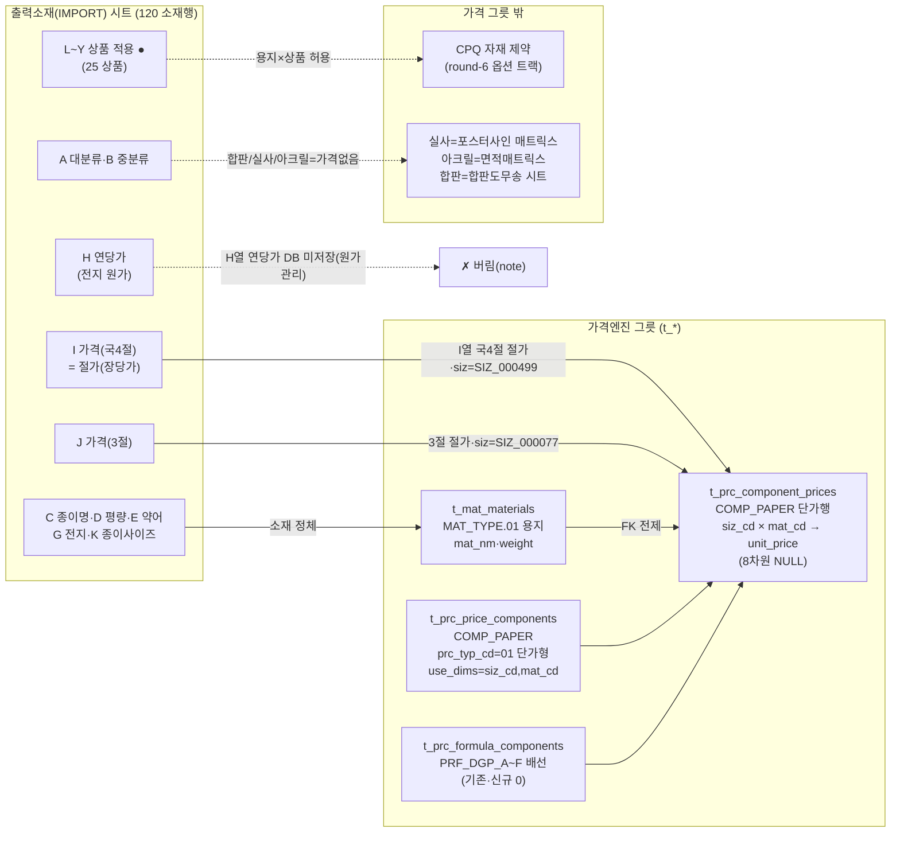
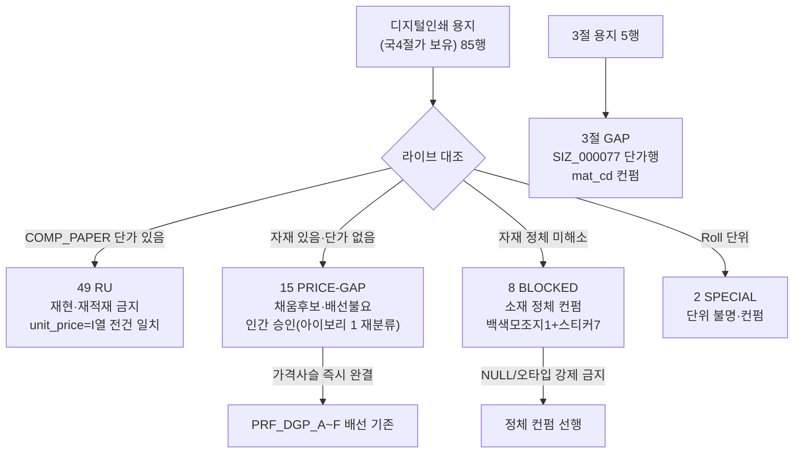
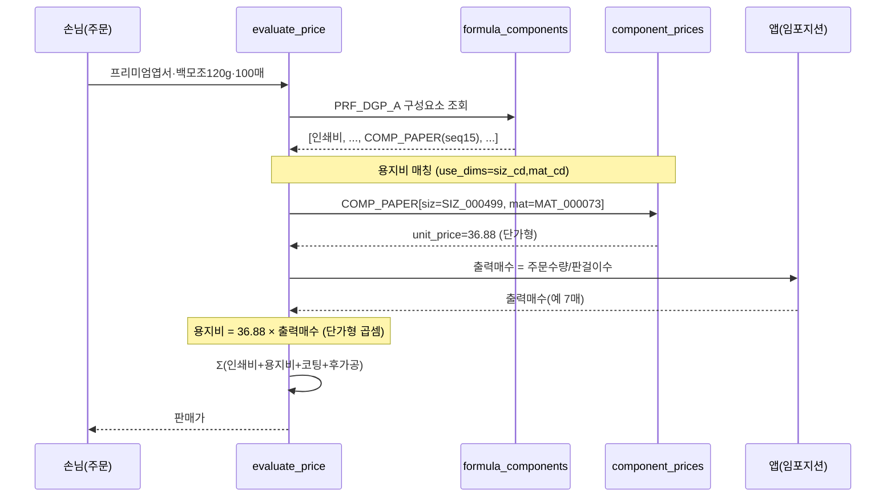

# 출력소재(IMPORT) → 가격엔진 그릇 매핑 절차 (paper-import-mapping-flow) — round-16

> **작성** 2026-06-13 · round-16. 입력 = `paper-import-decomposition.md` + 라이브 실측. mermaid는 **실제 분해 결과 반영**(샘플 날조 금지·실제 comp_cd·use_dims 표기). **DB 미적재.**

---

## 1. flowchart — 시트 3목적 분기 → 가격 그릇(COMP_PAPER)

**핵심 분기**:
- **I 가격(국4절) → COMP_PAPER 단가행**(가격 그릇의 유일한 가격 입력·연당가는 H열). siz_cd=SIZ_000499.
- **J 가격(3절) → COMP_PAPER 단가행**, siz_cd=SIZ_000077(현재 GAP).
- **F 연당가 → 버림**(전지 원가관리용·국4절 환산가가 권위).
- **L~Y ● 매트릭스 → CPQ 자재 제약**(가격 그릇 아님·별 트랙).
- **합판/실사/아크릴 → 소재 마스터만**(가격은 각 트랙).

---

## 2. flowchart — RU / GAP / BLOCKED 상태 분기 (디지털 85 종이명행)

---

## 3. sequenceDiagram — evaluate_price에서 용지비가 쓰이는 흐름

> **검증 포인트**: 용지비 단가행은 **min_qty NULL**(수량구간 없음·절가 고정) → 어떤 수량이든 동일 절가 매칭. 동시매칭 0(같은 siz·mat 조합당 1행). 단가형이므로 `절가 × 출력매수`. 출력매수=앱 계산(DB 미저장).

---

## 4. 그릇 엑셀 시트 ↔ mermaid 노드 대응

| mermaid 노드 | 그릇 엑셀 시트 | 행수 |
|--------------|---------------|------|
| `t_prc_price_components COMP_PAPER` | `1_price_components_RU` | 1 (RU) |
| `t_prc_formula_components PRF_DGP_A~F` | `2_formula_components_RU` | 6 (RU·배선 정상) |
| `t_mat_materials 용지` | `3_materials_paper_RU` | 107 (RU) |
| `COMP_PAPER 단가행 RU` | `4_component_prices_RU` | 49 (RU·일치) |
| `15 PRICE-GAP` | `4b_component_prices_GAP` | 15 (채움후보·아이보리 1 재분류) |
| `3절 GAP` | `4c_component_prices_3jeol_GAP` | 5 (컨펌) |
| `8 BLOCKED` | `9_BLOCKED_material` | 8 (백색모조지1+스티커7·정체컨펌) |
| `2 Roll SPECIAL` | `9b_SPECIAL_roll` | 2 (컨펌) |

---

## 5. 한 줄 현황

매핑 절차 mermaid 완료 — flowchart 2종(시트 3목적 분기·RU/GAP/BLOCKED 상태) + sequenceDiagram(용지비가 PRF_DGP_A 합산에서 절가×출력매수로 쓰이는 흐름). 노드 라벨=실제 comp_cd(COMP_PAPER)·use_dims(siz_cd,mat_cd)·frm_cd(PRF_DGP_A~F). 가격사슬 정상(배선 기존·GAP 채우면 즉시 조회). **다음 = validator P1~P6.**
