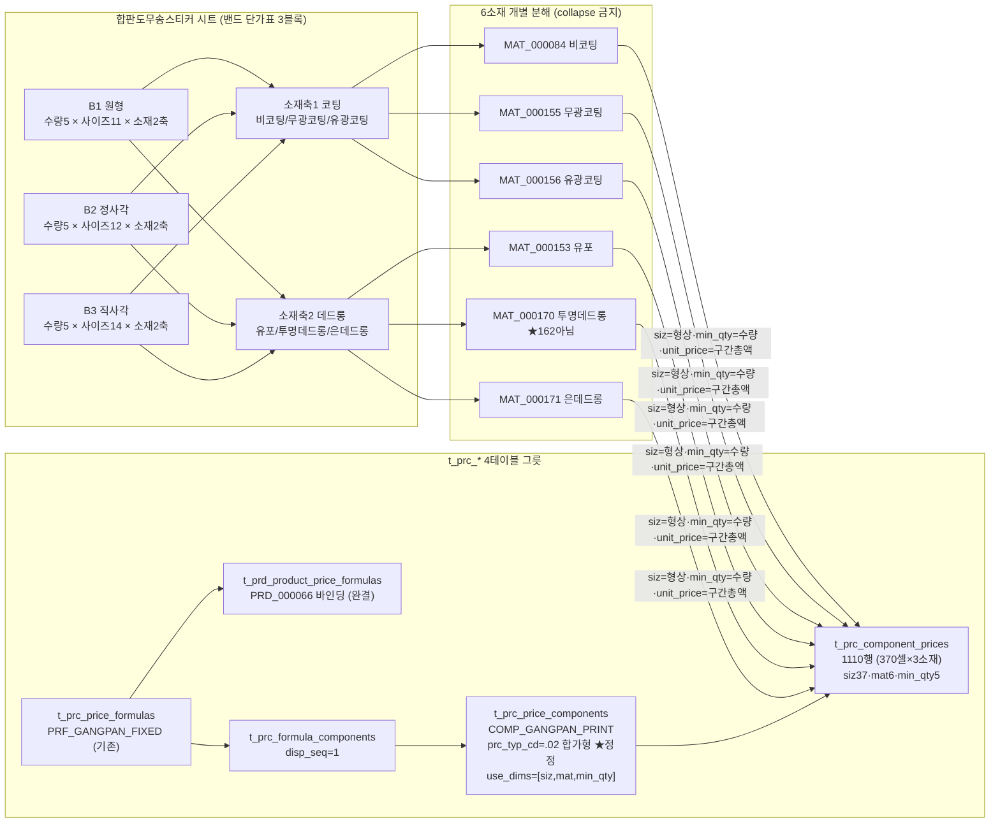
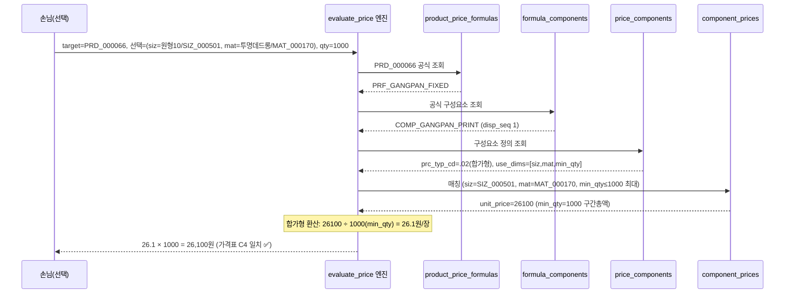

# 합판도무송스티커 매핑 절차 (plywood-domusong-mapping-flow) — round-16

> **작성** 2026-06-13 · round-16. 가격표 시트 → Phase11 가격엔진 4테이블 그릇 → `evaluate_price` 흐름을 mermaid로 시각화. 노드 라벨에 **실제 comp_cd·use_dims·prc_typ_cd** 표기(샘플 날조 금지). **DB 미적재.**

---

## 1. 분해 flowchart (가격표 블록 → 그릇 → 엔진)

**핵심 변환:**
- 형상헤더(원형/정사각/직사각 + mm) → `siz_cd`(37종·라이브 전부 등록·BLOCKED 0).
- 소재 2축 복합셀 → **6 개별 mat_cd**(한 컬럼 = 3소재 공유단가로 전개).
- 밴드 셀값 = 수량구간 총액 → `min_qty`(수량) + `unit_price`(총액) + **prc_typ_cd=.02 합가형**.
- 안 쓰는 차원(clr·proc·coat_side·opt·bdl) = **NULL 와일드카드**.

---

## 2. 엔진 계산 sequenceDiagram (evaluate_price)

> **합가형(.02) 동작 검증**: 셀값 26100은 "원형10·투명데드롱·1000매 총액". 단가형(.01)이면 `26100 × 1000 = 26,100,000원`(폭증). 합가형이라 `26100 ÷ 1000 × 1000 = 26,100원` 정확 → **라이브 .01 오적재가 가격 폭증 위험**(decomposition §2).

---

## 3. 그릇 시트 → 라이브 테이블 매핑표

| import.xlsx 시트 | 라이브 테이블 | 행수 | 비고 |
|------------------|--------------|------|------|
| `1_price_formulas` | t_prc_price_formulas | 1 | PRF_GANGPAN_FIXED 재현(신규 0) |
| `1b_product_price_formulas` | t_prd_product_price_formulas | 1 | PRD_000066 바인딩(완결·재현) |
| `2_formula_components` | t_prc_formula_components | 1 | 배선 재현 |
| `3_price_components` | t_prc_price_components | 1 | 🔴 prc_typ .01→.02 정정 |
| `4_component_prices` | t_prc_component_prices | **1110** | 🔴 라이브 370(collapse)→6소재 1110 분해 |

---

## 4. 한 줄 현황

매핑 절차 시각화 완료 — flowchart(소재 2축→6분해·합가형 정정)·sequenceDiagram(evaluate_price 합가형 환산 26100→26.1원/장 검증). 그릇 5시트→라이브 5테이블 매핑. **다음 = validator P1~P6.**
