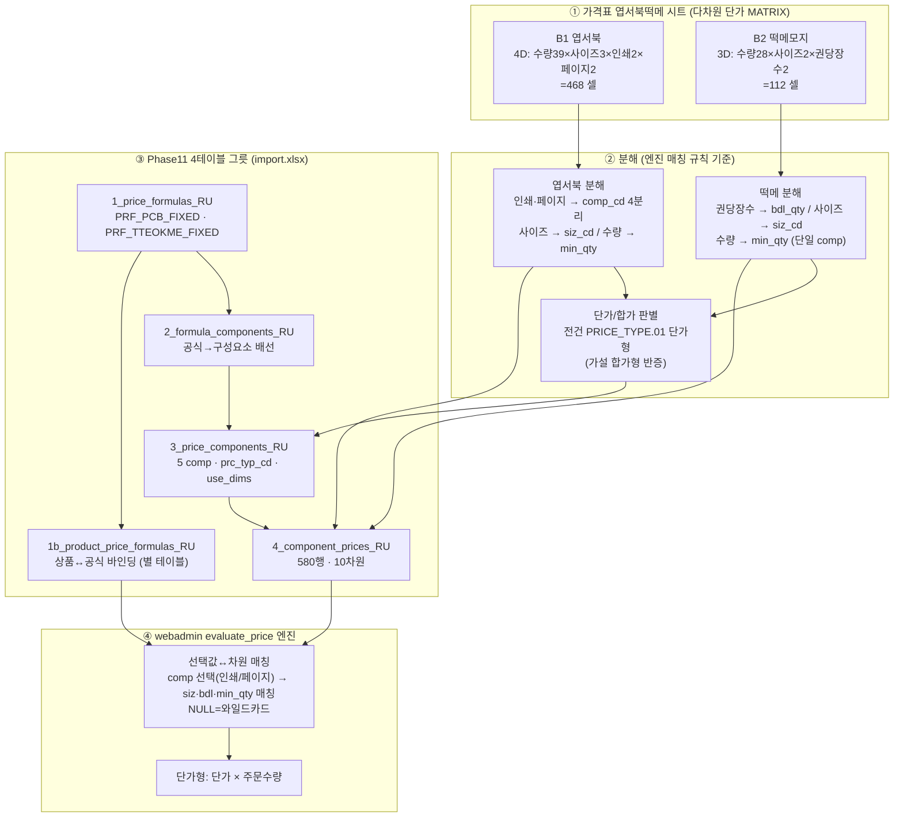
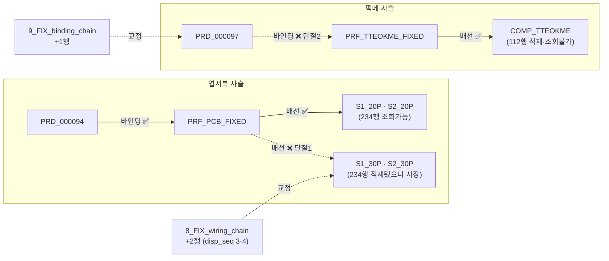
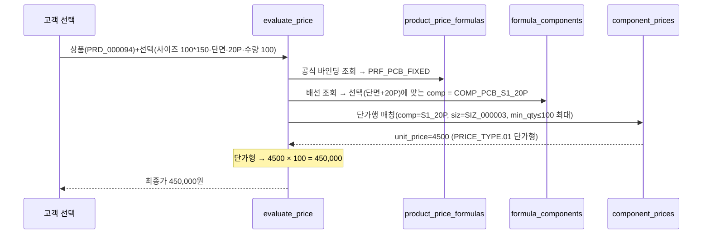

# 엽서북떡메 가격표 → DB 매핑 절차 (postcard-book-memo-mapping-flow) — round-16

> **작성** 2026-06-13 · round-16. 엽서북떡메 시트(다차원 단가 MATRIX)를 webadmin Phase11 가격엔진 `t_prc_*` 4테이블 그릇으로 매핑하는 **절차 시각화**. 산출 = `postcard-book-memo-import.xlsx`(580 단가행 재현 + 단절 교정 2시트). **DB 미적재 — 절차/그릇 준비.**

---

## 1. 전체 매핑 절차 (flowchart) — 가격표 시트 → 그릇 → 엔진

---

## 2. 🔴 가격사슬 단절 2건 (flowchart) — 그릇이 닫아야 할 끊김

- **단절1**: 30P 단가행 234행은 적재됐으나 `PRF_PCB_FIXED` 배선이 20P만 → 30P 선택 시 엔진이 구성요소를 못 찾음. → `8_FIX` 배선 2행으로 닫힘.
- **단절2**: 떡메 공식·구성요소·단가행 112행 다 있으나 상품 바인딩 0 → 엔진 진입 불가. → `9_FIX` 바인딩 1행으로 닫힘.

---

## 3. 엔진 계산 흐름 (sequenceDiagram) — 그릇이 어떻게 쓰이나

떡메(단가형·단절2 교정 후) 예시: 선택(90x90·100장1권·수량 60권) → `COMP_TTEOKME, siz=SIZ_000119, bdl_qty=100, min_qty≤60 최대(=60)` → `unit_price=1700 × 60 = 102,000원`.

---

## 4. 분해 매핑 표 (시트 요소 → 그릇 컬럼)

| 가격표 요소 | → 그릇 컬럼 | 변환 |
|------------|-----------|------|
| A열 수량 | `component_prices.min_qty` | 정수·상향구간 |
| 행2 사이즈(병합) | `component_prices.siz_cd` | 규격코드(100*150→SIZ_000003 등) |
| 행3 인쇄(단면/양면) | `comp_cd` 분기(S1/S2) | comp 식별로 흡수(차원 아님) |
| 행4 페이지(20P/30P) | `comp_cd` 분기(_20P/_30P) | comp 식별로 흡수 |
| 떡메 권당장수(50/100장) | `component_prices.bdl_qty` | 정수(권당 낱장수) |
| 셀 단가 | `component_prices.unit_price` | numeric·장당가(권당가) |

---

## 5. webadmin 복붙 사용법 (실무진용)

`postcard-book-memo-import.xlsx`는 시트별 = DB 테이블과 1:1. 각 시트:
- **1행 = [RU]/[FIX] 안내 노트**(빨강 이탤릭) — 복붙 시 제외
- **2행 = DB 컬럼명**(영문) — 복붙 타깃과 정확히 일치
- **3행 = 한국어 설명**(회색) — 복붙 시 제외
- **4행~ = 데이터** — 이 범위를 복사

적재 순서(FK): `1_price_formulas` → `1b_product_price_formulas` → `2_formula_components` → `3_price_components` → `4_component_prices`. **초록(_RU) 시트 = 라이브 기존 재현(재적재 금지·대조용)**. **주황(_FIX) 시트 = 가격사슬 단절 교정 제안(인간 승인 후 INSERT)** — 8_FIX(배선 2행)·9_FIX(바인딩 1행).

---

## 6. 한 줄 현황

엽서북떡메 매핑 절차 mermaid(flowchart 시트→분해→그릇→엔진 + 단절 사슬도 + sequence 계산흐름) + 분해 매핑 표 + 복붙 사용법 완료. 그릇 580행 재현 + 단절 교정 2시트. **다음 = validator P1~P6 독립검증.**
