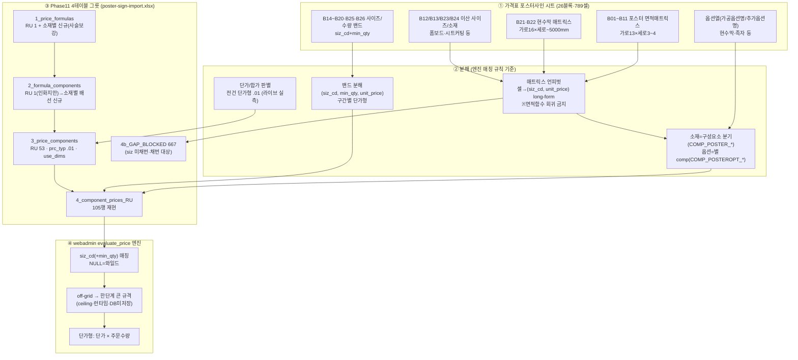
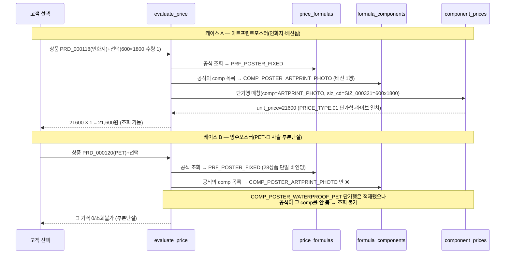
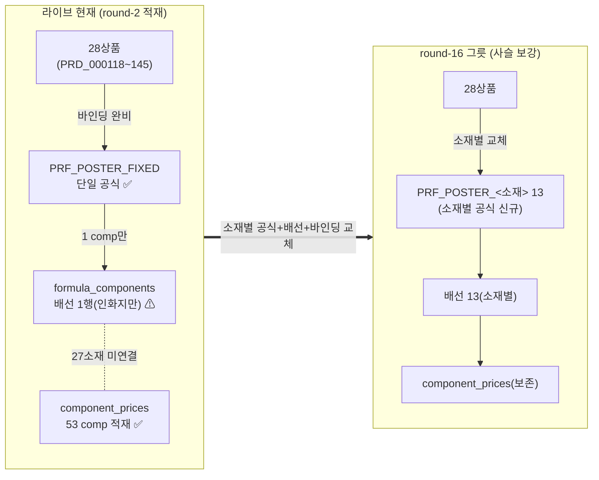

# 포스터사인 가격표 → DB 매핑 절차 (poster-sign-mapping-flow) — round-16 (면적매트릭스형·실사 가격 권위)

> **작성** 2026-06-13 · round-16. 포스터사인 시트(면적매트릭스+수량밴드·복합셀)를 webadmin Phase11 가격엔진 `t_prc_*` 4테이블 그릇으로 매핑하는 **절차 시각화**. 산출물 = `poster-sign-import.xlsx`(10시트·RU 105행 재현 + GAP_BLOCKED 667 + 밴드 41 + 옵션 25). **DB 미적재 — 절차/그릇 준비.** mermaid는 실제 분해 결과 반영(샘플 날조 금지·실 comp_cd 표기).

---

## 1. 전체 매핑 절차 (flowchart) — 가격표 시트 → 그릇 → 엔진

---

## 2. 엔진 계산 흐름 (sequenceDiagram) — 면적매트릭스 + 사슬단절 실증

> 해소: `PRF_POSTER_WATERPROOF_PET` 신규 + PRD_000120 바인딩 교체(`1`/`2`/`1b` 시트). off-grid 예: 650×650mm → 매트릭스 부재 → ceiling 800×800(런타임·DB 미저장).

---

## 3. 🔴 가격사슬 부분단절 해소 (이 시트의 결정적 발견 — 아크릴과 양태 다름)

> **아크릴**(배선 0행·전건단절)과 달리 포스터사인은 **배선 1행만 존재 + 28상품 단일공식 바인딩** = 인화지 1상품만 가격 조회 가능, 27상품은 자기 소재 단가행이 있어도 공식이 안 봄(부분단절·메모리 [[dbmap-price-chain-dwire-per-product-formula]]). round-16 그릇이 소재별 공식/배선/바인딩 교체를 신규 제안해 사슬 완결(단가행 재적재 ✗·재현만). 컨펌 Q-PS-1(소재별 분리 vs 단일공식 조건분기 — webadmin 엔진 설계 확인).

---

## 4. 분해 매핑 표 (시트 블록 → 그릇 컬럼)

| 가격표 요소 | → 그릇 컬럼 | 변환 |
|------------|-----------|------|
| 매트릭스 제목 소재(인화지/PET/PVC/패브릭…) | `comp_cd`(별 구성요소) | COMP_POSTER_<소재> 분기(mat_cd 미사용) |
| 좌표 (가로 g, 세로 s) | `component_prices.siz_cd` | 가로×세로 규격코드(예 800x1000→siz_cd) |
| 셀 단가 | `component_prices.unit_price` | numeric(개당 단가·단가형 .01) |
| 매트릭스 단가(통가격) | `clr_cd=NULL` | 도수 무관 |
| 면적매트릭스(수량축 없음) | `min_qty=NULL` | use_dims=[siz_cd] |
| 사이즈/수량 밴드 구간 | `siz_cd` + `min_qty` | use_dims=[siz_cd,min_qty]·구간별 단가 |
| 옵션열(가공옵션명·추가옵션명) | 별 `comp_cd`(COMP_POSTEROPT_*) | 본체+옵션 합산(addtn_yn·Q-PS-2) |
| 좌표 siz 미실재(667) | `siz_cd=(미채번:GxS)` | BLOCKED·채번 요청(Q-PS-3) |

---

## 5. webadmin 복붙 사용법 (실무진용)

`poster-sign-import.xlsx`는 10시트. 각 시트:
- **1행 = 빨강 안내(note)** — 시트 성격(_RU 재현 / NEW 신규 / GAP_BLOCKED 미채번 / 보존)
- **2행 = DB 컬럼명**(영문·파랑) — 복붙 타깃과 정확히 일치
- **3행 = 한국어 설명**(연파랑) — 복붙 시 제외
- **4행~ = 데이터** — 이 범위를 복사해 DB/적재 도구에 붙여넣기

적재 순서(FK·사슬완결): `1_price_formulas` → `2_formula_components` → `3_price_components` → `4_component_prices` → `1b_product_price_formulas`.

**색 범례**:
- 🟩 초록(_RU) = 라이브 기존 재현(**재적재 금지**·대조용)
- 🟨 노랑(_NEW) = 소재별 공식/배선 신규 후보(컨펌 후 적재)
- 🟧 주황(_GAP_BLOCKED/옵션/보존) = siz 미채번·옵션·부유노트(별 트랙)

---

## 6. 실사 가격 연결 ([HARD·사용자])

> 메모리 [[dbmap-silsa-price-via-poster-sign]]: **실사 시트 가격 = 이 포스터사인 면적매트릭스가 권위.** 실사 상품(현수막·배너·포스터 등)의 가격을 실사 시트 inline이 아니라 이 시트의 `[가로×세로]` 매트릭스 단가로 조회. 실사 상품↔포스터 소재 매칭 규칙은 컨펌 Q-PS-5. 그릇은 동일(이 import.xlsx) — 실사 트랙은 별 시트 신설 없이 이 매트릭스를 가격 원천으로 참조.

---

## 7. 한 줄 현황

포스터사인 매핑 절차 mermaid(flowchart 시트→분해→그릇→엔진 + sequence 면적매트릭스 계산·사슬단절 실증 + 가격사슬 부분단절 해소 diagram) + 분해 매핑 표 + 복붙 사용법 + 실사 연결 완료. 그릇 `poster-sign-import.xlsx` 10시트(RU 105·GAP_BLOCKED 667·밴드 41·옵션 25). **다음 = validator P1~P6 독립검증.**
