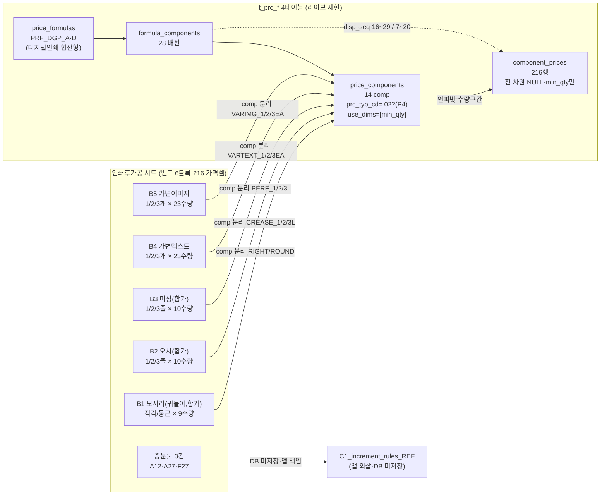
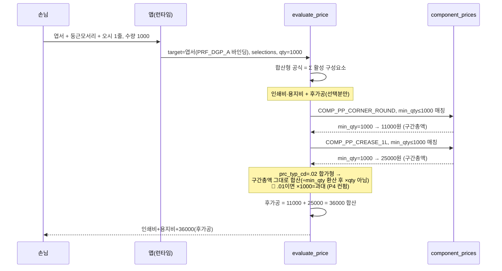

# 인쇄후가공 → t_prc_* 매핑 절차 (mermaid)

> round-16. 가격표 시트 → 그릇 4테이블 → Phase11 엔진 흐름. 실제 분해 결과 반영(샘플 날조 금지).
> [전제] 라이브 완전 적재 + 배선 완결 + 216/216 정합. RU=라이브 재현.

---

## 1. 분해 flowchart (가격표 6블록 → 그릇)

핵심: 줄수/개수는 **opt_cd 차원이 아니라 comp 분리**(가격이 다른 변형 = 별 comp). 후가공은 독립 공식 없이 **디지털인쇄 합산형 공식(PRF_DGP_A·D)의 부품**으로 배선됨.

---

## 2. 엔진 계산 sequenceDiagram (evaluate_price 안에서 후가공 합산)

> **P4 핵심**: 합가형(.02)이면 구간총액(11000)을 그대로 더함. 단가형(.01·라이브 현행)이면 11000을 장당가로 보고 ×1000=1100만원 → 비합리. Q-PF-1 해소가 계산 정확성의 관문.

---

## 3. 가격사슬 완결 검증 (아크릴 단절과 대비)

| 시트 | 가격사슬 상태 |
|------|--------------|
| 인쇄후가공 | **완결** — 공식·배선·구성요소·단가행 전부 실재 + 216/216 정합 |
| 아크릴(round-16) | 단절 — 단가행 적재됐으나 배선 0(엔진 조회 불가) |
| foil-small(round-16) | 전면 미적재 — 신규 구축 필요 |

인쇄후가공은 round-16 시트 중 **유일하게 사슬 완결 + 전건 정합**. 미해소는 단가/합가 백필(P4)뿐.
