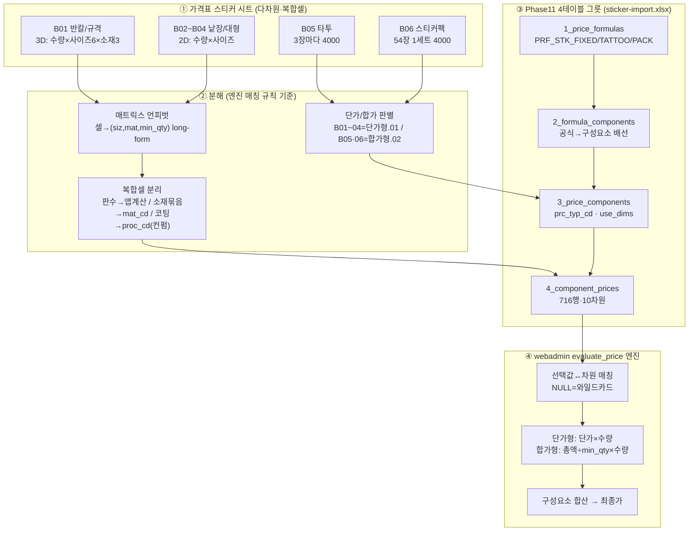
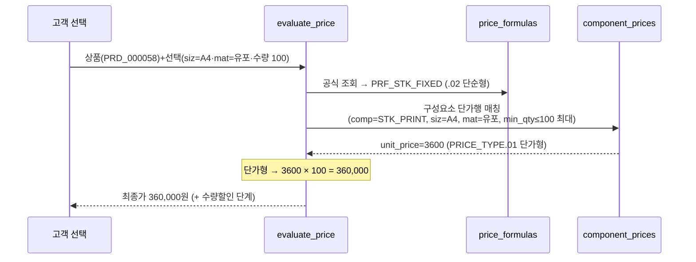

# 스티커 가격표 → DB 매핑 절차 (sticker-mapping-flow) — round-16 파일럿

> **작성** 2026-06-13 · round-16. 가격표 스티커 시트(다차원)를 webadmin Phase11 가격엔진 `t_prc_*` 4테이블 그릇으로 매핑하는 **절차 시각화**. 산출물 = `sticker-import.xlsx`(716 단가행). **DB 미적재 — 절차/그릇 준비.**

---

## 1. 전체 매핑 절차 (flowchart) — 가격표 시트 → 그릇 → 엔진

---

## 2. 엔진 계산 흐름 (sequenceDiagram) — 그릇이 어떻게 쓰이나

타투(합가형) 예시: 선택 수량 9 → `min_qty=3·unit=4000·PRICE_TYPE.02` → `4000÷3=1333/장 × 9 = 12,000원`.

---

## 3. 분해 매핑 표 (시트 블록 → 그릇 컬럼)

| 가격표 요소 | → 그릇 컬럼 | 변환 |
|------------|-----------|------|
| A열 수량 | `component_prices.min_qty` | 정수·상향구간 |
| 행2 사이즈(병합) | `component_prices.siz_cd` | 규격코드(임포지션 키) |
| 행3 소재그룹 | `component_prices.mat_cd` | 대표 소재코드(코팅=proc_cd 전환 컨펌) |
| 셀 단가 | `component_prices.unit_price` | numeric |
| T3 "종이+인쇄+커팅" | `formula_components`(comp 1개) | 단순형 통합단가 |
| "3장마다 4000"(타투) | `prc_typ_cd=.02` + `bdl_qty=3` | 합가형 환산 |
| 판수(4판 등) | (DB 미저장) | 앱 임포지션 계산 |

---

## 4. webadmin 복붙 사용법 (실무진용)

`sticker-import.xlsx`는 4시트 = webadmin/DB 4테이블과 1:1. 각 시트:
- **1행 = DB 컬럼명**(영문) — 복붙 타깃과 정확히 일치
- **2행 = 한국어 설명**(회색) — 복붙 시 제외
- **3행~ = 데이터** — 이 범위를 복사해 DB/적재 도구에 붙여넣기

적재 순서(FK): `1_price_formulas` → `2_formula_components` → `3_price_components` → `4_component_prices`. `[참고]` 열(siz_label·mat_label)은 사람 확인용(DB 적재 시 제외).

---

## 5. 한 줄 현황

스티커 매핑 절차 mermaid(flowchart 시트→분해→그릇→엔진 + sequence 계산흐름) + 분해 매핑 표 + 복붙 사용법 완료. 그릇 `sticker-import.xlsx` 716행. **다음 = validator P1~P6 독립검증.**
