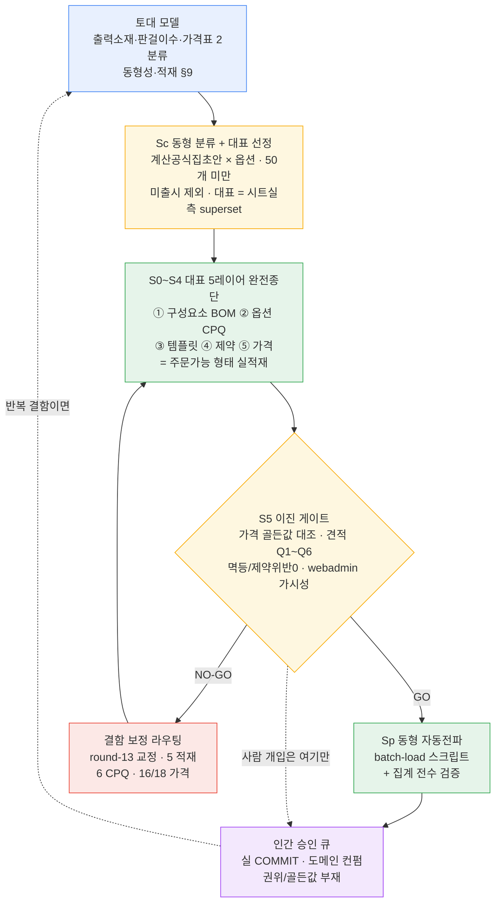
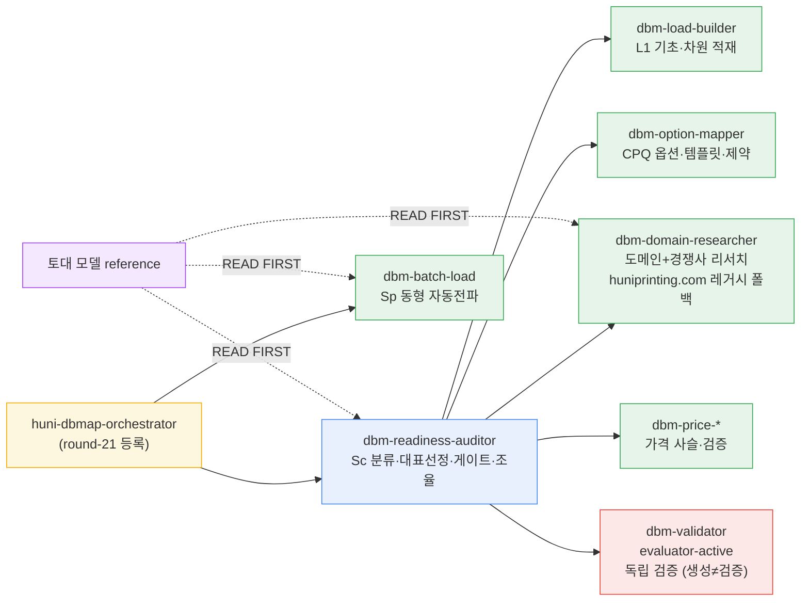
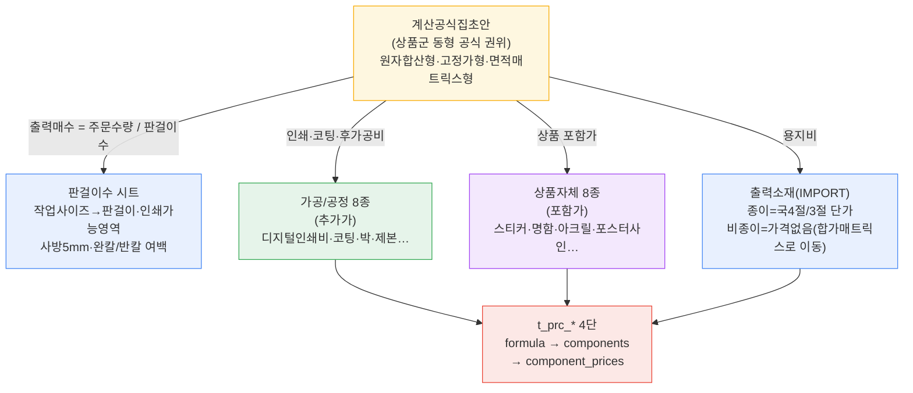

# Huni-DBMap 하네스 구성 — round-21 상품군 동형 효율 파이프라인

> 이 문서만 읽으면 round-21 하네스가 어떻게 구성·작동하는지 한 판에 이해된다.
> 토대 모델 권위 = `.claude/skills/dbm-batch-load/references/product-group-isomorphism-model.md`(9섹션).

## 1. 핵심 아이디어 (3줄)

- 같은 상품군은 옵션 구성과 가격공식이 **동형**(계산공식집초안 권위). 후니 전체 **50개 미만**.
- **대표 1개**(시트 실측 superset)만 주문가능 형태로 **완전종단** 적재 → 동형 나머지는 **스크립트 자동전파**.
- 각 단계는 **이진 게이트**로 자율 검증·보정. 사람 개입은 **인간 승인 큐**(실 COMMIT·도메인 컨펌·권위 부재)만.

## 2. 파이프라인 흐름 (자율 자기개선 폐루프)

## 3. 에이전트·스킬 구성

## 4. 인쇄상품 가격구성요소 사슬 (토대 §2~6)

## 5. 적재 산출 기준 (토대 §9 — 실무진 가시성)

| 축 | 컬럼 | 용도 |
|----|------|------|
| 시스템 코드 | `*_cd` (SIZ_000xxx) | 순번 surrogate·FK·정렬 |
| 관리 인식 명칭 | `*_nm`·tags | 실무진 관리화면 식별 |
| 고객 UI 명칭 | disp_nm | 위젯/사이트 표시 |
| 비고 | note | 실무진 쉬운 한국어(전문가 식별자 금지) |

- 명칭 권위 = **후니 용어**(경쟁사 참조만). 사이즈 = 공용/상품군전용/**판형(`impos_yn='Y'`)** 구분 + search-before-mint 중복 금지 + 정규화.
- 적재 후 `raw/webadmin` admin에서 실무진이 알아보는 형태로 보이는지 = webadmin 가시성 게이트.
