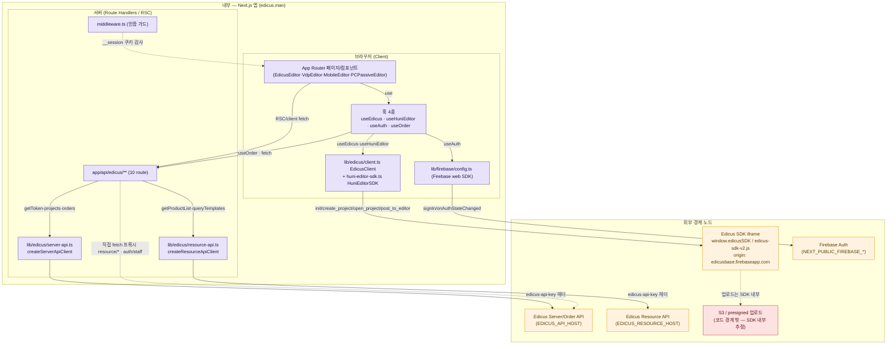
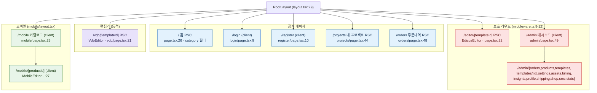

# 00 — 시스템 아키텍처 & 라우트 맵

> 청중: 개발팀. 권위[HARD]=API 계약 팩(`01_api/`) + 코드맵 팩(`02_codemap/`). 두 팩에 있는 사실만 도해한다.
> 추적성: 각 도해 아래 `파일:라인`·SDK 메서드·`PDF p.N`·env 키를 산문으로 병기(코드/문서로 점프 가능).
> 비밀값 비노출: env는 **키 이름만**(값 금지).

---

## A. 시스템 아키텍처 (경계: 내부 Next.js 앱 / 외부 Edicus·Firebase)

후니 `edicus.man`은 Next.js 15 App Router 앱이며(`02_codemap/module-map.md:6`), 핵심 외부 의존은 세 갈래다:
① 브라우저에 iframe으로 삽입되는 **Edicus SDK**(`window.edicusSDK`, `/edicus-sdk-v2.js`), ② **Edicus 서버/리소스 API**(토큰·프로젝트·주문·상품·템플릿), ③ **Firebase Auth**(로그인). 비밀값(`edicus-api-key`)이 필요한 Server API는 [HARD] 서버에서만 호출하고, 브라우저는 SDK와 Firebase Auth만 직접 접촉한다(`server-api-catalog.md:8`).

**추적 메모**
- 브라우저→SDK iframe: `EdicusClient`가 `window.edicusSDK.init({base_url})`을 호출(`client.ts:158`). iframe origin은 `edicusbase.firebaseapp.com`(`huni-editor-sdk.ts:17`; `data-flow.md:99`). `base_url`은 SDK config 키(`SDK PDF p.3`).
- 서버→Edicus Server API: `createServerApiClient`(`server-api.ts:35`)가 `EDICUS_API_HOST` 기반으로 `/api/auth/token`·`/api/projects/*`·`/api/order/*` 호출. 공통 헤더 `edicus-api-key`(`Server API PDF p.1`).
- 서버→Resource API: `createResourceApiClient`(`resource-api.ts:27`)가 `EDICUS_RESOURCE_HOST` 기반 `/resapi/product/list`·`/resapi/query`(`Resource PDF p.18, p.28`).
- Firebase: 클라 web SDK 직접 초기화(`config.ts:21`), env=`NEXT_PUBLIC_FIREBASE_*`. (env-mapping.md의 `EDICUS_FIREBASE_*` 6종은 Edicus가 Firebase 호스팅 기반이라 별도 존재 — `env-mapping.md:19-24`.)
- env 키: `EDICUS_API_HOST`·`EDICUS_RESOURCE_HOST`·`EDICUS_API_KEY`·`EDICUS_PARTNER_CODE`·`EDICUS_BASE_HOST`(=base_url) — `env-mapping.md:11-18`. `EDICUS_API_KEY`는 **서버 전용·절대 클라 노출 금지**(`env-mapping.md:12,40`).
- `%% 불일치` 성격: S3/presigned 업로드는 본 코드에서 직접 참조 없음 — Edicus iframe SDK 내부 책임으로 추정되며 코드 경계 밖(`data-flow.md:105`). 따라서 점선 boundary 노드로만 표기(없는 화살표 창작 금지).

---

## B. 라우트 맵 (App Router · 보호 라우트 표시)

전 라우트는 `RootLayout`(`layout.tsx:29`, html lang=ko)을 공유한다. **루트에 QueryClientProvider·zustand Provider 없음**(`module-map.md:50`). 미들웨어는 `/admin/*`·`/editor/*`를 `__session` 쿠키 **존재 여부만**으로 보호한다(`middleware.ts:9-12,23-28`). 페이지 21종 + API route 10종.

**추적 메모**
- 보호 패턴: `/admin/*`·`/editor/*`(`middleware.ts:9-12`). 미인증 시 `/login?redirect=`로 리다이렉트(`middleware.ts:32-35`). 인증 라우트(`/login`·`/register`)에 로그인 사용자 접근 시 `/admin`으로(`middleware.ts:15,40-42`). **`/vdp/*`·`/mobile/*`는 matcher 보호 대상 아님**(matcher는 `/admin`·`/editor`만; `middleware.ts:9-12,50-58`) — 위 그래프에서 vdp/mobile을 보호 박스 밖에 둔 이유.
- 인증 판정은 Edge Runtime이라 토큰 유효성 검증 없이 쿠키 존재만 본다 — 실제 검증은 API 라우트 책임(`middleware.ts:23-28`).
- 관리자 페이지 14종은 `admin/layout.tsx`(+Sidebar) 공유(`module-map.md:84-94`). `/admin/templates/[id]`는 동적 세그먼트.
- `/projects`·`/orders`·`/editor/[templateId]`·`/vdp/[templateId]`는 각각 `error.tsx`·`loading.tsx` 동봉(`module-map.md:62,71`).
- 페이지 수 집계: 공개 5 + 편집기 2 + 모바일 2 + admin 14(대시보드 1 + 서브 13) = 23 라우트(이 중 admin 14·동적 세그먼트 3개 포함). README 명세 "페이지 21+"와 정합 범위.

---

## API route 인벤토리 (10종 · `module-map.md:103-118`)

| 라우트 | 메서드 | 위임 | 근거 |
|---|---|---|---|
| `/api/edicus/auth` | POST | `server-api.getToken(uid)` | `auth/route.ts:29-30` |
| `/api/edicus/auth/staff` | POST | 직접 fetch `EDICUS_API_HOST/api/auth/staff/token` | `auth/staff/route.ts:34-41` |
| `/api/edicus/projects` | GET/POST/DELETE | `server-api.getProjects` 등 | `projects/route.ts:42,65,89` |
| `/api/edicus/orders` | POST/DELETE | `tentativeOrder`/`definitiveOrder`/`cancelOrder` | `orders/route.ts:41-42,66` |
| `/api/edicus/products` | GET | `resource-api.getProductList` | `products/route.ts:30` |
| `/api/edicus/templates` | GET | `resource-api.queryTemplates` | `templates/route.ts:37` |
| `/api/edicus/css` | GET/POST | `getCssForPartner` (POST=미저장 stub) | `css/route.ts:35,61-63` |
| `/api/edicus/resource/[id]` | GET | 직접 fetch `RESOURCE_HOST/resapi/resource/:id` | `resource/[id]/route.ts:50` |
| `/api/edicus/resource/products` | GET | 직접 fetch `/resapi/product/list` | `resource/products/route.ts:53` |
| `/api/edicus/resource/query` | POST | 직접 fetch `/resapi/query` | `resource/query/route.ts:53` |

비밀값 경계: `EDICUS_API_KEY`·스태프 자격증명은 서버 라우트 내에서만 사용, 응답 비포함(`module-map.md:120`).
