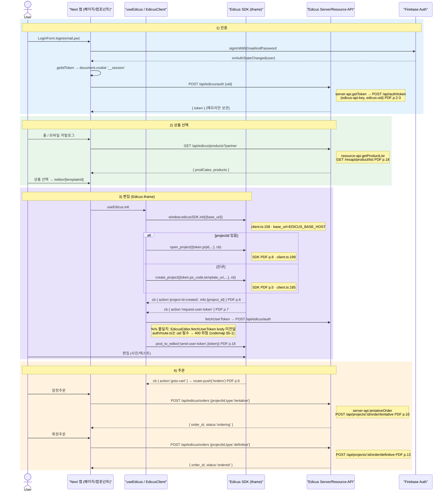
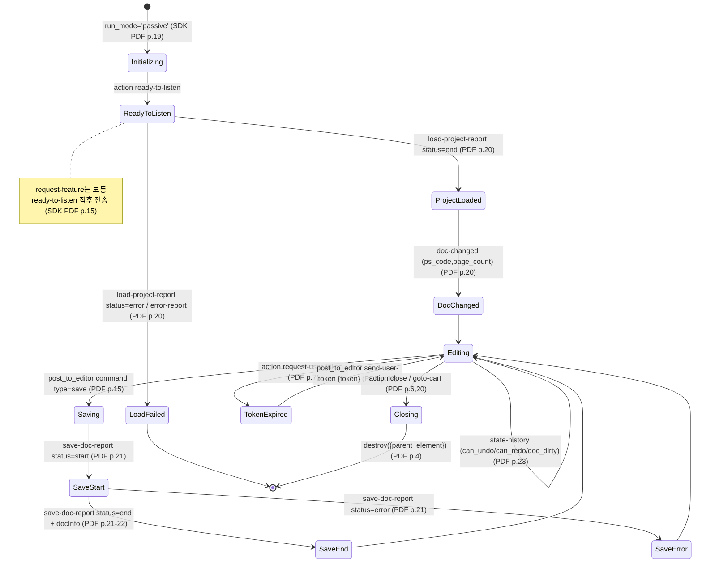
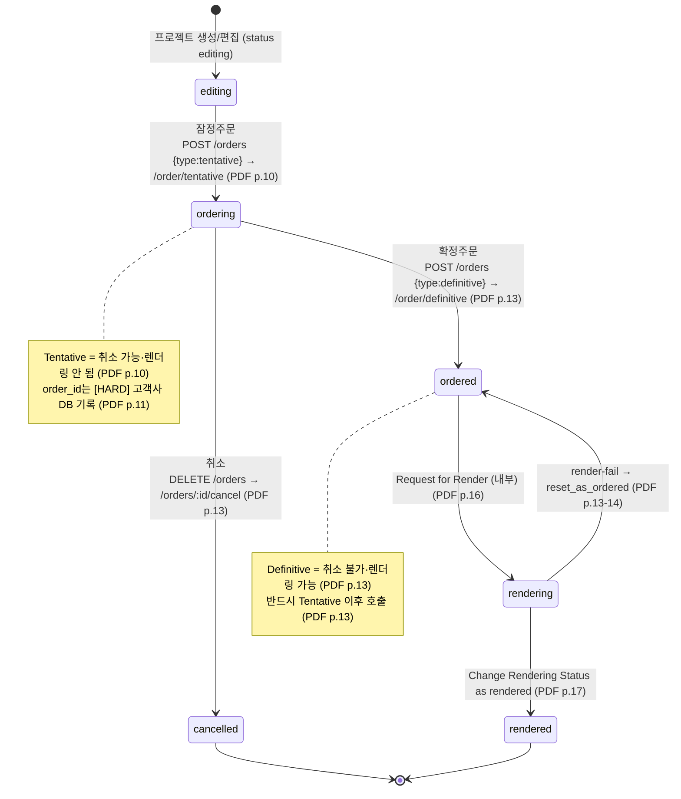

# 01 — 플로우 (인증→상품→편집→주문 · 패시브 라이프사이클 · 주문 상태머신)

> 청중: 개발팀. 권위[HARD]=API 계약 팩 + 코드맵 팩. 각 전이에 SDK 메서드/이벤트·`PDF p.N`·`파일:라인` 병기.
> 코드↔계약 불일치는 `%% 불일치: ...` 주석으로 명시.

---

## A. end-to-end 시퀀스 (인증 → 상품선택 → 편집 → 주문)

PC 데스크탑 `EdicusEditor` 경로(`useEdicus`→`EdicusClient`→`window.edicusSDK`)를 기준으로 한다(`data-flow.md:44-53`). 토큰은 [HARD] 고객사 서버에서 발급해 클라로 전달하고 SDK params `token`으로 쓴다(`SDK PDF p.2`).

**추적 메모**
- 인증: `useAuth.login`→`signInWithEmail`(`useAuth.ts:105`→`auth.ts:17`); `__session` 쿠키(`useAuth.ts:83-84`); Edicus 토큰 발급 `POST /api/edicus/auth {uid}`(`useAuth.ts:50-53`)→`server-api.getToken`→`EDICUS_API_HOST/api/auth/token`(`Server API PDF p.2-3`). 토큰은 메모리만, localStorage 미저장(`useAuth.ts:37-38`).
- 상품: `ProductGrid`가 `fetch /api/edicus/products?partner`(`ProductGrid.tsx:33`)→`resource-api.getProductList`(`Resource PDF p.18`).
- 편집: `useEdicus.init`→`client.init`→`window.edicusSDK.init({base_url})`(`useEdicus.ts:90`→`client.ts:158`). `projectId` 유무로 `open_project`/`create_project` 분기(`EdicusEditor.tsx:136-139`). 콜백 라우팅: `request-user-token`→토큰 재발급+`postToEditor('send-user-token')`, `close`→`router.back()`, `goto-cart`→`router.push('/orders')`(`EdicusEditor.tsx:81-112`).
- 주문: `useOrder`→`POST /api/edicus/orders`(`useOrder.ts:134-156`)→`server-api.tentativeOrder/definitiveOrder`(`server-api.ts:121`)→`EDICUS_API_HOST/api/projects/:id/order/*`(`Server API PDF p.10-13`). `order_id`는 [HARD] 고객사 DB 기록 대상(`Server API PDF p.11,13`).
- `%% 불일치`(시퀀스에 주석): 4개 편집기 토큰 발급이 **body 없이 POST**라 `uid` 필수 라우트와 충돌(`hooks-and-edicus-wiring.md:102`). 상세는 `02_code-api-wiring.md`.

---

## B. Edicus 패시브 모드 라이프사이클 (stateDiagram)

패시브 모드 = edicus를 canvas만 보이게 띄우고 postMessage로 부모↔iframe 연동(`passive-mode-events.md:7`). 진입=`create_project`/`open_project`의 `run_mode='passive'`(`SDK PDF p.19`). edicus→고객사 콜백 `function(err,data)`의 `data.action`으로 상태 전이를 본다.

**추적 메모**
- action enum 권위=`passive-mode-events.md:22-38`(ready-to-listen·load-project-report·doc-changed·page-changed·var-*·state-history·save-doc-report·error-report·close 등). 코드는 정확한 케밥 문자열로 매칭(`passive-mode-events.md:40`).
- 코드 진입점: `MobileEditor` passive 콜백 `ready-to-listen→onReadyToListen`·`doc-changed→onDocChanged`(`data-flow.md:57`; `MobileEditor.tsx:112-120`); 툴바 `undo/redo/save-doc` `postToEditor` 직접 호출(`MobileEditor.tsx:218-222`). `HuniEditorSDK`는 `ready`/`ready-to-listen`/`close`/`doc-changed`/`save-complete`/`error` 매핑(`huni-editor-sdk.ts:135-158`).
- save 전이: `state-history.doc_dirty`로 Save 버튼 enable/disable(`PDF p.23`). save-doc-report `docInfo@end`는 일반상품/사진인화 두 형태(`PDF p.21-23`).
- `%% 불일치`: `ready-to-listen` info/의미는 **PDF 미기재(모름)**(`passive-mode-events.md:177`); `save()`가 `postToEditor('save-doc')`로 보내나 PDF command type은 `save`(`huni-editor-sdk.ts:208-210`; `SDK PDF p.15`) — 이름 차이는 `02_code-api-wiring.md`에 상세.

---

## C. 주문 상태머신 (stateDiagram)

2단계 주문(잠정→확정)이며 취소는 잠정 상태에서만 가능(`data-flow.md:83-93`). 상태 enum: 프로젝트 `editing|ordering|ordered`(`types/edicus.ts:97`), 주문 `tentative|definitive|cancelled|processing|completed`(`types/order.ts:10-15`), Can Order status `editing|ordering|ordered|rendering|rendered`(`Server API PDF p.10`).

**추적 메모**
- 클라: `useOrder.tentativeOrder/definitiveOrder/cancelOrder`→`POST /api/edicus/orders/{tentative|definitive|cancel}`(`useOrder.ts:134,144,155`).
- 서버: `orders/route.ts` POST(type 분기)·DELETE(취소)→`server-api.*`→`EDICUS_API_HOST/api/projects/:id/order/*`·`/api/orders/:id/cancel`(`data-flow.md:90-91`; `server-api.ts:121-145`).
- 표시: `/orders` RSC가 `OrderCard`로 렌더, **잠정 상태만** 확정/취소 액션 노출(`orders/page.tsx:111-118`).
- `processing|completed`(order.ts)와 `rendering|rendered`(Server API/Can Order)는 별도 출처 enum — 위 머신은 Server API 렌더 단계를 권위로 그리고, order.ts의 후속 상태는 클라 도메인 모델로 별도 존재(`types/order.ts:10-15`). 두 enum 합성 화살표는 팩에 근거 없어 창작하지 않음.
- `%% 불일치`: `useOrder`가 `/orders/tentative` 등 **서브경로**로 POST하나 대응 route 파일 부재 — 구현은 `orders/route.ts`(POST type 분기·DELETE)뿐(`hooks-and-edicus-wiring.md:103`). 상세는 `02_code-api-wiring.md`.
