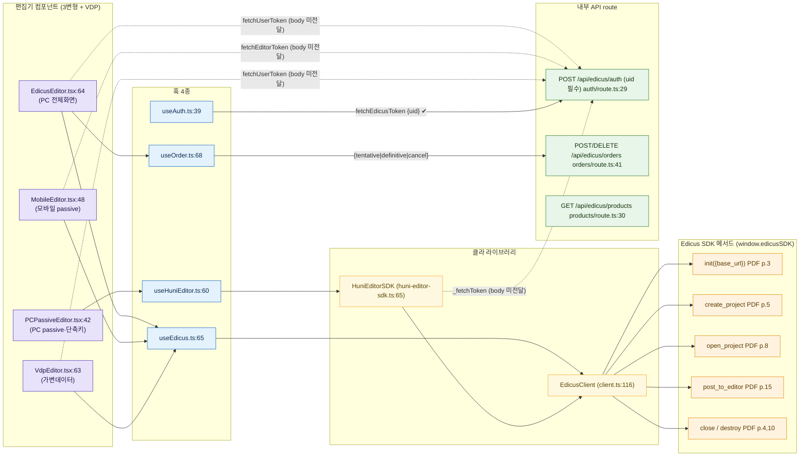
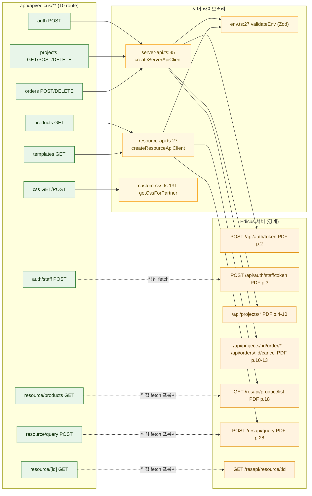

# 02 — 코드 ↔ API 배선도 (핵심 가치)

> 청중: 개발팀. 핵심 가치=**어느 코드가 어느 SDK 메서드/Server API를 호출하는가**.
> 권위[HARD]=API 계약 팩 + 코드맵 팩. 노드 라벨에 `파일:라인`, env 키는 주석.
> 코드↔계약 불일치는 `%% 불일치: ...` 주석으로 다이어그램에 명시.

---

## A. 클라이언트 측 배선 (4 hook + 편집기 3변형 → SDK 메서드 / Server API)

`useEdicus`와 `useHuniEditor`는 **둘 다 `EdicusClient`로 수렴**한다(`module-map.md:46`). `HuniEditorSDK`는 `EdicusClient`를 합성으로 감싼 고수준 래퍼(`huni-editor-sdk.ts:65`).



**env 키 주석**
- `init({base_url})` ← `EDICUS_BASE_HOST`(또는 `EDICUS_EDITOR_HOST`)(`env-mapping.md:16-17,31`).
- `create_project`/`open_project`의 `partner` ← `EDICUS_PARTNER_CODE`(클라 노출분 `NEXT_PUBLIC_EDICUS_PARTNER`)(`env-mapping.md:11,32`).
- `token` 파라미터 ← 서버 `POST /api/auth/token` 응답(어느 env 키도 토큰 자체를 담지 않음)(`env-mapping.md:33`).
- iframe origin 검증 상수 `TRUSTED_ORIGIN='edicusbase.firebaseapp.com'`(`huni-editor-sdk.ts:17`).

**SDK 메서드 호출 라인 근거**
- `init`: `useEdicus.ts:90`→`client.ts:158`. `create_project`: `useEdicus.ts:130`→`client.ts:185`. `open_project`: `useEdicus.ts:152`→`client.ts:199`. `post_to_editor`: `useEdicus.ts:172`→`client.ts:236`. `close`/`destroy`: `useEdicus.ts:105,167`→`client.ts:212,222`(`hooks-and-edicus-wiring.md:21-26`).
- VDP 전용: `VdpEditor`가 `postToEditor('set-variable-data',{variableData})`(`data-flow.md:65`; `VdpEditor.tsx:120-127`). (TnView `set_variable_data_row`는 SDK PDF p.26 메서드지만 본 코드 호출부는 `set-variable-data` postMessage 경로 — 아래 불일치 D.)

---

## B. 서버 측 배선 (API route → server-api/resource-api → Edicus 서버)



**env 키 주석**
- `server-api.ts`/`resource-api.ts` base URL ← `EDICUS_API_HOST`/`EDICUS_RESOURCE_HOST`(`env-mapping.md:13-14`).
- 전 Server/Resource API 공통 헤더 `edicus-api-key` ← `EDICUS_API_KEY`(**서버 전용·절대 클라 노출 금지**)(`env-mapping.md:12,40`; `Server API PDF p.1`).
- staff 토큰 헤더 `edicus-email`/`edicus-pwd` ← `EDICUS_MANAGER_ID`/`EDICUS_MANAGER_PW`(reference는 `EDICUS_STAFF_EMAIL`/`PASSWORD` — 명칭 불일치 가능, 아래 E)(`env-mapping.md:25-26,35`).
- Zod 검증: `EDICUS_API_KEY`·`EDICUS_API_HOST`·`EDICUS_RESOURCE_HOST`(`env.ts:27`; `code-facts.csv:26`).

---

## C. 인증 배선 (useAuth → Firebase + Edicus 토큰)

```mermaid
flowchart LR
  loginForm["LoginForm.tsx:7<br/>(useAuth props 주입)"]
  useAuth["useAuth.ts:39"]
  fbAuth["firebase/auth.ts:17,24,30,36"]
  fbExt["Firebase Auth (경계)<br/>NEXT_PUBLIC_FIREBASE_*"]
  rAuth["POST /api/edicus/auth {uid} auth/route.ts:29"]
  srvApi["server-api.getToken<br/>EDICUS_API_HOST/api/auth/token"]
  cookie["document.cookie '__session' useAuth.ts:83"]
  mw["middleware.ts:25 (쿠키 존재만 검사)"]

  loginForm -->|login/register/logout| useAuth
  useAuth -->|signInWithEmail 등| fbAuth --> fbExt
  fbExt -->|onAuthStateChanged| useAuth
  useAuth -->|getIdToken| cookie --> mw
  useAuth -->|fetchEdicusToken {uid}| rAuth --> srvApi
  useAuth -->|generateEdicusUid firebase/auth.ts:56| useAuth

  %% 불일치: LoginForm은 useAuth 직접호출 안 함, 부모가 login props 주입 → 페이지 배선 부분적 (codemap §5)

  classDef hook fill:#E3F2FD,stroke:#1565C0,color:#0d2b4d;
  classDef ext fill:#FFF3E0,stroke:#E08A00,color:#5a3a00;
  classDef route fill:#E8F5E9,stroke:#2E7D32,color:#13340d;
  classDef comp fill:#E8E2FB,stroke:#5538B6,color:#1c1340;
  class useAuth hook;
  class fbExt ext;
  class rAuth,srvApi route;
  class loginForm,fbAuth,cookie,mw comp;
```

**추적 메모**
- `onAuthChange`→`onAuthStateChanged`(`useAuth.ts:73`→`auth.ts:36`); admin 판정 `getIdTokenResult().claims['admin']`(`useAuth.ts:78-79`); edicusUid 정규화 `generateEdicusUid`(영숫자+하이픈 64자, `auth.ts:56-63`). 토큰은 메모리만(`useAuth.ts:37-38`). Firebase config=`NEXT_PUBLIC_FIREBASE_*`(`config.ts:10-17`).

---

## D. 코드 ↔ 계약 불일치 종합 (`%% 불일치` 목록)

| # | 불일치 | 코드 근거 | 계약/기대 | 영향 |
|---|---|---|---|---|
| 1 | **README zustand/react-query 부재** | grep 0건: `create()` store·`useQuery`/`useMutation`/`QueryClientProvider` 없음. 실제=로컬 `useState`+RSC/`fetch`(`module-map.md:134`; `data-flow.md:81`) | README 기술스택표 "Zustand 5 / TanStack React Query 5"(`README.md:138-139`) | 두 패키지는 `package.json` deps에만 존재. 루트에 Provider 없음(`layout.tsx:29`) |
| 2 | **토큰 발급 body 불일치** | `HuniEditorSDK._fetchToken`(`huni-editor-sdk.ts:263`)·`EdicusEditor.fetchUserToken`(`EdicusEditor.tsx:35-37`)·`MobileEditor.fetchEditorToken`(`MobileEditor.tsx:35`)·`VdpEditor.fetchUserToken`(`VdpEditor.tsx:41`)=**body 없이 POST** | `auth/route.ts`는 `uid` 필수(`auth/route.ts:11-13,21`). `useAuth.fetchEdicusToken`만 `{uid}` 전달(`useAuth.ts:50-53`) | 400 위험(`hooks-and-edicus-wiring.md:102`) |
| 3 | **useOrder 엔드포인트 불일치** | `useOrder`가 `/orders/tentative\|definitive\|cancel` 서브경로 POST(`useOrder.ts:134,144,155`) | 대응 route 파일 없음 — 구현은 `orders/route.ts`(POST type 분기·DELETE 취소)뿐(`hooks-and-edicus-wiring.md:103`) | 서브경로 핸들러 부재 |
| 4 | **RedEditorWrapper 미사용** | `lib/red-editor/wrapper.ts`(`window.RedEditorSDK` 가정)·`.d.ts`·`analyzed/*` import 0건(`module-map.md:130-131`) | 런타임 경로는 `EdicusClient`(`window.edicusSDK`) | 두 SDK 추상 공존·wrapper는 역공학 잔재(미배선) |
| 5 | **/api/edicus/css POST = stub** | DB 저장 미구현·성공 응답만(`css/route.ts:43,61-63` `@MX:TODO`)(`module-map.md:127`) | 저장 동작 기대 | 미저장(no-op) |
| 6 | **save 명령 이름 차이** | `useHuniEditor.save()`→`postToEditor('save-doc',{})`(`huni-editor-sdk.ts:208-210`) | PDF `post_to_editor('command',{type:'save'})`(`SDK PDF p.15`) | 패시브 save 경로 이름 비표준(코드는 'save-doc' 사용) |
| 7 | **이벤트 정규화 비대칭** | `useEdicus` 콜백=`action ?? type`(`EdicusEditor.tsx:89`), `HuniEditorSDK`=`type ?? action`(`huni-editor-sdk.ts:138-139`)(`hooks-and-edicus-wiring.md:105`) | 단일 정규화 기대 | 두 경로 우선순위 반대 |
| 8 | **VDP set-variable-data postMessage** | `VdpEditor`→`postToEditor('set-variable-data',{variableData})`(`VdpEditor.tsx:120-127`) | SDK PDF는 TnView `set_variable_data_row` 메서드(`SDK PDF p.26`); VDP 주입은 Server API `tentative_with_vdp`도 존재(`Server API PDF p.12`) | 코드의 `set-variable-data` action은 PDF post_to_editor action 표(`SDK PDF p.15`)에 미열거 — **PDF 미기재 action(모름)** |
| 9 | **EDICUS_MANAGER_ID/PW ↔ 헤더 명칭** | reference 구현은 `EDICUS_STAFF_EMAIL`/`PASSWORD` 사용(`auth/staff/route.ts`) | env 키는 `EDICUS_MANAGER_ID`/`PW`(`env-mapping.md:25-26,46`) | staff 계정 역할 동일 추정·명칭 불일치 가능 |
| 10 | **origin 검증 범위 비대칭** | `HuniEditorSDK`만 message origin 검증(`huni-editor-sdk.ts:278`) | `useEdicus` 경로 콜백은 외부 SDK 내부 검증에 의존(코드 미가시)(`hooks-and-edicus-wiring.md:104`) | 검증 위치 불균일 |

> 미상/정직 표기: `set-variable-data`·`ready-to-listen` info 등 일부 action은 **PDF 미기재(모름)** — 팩의 "미상" 항목을 그대로 계승(`passive-mode-events.md:177`; `sdk-method-catalog.md:357`). 없는 화살표는 창작하지 않았다.
