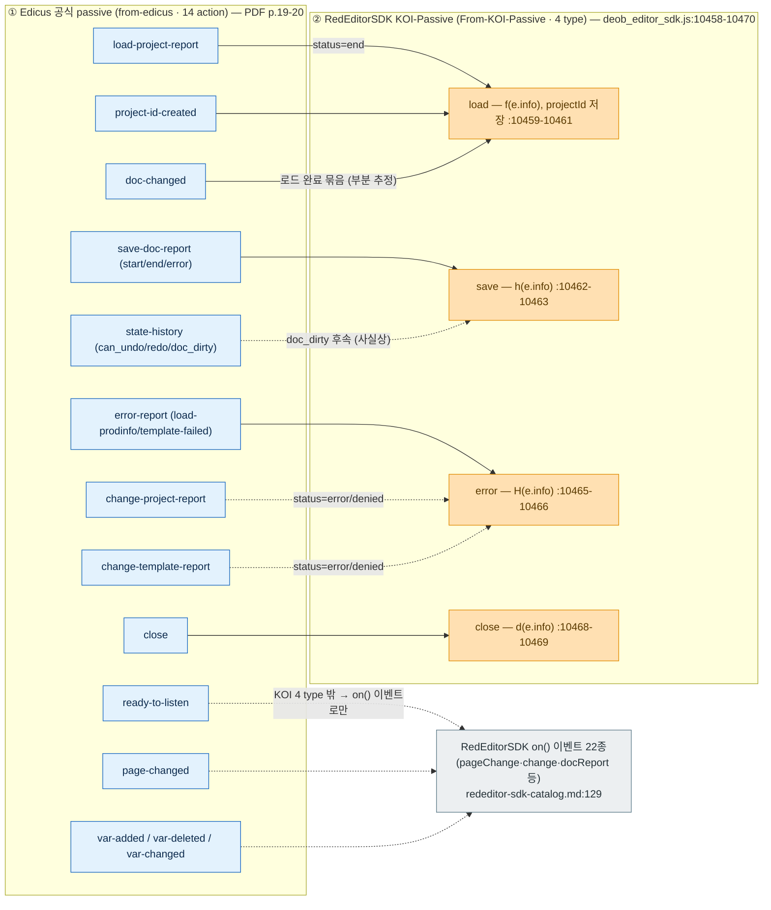
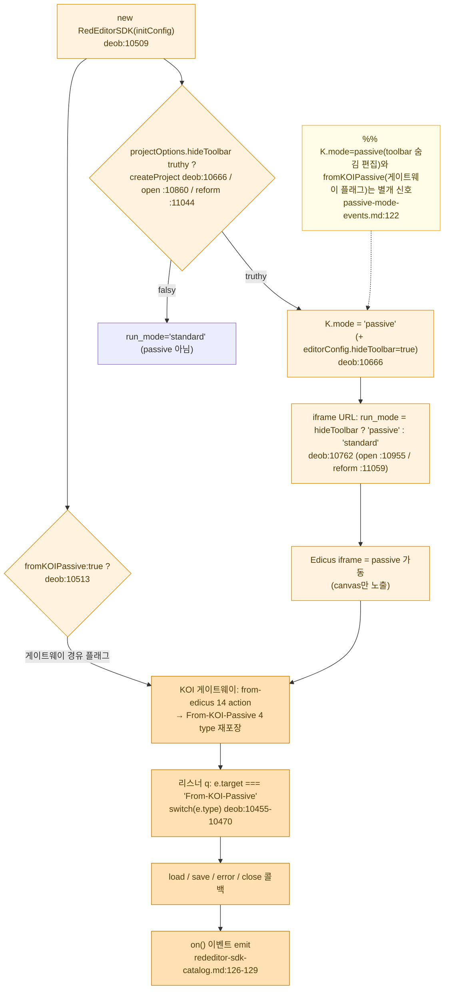
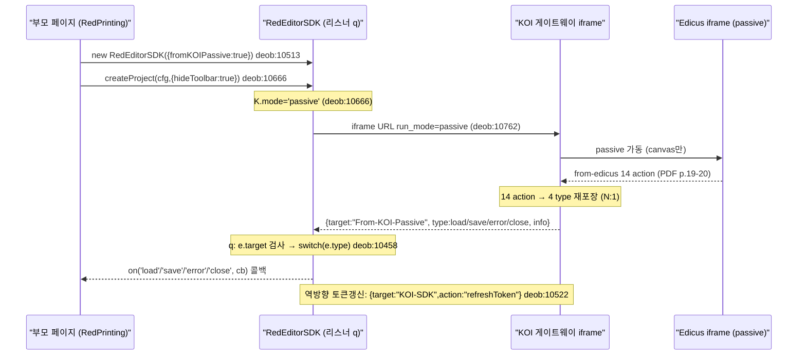
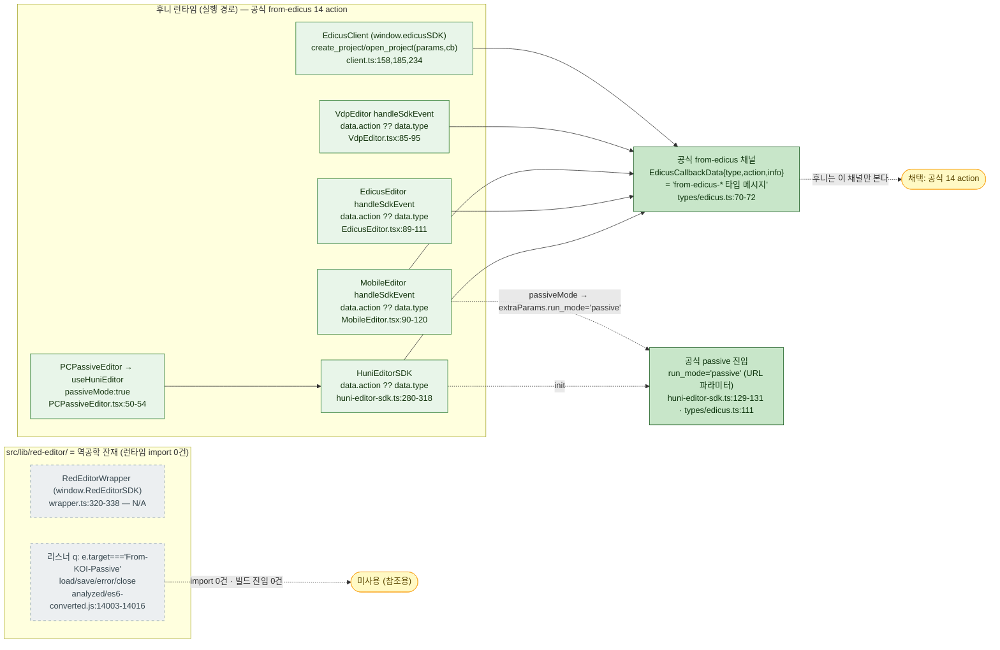

# 03 — 두 패시브 레이어 & 후니 채택 경로 (역공학 양면 보강)

> 청중: 개발팀. 권위[HARD]=API 계약 팩(`01_api/passive-mode-events.md`·`rededitor-sdk-catalog.md`) + 코드맵 팩(`02_codemap/passive-channel-binding.md`).
> 각 노드에 `파일:라인`/`PDF p.N`. 두 팩 밖 사실 창작 금지. 불일치/잔재는 `%% 잔재 …` 주석.

---

## 0. 핵심 결론 (TL;DR)

역공학 재검토로 **패시브 레이어가 둘**임이 드러났고, 후니가 어느 쪽을 따르는지 코드로 확정됐다.

| | ① Edicus 공식 passive | ② RedEditorSDK KOI-Passive |
|---|---|---|
| 식별 키 | `data.action ?? data.type` (target 문자열 비교 없음) | `e.target === "From-KOI-Passive"` → `e.type` |
| 메시지 채널 | `from-edicus*` | `From-KOI-Passive` |
| 이벤트 셋 | **14 action**(세밀 상태머신) | **4 type**(load/save/error/close) |
| 관계 | 원본(권위) | 14 action을 **N:1**로 재포장한 게이트웨이 래퍼 |
| 진입 | `run_mode='passive'`(공식 SDK URL 파라미터) | `fromKOIPassive`/`hideToolbar` → `K.mode="passive"` → `run_mode=passive` |
| **후니 edicus.man** | **✔ 런타임 전 모듈이 직접 사용** | **잔재**(`src/lib/red-editor/analyzed/*`에만·import 0건) |

근거: 14 action=`passive-mode-events.md:22-38`·`PDF p.19-20`. 4 type=`passive-mode-events.md:100-106`·`deob_editor_sdk.js:10458-10470`. 후니 채택=`passive-channel-binding.md:8-20`(런타임 핸들러 일관 `data.action ?? data.type`, `From-KOI-Passive` 매칭은 `src/lib/red-editor/analyzed/`에만).

---

## A. 두 패시브 레이어 비교 (flowchart · 14↔4 매핑 엣지)

Edicus 공식 14 action(왼쪽, 세밀)이 RedEditorSDK KOI-Passive 4 type(오른쪽)으로 **N:1 수렴**한다. 매핑 권위=`passive-mode-events.md:130-138`(PART C 양면 매핑표).

**추적 메모**
- 14 action 전체·info 페이로드=`passive-mode-events.md:22-71`(`PDF p.19-24`). 4 type 핸들러 `f/h/H/d`=`deob_editor_sdk.js:10459-10469`.
- N:1 매핑 권위=`passive-mode-events.md:130-138`. 실선=명확 수렴, 점선=**부분 추정**(KOI 게이트웨이 별 코드 미보유). `load`에 `doc-changed` 포함 여부 등은 `:10460` project_id 추출·라벨 로깅(`:11356-11433`)에서 추정(`passive-mode-events.md:151`).
- KOI 4 type **밖** 세밀 action(`page-changed`·`var-*`·`ready-to-listen` 등)은 RedEditorSDK `on()` 22 이벤트로 라우팅(`passive-mode-events.md:136-138`; `rededitor-sdk-catalog.md:129`). 4 type↔on 정확 라우팅 코드 대조는 미보유(=모름, `passive-mode-events.md:138`).
- 단순화 의미: 공식 14=세밀/상태머신형, KOI 4=게이트웨이형 라이프사이클만(`passive-mode-events.md:140-142`).

---

## B. KOI-Passive 트리거 체인 (flowchart — 켜지는 경로)

KOI-Passive 4 type 채널이 어떻게 켜지는가. 권위=`passive-mode-events.md:112-122`·`rededitor-sdk-catalog.md:24,67`. **이 경로는 RedEditorSDK(레퍼런스) 전용이며 후니 런타임에서는 작동하지 않는다**(§C 참조).

**보조: 트리거 체인 sequenceDiagram (메시지 시점)**

**추적 메모**
- 요약 체인 원문: `fromKOIPassive`(생성자) / `hideToolbar`(옵션) → `K.mode="passive"`(`:10666`) → iframe `run_mode=passive`(`:10762`) → Edicus passive → `From-KOI-Passive` 4 type → 리스너 `q`(`:10458`) → load/save/error/close 콜백 → `on()` emit(`passive-mode-events.md:120`).
- `hideToolbar`만으로 Edicus는 passive로 뜨지만, `From-KOI-Passive` 4 type 메시지는 **KOI 게이트웨이 경유 시** 수신(`passive-mode-events.md:122`).
- `load`의 info는 **이중 중첩** `info.info.project_id`(`:10460`) — 게이트웨이가 Edicus 원본 info를 한 겹 더 감쌈(`passive-mode-events.md:109`).
- 역방향(SDK→KOI iframe) 토큰 갱신=별 target `{target:"KOI-SDK",action:"refreshToken",info:{token}}`(`:10522-10529`).

---

## C. 후니 채택 경로 (flowchart — 후니=공식 from-edicus·KOI는 잔재)

후니 `edicus.man` 런타임은 **전 모듈이 공식 `from-edicus` 채널(14 action)을 직접** 본다. KOI-Passive는 `src/lib/red-editor/`에 잔재로만 존재(import 0건). 권위=`passive-channel-binding.md:8-20,28-39,79-86`.

**추적 메모 (확정 근거)**
- 결론: "후니 edicus.man 런타임 코드는 전부 공식 Edicus 채널(`from-edicus*`)을 따른다"(`passive-channel-binding.md:10`). `EdicusCallbackData.type`은 코드 주석에서 **"from-edicus-* 타입 메시지"** 로 정의(`types/edicus.ts:70-72`).
- 식별 키=`data.action ?? data.type`(`EdicusEditor:89`·`MobileEditor:90`·`VdpEditor:85`·`huni-editor-sdk.ts:288`) / `data.type ?? data.action`(createProject 콜백 `huni-editor-sdk.ts:138-139`). 후니 어디에도 `e.target === '...'`/`From-KOI-Passive` 비교 없음(`passive-channel-binding.md:43`).
- 후니 런타임이 실제 비교하는 문자열(전수): `request-user-token`·`close`·`goto-cart`·`doc-changed`·`ready-to-listen`·`ready`·`save-complete`·`error` — 전부 공식 from-edicus(KOI 4종 load/save/error/close와 명칭·의미 불일치)(`passive-channel-binding.md:50`).
- passive 진입=공식 `run_mode='passive'` URL 파라미터(`huni-editor-sdk.ts:129-131`·`MobileEditor.tsx:160-164`·`types/edicus.ts:111`). 후니는 `hideToolbar`를 쓰지 않는다(런타임 grep 0건; `hideToolbar`는 `analyzed/*`에만, `passive-channel-binding.md:73`).
- **잔재 입증**: `From-KOI-Passive`·`fromKOIPassive`는 `src/lib/red-editor/analyzed/`에서만 매칭(es6-converted.js:14003,14063; formatted.js:14415,14475)(`passive-channel-binding.md:18,43`). `red-editor` 런타임 import 0건, 타입 1건만(`types/edicus.ts:347` 주석)(`passive-channel-binding.md:81`). `analyzed/.gitkeep` 동반=분석 산출물 보관소(`passive-channel-binding.md:84`).

---

## D. 미상 / 정직 표기 (팩 계승)

- 14→4 매핑의 일부 묶음(`load`에 `doc-changed` 포함 여부 등)은 KOI 게이트웨이(별 코드, 미보유)에서 일어나 **부분 추정**(`passive-mode-events.md:151`). 위 A의 점선이 그 부분.
- KOI-Passive `load/save/error/close`의 `info` 하위 필드 전체·게이트웨이 변형분=**부분 모름**(deob 미노출)(`passive-mode-events.md:149`).
- 4 type↔`on()` 22 이벤트 정확 라우팅, 내부 핸들러 `f/h/H/d`의 emit 대상 이벤트명=**모름**(minified 바인딩; code-cartographer가 d.ts/wrapper.ts 대조)(`passive-mode-events.md:138,150`).
- `ready-to-listen` info/의미=**PDF 미기재(모름)**(`passive-mode-events.md:147`).
- `useEdicus` 경로 message origin 검증 위치=SDK 내부(외부 스크립트)라 **코드 미가시(모름)**; `HuniEditorSDK`만 후니 코드에서 직접 검증(`TRUSTED_ORIGIN`·`huni-editor-sdk.ts:278`)(`passive-channel-binding.md:101`).
