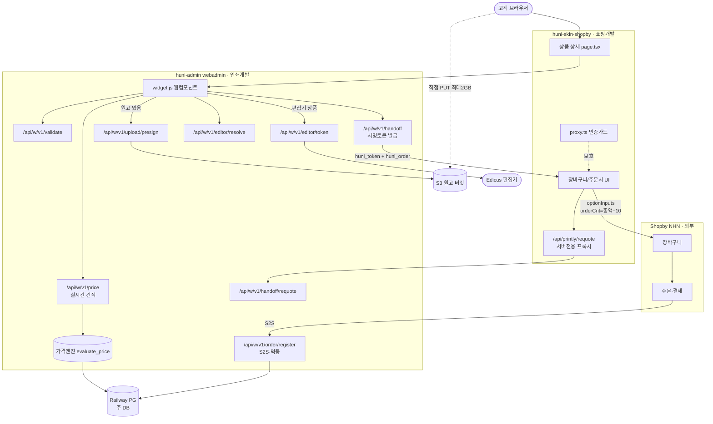

# L0 — 후니프린팅 서비스 연결 지도 (lead 직접 작성 · 2026-09-02)

> 지니 지시: 「먼저 리드가 전체적으로 이 서비스가 어떤식으로 연결되어있는지를 먼저 파악하는 것이 선행. 전체 그림이 없는 상태에서 각 모듈의 연관성 등과 각 역할을 정의하기 어렵다.」
> **순서 정정**: L1~L4(기능목록·인벤토리·병합)보다 이 문서가 선행이어야 했다. L5(역할배정·게이트)는 이 지도 위에서만 그을 수 있다.
> 근거는 전부 코드 실측(file:line). 추정으로 채운 칸 없음. 미확인은 「미확인」으로 표기.

## 1. 시스템 5개와 소유자

| # | 시스템 | 정체 | 오리진/위치 | 우리가 고칠 수 있나 | 3인 중 소유 |
|---|---|---|---|---|---|
| S1 | **huni-skin-shopby** | Next.js 16 자사몰 프론트 | `/Users/innojini/Dev/huni-skin-shopby` | ✅ 전부 | **쇼핑개발** |
| S2 | **Shopby (NHN 커머스)** | 회원·장바구니·주문·결제·정산 **원장** SaaS | 외부 API | ❌ 못 고침 — 제약을 우회할 뿐 | PM(계약) |
| S3 | **huni-admin (webadmin)** | Django. 상품·가격엔진·위젯·원고 | `huni-admin.printly.co.kr` · `raw/webadmin` | ✅ 전부 | **인쇄개발** |
| S4 | **Edicus** | 온라인 디자인 편집기 SaaS | 외부 | ❌ | PM(계약)+인쇄개발(연동) |
| S5 | **Pie Canvas** | 상세페이지 빌더 발행본 | Railway PG `vc_v_product_detail_tabs` | ✅ | 쇼핑개발 |

## 2. ★ 결정적 배선 — 가격 브리지 (이 시스템 전체를 규정하는 제약)

**Shopby 는 외부에서 계산한 금액을 받지 못한다.** 그래서 후니는 이렇게 우회한다:

```
상품을 「판매가 10원」으로 Shopby 에 등록
위젯이 계산한 총액  →  orderCnt = round(총액 ÷ 10)
결제액 = 10원 × orderCnt = 총액
```

근거: `huni-skin-shopby/src/lib/api/widget-order.ts:23-35`
> "shopby 는 외부 금액 지정을 받지 못하므로 «판매가 10원 상품 × 수량(=금액÷10)» 으로 결제 금액을 표현한다(후니 §11 확정). 후니 가격엔진이 청구액 1원 단위를 절삭 → 항상 10원 배수라 정확히 표현된다."

**실제 사양은 어디 있나** — Shopby 의 `optionInputs`(ad-hoc `{inputLabel,inputValue}`) 두 칸에 실린다:
- `huni_token` — 1시간 서명 견적 토큰
- `huni_order` — `{total, qty, summary, qtyRule, editors, files}` JSON

`widget-order.ts:parseWidget()` 이 이걸 되파싱해 화면 표시값으로 복원한다. 장바구니·주문서가 **같은 파서**를 쓴다(드리프트 방지).

> 이것이 runway 원장 `X-PRICE-BRIDGE-01`(5건 흡수 · 「동적 계산가 무손실 환원 경로」)의 실체다.

**이 브리지가 만드는 파생 제약** — L5 가 반드시 반영할 것:
- Shopby 화면의 「수량」은 제작수량이 아니라 **금액÷10** 이다. 고객 노출 UI 전부가 위젯 값으로 덮어써져야 한다.
- 총액이 10원 배수가 아니면 금액이 틀어진다 → 가격엔진의 1원 절삭이 **전제조건**이다.
- Shopby 쿠폰·적립금·배송비가 「10원 상품 × N」 위에서 계산된다 → **프로모션 정책이 이 구조와 충돌하는지 미확인**.
- 토큰 1시간 만료 → 장바구니 체류 후 결제 시 **재견적 필수**.

## 3. 주문 1건이 지나가는 경로 (종단)



### 단계별 실측 근거

| 단계 | 엔드포인트/파일 | 근거 |
|---|---|---|
| 위젯 로드 | `widget.js` | `src/lib/printly/huni.ts:11-14` — `huni-admin.printly.co.kr/static/catalog/widget.js` |
| 실시간 견적 | `POST /api/w/v1/price` | `config/urls.py` · `catalog/widget_api.py` |
| 원고 업로드 | `POST /api/w/v1/upload/presign` → S3 직접 PUT | `widget_api.py:api_upload_presign` — "서버는 **권한만** 내주고 파일은 지나가지 않는다(최대 2GB)" |
| 편집기 | `editor/token`(비밀키 서버전용) → `editor/resolve`(옵션조합→PSCode·템플릿) | `widget_api.py:api_editor_token/api_editor_resolve` |
| 견적 확정 | `POST /api/w/v1/handoff` → 서명 토큰 | `widget_api.py:api_handoff` |
| 장바구니 | Shopby `/cart` + optionInputs 2칸 | `src/lib/api/widget-order.ts:parseWidget` |
| 재견적 | `/api/printly/requote` → `handoff/requote` | `src/app/api/printly/requote/route.ts:13` |
| 주문 확정 | `POST /api/w/v1/order/register` (S2S·멱등) | `widget_api.py:api_order_register` — "사양의 출처는 `token` 또는 `item_id` 중 하나" |

## 4. 신뢰 경계 (보안 설계 — 깨면 돈이 샌다)

| 경계 | 규칙 | 근거 |
|---|---|---|
| 브라우저는 후니를 **직접 부르지 않는다** | 금액 신뢰 경계 + 도메인 화이트리스트 | `requote/route.ts:9-11` |
| `site_key` 는 **서버 env 로만** | 브라우저 노출 금지 | `requote/route.ts:37` |
| 재견적은 **로그인 세션 필수** | 오픈 프록시 방지 | `requote/route.ts:24-31` |
| Edicus 비밀 API 키는 **응답에 절대 미탑재** | | `widget_api.py:api_editor_token` |
| `editor/resolve` 는 **원가 역산 가능 필드 제외** (`use_dims`·`edicus_tmpl_id`·`dim_vals`·matched row) | R2 규칙 | `widget_api.py:api_editor_resolve` |
| 원고 검증 **이중** — presign 시점 + handoff 시점 | 2GB 올린 뒤 퇴짜 방지 | `widget_api.py:api_upload_presign` |
| 「원고 필수」 판정은 **handoff 에서만** | presign 은 고객이 고르는 중이라 안 봄 | 같은 곳 |

## 5. 데이터 저장소 4곳

| DB | 무엇이 사는가 | 접속 | 죽으면 |
|---|---|---|---|
| **Railway PG (주 DB)** `DATABASE_URL` | 상품·가격·옵션·제약·위젯·주문사양 | `catalog/models.py` (모델 60 · `db_table` 120) | 가격엔진·위젯API·운영자화면 **전면 정지** |
| **Printly 커머스 DB** `PRINTLY_DB_URL` | 위젯 해석(`t_wgt_widgets`·`t_wgt_sites`·`t_wgt_widget_versions`·`t_prd_products`) | `src/lib/printly/widget.ts:43` | 위젯 미해석 → **하드코딩 가격 폴백**(`configurator.tsx:45-52`, a4=75000)이 고객에게 노출 |
| **Pie Canvas 발행본** 같은 PG | 상세탭(`vc_v_product_detail_tabs`) | `src/lib/printly/publications.ts:4` | 정적 섹션 폴백(치명 아님) |
| **S3 원고 버킷** | 고객 원고 파일 | presign PUT | 원고 업로드 불가 |
| Redis | 위젯 rate-limit 공유 | `settings.py:339-368` | **현행 Railway 미설정** → LocMem 폴백, 실질 상한 = 값×워커수 |
| Prisma (23모델) | — | `prisma/schema.prisma` | **사문** — `src` import 0건 |

⚠ **미해결 불일치**: 라이브 railway DB 는 44테이블(t_* 34 + Django 10)로 기록돼 있으나 `models.py` 는 모델 60 · `db_table` 120 이다. 코드에만 있는 것 / 라이브에만 있는 것을 가려야 한다. **미확인.**

## 6. API 표면 (실측)

| 그룹 | 개수 | 비고 |
|---|---:|---|
| Shopby API (S1→S2) | **31** 고유 경로 | 상품5·장바구니2·주문서6·마이11·전시3·게시판1·결제1 등 |
| 후니 위젯 API (S1→S3) | **27** 공개 경로 (뷰 함수 116) | `api/w/v1/*` |
| Next.js 자체 라우트 | **7** | 프록시 2 + 인증 3 + `pay-config` + `printly/requote` |
| webadmin 전체 URL | **151** | 운영자 화면 포함 |

## 7. ★ 역할 경계 — 이 지도가 답하는 것

```
┌───────────────── 쇼핑개발 ─────────────────┐   ┌──── 계약(둘의 접점) ────┐   ┌───────── 인쇄개발 ─────────┐
│ huni-skin-shopby 전부                      │   │ handoff 서명토큰 스키마  │   │ huni-admin(webadmin) 전부  │
│ · Shopby API 31 엔드포인트                 │◄─►│ optionInputs 2칸 규약     │◄─►│ · /api/w/v1/* 27 엔드포인트│
│ · proxy.ts 인증가드 · NextAuth             │   │ orderCnt = 총액÷10 규칙  │   │ · 가격엔진 evaluate_price  │
│ · 장바구니/주문서/결제 UI                  │   │ order/register S2S 계약  │   │ · 위젯 widget.js           │
│ · 상세페이지(Pie Canvas 발행본)            │   │ shopby webhook           │   │ · 원고 presign·S3          │
│ · 게스트 구매 · 마이페이지                 │   │ 재견적 토큰 만료 규칙    │   │ · Edicus 서버측 연동       │
└────────────────────────────────────────────┘   └──────────────────────────┘   └────────────────────────────┘
                                    PM: 외부계약(NHN·PG·알림톡·본인인증·Edicus) · 정책 · 정산권위 · 범위결정
```

**접점 6가지가 가장 깨지기 쉬운 곳이다** — 어느 한쪽만 바꿔도 금액이 틀어지거나 주문이 유실된다. L5 는 이 접점들을 **별도 항목**으로 세우고 양쪽 담당을 함께 붙여야 한다.

## 8. ★ 이 지도가 드러낸 결함

| # | 결함 | 근거 | 왜 중요한가 |
|---|---|---|---|
| A-1 | **원고 업로드 버튼이 stub** — 누르면 장바구니 담기가 실행됨 | `configurator-actions.tsx:74-86` | 주문 경로의 원고 단계가 프론트에서 끊김. 서버(presign·S3)는 준비돼 있음 |
| A-2 | **에디터 버튼 `onClick` 없음** | `configurator-actions.tsx:170-176` | 서버에 `editor/token`·`editor/resolve` 가 있는데 **프론트가 부르지 않는다.** shopby 전역에서 Edicus 언급이 주석 2줄뿐 |
| A-3 | **폴백 견적기 가격 하드코딩** | `configurator.tsx:45-52` (`a4=75000`) | 위젯 DB 미해석 시 **틀린 가격이 고객에게 노출** |
| A-4 | Redis 미설정 → LocMem 폴백 | `settings.py:339-368` | rate-limit 실질 상한이 워커수배로 뚫림 |
| A-5 | Prisma 23모델 사문 | import 0건 | 데이터층 이중화 흔적 — 정리 대상인지 미확인 |
| A-6 | DB 테이블 수 불일치(44 vs 60/120) | §5 | 가격·상품 데이터 판정의 토대가 흔들림 |

## 9. 미확인 (정직 고지 · 추정으로 메우지 않음)

- **런타임 미검증** — 전부 정적 코드 판독. 서버를 띄워 실제 호출을 관찰하지 않았다.
- **Shopby 프로모션(쿠폰·적립금·배송비)이 「10원 상품 × N」 구조와 충돌하는지 미확인.** 돈이 걸린 미확인이다.
- **`raw/webadmin` 로컬 체크아웃이 라이브 배포본과 동일한지 미확인.**
- **webadmin `views.py`(4773줄)·`widget_api.py`(4666줄) 전문 미독** — 라우팅표·함수 docstring 기준.
- **Edicus 계약 상태 미확인** — 코드로는 알 수 없다.
- **shopby webhook(`/api/w/v1/shopby/webhook/{secret}`) 의 실제 수신 이벤트 미확인.**

---

# ★ 정정 — 이 문서는 오류를 포함한 초안이다 (지니 지적 2026-09-02)

## 철회하는 진단

| # | 내가 쓴 것 | 실제 | 왜 틀렸나 |
|---|---|---|---|
| **A-1 철회** | 「원고 업로드 버튼이 stub」 | **파일업로드는 위젯(webadmin) 안에 구현돼 있다** | 내가 본 `configurator-actions.tsx` 는 shopby 쪽 폴백 경로였고 고객 실제 경로가 아니다 |
| **A-2 철회** | 「에디터 미배선 — Edicus 언급이 주석 2줄뿐」 | **상품에서 편집 버튼을 누르면 Edicus 가 동작하도록 위젯에 구현돼 있다** | 위젯 내부(webadmin)를 안 보고 shopby 쪽만 grep 했다 |

두 진단 모두 **위젯이 webadmin 에 구현돼 있고 쇼핑몰에 임베딩된다**는 구조를 몰라서 나온 오진이다. 「서버엔 있는데 프론트가 안 부른다」는 결론은 성립하지 않는다 — 부르는 주체가 shopby 코드가 아니라 **위젯 자신**이다.

## 어긴 규칙

- **[HARD] webadmin 구조는 앱 내장 매뉴얼 2종이 1차 참조** (`.claude/rules/moai/domains/huni-webadmin-manual-first.md` · 메모리 `webadmin-manual-first-260823`). 매뉴얼을 읽지 않고 코드만 grep 했다. 지니 지적: 「이런 부분은 webadmin 매뉴얼에 자세하게 되어있지」.
- **라이브 실동작 미확인**. 환경변수의 webadmin 사이트에서 전체 코드+DB 결합 상태로 실제 동작을 볼 수 있는데 보지 않았다.

## 지도에서 통째로 빠진 축 — 생산

지니 지적: 「위젯의 파일업로드되거나 편집을 통해 만들어진 **인쇄데이터는 생산시스템과 연결을 해서 생산이 되어지고 전체 공정라우트를 통해서 포장이 되고 고객에게 배송**되는 전반적인 부분」.

내 지도는 **주문 확정(`order/register`)에서 끝난다.** 그 뒤 절반 — 인쇄데이터 인계 → 생산 → 공정라우트 → 포장 → 배송 — 이 통째로 없다. 인쇄 쇼핑몰에서 이건 부록이 아니라 **본체의 절반**이고, 테스트 시나리오의 「사람이 개입해야 하는 부분」이 대부분 여기 있다.

## lead 역할 오판 — 방법 자체가 틀렸다

지니 지적: 「리드가 중요한 부분이야. **이런 부분을 너가 하지말고 어떤 일을 할지를 잘 정해서 각 레인에게 역할을 맡기면** 좋을 것 같아」.

나는 파일 3~4개를 직접 읽고 시스템 전체를 판정했다. 그 얕이가 A-1·A-2 오진을 낳았다. lead 의 일은 **직접 파는 것이 아니라 무엇을 모르는지 정의하고 조사 축을 설계해 배분하고 결과를 교차검증해 합치는 것**이다. 이 문서는 그 원칙을 어긴 산출물이므로 **초안**으로만 쓰고, 아래 재설계된 조사가 이를 교정·대체한다.

## 살아남는 부분 (교정 대상 아님 — 다만 lane 재검증 필요)

- §2 가격 브리지(`orderCnt = 총액÷10`) — `widget-order.ts:23-35` 코드 주석 직접 인용이라 사실 자체는 성립. 다만 **파생 제약과 프로모션 충돌 여부는 여전히 미확인**.
- §4 신뢰 경계 — docstring 직접 인용.
- §5 저장소 목록 · §6 API 표면 개수 — 기계 집계.
- A-3(폴백 하드코딩 `a4=75000`)·A-4(Redis 미설정)·A-5(Prisma 사문)·A-6(테이블 44 vs 60/120) — 기계 실측이라 유지. 단 A-3 는 「폴백 경로가 살아있는 것 자체」가 정리 대상인지 재판정 필요.
