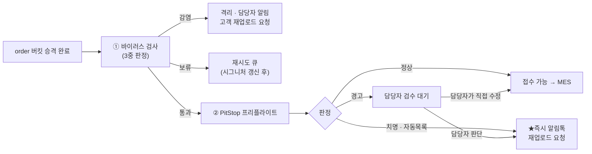

# M3 — 프리플라이트(접수 전 원고 검사) 아키텍처

> 작성 2026-09-02 · lane `sync-huniweb`
> **완료조건 ④ 「프리플라이트 현재 구현 여부 판정(추정 금지)」에 답하는 문서.**

---

## 0. 판정 — **미구현. 인프라도 미도입.**

| 축 | 판정 | 근거 |
|---|---|---|
| **코드** | ❌ 없음 | `raw/webadmin` 앱 전수 grep: `pitstop` **0** · `preflight` **0**(앱 코드) · `n8n` **0** · `clamav`/`virus` **0** |
| **인프라** | ❌ 미도입 | `aws-architecture-huni.pdf` p.4 표 — PitStop Server 는 「**향후 · 추가 예정**」, p.12 프로비저닝 체크리스트에서 **확장(필요 시점)** 칸 |
| **로드맵 위치** | 5단계 중 **4단계** | 같은 PDF p.13 §9 — 1단계 가성비 → 2단계 MES 연동 → 3단계 무중단·확장 → **4단계(인쇄 자동화) PitStop + S3/SQS 프리플라이트** → 5단계 본격 확장 |
| **착수 순서** | **MES 인터페이스 뒤** | `order-to-mes-process.md` §11 — 「먼저 ①원고 승격 → ②MES 인터페이스 / 나중: 파일 검사」 |
| **설계** | ✅ **확정돼 있음** | `order-to-mes-process.md` §5 · `artwork-scan-integration.md` · `artwork-scan-engine-review.md` |

> **지금 이 일은 사람이 한다.** 「검사 없이 접수하는 것은 **지금 운영 방식과 같다**(사람이 눈으로 확인)」 — 설계문서가 스스로 그렇게 적었고, 그래서 중간 단계로 성립한다고 판단했다. 발주팀 「파일확인/파일명」 업무(주문프로세스 PDF p.5 §05)가 그 실체다.

---

## 1. 설계된 순서 — 2단 검사



**[HARD] 바이러스 검사의 「보류」는 통과가 아니다.** 스캔 실패·타임아웃·시그니처 오래됨 → 재시도 큐. 기본값이 통과면 방어가 무너진다.

---

## 2. ① 바이러스 검사 — 왜 3중으로 보나

Windows Defender **실시간 보호는 판정 수단이 아니라 안전망**이다:

- 깨끗하면 → **아무 신호도 없음**(검사했다는 증거가 안 남는다)
- 악성이면 → 파일이 조용히 격리·삭제 → 워크플로우는 **"파일 없음" 오류**만 본다 (다운로드 실패인지 감염인지 코드가 구분 못 함)

⇒ **명시적 온디맨드 스캔 + 3중 교차 확인**:

| 확인 | 방법 | 의미 |
|---|---|---|
| 스캔 실행 결과 | `MpCmdRun.exe -Scan -ScanType 3 -File <경로>` 종료코드 / `Start-MpScan` | 1차 판정 |
| 탐지 기록 조회 | `Get-MpThreatDetection` · Defender 이벤트 로그 | 실제 무엇이 탐지됐나 |
| **파일 존재·해시** | 스캔 후 파일이 그대로 있는지 | **실시간 보호가 이미 지웠는지** 판별 |

+ **시그니처 신선도** 확인(`Get-MpComputerStatus`). 마지막 갱신이 며칠 지났으면 **결과를 신뢰하지 않고 보류**.

**알려진 위험 2건**(도입 시 실측 고정 필요):
1. `MpCmdRun.exe` **종료 코드 의미가 공식 문서화돼 있지 않고** 버전마다 해석이 다르다는 보고.
2. **SYSTEM 계정 실행·동시 다중 스캔에서 실패가 잦다**는 보고 → 우리는 **동시 4~5작업**을 계획하므로 직접적 위험. → **스캔 단계만 직렬화**(PitStop 변환은 병렬 유지).

**엔진 선택**: 오픈은 **Windows Defender**(비용 0) → 교체 후보는 CLI 형(ESET `ecls.exe` · Kaspersky `KAVSHELL SCAN` · Trellix) / **API 형이 중장기 유력**(Kaspersky Scan Engine — REST+ICAP, **S3·컨테이너 공식 지원** · WithSecure Atlant). 교체 트리거: 스캔 실패·재시도 잦음 / 검사 이력 증빙 요구 / 물량 병목.

**작업 폴더 정책**: 실시간 보호 **제외 + 온디맨드 명시 검사**를 택하되, **"검사 없이 PitStop 투입" 경로가 코드상 존재하지 않도록** 만든다.

---

## 3. ② PitStop 프리플라이트 — 무엇을 검사하나

> **[미확인 · U-4]** PitStop **프로파일이 확정되지 않았다.** 아래 목록은 설계문서의 **초안**이며, 실제 목록은 프로파일 확정 시 **접수담당자와 함께 고정**한다(`order-to-mes-process.md` §12-6). 추정으로 확정하지 않는다.

### 3.1 3갈래 분기 — 「자동 발송 목록」을 좁게 유지

| 분기 | 언제 | 누가 판단 | 고객에게 가는 것 |
|---|---|---|---|
| **A. 자동 재업로드 요청** | 사람이 봐도 결론이 뻔한 오류 | **시스템**(사전 정의 목록) | **즉시 알림톡** + 재업로드 링크 |
| **B. 담당자 검수** | 애매하거나 담당자가 고칠 수 있는 것 | **접수담당자** | (고치면) 아무것도 안 감 |
| **C. 담당자 발 재업로드 요청** | 담당자가 "고객이 다시 올려야 한다" 판단 | **접수담당자** | 담당자가 버튼을 눌러 알림톡 |

### 3.2 A 목록 (자동 발송) — 초안, 좁게

- 파일이 열리지 않음 / 손상됨
- **암호(비밀번호)가 걸려 있음**
- 폰트 미포함으로 열리지 않음
- **페이지 수가 주문 사양과 다름**(예: 8페이지 주문에 6페이지 파일)
- **재단 여백(도련)이 아예 없음**
- 실제 인쇄 크기가 **주문 규격과 명백히 다름**

### 3.3 B 로 남기는 것 (담당자가 고칠 수 있는 것)

RGB→CMYK 변환 · 약간의 저해상도(150~300dpi 구간) · 오버프린트 설정 · 여백 소폭 부족 · 별색 채널 정리.

> **왜 좁게 두는가**: 「이런 것까지 자동으로 고객에게 보내면 **고칠 수 있는 일로 고객을 괴롭히게 되고, 주문 이탈이 생긴다.**」

### 3.4 카드가 물은 검사 항목 대조

| 카드가 물은 것 | 설계에 있나 | 분기 |
|---|---|---|
| 재단선·블리드(도련) | ✅ 「재단 여백이 **아예 없음**」 | A |
| | ✅ 「여백 **소폭 부족**」 | B |
| 해상도 | ✅ 「약간의 저해상도(150~300dpi)」 | B |
| 폰트 | ✅ 「폰트 미포함으로 열리지 않음」 | A |
| 색상 | ✅ 「RGB→CMYK 변환」·「별색 채널 정리」·「오버프린트」 | B |
| 페이지수 | ✅ 「주문 사양과 다름」 | A |
| 크기 | ✅ 「주문 규격과 명백히 다름」 | A |

**7개 축 전부 설계에 있다.** 다만 **임계값(dpi 몇 이하가 A 인가, 도련 몇 mm 인가)은 미확정**이다.

---

## 4. 어디서 도는가 — 실행 위치

| 요소 | 위치 | 상태 |
|---|---|---|
| PitStop Server | **EC2 Windows** (예: `t3.xlarge` + Win, ~$150–250/월) | ❌ 미도입 |
| 오케스트레이션 | **n8n 워크플로우** | ❌ 미구축 |
| 트리거 | **S3 이벤트/폴링 → SQS(프리플라이트 큐)** | ❌ 미구성 |
| 대상 파일 | **order 버킷 승격본** (tmp 아님) | ✅ 승격은 라이브 |

n8n 배치 초안:

```
S3 이벤트/폴링 → 다운로드 → [스캔 노드] → 분기
                              ├ 통과 → PitStop 핫폴더 → 산출물 업로드 → 주문 상태 갱신
                              ├ 감염 → 격리 이동 + 담당자 알림 + 고객 재업로드 안내
                              └ 보류 → 재시도 큐(시그니처 갱신 후 재검사)
```

스캔 노드는 PowerShell 실행 + 3중 확인을 **한 묶음으로 감싸 단일 판정값**을 돌려준다 → 나중에 엔진만 교체해도 나머지 흐름은 그대로.

---

## 5. 실패 시 고객에게 무엇이 보이나

### 5.1 재업로드 경로 (설계 확정 · 미구현)

Shopby 주문 상세 화면에는 **파일을 올리는 기능이 없다.** 그래서 **우리가 재업로드 전용 링크를 발급**한다.

- 서명된 **1회성 URL** — 주문번호 + 주문상품옵션번호 + 구성원/순번에 바인딩, **유효기간 7일 권장**
- 화면은 **위젯의 업로드 컴포넌트 재사용** — 고객은 "어느 파일을 다시 올려야 하는지"만 보면 된다
- 업로드되면 **회차(r2, r3…)가 올라가고 검사·프리플라이트가 자동 재실행**
- 통과하면 담당자에게 "재업로드 접수됨" 알림 → 담당자가 접수 진행

### 5.2 이 구간의 주문상태 — 취소 권리가 유지된다

> **이 구간 동안 주문상태는 `PAY_DONE`(결제완료)로 유지한다. 상품준비중으로 올리지 않는다.**
> 즉 **고객이 취소할 수 있는 상태가 유지되는 것이 맞다** — 파일이 잘못돼 못 만들고 있는 상황이라 고객의 취소 권리를 막을 이유가 없다.

### 5.3 알림 경계 — 파일 관련만 우리가 보낸다

| 알림 | 보내는 주체 |
|---|---|
| 주문 접수 / 입금 확인 / 배송 시작 / 배송 완료 / 취소·환불 | **Shopby**(기본 기능) |
| **파일 오류 → 재업로드 요청**(자동 · 담당자 발 둘 다) | **우리** |
| 재업로드 접수 확인 | **우리** |
| 가상계좌 입금기한 임박 안내 | Shopby(설정) |

**실무 주의**: 카카오 알림톡은 **템플릿을 미리 카카오에 심사·승인**받아야 발송된다(보통 영업일 며칠). **템플릿 문구는 개발 시작 시점에 같이 신청**해야 일정이 안 밀린다. 발송 실패(카톡 미사용·수신거부) 대비 **SMS/LMS 자동 대체**를 걸어 둔다.

---

## 6. 지금 라이브에 있는 「검사」 — 프리플라이트가 아니다

혼동 방지. 아래는 **이미 라이브지만 프리플라이트가 아니다.**

| 라이브 검증 | 언제 | 무엇을 보나 | 프리플라이트인가 |
|---|---|---|---|
| presign 시점 검증 | 업로드 URL 요청 시 | 확장자·개수 계약 | ❌ 계약 검증 |
| **handoff `_check_files`** | 장바구니 담기(서명) 시 | 허용 확장자·개수 — **서명 안에 박제**되어 이후 위변조 불가 | ❌ 계약 검증 |
| **승격 검증**(`artwork_promote.py`) | SF-1 수신 시 | `head_object` 로 **원본 실존 + 크기 실측 대조** — presign 은 크기를 강제 못 하므로 **여기가 처음 강제되는 지점** | ❌ 무결성 검증 |
| 「원고 필수」 판정 | **handoff 에서만** | presign 은 고객이 고르는 중이라 안 봄 | ❌ |

**셋 다 PDF 내용을 열어보지 않는다.** 프리플라이트는 **PDF 안을 읽는 검사**다.

**승격 실패는 fail-closed**: 조용히 통과시키지 않고 **주문을 `HOLD`로 세우고 사유를 남긴다.** 3개 중 1개만 실패해도 그 주문은 보류. 성공한 파일은 그대로 두고 재시도로 회복.
⚠ 단 **담당자 알림(알림톡·메일)은 아직 없다** — 지금은 로그와 주문 상태가 그 자리이고, **담당자용 보류 주문 목록 화면도 없다**(DB 조회로만 확인 가능).

---

## 7. 회차(revision) 규약 — 프리플라이트가 전제하는 것

재업로드가 생기면 같은 자리에 파일이 두 번 이상 올라간다. **덮어쓰지 않고 쌓는다.**

```
orders/{사이트}/{주문번호}/{주문항목번호}/{구성원}/{순번}/r{회차}/{uuid}.{확장자}
```

- 이유: 사고 시 **"무엇을 보고 만들었는지"** 를 되짚어야 하고, **MES 가 이미 가져간 파일과 새 파일을 구분**해야 한다.
- **MES 에 넘기는 것은 항상 최신 회차**이며, 회차가 올라가면 MES 에 **파일 교체를 통보**한다(MES-3).
- 셋트가 아닌 상품은 구성원 자리에 **`single`**.
- 규약의 단일 출처는 `catalog/s3_artwork.py` `build_order_key()` 한 곳.
- ✅ **이 규약과 승격은 라이브**(2026-08-18). ❌ **회차 증가를 유발하는 재업로드 경로는 미구현.**

---

## 8. 감사 기록으로 남길 것 (설계 · 미구현)

주문/작업 건마다: 검사 시각 · 엔진/시그니처 버전 · 판정(통과/감염/보류) · 탐지명 · **파일 해시(스캔 시점, 이후 변조 확인용)** · PitStop 처리 결과(성공/실패 · 프리플라이트 리포트).

---

## 9. 미확인 (추정 금지)

| # | 미확인 | 누구에게 |
|---|---|---|
| U-4 | **PitStop 프로파일 · A목록 최종 확정 · 검사 임계값(dpi·도련 mm)** | 접수담당자 |
| U-7 | order 버킷 **보존기간**(제안 1년) + 미입금 취소분 태그 규칙 | AWS 담당자 |
| P-1 | PitStop **라이선스 보유 여부·판수** | PM |
| P-2 | n8n **호스팅 위치**(PitStop 서버 동거 vs 별도) | 인프라 |
| P-3 | 사내 보유 **서버용 백신 라이선스**가 있는지 — 있으면 그 제품의 CLI/API 지원 여부를 먼저 확인(추가 비용 없이 더 나은 인터페이스) | 사내 |
| P-4 | 대용량(**1~2GB**) 파일에 스캔 엔진 크기 제한이 있는지 | 총판 |
