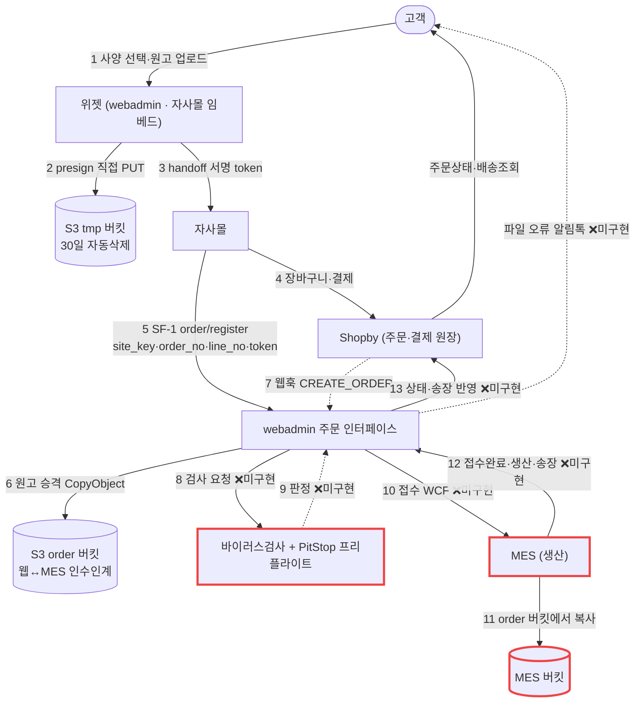

# M3 — 주문확정 → 배송 종단 사슬

> 작성 2026-09-02 · lane `sync-huniweb` · 카드 M3
> **정독 근거**: `docs/huni/후니프린팅_주문프로세스_20251001.pdf`(12p) · `후니프린팅_공정관리_시행초안_20260210.pdf`(2p) · `aws-architecture-huni.pdf`(13p) → `raw/webadmin/tools/manual_content.py`(운영자 매뉴얼 원고) → 라이브 `https://huni-admin.printly.co.kr/admin/`(2026-09-02 실접속) → 코드 대조.
> **[HARD] 미확인은 「미확인」으로 적었다.** 추정으로 메운 칸 없음.

---

## 0. 한 줄

주문이 확정된 뒤의 절반은 **거의 전부 MES 가 한다.** 후니 신규 시스템(webadmin)이 그 절반에 대해 지금 가진 것은 **주문 사양을 받아 두는 그릇(SF-1)과 원고를 안전한 버킷으로 옮기는 승격 하나**뿐이고, **MES 로 넘기는 관은 아직 없다.** 그 관의 설계는 확정돼 있다 — 코드가 없을 뿐이다.

---

## 1. 이 사슬에 등장하는 시스템 (M3 축의 분모)

| 시스템 | 정체 | 이 사슬에서 하는 일 | 우리가 고칠 수 있나 |
|---|---|---|---|
| **Shopby (NHN)** | 커머스 SaaS | 주문·결제·환불·배송조회 **원장**. 고객이 보는 주문상태는 전부 여기 | ❌ (API 만) |
| **자사몰**(huni-skin-shopby) | 스토어프론트 | 위젯 임베드 + 장바구니 + **주문 등록 API 1건 호출**. 결제 이후 관여 안 함 | ✅ 쇼핑개발 |
| **webadmin**(huni-admin, Django) | 상품·가격·위젯·원고 | 사양·파일의 원장. **「주문 인터페이스」 역할이 이번에 새로 붙는다** | ✅ 인쇄개발 |
| **MES** | **별도 시스템** · EC2 Windows · SQL Server + WCF + WinForms | **생산·작업지시·공정·출고·송장.** 접수담당자가 일하는 곳 | ✅ (별도 개발자 · PM 보유) |
| **PitStop Server** | EC2 Windows · **미도입** | PDF 프리플라이트 | 도입 예정 |
| **외주처** | 비즈하우스·후지필름·컨티뉴·쿠마샵·박작업·현수막·합판·고주파·폰케이스 | 일부 공정/제작 대행 | ❌ |

**근거**: `aws-architecture-huni.pdf` p.4 표 · p.5 §2 · `order-to-mes-process.md` §1 · `주문프로세스.pdf` p.5 §05 · p.9 §03-1.

---

## 2. 종단 사슬 (13단계)



**끊김 지점은 8번부터다.** 6번까지는 라이브에 있고, 7번은 수신함만 있고, 8~13번은 **설계만 있고 코드가 없다**(§4 판정표).

---

## 3. 단계별 상세 — 무엇이 · 누가 · 지금 되는가

| # | 단계 | 주체 | 트리거 | 지금 상태 | 근거 |
|---|---|---|---|---|---|
| 1 | 사양 선택 + 원고 업로드 | 고객 | — | ✅ 라이브 | 위젯 · M1 축 |
| 2 | tmp 버킷 presign 직접 PUT | 브라우저 | 원고 선택 즉시 | ✅ 라이브 | `order-to-mes-process.md` §4-1 |
| 3 | handoff 서명 token 발급 | webadmin | 장바구니 담기 | ✅ 라이브 | `widget_api.py:3388` payload |
| 4 | Shopby 주문·결제 생성 | 자사몰→Shopby | 결제 | ✅ 라이브 | `ARCHITECTURE.md` §2 |
| 5 | **주문 등록 SF-1** | 자사몰→webadmin | 주문 생성 직후 | ✅ **엔드포인트 라이브 · 실주문 0건**(§5) | `config/urls.py:267` · `widget_api.py:api_order_register` |
| 6 | **원고 승격 tmp→order** | webadmin | SF-1 수신 시(웹훅은 보정) | ✅ 코드 라이브 · 실행 0건 | `catalog/artwork_promote.py` |
| 7 | Shopby 웹훅 수신 | Shopby→webadmin | 주문 생성·상태변경 | ⚠ **수신함만** — 원문 저장 후 200. **소비자 없음** | `catalog/shopby_hook.py` · 소비자 grep 0건 |
| 8 | 바이러스 검사 | (원고처리 서버) | 승격 완료 후 | ❌ **미구현** | 코드 grep: `clamav|virus` 0건 |
| 9 | PitStop 프리플라이트 | PitStop Server | 검사 통과 후 | ❌ **미구현 · 서버 미도입** | grep `pitstop` 0건 · `aws-architecture-huni.pdf` p.13 로드맵 4단계 |
| 10 | **MES 접수 (WCF)** | webadmin→MES | 결제완료 + 검사통과 | ❌ **미구현** | grep `wcf|zeep|soap` 0건 |
| 11 | MES 버킷으로 파일 복사 | MES | 접수 시 | ❌ (10 의 종속) | `order-to-mes-process.md` §4-3 |
| 12 | MES→우리 상태·송장 통보 | MES→webadmin | 접수완료·생산·출고 | ❌ **미구현** (API 4종 정의서 미작성) | 같은 문서 §8.4 · §11 2단계 |
| 13 | Shopby 상태·송장 반영 | webadmin→Shopby | 12 수신 시 | ❌ **미구현** (엔드포인트만 확정) | 같은 문서 §8.2 · §11 3단계 |

---

## 4. 사슬이 실제로 끊기는 곳 — 3개

| 끊김 | 어디서 | 결과 |
|---|---|---|
| **끊김 A** | 6 → 10 사이 (webadmin → MES) | **결제된 주문이 생산에 도달하지 못한다.** 현재는 사람이 MES 에서 직접 주문을 만들어 메꾸는 구조(주문프로세스 PDF `case5 신용결제 (MES에서 생성된 주문) 제작대기에서 시작`) |
| **끊김 B** | 12 → 13 (MES → Shopby) | **고객 주문상태가 결제완료에서 멈춘다.** 상품준비중·배송준비중·송장은 판매자가 써 넣어야 올라가는 칸인데(§6.1) 써 넣는 관이 없다 |
| **끊김 C** | 7 (웹훅 수신함) | 원문만 쌓이고 **아무도 읽지 않는다.** 취소·입금완료 이벤트가 처리되지 않는다 |

**끊김 A 가 이 축의 최우선이다** — B·C 는 A 뒤에 온다.

---

## 5. 라이브 실측 (2026-09-02 · 읽기전용 SELECT)

| 항목 | 값 | 뜻 |
|---|---:|---|
| `t_ord_orders` 행수 | **0** | SF-1 엔드포인트는 라이브지만 **실주문이 한 건도 안 들어왔다** |
| `t_ord_artworks` 행수 | **0** | 승격 코드가 실전에서 한 번도 돌지 않았다 |
| `t_ord_webhooks` 행수 | **0** | 웹훅 URL 이 Shopby 에 아직 등록되지 않았다(또는 이벤트 미발생) |
| `MES_ITEM_CD` 충전 | **15 / 269 활성상품 (5.6%)** | 설계문서가 2026-08-18 에 「15개」로 적은 수치가 **2주 뒤에도 그대로** — 진전 없음 |
| `t_proc_processes` (활성) | **143** | 공정 마스터는 있다 |
| 주문/생산/배송 테이블 | `t_ord_orders` · `t_ord_artworks` · `t_ord_webhooks` **3개뿐** | 라우트·포장·배송·MES 매핑 테이블 **없음** |

> 명령: `raw/webadmin/.venv/bin/python` + Django `connection.cursor()`, `information_schema` 및 각 테이블 `count(*)`.
> `MES_ITEM_CD` 는 대문자 컬럼이라 `"MES_ITEM_CD"` 로 인용해야 한다(소문자로 쓰면 `column does not exist`).

**MES 품목코드 5.6% 는 끊김 A 의 선행 블로커다.** 상품↔MES 품목 매핑이 없으면 접수 payload 를 만들 수 없다.

---

## 6. 라이브 webadmin 화면 실측 — 생산 화면이 **없다**

2026-09-02 `https://huni-admin.printly.co.kr/admin/` 사이드바 전수(31 항목):

```
상품정보 · 상품 뷰어 · 셋트상품 관리 · 추가상품 템플릿 · 상품별 Edicus 템플릿 연결
상품별 작업가이드 파일 · 상품별 메인이미지 · 상품별 시작가 · 상품별 디자인
카테고리 · 자재정보 · 용지 관리 · 사이즈정보 · 도수정보 · 인쇄옵션 · 공정정보 · 기초코드정보
가격공식 · 가격구성요소 · 할인테이블(수량구간) · 가격 뷰어 · 가격 시뮬레이터
위젯빌더 · 상품별 위젯 관리 · 위젯 템플릿 관리
고객 · 사용자 · 퀵스타트 가이드 · 메뉴얼 · 위젯빌더 메뉴얼 · 테이블 명세서
```

**주문 · 생산 · 공정관리(현장) · 포장 · 출고 · 배송 · 외주 화면이 하나도 없다.**
「공정정보」는 **기준정보 마스터**(공정 코드·상세옵션·책등계산·작업여백)이지 생산 현장 관리 화면이 아니다 — 매뉴얼 `manual_content.py:570` 이 「공정 마스터」로 명시.

증거: `evidence/admin-sidebar-260902.png`

**따라서 이 축의 화면은 전량 MES(WinForms) 쪽에 있다.** webadmin 에는 설계문서가 예고한 담당자용 화면(보류 주문 목록·실패 주문 목록·처리 현황 대시보드)조차 아직 없다(`order-to-mes-process.md` §11 1단계 남음 · 3단계 · 5단계).

---

## 7. 상태값 3열 매핑 (설계 확정 · MES 열은 추정)

| Shopby (고객이 보는 것) | webadmin (내부 진실) | MES (생산 현장) | 취소 |
|---|---|---|---|
| (주문 생성 직후) | `REGISTERED` ✅라이브 | 미전송 | 가능 |
| — | `PROMOTING` ✅라이브 | 미전송 | 가능 |
| — | `PROMOTED` 원고 준비완료 ✅라이브 | 미전송 | 가능 |
| — | `HOLD` 보류 ✅라이브 | 미전송 | 가능 |
| `DEPOSIT_WAIT` 입금대기 | `AWAIT_PAY` | 미전송 | 가능 |
| `PAY_DONE` 결제완료 | `PAID` | 미전송 | 가능 |
| `PAY_DONE`(유지) | `FILE_CHECK` 파일검사중 ❌ | 미전송 | 가능 |
| `PAY_DONE`(유지) | `FILE_HOLD` 원고보완대기 ❌ | 미전송 | 가능 |
| `PAY_DONE`(유지) | `MES_SENT` 접수전송됨 ❌ | 접수대기 | ⚠ 조건부 |
| **`PRODUCT_PREPARE`** ← 우리가 씀 ❌ | `IN_PRODUCTION` ❌ | 접수완료→생산대기→생산중 | ❌ **불가** |
| `PRODUCT_PREPARE`(유지) | `PRODUCED` ❌ | 생산완료 | ❌ |
| **`DELIVERY_PREPARE`** ← 우리가 송장 등록 ❌ | `SHIPPED` ❌ | 출고완료(송장 발행) | ❌ |
| `DELIVERY_ING` / `DELIVERY_DONE` / `BUY_CONFIRM` | `SHIPPED` / `DONE` ❌ | — | ❌ |
| `CANCEL_DONE` | `CANCELED` ❌ | 취소통보 | — |

✅ = 라이브 · ❌ = 미구현. **라이브에 있는 상태는 4개(REGISTERED/PROMOTING/PROMOTED/HOLD)뿐**이며 `artwork_promote.py:49-52` 에서 확인된다. 나머지는 설계상의 이름이다.

**[미확인] MES 실제 상태 코드·명칭.** 위 「MES」열은 설계문서 §12-1 이 스스로 **추정**이라고 명시했다. MES 담당과 맞춰야 고정된다. 다만 `공정관리 PDF` p.1 Summary 에는 현장 어휘가 나온다 — `출력완료 / 커팅완료 / 봉제미싱입고 / 아크릴가공입고 / 제본입고 / 박작업입고 / 제본시작 / 봉재시작 / 가공시작 / 제작완료 / 송장출력`. 이것이 MES 상태값 후보다.

---

## 7.1 취소 경계 — 돈이 걸린 한 줄

> **MES 「접수완료」 순간부터 고객 셀프 취소는 불가능하다.**
> 그 순간 우리가 Shopby 를 `PRODUCT_PREPARE` 로 올리고, Shopby 기본 정책상 고객은 즉시 취소를 못 하게 된다(취소요청 → 판매자 승인).

3단 게이트:

| 게이트 | 구간 | 방식 |
|---|---|---|
| ① 고객 셀프 취소 | 입금대기 ~ MES 접수 직전 | Shopby 마이페이지 즉시 취소 → `CANCEL_DONE` 웹훅 → MES 전송 중단 |
| ② 고객 취소 **요청**(승인 필요) | MES 접수완료 이후 | Shopby 클레임 → 담당자가 생산 상황 보고 승인/거부 |
| ③ **접수담당자 취소**(MES 발) | 언제든(생산 착수 전 권장) | MES 화면 취소 → 우리 API → 우리가 Shopby 취소 실행 → 환불 |

**③ 의 방향이 반대라는 것이 핵심**이다 — 돈은 Shopby 만 돌려줄 수 있으므로 MES 는 취소를 *실행*하지 않고 *요청*한다.

**경합 방어**: 우리 DB 의 `cancelable` 플래그를 **먼저 잠그고(CAS) 나서 행동한다.** 생산 시작 뒤 도착한 취소는 자동 환불하지 않고 **사람에게 넘긴다.** (`order-to-mes-process.md` §7.3) — **전부 미구현.**

---

## 8. 포장 · 출고 · 배송

### 8.1 현장 절차 (주문프로세스 PDF p.1 · p.4)

```
제작완료 판정: (제작번호별) 바코드입력 → 포장완료로 상태변경
               → if 모든 상품이 포장완료이면 제작완료
출고: case1 택배출고 → 송장출력 → (주문번호별) 바코드입력 → 출고완료
      case2 퀵      → 납품명세서
      case3 직접방문 → 출고명세서
```

- **포장은 「1차포장」과 「박스포장」 2단**이다(공정관리 PDF): 대부분 라우트의 마지막이 `1차포장`, 실사/사인·투명실사·커팅류는 `1차포장+박스포장`.
- 조직: `1차포장 : 제작완료` · `박스포장 : 송장출력` (공정관리 PDF Summary).
- **(오프라인 주문 외) 전상품 출고지 단일화** — 주문프로세스 PDF p.3 §03 하단 명시.

### 8.2 배송사 연동 · 배송상태 회신

| 항목 | 사실 | 근거 |
|---|---|---|
| 송장 등록 주체 | **MES** 가 발행 → 우리에게 통보(FR-2) → 우리가 Shopby `PUT /orders/prepare-delivery` → `PUT /orders/delivery` | `order-to-mes-process.md` §8.2 TO-3 · §8.4 FR-2 |
| 고객 배송조회 | **Shopby 기본 기능** (택배사 추적) | 같은 문서 §10 |
| 배송 알림 발송 | **Shopby** (우리는 파일 관련 알림만) | 같은 문서 §10 표 |
| 배송사 직접 연동 | **없다** — 우리는 `invoiceNo` + `deliveryCompanyType` 만 Shopby 에 넘긴다 | 같은 곳 |
| 한 주문 다중 송장 | **요구사항으로 명시됨** — 「하나의 주문에 여러개의 송장부여가 가능하도록 합니다」 | 주문프로세스 PDF p.5 §05 출고 Pain point |
| 합배송 | **현행 Pain point** — 장바구니가 없어 의뢰서에 메모해 수동 처리. 신규는 장바구니로 해결 예정 | 같은 곳 |
| 제주/추가배송비 | **현행 부과 안 됨** — 전화로 받는 중. 신규 Front 에서 해결 예정 | 같은 곳 |

**[미확인] 배송사(택배사) 계약·API·`deliveryCompanyType` 코드값.** PDF·매뉴얼·코드 어디에도 없다.

### 8.3 배송지 변경

`UPDATE_RECEIVER` 웹훅 → 우리가 MES 에 통보(MES-4) → **출고 전에만 유효**. 미구현.

---

## 9. 클레임 · 재제작 (주문프로세스 PDF p.7 §07)

| 유형 | 처리 |
|---|---|
| **재제작 + 재배송** | 일부 재제작 / 전체 재제작. **MES 내에서 주문복사 또는 오프라인주문으로 처리** — front 페이지와 연동 안 해도 됨 |
| **주문취소(환불)** | 부분환불 → 취소처리 안 함(매출과 안 맞음) · 전체환불 → 주문취소처리. 이니시스 취소 또는 무통장 |
| **반송** | Nfocus 에서 반송요청. 주문에 **정산관련 메모필드 추가** · 반송비 부담 · 재제작 비용부담 · **반송여부만 체크** |
| **재출고** | 신규송장 부여 — 상품누락 추가발송 / 교환 재발송 |

설계 보강(POD 법적 성격): 주문제작 상품은 단순변심 청약철회 예외. `RETURN_DONE`/`EXCHANGE_DONE` 웹훅은 **기록만 하고 자동으로 MES 작업을 만들지 않는다** — 재제작은 담당자가 MES 에서 직접 지시(`order-to-mes-process.md` §7.4).

---

## 10. 세금계산서

「주문정보에 세금계산서 발행여부와 발행날짜 정보 → **추후 고도화**」 (주문프로세스 PDF p.7 §08). 1차 범위 밖.

---

## 11. 조직·권한 (주문프로세스 PDF p.4 §04)

7개 조직이 MES 화면 권한 축이다.

| 조직 | 업무 | MES 화면 |
|---|---|---|
| 마스터관리 | 상품등록/관리 · 통계 · 온라인업체정산 | 거래처별 주문EXCEL다운(가격없어도 됨) |
| 상품/마케팅 | 상품평 · 댓글 · 프로모션 | — |
| **발주** | 주문확인/등록 · **파일확인/파일명/파일분배** · **조판** · 외주발주 · 송장피드백 · CS | 출력파일업로드 · **작업의뢰서**(대표썸네일 / EXCEL) · 외주발주서 · **★005발주서** · 주문IMPORT · 송장EXCEL · 외주파일다운로드 |
| **생산** | 자재 입/출고 | **파일다운로드** |
| **출고** | 1차포장 · 박스포장 · 재고상품관리 · 송장출력 | 포장완료 처리(바코드) · 송장출력(바코드) · 송장추가출력 · 납품명세서 · 출고명세서 · **★썸네일 보는 화면** |
| 외주관리 | 외주제작 입/출고 · 외주공정 제작물 입/출고 | 외주공정 주문리스트 · 외주처별 생산리스트 |
| 회계 경리 | 환불(이니시스/이체) · 무통장 입금관리 · 견적서/거래명세서 발송 · 청구서 · 세금계산서 | 거래처별 청구서(오프라인주문/금액있음) |

★ **오프라인 주문**(EXCEL 로 거래처별 주문 + 금액 입력)이 별도 경로로 존재한다 — 자사몰을 안 거치는 주문이다.

**파일 다운로드 권한은 팀별로 갈린다**(PDF p.9 §03-1): 디지털인쇄팀(디지털인쇄) · 특수인쇄팀(실사출력·시트커팅·레이저커팅) · 커팅파트(반칼/완칼) · 쿠마샵 외주(화이트인쇄·패브릭출력·UV평판출력·전사인쇄). 조건은 **「제작중 상태 and 품목관리에서 생산다운 여부 Y」**.

---

## 12. 이 문서가 답하지 못한 것 (미확인 목록)

| # | 미확인 | 왜 못 채웠나 | 누구에게 물어야 하나 |
|---|---|---|---|
| U-1 | **MES 실제 상태 코드·WCF 메서드/필드 스펙** | 우리 저장소에 MES 소스·스펙이 없다 | MES 담당 개발자 |
| U-2 | **MES 인계 방식이 정말 WCF 인가** — 설계는 WCF 로 확정했으나 **코드가 0줄**이라 실증 불가 | 구현 전 | MES 담당 · PM |
| U-3 | 배송사(택배사) 계약·API·`deliveryCompanyType` 코드값 | 문서·코드 전무 | PM |
| U-4 | 프리플라이트 판정 코드 → 3분기 매핑표(자동 재업로드 대상 목록 확정) | PitStop 프로파일 미확정 | 접수담당자 |
| U-5 | Shopby 웹훅이 실제로 무슨 이벤트를 보내는가 (`t_ord_webhooks` 0행) | 웹훅 URL 미등록 또는 미발생 | **M2 축과 중복 — M2 가 판정** |
| U-6 | 가상계좌 미입금 만료 시 오는 웹훅 종류 | 실측 필요 | Shopby |
| U-7 | order 버킷 보존기간(제안 1년) · 미입금 취소분 태그 규칙 | 미협의 | AWS 담당자 |
| U-8 | 셋트상품·건수(같은 사양 반복) 주문의 **MES 작업 분해 규칙** | 우리 payload 엔 정보가 있으나 MES 쪽 규칙 미정 | MES 담당 |
| U-9 | 부분취소·수량변경 지원 여부 | 정책 미정(1차 미지원 제안) | 운영 정책 |
| U-10 | 「제작수량과 출력수량의 차이가 있을 때는?」 — 파일명 규약 전 6블록에 같은 물음표가 반복 | PDF 자체가 미해결로 남김 | 발주팀 |

---

## 13. 형제 산출물

- `mes-handoff.md` — MES 인계 구현/미구현/부분 판정
- `preflight-architecture.md` — 프리플라이트 구조와 현재 구현 여부
- `process-route.md` — 16 케이스 공정라우트
- `auto-vs-human.md` — ★ 자동/사람 분계표
- `production-feature-canon.csv` — ★ L1 형식 생산축 기능
- `l0-corrections.md` — L0 지도 교정 지점
