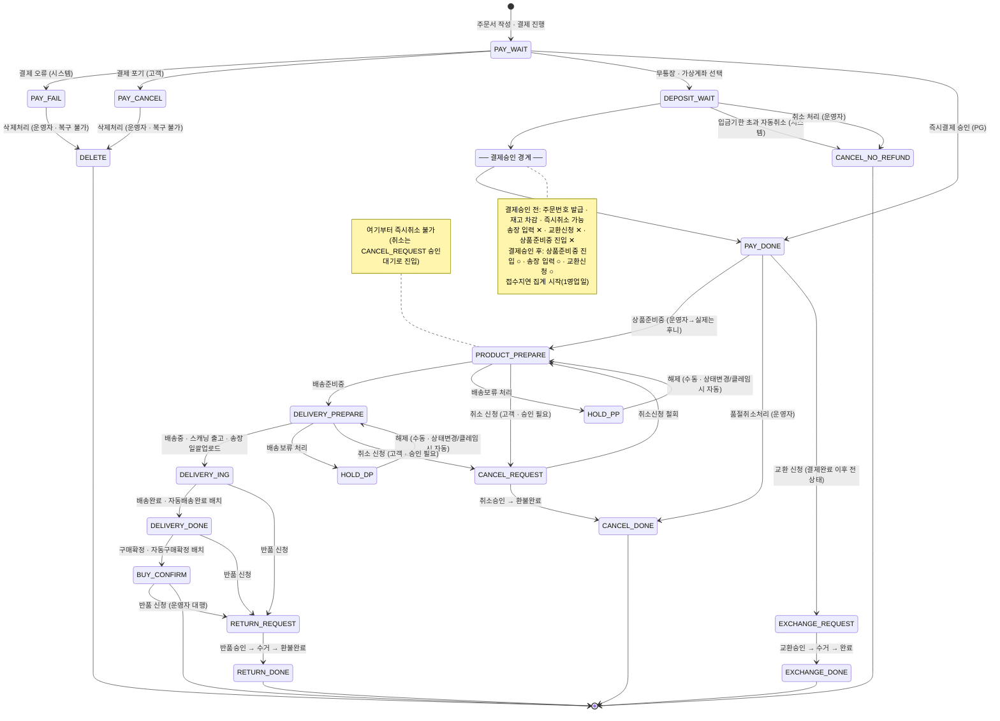

# 샵바이(shopby) 주문 상태기계 — 플랫폼 거동 정본

> **이 문서가 답하는 것**: 샵바이 플랫폼에서 주문이 **어떤 상태를 가질 수 있고**, **어떤 전이가 합법이며**, **각 상태에서 무엇이 되고 무엇이 막히는가**.
> **답하지 않는 것**: 후니가 어떤 샵바이 API를 호출하는가(별도 산출물 소관).
>
> 하위 테스트 시나리오는 이 문서의 「상태별 조작 매트릭스」를 분모로 삼는다.

## 0. 권위 순서와 표기 규약

| 순위 | 원천 | 성격 |
|---|---|---|
| 1 | `docs/shopby/shopby_enterprise_docs/order/*.mdx` · `claim-order/*/condition.mdx` | 샵바이 엔터프라이즈 운영자 매뉴얼 — 플랫폼 거동의 1차 권위 |
| 2 | `docs/shopby/shopby-api/*.yml` | OpenAPI 스펙 — enum 값·상태 코드·API 레벨 제약의 확인용 |
| 3 | `_workspace/huni-launch-runway/07_rebaseline/L0/M2/_evidence/sdk-guide-live-20260902.txt` §10·§11 | 후니↔자사몰 계약 — **플랫폼 거동이 아니라 후니가 그 위에 얹은 운영 정책** |

표기 규약:

- **「미확인」** = 위 원천이 결론을 내려주지 않는 항목. 일반적인 이커머스 상식으로 메우지 않는다.
- 세 가지를 절대 섞지 않는다: **㉠ 플랫폼이 못 하는 것**(샵바이에 기능이 없음) / **㉡ 우리가 아직 안 만든 것**(후니·자사몰 미구현) / **㉢ 아직 관측되지 않은 것**(결제승인 미도달 등으로 실물 확인 전).
- enum 값·API 경로·파일 경로는 원문 그대로 둔다.

---

## 1. 상태 전수 목록

### 1-1. 주문상태 `orderStatusType` (16개)

API가 노출하는 전체 enum이다. 한글 라벨은 스펙에 병기된 값을 그대로 옮겼다.

| # | enum | 한글 라벨 | 성격 | 운영자 매뉴얼 전용 문서 |
|---|---|---|---|---|
| 1 | `PAY_WAIT` | 결제대기 | 결제 진행 중(주문 미완성) | 없음 |
| 2 | `DEPOSIT_WAIT` | 입금대기 | 결제승인 **전** · 주문 성립 | `order/deposit-wait.mdx` |
| 3 | `PAY_DONE` | 결제완료 | 결제승인 **후** 최초 상태 | `order/pay-done.mdx` |
| 4 | `PRODUCT_PREPARE` | 상품준비중 | 정상 진행 | `order/product-prepare.mdx` |
| 5 | `DELIVERY_PREPARE` | 배송준비중 | 정상 진행 | `order/delivery-prepare.mdx` |
| 6 | `DELIVERY_ING` | 배송중 | 정상 진행 | `order/delivery-ing.mdx` |
| 7 | `DELIVERY_DONE` | 배송완료 | 정상 진행 | `order/delivery-done.mdx` |
| 8 | `BUY_CONFIRM` | 구매확정 | 정상 흐름 종착 | `order/buy-confirm.mdx` |
| 9 | `CANCEL_DONE` | 취소완료 | 클레임 종착 | `claim-order/cancel.mdx` |
| 10 | `RETURN_DONE` | 반품완료 | 클레임 종착 | `claim-order/return.mdx` |
| 11 | `EXCHANGE_DONE` | 교환완료 | 클레임 종착 | `claim-order/exchange.mdx` |
| 12 | `EXCHANGE_WAIT` | 교환대기 | 「미확인」 — enum에만 존재 | 없음 |
| 13 | `REFUND_DONE` | 환불완료 | 클레임 종착 | `claim-order/refund.mdx` |
| 14 | `PAY_CANCEL` | 결제포기 | 주문 미성립 | `order/pay-fail.mdx` |
| 15 | `PAY_FAIL` | 결제실패 | 주문 미성립 | `order/pay-fail.mdx` |
| 16 | `DELETE` | 삭제 | 영구 삭제(복구 불가) | `order/pay-fail.mdx` |

근거: `docs/shopby/shopby-api/claim-shop-public.yml:4236-4256`(한글 라벨 병기 enum), `docs/shopby/shopby-api/order-shop-public.yml:6750-6756`(동일 16개 값, 영문 라벨).

### 1-2. 배송보류는 별도 주문상태가 아니다 (중요)

운영자 매뉴얼은 `상품준비중_배송보류` · `배송준비중_배송보류`라는 이름을 쓰지만(`order/hold-delivery.mdx` §배송보류 주문리스트 ①②), **API `orderStatusType` enum에는 배송보류 값이 없다.** API 표현은 주문상태에 얹히는 **불리언 플래그 + 해제 일시**다.

| 필드 | 타입 | 설명 | 근거 |
|---|---|---|---|
| `holdDelivery` | boolean (nullable) | 배송보류 여부 | `order-shop-public.yml:16872-16875` |
| `releaseHoldDeliveryYmdt` | string (nullable) | 배송보류 해제 일시 | `order-shop-public.yml:16689-16692` |
| `holdDeliveryReason` | — | 배송보류 사유(응답 예시에서 관측) | `order-shop-public.yml:1532` |

즉 배송보류는 **상품준비중 또는 배송준비중 위에 겹쳐지는 부가 상태**이며, 두 상태에서만 발생한다(`order/hold-delivery.mdx` §배송보류 관리 Callout).

### 1-3. 클레임상태 `claimStatusType` (24개)

주문상태와 **직교하는 별개 축**이다. 한 주문 항목은 `orderStatusType` 하나와 `claimStatusType`(nullable) 하나를 동시에 가진다(`order-shop-public.yml:1506` 응답 예시 — `"orderStatusType":"PAY_DONE","claimStatusType":null`).

**취소 (5)** — 근거 `claim-server-public.yml:160-166`, 설명 `claim-order/cancel/condition.mdx`

| enum | 한글 | 해당 상태에서 가능한 조작 |
|---|---|---|
| `CANCEL_REQUEST` | 취소신청[승인대기] | 취소신청 철회 · 취소승인 |
| `CANCEL_PROC_REQUEST_REFUND` | 취소처리[환불보류] | 취소신청 철회 · 환불처리 |
| `CANCEL_PROC_WAITING_REFUND` | 취소처리[환불대기] | 취소신청 철회 |
| `CANCEL_NO_REFUND` | 취소완료[환불없음] | (종착) |
| `CANCEL_DONE` | 취소완료[환불완료] | (종착) |

**교환 (11)** — 근거 `claim-server-public.yml:168-181`, 설명 `claim-order/exchange/condition.mdx`

`EXCHANGE_REQUEST`(교환신청[승인대기] — 철회·승인 가능) · `EXCHANGE_REJECT_REQUEST`(교환처리[철회대기]) · `EXCHANGE_PROC_BEFORE_RECEIVE`(교환처리[수거진행] — 수거완료 가능) · `EXCHANGE_PROC_REQUEST_PAY`(교환처리[결제대기] — 철회·입금확인 가능) · `EXCHANGE_PROC_REQUEST_REFUND`(교환처리[환불보류] — 철회 가능) · `EXCHANGE_PROC_WAITING`(교환처리[처리대기] — 철회 가능) · `EXCHANGE_PROC_WAITING_PAY`(교환처리[입금처리대기]) · `EXCHANGE_PROC_WAITING_REFUND`(교환처리[환불대기]) · `EXCHANGE_DONE_PAY_DONE`(교환완료[결제완료]) · `EXCHANGE_DONE_REFUND_DONE`(교환완료[환불완료]) · `EXCHANGE_DONE`(교환완료[차액없음])

> `EXCHANGE_PROC_WAITING_PAY`(교환처리[입금처리대기]) · `EXCHANGE_PROC_WAITING_REFUND`(교환처리[환불대기])는 API enum에는 있으나 `claim-order/exchange/condition.mdx` 표에는 없다 → 발생 조건 「미확인」.

**반품 (8)** — 근거 `claim-server-public.yml:183-193`, 설명 `claim-order/return/condition.mdx`

`RETURN_REQUEST`(반품신청[승인대기] — 철회·승인 가능) · `RETURN_REJECT_REQUEST`(반품신청[철회대기] — 파트너사가 반려한 상태) · `RETURN_PROC_BEFORE_RECEIVE`(반품처리[수거진행] — 수거완료·환불금액 조정요청 가능) · `RETURN_PROC_REQUEST_REFUND`(반품처리[환불보류] — 철회·환불처리 가능) · `RETURN_REFUND_AMT_ADJUST_REQUESTED`(반품처리[조정요청] — 철회·환불처리 가능) · `RETURN_PROC_WAITING_REFUND`(반품처리[환불대기] — 철회 가능) · `RETURN_DONE`(반품완료[환불완료]) · `RETURN_NO_REFUND`(반품완료[환불없음])

**환불 (4, 표시용)** — `claim-order/refund/condition.mdx`: 환불보류 · 환불대기 · 조정요청 · 환불완료. 이 4개는 환불 관리 화면의 표시 상태이며, 별도 enum 목록이 API 스펙에 따로 열거되어 있지는 않다(취소·교환·반품 enum의 환불 국면과 대응).

### 1-4. 주문접수 유형 (상태와 직교하는 분류)

`order/list.mdx` §상세검색 「주문접수 유형」: 일반주문 · 수기주문 · 외부연계주문 · 예약주문 · 정기주문 · 배송보류주문.

---

## 2. 상태 전이표

**주체 표기**: 고객 = 주문자 · 운영자 = 셀러어드민 관리자 · PG = 결제대행사 · 배치 = 샵바이 스케줄러 · 시스템 = 샵바이 내부 처리.

### 2-1. 정상 흐름(전진)

| # | from | to | 트리거 | 주체 | 근거 |
|---|---|---|---|---|---|
| T1 | (없음) | `PAY_WAIT` | 주문서 작성 후 결제 진행 | 고객 | `order-shop-public.yml:3785`(주문서 작성) · `:4692`(주문 예약) |
| T2 | `PAY_WAIT` | `DEPOSIT_WAIT` | 무통장입금·가상계좌 선택 후 주문 완료 | 고객 | `order/deposit-wait.mdx` §Callout |
| T3 | `PAY_WAIT` | `PAY_DONE` | 즉시결제 수단의 결제 승인 | PG | `order/pay-done.mdx` §Callout |
| T4 | `DEPOSIT_WAIT` | `PAY_DONE` | **무통장입금**: 운영자가 [입금확인 처리] 수동 클릭 | 운영자 | `order/deposit-wait.mdx` ① |
| T5 | `DEPOSIT_WAIT` | `PAY_DONE` | **가상계좌·에스크로**: PG 입금 확인 시 자동 (수동 입금확인 처리 **불가**) | PG | `order/deposit-wait.mdx` ③ |
| T6 | `PAY_DONE` | `PRODUCT_PREPARE` | [상품준비중] 클릭 · 일괄처리 | 운영자 | `order/pay-done.mdx` ③ · API `order-server-public.yml:1194` |
| T7 | `PRODUCT_PREPARE` | `DELIVERY_PREPARE` | [배송준비중] 클릭 | 운영자 | `order/product-prepare.mdx` ③ · API `order-server-public.yml:1131` |
| T8 | `DELIVERY_PREPARE` | `DELIVERY_ING` | [배송중] 클릭 / 스캐닝 출고 처리 / 송장번호 일괄 업로드 시 「배송중 처리」 선택 | 운영자 | `order/delivery-prepare.mdx` ③⑤ · `order/delivery-prepare/invoicenumber.mdx` ⓔ · API `order-server-public.yml:1009` |
| T9 | `DELIVERY_ING` | `DELIVERY_DONE` | [배송완료] 클릭 | 운영자 | `order/delivery-ing.mdx` ③ · API `order-server-public.yml:1257`(수취확인처리 = 배송완료처리) |
| T10 | `DELIVERY_ING` | `DELIVERY_DONE` | 자동 배송완료 — 배송시작 후 지정 기간 경과(영업일 1~30일, 서비스관리>쇼핑몰 관리>주문처리기간 설정) | 배치 | `order/delivery-ing.mdx` ④ |
| T11 | `DELIVERY_DONE` | `BUY_CONFIRM` | [구매확정] 클릭 | 운영자 | `order/delivery-done.mdx` ③ · API `order-server-public.yml:645` |
| T12 | `DELIVERY_DONE` | `BUY_CONFIRM` | 자동 구매확정 — 배송완료 후 지정 기간 경과(영업일 1~30일) | 배치 | `order/delivery-done.mdx` ④ |
| T13 | `DELIVERY_DONE` | `BUY_CONFIRM` | 고객이 직접 구매확정 | 고객 | `order-shop-public.yml:6616`(상품 주문 구매 확정하기) · nextActions `CONFIRM_ORDER` |

> **T7 우회 경로**: API `order-server-public.yml:938`은 「상품준비중 → 배송중」 직접 변경을 받지만, **시스템 내부에서는 `상품준비중 → 배송준비중 → 배송중`으로 처리**한다. 요청 즉시 배송준비중으로 바뀌고, real 서버 기준 1분 간격 배치가 수집해 배송중으로 일괄 변경한다. 즉 **T7을 건너뛰는 진짜 경로는 없다.**

### 2-2. 배송보류(부가 상태)

| # | from | to | 트리거 | 주체 | 근거 |
|---|---|---|---|---|---|
| H1 | `PRODUCT_PREPARE` | `PRODUCT_PREPARE` + 배송보류 | [배송보류 처리] — 출고예정일·사유·안내 알림 설정 | 운영자 | `order/product-prepare.mdx` ④ |
| H2 | `DELIVERY_PREPARE` | `DELIVERY_PREPARE` + 배송보류 | [배송보류 처리] | 운영자 | `order/delivery-prepare.mdx` ⑥ |
| H3 | 배송보류 | 원상태(상품준비중/배송준비중) | 배송보류 해제 처리(수동) | 운영자 | `order/hold-delivery.mdx` ③ |
| H4 | 배송보류 | 원상태 | **자동 해제** — 해당 주문의 주문상태를 변경하거나, 그 주문에 신청된 클레임을 처리한 경우 | 시스템 | `order/hold-delivery.mdx` §Callout(warning) |
| H5 | 배송보류 | 배송보류 지연(집계 분류) | 배송보류 처리일로부터 3영업일 경과 | 배치 | `order/hold-delivery.mdx` §Callout(warning) |

### 2-3. 역행·건너뛰기

| # | 범위 | 규칙 | 근거 |
|---|---|---|---|
| B1 | `DEPOSIT_WAIT` ~ `BUY_CONFIRM` | 전체주문 조회에서 원하는 주문상태로 **수동 변경 가능** — 특정 시점과 무관하게 **앞 단계로 복귀 가능**하고 **단계 건너뛰기도 가능** | `order/list.mdx` §Callout · §배송번호 기준 주문리스트 ③ |
| B2 | `DEPOSIT_WAIT` → `PAY_DONE` | 이 전이만은 예외 — **입금대기 주문리스트에서만** 가능하며 결제완료로만 변경 가능 | `order/list.mdx` ③ 첫 번째 불릿 |
| B3 | `PAY_DONE` | 상품준비중~구매확정 범위로 변경 가능 | `order/pay-done.mdx` §Callout |
| B4 | `PRODUCT_PREPARE` · `DELIVERY_PREPARE` · `DELIVERY_ING` · `DELIVERY_DONE` | 결제완료~구매확정 **모든 단계**로 변경 가능 | 각 상태 mdx §Callout |
| B5 | `BUY_CONFIRM` | 결제완료~**배송완료**까지 변경 가능(구매확정은 자기 자신) | `order/buy-confirm.mdx` §Callout |

**상태별 최종 변경 처리일시**는 주문리스트 우측 스크롤에서 확인되며, 단계를 건너뛴 경우 건너뛴 상태의 처리일시는 **최종 변경 상태의 처리일시와 동일한 일자로 표기**된다(`order/list.mdx` §배송번호 기준 주문리스트 말미).

### 2-4. 에스크로 결제의 전이 봉인 (플랫폼 강제)

에스크로(가상계좌/실시간계좌이체) 결제 주문은 에스크로 정책에 의해 수동 상태 변경이 제한된다.

| 현재 상태 | 수동 변경 허용 범위 | 근거 |
|---|---|---|
| `PAY_DONE` | 상품준비중 ~ 배송중 ○ / **배송완료·구매확정 ✕** | `order/pay-done.mdx` §Callout |
| `PRODUCT_PREPARE` | 결제완료 ~ 배송중 ○ / **배송완료·구매확정 ✕** | `order/product-prepare.mdx` §Callout |
| `DELIVERY_PREPARE` | 결제완료 ~ 배송중 ○ / **배송완료·구매확정 ✕** | `order/delivery-prepare.mdx` §Callout |
| `DELIVERY_ING` | **모든 상태로 수동 변경 ✕** | `order/delivery-ing.mdx` §Callout |
| `DELIVERY_DONE` | **모든 상태로 수동 변경 ✕** | `order/delivery-done.mdx` §Callout |
| `BUY_CONFIRM` | **모든 상태로 수동 변경 ✕** | `order/buy-confirm.mdx` §Callout |

전체주문 조회에도 같은 제약이 걸린다(`order/list.mdx` §Callout · ③ 두 번째 불릿).

### 2-5. 클레임으로의 이탈

| # | from(주문상태) | 클레임 | 주체 | 근거 |
|---|---|---|---|---|
| C1 | `DEPOSIT_WAIT` | 자동취소(입금기한 초과) 또는 운영자 수동 취소 → `CANCEL_NO_REFUND`(취소완료[환불없음]) | 시스템 / 운영자 | `claim-order/cancel/condition.mdx` 1행 · `order/deposit-wait.mdx` ② |
| C2 | `PRODUCT_PREPARE` · `DELIVERY_PREPARE` | 취소 신청 → `CANCEL_REQUEST` | 고객 | `claim-order/cancel/condition.mdx` 2행 |
| C3 | `PAY_DONE` | 운영자 **품절취소처리** → 주문취소. 결제수단에 따라 분기: 무통장입금(자동환불 불가) → 취소처리_환불보류 / PG 결제(자동환불 가능) → 취소처리_환불완료 | 운영자 | `order/pay-done.mdx` ④ §Callout(warning) |
| C4 | 결제완료 **이후 모든 상태** | 교환 신청 → `EXCHANGE_REQUEST` | 고객 | `claim-order/exchange/condition.mdx` 1행 |
| C5 | `DELIVERY_ING` · `DELIVERY_DONE` · `BUY_CONFIRM` | 반품 신청 → `RETURN_REQUEST` | 고객 | `claim-order/return/condition.mdx` 1행 |
| C6 | `BUY_CONFIRM` | **고객 직접 교환·반품 신청 불가** — 운영자가 클레임 처리를 진행해야 함 | 운영자 | `order/buy-confirm.mdx` ③ |

> **C4 ↔ C6 충돌**: 교환 조건은 "결제완료 이후 모든 상태"라 하고, 구매확정 문서는 "구매확정 상태에서는 고객이 직접 교환·반품 신청 불가"라 한다. 두 문장의 우선순위 → 「미확인」(§6-1 참조).

### 2-6. 미성립 주문

| # | from | to | 트리거 | 주체 | 근거 |
|---|---|---|---|---|---|
| F1 | `PAY_WAIT` | `PAY_FAIL` | 결제 오류로 실패 — 시스템이 확인한 실패사유가 표기됨 | 시스템 | `order/pay-fail.mdx` ① |
| F2 | `PAY_WAIT` | `PAY_CANCEL` | 고객이 결제를 진행하다 포기 — 사유는 표기되지 않음 | 고객 | `order/pay-fail.mdx` ② |
| F3 | `PAY_FAIL` · `PAY_CANCEL` | `DELETE` | [삭제처리] 클릭 — **복구되지 않음** | 운영자 | `order/pay-fail.mdx` ③ |

### 2-7. 예약주문 · 정기결제 · 이전주문 (별도 원장)

| 종류 | 규칙 | 근거 |
|---|---|---|
| 예약주문 | 입금대기·결제완료 상태로 **예약주문 리스트에 격리**된다. 예약 배송시작일 **당일 새벽 1시**에 원주문리스트(입금대기/결제완료)로 **자동 이동**. 운영자가 [주문메뉴로 이동]으로 수동 이동도 가능. **수동 이동되지 않았거나 배송시작일이 도래하지 않은 예약주문은 다른 주문상태로 변경 불가.** | `order/reservation-order.mdx` §Callout · ② · §Callout(warning) |
| 예약주문 API | 예약주문 → 일반주문 변경 엔드포인트 존재 | `order-server-public.yml:1320` |
| 정기결제(배송) | 정기 배송일 **2일 전**에 주문서가 생성되고 이후 자동 결제 → 「정기주문」으로 구분. 이용상태는 이용중 / 해지 / 시스템 해지. 주문서 생성 **전**에만 해지 가능 | `order/recurring-payments.mdx` §Callout · ① · ③ |
| 이전주문 | 주문 상세 확인만 가능. **주문상태 변경(이동) 및 클레임 처리 불가** | `order/previous-orders.mdx` §Callout |

---

## 3. ★상태별 가능/불가 조작 매트릭스

범례: **○** 가능 · **✕** 불가 · **△** 조건부(조건 명시) · **?** 「미확인」

### 3-1. 주 매트릭스

| 상태 | 주문 취소 | 부분 취소 | 교환 | 반품 | 환불 | 송장 입력 | 배송보류 | 주문 수정(배송지·수령자) | 옵션 변경 | 구매확정 |
|---|---|---|---|---|---|---|---|---|---|---|
| `PAY_WAIT` 결제대기 | ? | ? | ✕ | ✕ | ✕ | ✕ | ✕ | ? | ✕ | ✕ |
| `DEPOSIT_WAIT` 입금대기 | ○ ⁽¹⁾ | ? ⁽²⁾ | ✕ ⁽³⁾ | ✕ ⁽⁴⁾ | △ ⁽⁵⁾ | ✕ ⁽⁶⁾ | ✕ ⁽⁷⁾ | ○ ⁽⁸⁾ | ✕ ⁽⁹⁾ | △ ⁽¹⁰⁾ |
| `PAY_DONE` 결제완료 | ○ ⁽¹¹⁾ | ○ ⁽¹¹⁾ | ○ ⁽³⁾ | ✕ ⁽⁴⁾ | ○ ⁽¹²⁾ | ○ ⁽⁶⁾ | ✕ ⁽⁷⁾ | ○ ⁽⁸⁾ | ✕ ⁽⁹⁾ | △ ⁽¹⁰⁾ |
| `PRODUCT_PREPARE` 상품준비중 | △ ⁽¹³⁾ | △ ⁽¹³⁾ | ○ ⁽³⁾ | ✕ ⁽⁴⁾ | ○ ⁽¹²⁾ | ○ ⁽⁶⁾ | ○ ⁽¹⁴⁾ | ○ ⁽⁸⁾ | ✕ ⁽⁹⁾ | △ ⁽¹⁰⁾ |
| 상품준비중 + 배송보류 | △ ⁽¹³⁾⁽¹⁵⁾ | △ ⁽¹³⁾⁽¹⁵⁾ | ○ ⁽¹⁵⁾ | ✕ | ○ | ○ | (해제) ⁽¹⁶⁾ | ○ | ✕ | △ ⁽¹⁵⁾ |
| `DELIVERY_PREPARE` 배송준비중 | △ ⁽¹³⁾ | △ ⁽¹³⁾ | ○ ⁽³⁾ | ✕ ⁽⁴⁾ | ○ ⁽¹²⁾ | ○ ⁽⁶⁾ | ○ ⁽¹⁴⁾ | △ ⁽⁸⁾ | ✕ ⁽⁹⁾ | △ ⁽¹⁰⁾ |
| 배송준비중 + 배송보류 | △ ⁽¹³⁾⁽¹⁵⁾ | △ ⁽¹³⁾⁽¹⁵⁾ | ○ ⁽¹⁵⁾ | ✕ | ○ | ○ | (해제) ⁽¹⁶⁾ | △ | ✕ | △ ⁽¹⁵⁾ |
| `DELIVERY_ING` 배송중 | ✕ ⁽¹⁷⁾ | ✕ ⁽¹⁷⁾ | ○ ⁽³⁾ | ○ ⁽⁴⁾ | ○ ⁽¹²⁾ | ○ ⁽⁶⁾ | ✕ ⁽⁷⁾ | ✕ ⁽⁸⁾ | ✕ ⁽⁹⁾ | △ ⁽¹⁰⁾ |
| `DELIVERY_DONE` 배송완료 | ✕ ⁽¹⁷⁾ | ✕ ⁽¹⁷⁾ | ○ ⁽³⁾ | ○ ⁽⁴⁾ | ○ ⁽¹²⁾ | ○ ⁽⁶⁾ | ✕ ⁽⁷⁾ | ✕ ⁽⁸⁾ | ✕ ⁽⁹⁾ | ○ ⁽¹⁸⁾ |
| `BUY_CONFIRM` 구매확정 | ✕ ⁽¹⁷⁾ | ✕ ⁽¹⁷⁾ | △ ⁽¹⁹⁾ | △ ⁽¹⁹⁾ | ○ ⁽¹²⁾ | ○ ⁽⁶⁾ | ✕ ⁽⁷⁾ | ✕ ⁽⁸⁾ | ✕ ⁽⁹⁾ | (자기 자신) |
| `PAY_FAIL` · `PAY_CANCEL` | ✕ ⁽²⁰⁾ | ✕ | ✕ | ✕ | ✕ | ✕ | ✕ | ✕ | ✕ | ✕ |
| `CANCEL_DONE`·`RETURN_DONE`·`EXCHANGE_DONE` | ✕ | ✕ | ? | ? | (완료) | ✕ | ✕ | ✕ | ✕ | ✕ |
| 이전주문(previous-orders) | ✕ ⁽²¹⁾ | ✕ ⁽²¹⁾ | ✕ ⁽²¹⁾ | ✕ ⁽²¹⁾ | ✕ ⁽²¹⁾ | ✕ | ✕ | ✕ | ✕ | ✕ |

### 3-2. 셀 주석 (근거)

1. **입금대기 주문취소** — 주문자가 입금 전 취소 요청하거나 입금 미확인 시 [취소 처리] 가능. 결과는 `CANCEL_NO_REFUND`(취소완료[환불없음]). 근거 `order/deposit-wait.mdx` ② · `claim-order/cancel/condition.mdx` 1행.
2. **입금대기 부분취소** — API에 옵션 단위 취소(`옵션취소 신청하기` `claim-shop-public.yml:1005` 단일 · `:14` 복수)가 존재하나, **어느 주문상태에서 허용되는지 스펙·매뉴얼 모두 명시 없음** → 「미확인」.
3. **교환** — `claim-order/exchange/condition.mdx` 1행: "결제 완료 이후 모든 상태의 주문 건을 교환 신청한 상태". 따라서 `DEPOSIT_WAIT`은 대상 아님.
4. **반품** — `claim-order/return/condition.mdx` 1행: "배송 중/배송 완료/구매확정 상태의 주문 건을 반품 신청". 배송중 이전은 대상 아님.
5. **입금대기 환불** — 입금 자체가 없으므로 환불 금액 0원(`CANCEL_NO_REFUND`). 현금이 오간 경우가 아니면 환불 절차가 발생하지 않는다. 근거 `claim-order/cancel/condition.mdx` 1행.
6. **송장 입력** — 매뉴얼: "택배사와 송장번호 정보는 **결제완료 상태 주문 건부터** 입력 및 적용이 가능"(`order/list.mdx` §배송번호 기준 주문리스트 ④). API: "송장정보는 배송중 이전 `[PAY_DONE, PRODUCT_PREPARE, DELIVERY_PREPARE]` 상태에서, 배송중 이후 `[DELIVERY_ING, DELIVERY_DONE, BUY_CONFIRM]` 상태로 변경 시 입력 가능"(`order-server-public.yml:1617-1624`). 별도 송장번호 변경 엔드포인트도 존재(`order-server-public.yml:1434`).
7. **배송보류** — 상품준비중·배송준비중 두 상태에서만 발생(`order/hold-delivery.mdx` §Callout · ①②).
8. **수령자 정보 변경** — "수령자 정보는 **택배사/송장번호의 입력 및 적용을 하기 전 단계에서만** 변경이 가능"(`order/list/detail.mdx` §수령자 정보 ①). 즉 송장이 붙는 순간 잠긴다 — 배송준비중은 송장 입력 전이면 ○, 입력 후면 ✕라 △. 배송중 이후는 송장이 이미 있으므로 ✕. 주문자 정보(휴대폰·이메일)는 별도로 [변경] 가능(`order/list/detail.mdx` §주문자 정보 ②). API: 주문단위 배송정보 수정 `order-shop-public.yml:7387` — 단 "지역별 배송비가 변경되는 주소로는 변경 불가". nextActions에 `CHANGE_ADDRESS: 배송지변경` 존재(`order-shop-public.yml:15353-15385`).
9. **옵션 변경** — **주문 성립 후 상품·옵션·수량을 바꾸는 API가 샵바이 스펙에 존재하지 않는다.** 장바구니 수정(`order-shop-public.yml:610`)은 주문 전 단계이고, 주문 이후 목록에는 배송정보·현금영수증·정기결제 관련 수정만 있다(엔드포인트 summary 전수 확인). 사양 변경은 **교환 클레임으로만** 처리된다 → **㉠ 플랫폼이 못 하는 것**.
10. **구매확정(전진 변경)** — B1/B3/B4에 따라 결제완료~배송준비중~배송중에서도 구매확정으로 **수동 점프가 가능**하다. 단 **에스크로 결제는 배송완료·구매확정으로 변경 불가**(§2-4) → △.
11. **결제완료 취소** — 후니 정책상 "입금대기·결제완료 = 즉시 취소 가능"(sdk-guide-live-20260902.txt:932-934). 플랫폼 측 운영자 경로로는 품절취소처리도 존재(`order/pay-done.mdx` ④). 세트상품은 '전체 품절취소처리'와 '부분 품절취소처리 + 부분 취소처리' 중 선택(`order/pay-done.mdx` ⑤).
12. **환불** — 취소·반품·교환차액에서 파생되는 종속 절차. 환불방법은 **최초 결제수단 / 현금환불 / 관리자지정환불** 중 선택(`claim-order/cancel/detail.mdx` ④ · `claim-order/return/detail.mdx` ⑥). PG환불액과 현금환불액은 **함께 설정 불가**. 현금환불액 설정 시 환불계좌정보 필수. **관리자지정 환불방법 가용 국면**: 취소 = 입금 전 취소신청·결제 후 취소신청·취소신청 상태(`claim-order/cancel/detail.mdx:18`) / 반품 = **출고 후 반품신청** 상태(`claim-order/return/detail.mdx:18`) / 교환 = 출고 전 교환신청·출고 후 교환신청 상태(`claim-order/exchange.mdx:131`).
13. **상품준비중·배송준비중 취소** — 플랫폼상 이 두 상태는 **취소 신청은 되지만 즉시 취소가 아니라 승인 대기**로 들어간다(`CANCEL_REQUEST` 취소신청[승인대기], `claim-order/cancel/condition.mdx` 2행). 후니 운영 정책도 동일 경계를 명시: "상품준비중부터 즉시 취소 불가 — 취소요청 후 담당자 승인"(sdk-guide-live-20260902.txt:934).
14. **배송보류 처리** — 출고예정일·배송보류처리 사유·배송보류 안내 알림을 설정하고 처리(`order/product-prepare.mdx` §배송보류 처리 · `order/delivery-prepare.mdx` §배송보류 처리).
15. **배송보류 상태에서의 조작** — 배송보류 주문의 **주문상태를 변경하거나 클레임을 처리하면 배송보류가 자동 해제**된다(`order/hold-delivery.mdx` §Callout(warning)). 즉 배송보류는 조작을 막는 잠금이 아니라, 조작이 발생하면 스스로 풀리는 표식이다.
16. **배송보류 해제** — 출고가 가능해지면 수동 해제 → 원래 상태(상품준비중/배송준비중)로 복귀(`order/hold-delivery.mdx` ③).
17. **배송중 이후 취소 ✕** — `claim-order/cancel/condition.mdx`는 취소신청 대상을 "상품 준비 중/배송 준비 중 상태의 주문 건"으로 한정한다. 배송중 이후는 반품 경로로 넘어간다(주석 4).
18. **배송완료 → 구매확정** — 정상 전진 경로. 고객·운영자·배치 모두 트리거 가능(T11~T13).
19. **구매확정 교환·반품** — 고객 직접 신청은 불가, 운영자가 클레임 처리를 진행해야 함(`order/buy-confirm.mdx` ③). 반품 조건표는 구매확정을 반품신청 대상에 포함시킨다(`claim-order/return/condition.mdx` 1행) → 운영자 대행 경로로 해석. 교환은 §2-5 C4↔C6 충돌로 「미확인」.
20. **결제실패/결제포기** — 주문이 성립하지 않았으므로 취소 대상이 아니며, 유일한 조작은 [삭제처리](복구 불가)(`order/pay-fail.mdx` ③).
21. **이전주문** — "주문 상세 정보 확인은 가능하지만, **주문 상태 변경(이동) 및 클레임 처리는 불가**"(`order/previous-orders.mdx` §Callout). 업무메시지·CS처리 대신 **관리자 메모**(최대 100개)가 제공된다.

### 3-3. 플랫폼이 직접 알려주는 가능 조작 — `nextActions`

샵바이는 주문 항목마다 "다음에 할 수 있는 작업"을 응답에 실어 준다. **테스트 시나리오의 기대값은 이 배열로 검증할 수 있다**(`order-shop-public.yml:15353-15385`).

`nextActionType` 값 (15개): `CANCEL_ALL`(주문취소) · `CANCEL`(취소) · `EXCHANGE`(교환) · `RETURN`(반품) · `WITHDRAW_CANCEL`(취소신청 취소) · `WITHDRAW_EXCHANGE`(교환신청 취소) · `WITHDRAW_RETURN`(반품신청 취소) · `VIEW_CLAIM`(클레임 조회) · `VIEW_DELIVERY`(배송조회) · `DELIVERY_DONE`(수취확인) · `CONFIRM_ORDER`(구매확정) · `CHANGE_ADDRESS`(배송지변경) · `WRITE_REVIEW`(상품평작성) · `ISSUE_CASH_RECEIPT`(현금영수증 발행) · `VIEW_RECEIPT`(현금영수증 조회).

`CANCEL_ALL`(주문 단위)과 `CANCEL`(옵션 단위)이 **별도 값으로 존재한다**는 점이 부분취소가 플랫폼 1급 기능임을 보여준다.

보조 불리언 플래그(주문 항목 응답): `cancelable`(취소가능여부, `:16918`) · `exchangeable`(교환가능여부, `:16907`) · `returnable`(반품가능여부, `:16879`) · `refundable`(환불가능여부, `:17021`).

> **주의**: `nextActions`가 **어느 상태에서 어떤 값을 내는지의 산출 규칙은 스펙에 문서화되어 있지 않다** → 「미확인」. 이 문서의 매트릭스는 매뉴얼 서술에서 도출한 것이고, `nextActions`는 런타임 관측으로 교차검증할 수단이다.

---

## 4. ★결제승인 전/후 경계

이 절이 이 문서의 핵심이다. 샵바이에서 주문은 **플랫폼이 결제승인을 기록하기 전까지 주문처리 단계로 진입하지 않는다.**

### 4-1. 경계선의 위치

```
[승인 전]  PAY_WAIT ──▶ DEPOSIT_WAIT ═══╗
                                        ║ ◀── 결제승인 = 이 선
[승인 후]                     PAY_DONE ═╝──▶ PRODUCT_PREPARE ──▶ …
```

- **입금대기(`DEPOSIT_WAIT`)는 결제승인 전이다.** 주문 레코드는 이미 존재하고, 무통장입금·가상계좌 선택 후 **입금 전** 상태다(`order/deposit-wait.mdx` §Callout).
- **결제완료(`PAY_DONE`)가 승인 기록 지점이다.** 무통장은 운영자의 [입금확인 처리]가, 가상계좌·에스크로는 PG의 입금 확인이 이 전이를 만든다(T4·T5).

### 4-2. 승인 전에 이미 존재하는 것

| 항목 | 상태 | 근거 |
|---|---|---|
| 주문번호 | 발급됨 | `order/list.mdx` §주문번호 기준 주문리스트 ① |
| **상품 재고 차감** | **입금대기 상태의 주문 건부터 재고가 차감된다** | `order/deposit-wait.mdx` §Callout |
| 주문 취소 | 가능(즉시) | 주석 ⁽¹⁾ |
| 배송지·수령자 정보 변경 | 가능(송장 전이므로) | 주석 ⁽⁸⁾ |
| 예약주문 격리 | 입금대기·결제완료 두 상태가 예약주문 리스트에 존재 | `order/reservation-order.mdx` §Callout |
| 후니 주문 등록 | **결제 완료를 기다리지 않는다** — 입금대기여도 주문 생성 직후 등록 | sdk-guide-live-20260902.txt:873, :495 |

> 재고 차감이 승인 전에 일어난다는 점이 후니 구조에서 특히 중요하다. 후니는 **금액을 수량 칸으로 표현**하므로(판매가 10원 × 수량 = 금액, sdk:1035~1050), 입금대기 주문 하나가 재고를 `금액÷10` 만큼 미리 소진한다. 미입금 주문이 쌓이면 **재고 = 결제 한도**가 조기에 마른다(sdk:1078-1085).

### 4-3. 승인이 열어주는 것 (승인 전에는 불가능)

| 잠금 해제 항목 | 승인 전 | 승인 후 | 근거 |
|---|---|---|---|
| 상품준비중 이후 단계 진입 | ✕ | ○ | `order/pay-done.mdx` ③ · API `order-server-public.yml:1194`("**결제완료된** 상품을 상품준비중 상태로") |
| 택배사·송장번호 입력 | ✕ | ○ (`PAY_DONE`부터) | `order/list.mdx` ④ · `order-server-public.yml:1617-1624` |
| 교환 신청 | ✕ | ○ ("결제 완료 이후 모든 상태") | `claim-order/exchange/condition.mdx` 1행 |
| 접수지연 자동 집계 | — | 결제완료 변경일로부터 **1영업일** 경과 시 | `order/pay-done.mdx` §Callout(warning) |
| 품절취소처리 + 결제수단별 환불 분기 | — | ○ (자동환불 가능/불가로 분기) | `order/pay-done.mdx` ④ |
| 배송보류 처리 | ✕ | ○ (상품준비중·배송준비중에서) | `order/hold-delivery.mdx` §Callout |

### 4-4. 승인 후 되돌릴 수 없는 것

| 항목 | 성격 | 근거 |
|---|---|---|
| **상품준비중 진입 = 즉시취소 소멸** | 취소가 `CANCEL_REQUEST`(승인대기)로 바뀌어, 이후 취소 성립 여부는 **승인권자의 판단**에 달린다. 고객이 되돌릴 수 없다 | `claim-order/cancel/condition.mdx` 2행 · sdk:932-935 |
| **에스크로 배송중 진입 = 상태 전이 전면 봉인** | 배송중·배송완료·구매확정의 에스크로 주문은 **모든 상태로 수동 변경 불가**. 되돌리기 자체가 막힌다 | `order/delivery-ing.mdx` · `delivery-done.mdx` · `buy-confirm.mdx` §Callout |
| **송장 입력 = 수령자 정보 잠금** | 송장 입력·적용 이후에는 수령자 정보 변경 불가 | `order/list/detail.mdx` §수령자 정보 ① |
| **구매확정 = 고객 자력 클레임 경로 소멸** | 이후 교환·반품은 운영자 클레임 처리로만 | `order/buy-confirm.mdx` ③ |
| **결제실패 주문 삭제** | 복구되지 않음(영구) | `order/pay-fail.mdx` ③ |
| 무통장 자동취소 | 입금 기한까지 미입금 시 자동취소 → `CANCEL_NO_REFUND` | `claim-order/cancel/condition.mdx` 1행 |

### 4-5. 후니가 이 경계 위에 얹은 운영 정책 (플랫폼 규칙이 아님 — 구분할 것)

sdk-guide-live-20260902.txt §10 「주의할 것 세 가지」:

> **1 · 쇼핑몰 관리자에서 주문 상태를 손으로 바꾸지 마세요**
> 저희가 생산 진행에 맞춰 상태를 올립니다. 사람이 먼저 바꾸면 취소 가능·불가 경계가 어긋나 이미 생산에 들어간 주문이 취소되거나, 반대로 아직 만들지 않은 주문의 취소가 막힙니다. (`:924-928`)

> **2 · 별도의 주문취소 기능을 만들지 마세요**
> 취소 정책은 주문상태로 강제됩니다. 저희가 생산 접수가 확정되는 순간 주문을 '상품준비중'으로 올리므로, 쇼핑몰 기본 정책만으로 경계가 지켜집니다. (`:929-931`)
>
> | 주문상태 | 고객 취소 |
> |---|---|
> | 입금대기 · 결제완료 | 즉시 취소 가능 |
> | 상품준비중부터 | 즉시 취소 불가 — 취소요청 후 담당자 승인 |
>
> 생산 착수 뒤에 들어온 취소 요청은 저희 접수담당자가 생산 상황을 보고 승인·거부합니다. 그 결과도 저희가 쇼핑몰에 반영합니다. (`:932-936`)

> **3 · 가상계좌(무통장) 입금기한은 짧게** — 원고 파일 임시 보관 기간이 30일. 입금기한이 그보다 길면 입금 전에 원고가 사라질 수 있음. **3~7일 권장**. (`:937-940`)

담당 경계 — 자사몰이 **하지 않는** 것 (`:895-897`):

> ✕ 주문상태를 '상품준비중'·'배송준비중'으로 올리는 처리 — 생산 진행에 맞춰 저희가 올립니다
> ✕ 송장번호 등록 — 출고 시 저희가 등록합니다. 고객 배송조회는 그때 자동으로 열립니다

**즉 T6·T7·T8과 송장 입력의 실제 주체는 「운영자」가 아니라 「후니」다.** 플랫폼 관점으로는 운영자 권한 조작이지만, 운영 관점에서는 후니가 전담한다(`:758` 담당 경계표 "주문상태 변경 · 송장번호 등록 → 후니").

주문 등록 시점 (`:873`, `:495`):

> 주문이 만들어진 직후 — 결제 완료를 기다리지 마세요. **입금대기(가상계좌·무통장) 상태여도 보내 주세요.** 저희가 그 시점에 원고 파일을 안전한 곳으로 옮겨 둡니다. 보내지 않으면 입금이 늦어질 때 원고가 보관 기한(30일)을 넘겨 사라질 수 있습니다. 결제 완료 자체는 저희가 쇼핑몰 웹훅으로 따로 받습니다.

**정리**: 후니의 원고 파이프라인은 **결제승인 전(입금대기)에 이미 가동**되고, 샵바이의 주문처리 파이프라인은 **결제승인 후(결제완료)에 시작**한다. 두 파이프라인의 시작점이 다르다는 것이 이 연동의 구조적 특징이다.

---

## 5. 상태기계 다이어그램



**다이어그램이 담지 못한 것** (본문 §2-3 참조):

- `DEPOSIT_WAIT` ~ `BUY_CONFIRM` 사이의 **임의 역행·건너뛰기 전이**(B1). 모든 쌍을 그리면 그래프가 완전그래프가 되어 읽을 수 없다.
- 에스크로 봉인(§2-4) — 결제수단에 따라 위 전이 중 일부가 막힌다.
- 클레임 상태의 세부 국면(§1-3, 24개) — 상단 다이어그램은 대표 상태만 표기.

---

## 6. 「미확인」 목록

이 문서의 원천(§0)이 결론을 내려주지 않은 항목이다. **추정으로 메우지 않았다.** 하위 테스트 시나리오는 이 항목들을 라이브 관측 또는 샵바이 문의로 먼저 닫아야 한다.

### 6-1. 문서 간 충돌 (해석 우선순위 불명)

1. **교환 신청 가능 상태의 충돌** — `claim-order/exchange/condition.mdx` 1행은 "결제 완료 이후 **모든** 상태"라 하고, `order/buy-confirm.mdx` ③은 "구매확정 상태 주문 건은 주문자가 **직접 교환 및 반품 신청을 할 수 없다**"고 한다. 구매확정에서 고객 교환신청이 (ㄱ) 완전 불가인지 (ㄴ) 운영자 대행으로만 가능한지 확정 필요.
2. **배송보류의 API 표현** — 어드민 라벨 `상품준비중_배송보류` / `배송준비중_배송보류`와 API의 `holdDelivery` 불리언 사이의 정확한 대응, 그리고 배송보류 중에도 `orderStatusType`이 원래 값을 유지하는지 여부가 명시되지 않음(§1-2는 스키마에서 추론한 구조이며 라이브 확인 전).

### 6-2. 스펙에만 있고 설명이 없는 상태

3. **`EXCHANGE_WAIT`(교환대기)** — `orderStatusType` enum에만 존재. 어느 전이로 진입하고 어디로 빠지는지 매뉴얼에 설명 없음.
4. **`REFUND_DONE`(환불완료)이 주문상태로 존재하는 의미** — 클레임상태 축에도 환불 완료가 있는데, 주문상태 축의 `REFUND_DONE`이 언제 세팅되는지 불명.
5. **`PAY_WAIT`(결제대기)의 수명** — 이 상태가 얼마나 유지되는지, 타임아웃으로 `PAY_CANCEL`이 되는지, 이 상태에서 취소·조회가 가능한지 미기재.
6. **`EXCHANGE_PROC_WAITING_PAY`(교환처리[입금처리대기]) · `EXCHANGE_PROC_WAITING_REFUND`(교환처리[환불대기])** — API enum(`claim-server-public.yml:175-176`)에만 존재하고 `claim-order/exchange/condition.mdx` 표에는 없다. 발생 조건 불명.

### 6-3. 조건이 명시되지 않은 조작

7. **부분취소(옵션 단위 취소)의 허용 상태 범위** — API에 단일/복수 옵션취소가 존재하지만(`claim-shop-public.yml:14`, `:1005`), 어느 `orderStatusType`에서 허용되는지 스펙·매뉴얼 어디에도 없다. 매트릭스 §3-1의 부분취소 열은 주문취소 열과 같은 경계를 가정했으나 **검증 전**이다.
8. **`nextActions` 산출 규칙** — 어느 상태·어느 결제수단·어느 클레임 국면에서 어떤 `nextActionType`이 나오는지의 규칙이 문서화되어 있지 않다. `cancelable`/`exchangeable`/`returnable`/`refundable` 플래그의 판정 로직도 동일.
9. **무통장 입금기한의 기본값과 설정 위치** — 자동취소를 유발하는 값. 매뉴얼에 기본값·설정 화면이 명시되지 않았고, sdk 가이드에서도 후니가 자사몰에 **역으로 문의한 항목**으로 남아 있다("가상계좌 입금기한 설정값", sdk:942-944).
10. **상태 역행의 부수효과** — B1이 허용하는 역행(예: 배송완료 → 결제완료) 시 재고·정산·고객 알림·적립금이 어떻게 처리되는지 매뉴얼에 기재 없음.
11. **수기주문의 진입 상태** — 수기주문은 가상계좌 결제수단만 가능하므로(`order/manual-order.mdx` §Callout) `DEPOSIT_WAIT`으로 진입할 것으로 보이나 **명시된 문장이 없다**.
12. **세트상품의 부분 품절취소 결과 상태** — "'전체 품절취소처리'와 '부분 품절취소처리 + 부분 취소처리' 중에서 선택"(`order/pay-done.mdx` ⑤)의 각 선택지가 남은 항목을 어떤 상태로 두는지 미기재.

### 6-4. 구분이 필요한 항목 (㉠/㉡/㉢)

| 항목 | 분류 | 서술 |
|---|---|---|
| 주문 후 옵션·수량 변경 | **㉠ 플랫폼이 못 함** | 주문 성립 후 상품·옵션·수량 변경 API가 샵바이 스펙에 없다(엔드포인트 summary 전수 확인). 교환 클레임이 유일한 경로 |
| 금액 직접 지정 | **㉠ 플랫폼이 못 함** | "외부에서 금액 지정은 불가능하다"는 샵바이 공식 회신(2026-08-26 미팅, sdk:980-984). 그래서 판매가 10원 × 수량 방식이 됐다 |
| 재고 관리 끄기 | **㉠ 플랫폼이 못 함** | "재고 관리를 끄는 설정은 샵바이에 존재하지 않는다"(sdk:1088-1091, 상품·설정 매뉴얼 전문 확인 근거 기재) |
| 취소 승인 UI(후니 접수담당자용) | **㉡ 우리가 아직 안 만든 것 / 후니 소관** | 상품준비중 이후 취소 요청의 승인·거부는 후니 접수담당자가 수행한다고 선언되어 있으나(sdk:935), 그 화면·API의 구현 상태는 이 문서의 원천에서 확인되지 않음 |
| 실제 상태 전이의 라이브 관측 | **㉢ 아직 관측 전** | 이 문서 전체가 **매뉴얼·스펙 기반**이며, 실주문으로 각 전이를 밟은 관측 기록은 없다. 특히 §4-2의 "입금대기부터 재고 차감"은 후니 금액-수량 방식과 결합했을 때의 실제 소모량이 미관측 |
| 결제승인 후 거동 전반 | **㉢ 아직 관측 전** | 결제승인이 도달한 실주문이 아직 없으므로, `PAY_DONE` 이후 상태·`nextActions`·클레임 플래그의 실제 값은 모두 미관측 |

---

## 7. 참조 파일 목록

**운영자 매뉴얼** (`docs/shopby/shopby_enterprise_docs/`)
`order/deposit-wait.mdx` · `order/pay-done.mdx` · `order/product-prepare.mdx` · `order/delivery-prepare.mdx` · `order/delivery-prepare/invoicenumber.mdx` · `order/delivery-ing.mdx` · `order/delivery-done.mdx` · `order/buy-confirm.mdx` · `order/pay-fail.mdx` · `order/hold-delivery.mdx` · `order/list.mdx` · `order/list/detail.mdx` · `order/manual-order.mdx` · `order/reservation-order.mdx` · `order/recurring-payments.mdx` · `order/previous-orders.mdx` · `claim-order/cancel.mdx` · `claim-order/cancel/condition.mdx` · `claim-order/cancel/detail.mdx` · `claim-order/exchange.mdx` · `claim-order/exchange/condition.mdx` · `claim-order/return.mdx` · `claim-order/return/condition.mdx` · `claim-order/return/detail.mdx` · `claim-order/refund.mdx` · `claim-order/refund/condition.mdx` · `claim-order/cs.mdx`

**API 스펙** (`docs/shopby/shopby-api/`)
`order-shop-public.yml`(주문상태 enum `:6750`, nextActions `:15353`, 조작 플래그 `:16872`-`:17023`) · `order-server-public.yml`(상태변경 API `:645`·`:938`·`:1009`·`:1131`·`:1194`·`:1257`·`:1320`, 송장 `:1434`, 일괄 상태변경+송장 규칙 `:1617`) · `claim-shop-public.yml`(주문상태 한글 enum `:4236`, 클레임 신청 API `:14`·`:1005`·`:1229`·`:1521`·`:1675`) · `claim-server-public.yml`(클레임상태 24개 정의표 `:158`-`:193`)

**후니 연동 계약**
`_workspace/huni-launch-runway/07_rebaseline/L0/M2/_evidence/sdk-guide-live-20260902.txt` §10(`:734`-`:960`) · §11(`:970`-`:1460`)
