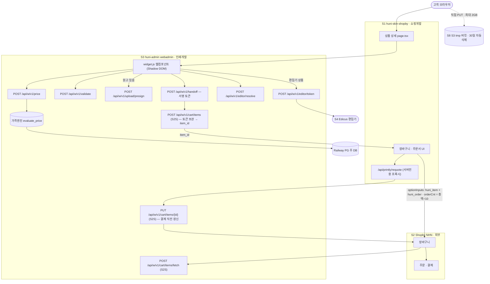
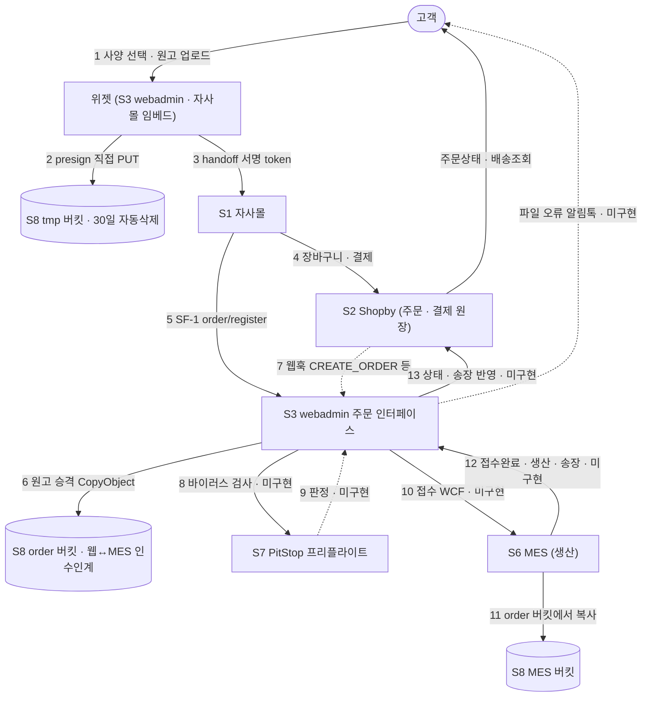

# L0 — 후니프린팅 서비스 연결 지도 v2 (2026-09-02)

> **초안 대체본이다.** `L0/ARCHITECTURE.md`(lead 직접 작성, 오류 포함)를 고치지 않고 새로 썼다 — 무엇이 어떻게 바뀌었는지 추적하기 위해서다. 초안은 그대로 두고 이 문서를 정본으로 쓴다.
> **입력**: `L0/M1/l0-corrections.md`(위젯 축) · `L0/M2/l0-corrections.md`(연동 계약 축) · `L0/M3/l0-corrections.md`(생산·MES 축) · `L0/LEAD-VERDICT-M.md`(lead 재실측·검산).
> **반영 추적**: 세 교정 문서의 항목 하나하나를 어디에 반영했는지는 `corrections-applied.md`에 있다(누락 0).
> **미확인은 「미확인」으로 적었다.** 추정으로 메운 칸은 없다.

---

## 0. 이 문서를 읽는 법

### 0.1 권위 순서 [HARD]

무엇이 사실인지 다툴 때 이 순서로 판정한다. 초안이 틀린 가장 큰 이유는 이 순서를 지키지 않고 **코드부터 열었기** 때문이다.

| 순위 | 출처 | 무엇을 판정하는가 |
|---:|---|---|
| 1 | webadmin 앱 내장 매뉴얼 2종 | 운영자 관점의 화면·기능 구조 |
| 2 | **SDK 개발가이드** `huni-admin.printly.co.kr/sdk/guide/` (2,132줄) | **쇼핑개발 ↔ 인쇄개발 계약 정본** |
| 3 | 라이브 실화면 · 라이브 DB 읽기전용 SELECT | 지금 실제로 어떤 상태인가 |
| 4 | 코드 | 위 셋으로 닫히지 않는 세부 |

### 0.2 「없다」의 세 가지 뜻 — 섞으면 오진이 난다 [HARD]

초안의 가장 비싼 오류는 이 셋을 구분하지 못한 데서 나왔다.

| 표기 | 뜻 | 예 |
|---|---|---|
| **미구현** | 코드가 없다 | MES 인계(WCF/SOAP/zeep grep 0건) |
| **미실행** | 코드는 라이브인데 아직 한 번도 안 돌았다 | `t_ord_orders` 0행 — **PG 결제승인 심사 중이라 주문이 아직 들어올 수 없다** |
| **미확인** | 우리가 아직 안 봤다 | 샵바이 셀러어드민의 금지 설정 실제 상태 |

> ★ **`t_ord_*` 0행 해석 정정.** lead 는 이 0행을 「결제 이후 사슬이 미구현이라는 증거」로 읽었으나 **오독**이다. 지니 지적: 「현재 카트에 넣으면 결제 전까지 통과한다. 현재 결제승인을 받고 있기 때문에 승인이 이뤄지면 주문처리를 할 수 있을 것이다.」 **0행은 미구현의 증거가 아니라 미실행의 결과다.** 결제승인 전이라 주문이 생성될 수 없었을 뿐이다.
> 단, 이것이 「결제 이후가 다 구현돼 있다」는 뜻은 아니다 — 미실행(SF-1 주문등록·원고승격)과 미구현(MES 인계·프리플라이트·상태왕복)은 §10 결함표에서 따로 표기했다.

### 0.3 등급 규칙 [HARD]

기본값은 **「작업 항목」**. **「차단」은 우리가 통제할 수 없는 외부 의존에만** 쓴다.
생산·MES·프리플라이트·공정라우트는 지니와 서희항 대표가 레드프린팅에서 개발한 영역이다 — 미지의 위험이 아니라 **아직 안 짠 코드**다.

---

## 1. 시스템 7개와 소유자

초안은 5개를 셌다. **MES · PitStop Server 가 빠졌고, S3 원고 저장소는 「저장소」로만 취급됐다.** 셋 다 시스템이다.

| # | 시스템 | 정체 | 위치 | 고칠 수 있나 | 소유 |
|---|---|---|---|---|---|
| **S1** | **huni-skin-shopby** | Next.js 자사몰 프론트/BFF | `~/Dev/huni-skin-shopby` | ✅ 전부 | 쇼핑개발 |
| **S2** | **Shopby (NHN 커머스)** | 회원·장바구니·주문·결제·정산 **원장** SaaS | `shop-api.e-ncp.com` / `server-api.e-ncp.com` | ❌ 제약을 우회할 뿐 | PM(계약) |
| **S3** | **huni-admin (webadmin)** | Django. 상품·가격엔진·위젯·원고·**주문 인터페이스** | `huni-admin.printly.co.kr` · `raw/webadmin` | ✅ 전부 | 인쇄개발 |
| **S4** | **Edicus** | 온라인 디자인 편집기 SaaS | 외부 | ❌ | PM(계약) + 인쇄개발(연동) |
| **S5** | **Pie Canvas** | 상세페이지 빌더 발행본 | Railway PG `vc_v_product_detail_tabs` | ✅ | 쇼핑개발 |
| **S6** | **MES** ★신규 인식 | **별도 시스템** · EC2 Windows · SQL Server + WCF + WinForms. **생산·작업지시·공정·출고·송장의 원장** | EC2 | ✅ 단 별도 개발자 | **PM + MES 담당 개발자** |
| **S7** | **PitStop Server** ★신규 인식 | EC2 Windows · **미도입**. PDF 프리플라이트 | — | 도입 결정 필요 | PM(도입) + 인쇄개발(연동) |
| **S8** | **AWS S3 원고 저장소** ★승격 | 버킷 **3개**(tmp / order / MES). 승격이라는 **상태 전이**를 갖고 30일 수명주기가 다른 정책을 역으로 규정한다 | AWS | ✅ (계정 소유 미확인) | 인쇄개발 |

**왜 이게 치명적인가** — MES 가 시스템 목록에 없으면 §9 역할 경계에 **MES 담당 칸이 안 생긴다.** 실제로 MES WinForms 에 새 버튼(취소·재업로드 요청·취소승인)을 만들 사람이 초안의 3인 구도에는 없었다.

**근거**: `aws-architecture-huni.pdf` p.4 표 · p.5 §2 · `raw/webadmin/docs/order-to-mes-process.md` §1·§4 · M3 C-2/C-4 · M1 C-6.

**외주처**(비즈하우스·후지필름·컨티뉴·쿠마샵·박작업·현수막·합판·고주파·폰케이스)는 시스템이 아니라 **공정 대행처**다 — §8 공정라우트에서 다룬다.

---

## 2. ★ 1차 계약 문서 — SDK 개발가이드

**「위젯 API 계약이 무엇인가」는 코드를 읽어 재구성할 필요가 없다. 이미 문서로 발행돼 있다.**
초안 어디에도 이 문서가 없었고, 그래서 lead 가 코드 서너 개를 읽어 시스템 전체를 판정했다. 그 얕이가 A-1·A-2 오진을 낳았다.

| 항목 | 값 |
|---|---|
| 위치 | huni-admin 사이드바 「개발자 문서(외부 공개)」 → `https://huni-admin.printly.co.kr/sdk/guide/` |
| 규모 | **2,132줄 · 16개 장** |
| 생성원 | `raw/webadmin/tools/gen_sdk_guide.py` (124,951 B · 2026-08-28) |
| 드리프트 가드 | `raw/webadmin/tests/test_sdk_guide.py` — `urls.py` 를 파싱해 문서와 대조 |
| 원문 보존본 | `L0/M2/_evidence/sdk-guide-live-20260902.txt` |
| 라이브 데모 | `https://huni-admin.printly.co.kr/sdk/demo/` — 게시 위젯 전체를 실제로 띄워 이벤트·상태를 보여준다 |

**장 구성**: §1 준비물 · §2 동작 구조 · §3 임베드 2형 · §4 이벤트 7종 · §5 자체 버튼 · §6 토큰 검증 · §7 원고 업로드 · §8 편집기 · **§9 장바구니 연동** · **§10 주문 등록·담당 경계** · **§11 샵바이 연동 규칙(금지사항)** · §12 메인이미지 · §13 스타일 토큰 · **§14 API 레퍼런스** · **§15 오류 코드 사전(70여 개)** · §16 위젯 없이 API 직접.

> 앱 내장 매뉴얼 2종에서 `sdk`·`api/w/v1` grep 이 0건인 것은 결함이 아니라 **문서 분리**다 — 운영자 매뉴얼은 운영자 몫만 담고(`widget_manual_content.py:719-721`), 개발자 계약은 이 문서가 맡는다(`urls.py:241`).

---

## 3. ★ 결정적 배선 — 가격 브리지

**Shopby 는 외부에서 계산한 금액을 받지 못한다.** 샵바이에 공식 문의해 **불가능하다는 회신**을 받았다(2026-08-26 미팅, SDK 가이드 §10). 그래서 후니는 이렇게 우회한다.

```
상품을 「판매가 10원」으로 Shopby 에 등록  (2026-08-26 · 판매중 226개 일괄 변경 완료)
위젯이 계산한 총액  →  orderCnt = 총액 ÷ 10        ← 나눗셈 그대로. 반올림 금지
결제액 = 10원 × orderCnt = 총액
```

### 3.1 [교정] `orderCnt` 는 반올림하지 않는다

초안은 `orderCnt = round(총액 ÷ 10)` 이라고 썼다. **계약이 반올림을 명시적으로 금지한다.**

> SDK 가이드 §9-05 「반드시 피해야 할 것」: 「`orderCnt` 는 `total ÷ 10` 을 **그대로** 쓰세요. 나눠떨어지지 않으면 저희가 `price_unit_mismatch` 로 거절합니다 — **임의 보정은 곧 청구액 오차**이니 그때는 저희에게 알려 주세요.」

서버 가드는 실재한다 — `widget_api.py:3229`, `int(total) % SHOPBY_PRICE_UNIT != 0` → 422 `price_unit_mismatch`.
그런데 자사몰 실코드는 `widget-order.ts:33-35` 에서 `Math.round` 를 쓴다. **이 반올림이 서버 가드를 무력화한다.** 가격 규칙이 바뀌어 10원 배수가 깨지는 순간, 서버는 시끄럽게 거절하려 하는데 클라이언트가 이미 반올림해 넘겼으므로 **조용한 청구액 오차**가 된다.

> **교정문**: `orderCnt = total ÷ 10`(나눗셈 그대로). 나눠떨어지지 않으면 그것은 **오류 신호**이므로 보정하지 말고 후니에 알린다.

### 3.2 [교정] 사양은 어디 있는가 — 계약과 현행 구현이 다르다

초안은 `optionInputs` 두 칸에 `huni_token` + `huni_order`(JSON) 가 실린다고 썼다. **칸이 2개인 것은 맞고, 내용물이 틀렸다.**

**현행 계약(2026-08-26/27 개정)**: 사양·금액·토큰은 **후니 항목 보관소**(`t_wgt_cart_items`)가 보관한다. 샵바이에는 두 칸만 실린다.

| 라벨 | 값 | 쓰임 |
|---|---|---|
| `huni_item` | `item_id` (36자 UUID, **불변**) | 기계가 읽는 키 — 장바구니 화면·주문 등록이 이걸로 후니 기록을 찾는다 |
| `huni_order` | `summary` — 사람이 읽는 **요약 한 줄** | 셀러어드민 주문 상세에서 담당자가 본다 |

> 가이드 §9-05: 「**✕ 토큰을 샵바이 텍스트 옵션에 넣기** — 텍스트 옵션은 **주문조회 응답으로 그대로 읽힙니다**.」
> 「요약에는 **원고 파일 키·편집기 프로젝트 ID·금액 내역이 들어가지 않습니다.**」

**현행 자사몰 코드**(`huni-widget.tsx:55-81` · `requote.ts:73-74`)는 `huni_token`(서명 토큰 원문) + `huni_order`(인라인 JSON, `files`·`editors` 포함)를 싣는다. `huni_item`·`cart/items`·`X-Huni-Server-Key` 는 **소스 전체에 0건**이다.

이것이 만드는 위험 넷:

| # | 위험 |
|---|---|
| 1 | **서명 토큰이 주문조회로 노출된다** |
| 2 | **원고 S3 키가 평문 노출된다** — 가이드가 금지한 항목 |
| 3 | **Edicus 프로젝트 ID(`prjid`)가 노출된다** — 「인쇄용 데이터를 뽑을 때 쓰는 열쇠」 |
| 4 | **`huni_token` 라벨이 샵바이 상품에 등록돼 있지 않을 가능성** — 후니는 `huni_order`·`huni_item` 2개만 등록했다. 등록되지 않은 라벨은 **값이 조용히 안 실린다** (미확인 — 셀러어드민 실화면 필요) |

레거시 경로(토큰 직접 보관 + `/handoff/requote`)는 **계속 지원**되나, 그 경우에도 **토큰을 텍스트 옵션에 넣는 것은 금지**다.

### 3.3 파생 제약 — 프로모션 (초안의 「미확인」을 닫는다)

초안은 「Shopby 프로모션이 10원 구조와 충돌하는지 **미확인**. 돈이 걸린 미확인이다」로 남겼다. **SDK 가이드 §11 이 이미 답했다.** 조사 항목이 아니라 **설정 점검 항목**이다.

| 기능 | 판정 | 이유 |
|---|---|---|
| **쿠폰** | ✅ 안전 | 금액 기준. 정액 쿠폰은 「상품별 총 상품금액 기준, 수량별로 할인되지 않음」 |
| **적립금** | ✅ 안전 | 금액 기준(적립률 %) |
| **수량 기준 배송비**(`QUANTITY_PROPOSITIONAL_FEE`·`QUANTITY_FEE`) | 🔴 영구 금지 | 켜는 순간 배송비 폭발 — 85,000원 주문에 배송비 12,750,000원 |
| **중량 기준 배송비**(`WEIGHT_FEE`) + 상품 중량 입력 | 🔴 영구 금지 | 같음 |
| **1회 최대구매수량 제한** | 🔴 금지 | 수량 = 금액이므로 결제 금액 상한이 된다 |
| **즉시할인** | 🔴 금지 | `(판매가−할인)×수량` 으로 계산 |
| 허용 배송비 유형 | `FREE` · `CONDITIONAL` · `FIXED_FEE` · `PRICE_FEE` 넷뿐 | |
| **재고** | ⚠ 제약 | 「재고 수량 × 10원 = 그 상품으로 받을 수 있는 **누적 결제금액 한도**」. 재고 관리를 끄는 설정이 **샵바이에 존재하지 않는다**(문서 전수 확인) |

> **지니 질문에 대한 답**: 그렇다. **후니가 정한 게 아니라 샵바이(NHN) 플랫폼의 계산 방식**이다. 가이드 원문 :959 「수량 칸을 금액에 쓰는 순간, 샵바이에서 수량을 기준으로 계산하는 기능이 전부 위험해집니다」 · :1095 「지금은 **전부 꺼져 있는 것을 확인했고**, 앞으로도 켜면 안 됩니다.」

**후니 가격엔진에 배송비 이중청구는 없다** — `raw/webadmin/webadmin/catalog/` 전체에 `배송비|delivery_fee|shipping_fee` **0건**.

**남는 실제 할 일은 하나 — 문구 정정(PM)**:
공지된 운영정책이 **그 금지 기능을 이미 고객에게 약속**했다. `docs/huni/후니프린팅_운영정책_260827.xlsx` 「구매배송정보」 r2c6:
> 「실외용배너거치대는 **수량 1개당 배송비가 부과**되며, 봉투상품은 1000장 단위로 배송비 부과」

이건 정확히 금지 유형 둘이다. 같은 시트 r2c3 「결제금액 10만원 이상 무료배송」도 걸린다 — 라이브 재고가 전 상품 9,999 이고 `orderCnt = 총액÷10` 이면 **단건 상한이 99,990원**이라 10만원 기준선에 닿는 주문이 성립하지 않는다. 「할인쿠폰」 시트의 「배송비는 쿠폰으로 결제하실 수 없습니다」 때문에 쿠폰도 완화책이 되지 못한다.
→ **시스템 개발 0. 공지 문구를 규칙에 맞추면 닫힌다. PM 결정.**

### 3.4 파생 제약 — 화면 밖에서 샵바이가 직접 수량을 노출하는 자리

초안은 「고객 노출 UI 전부가 위젯 값으로 덮어써져야 한다」로만 적었다. **화면은 그렇다. 화면이 아닌 것이 남는다.**

| 무엇 | 누가 만드나 | 수량 노출 | 상태 |
|---|---|---|---|
| 상품·장바구니·주문서·주문조회 화면 · 거래명세표 | 자사몰 | 아니오 | 통제 가능 |
| **주문·결제·배송 알림**(문자·알림톡·메일) | 샵바이 | **예** | 템플릿 치환 `count`·`productNames`(「상품명(1500)」). 가이드 ★미확정 |
| **현금영수증·세금계산서** | 샵바이 | **예** | 품목·수량 표기. **완화책이 어디에도 진술돼 있지 않다** |
| 셀러어드민 주문 화면·판매 통계 | 샵바이 | 예 | 요약 한 줄이 이걸 위한 것 — 그런데 현행 코드는 요약 대신 JSON 을 싣는다(§3.2) |
| 결제창(PG) | 샵바이→PG | 금액 정상 | 상품명만 노출 |

세금계산서·현금영수증 건은 **대응책이 진술되지 않은 유일한 항목**이다 → §10 등급 「외부 의존」.

---

## 4. 주문 1건이 지나가는 길 — 종단

초안의 흐름도는 `order/register` 에서 **끝났다.** 인쇄 쇼핑몰에서 결제 이후는 부록이 아니라 **본체의 절반**이다. 여기서는 결제 전(§4.1)과 결제 이후(§4.2)를 이어 붙인다.

### 4.1 결제 전 — 견적에서 담기까지



**★ 초안에 통째로 없던 것 — 장바구니 항목 보관소(`cart/*` 4종).** `POST /handoff` 와 샵바이 장바구니 **사이에** 후니 API 넷이 있다. 전부 **서버-투-서버**(`X-Huni-Server-Key` 필수, CORS 미개방이라 브라우저 호출 불가).

| 단계 | 호출 | 용도 |
|---|---|---|
| ① 담기 | `POST /api/w/v1/cart/items` | token → **`item_id`** + `summary` + `total` + `qty_rule` |
| ② 장바구니 화면 | `POST /api/w/v1/cart/items/fetch` | item_id 배열(≤50) → 줄마다 금액·요약·**status** |
| ③ 수량 변경 | `PUT /api/w/v1/cart/items/{item_id}` `{qty\|copies}` | 금액 재계산 + **토큰까지 원자적 갱신** |
| ④ **결제 직전 갱신 (필수)** | `PUT /api/w/v1/cart/items/{item_id}` (수량 생략) | 가이드: 「**④는 없으면 결제 자체가 안 됩니다**」 (토큰 TTL 3600초) |
| ⑤ 주문 등록 | `POST /api/w/v1/order/register` `{order_no, line_no, item_id}` | |
| ⑥ 삭제 | `DELETE /api/w/v1/cart/items/{item_id}` | 빠뜨려도 무해(30일 자동 정리) |

②의 줄별 `status`: `ok` · `expired`(30일) · `product_unpublished` · `not_found` → 「한 줄이 죽어도 나머지 줄은 그리세요」.
**보안 규칙(가이드 §9-03-②)**: 브라우저가 보낸 `item_ids` 를 그대로 중계하면 **고객 A 가 남의 주문 요약과 금액을 읽는다**(제작물 제목에 실명이 흔하다). `item_ids` 는 인증된 세션으로 샵바이 `GET /cart` 를 호출해 받은 결과에서만 뽑는다.
**호출 상한**: 장바구니 전용 버킷 사이트당 분당 600회(브라우저 가격조회 240회/분과 분리).

> **현행 구현 상태**: 자사몰은 이 넷을 **한 번도 부르지 않는다**(`cart/items` grep 0건). 레거시 경로(`POST /handoff/requote`)만 쓴다. 그리고 **재견적이 `onCheckout()` 에 없다** — `cart-page.tsx:200-224` 가 `createOrderSheet()` 를 바로 부른다. 정상 라인은 담은 뒤 수량을 안 바꾸면 재견적이 **한 번도 안 돈다** → 1시간 지나면 결제가 막힌다.

### 4.2 결제 이후 — 생산에서 배송까지 (13단계)



| # | 단계 | 주체 | 지금 상태 | 근거 |
|---|---|---|---|---|
| 1 | 사양 선택 + 원고 업로드 | 고객 | ✅ 라이브 | 위젯(M1) |
| 2 | tmp 버킷 presign 직접 PUT | 브라우저 | ✅ 라이브 | `order-to-mes-process.md` §4-1 |
| 3 | handoff 서명 token 발급 | webadmin | ✅ 라이브 · **192건 실행 이력**(성공 179) | `widget_api.py:3388` |
| 4 | Shopby 주문·결제 생성 | 자사몰→Shopby | ⏳ **PG 결제승인 심사 중** | §0.2 |
| 5 | 주문 등록 SF-1 | 자사몰→webadmin | ⚠ 서버 엔드포인트 라이브 · **자사몰 호출부 0건(미구현)** | `urls.py:267` · grep 0건 |
| 6 | 원고 승격 tmp→order | webadmin | ✅ 코드 라이브 · **미실행** | `catalog/artwork_promote.py` |
| 7 | Shopby 웹훅 수신 | Shopby→webadmin | ⚠ **수신함만** — 원문 저장 후 200. **소비자 0건** | `catalog/shopby_hook.py` |
| 8 | 바이러스 검사 | 원고처리 서버 | ❌ 미구현 | grep `clamav\|virus` 0건 |
| 9 | PitStop 프리플라이트 | S7 | ❌ 미구현 · **서버 미도입** | grep `pitstop` 0건 · AWS 로드맵 4단계 |
| 10 | **MES 접수 (WCF)** | webadmin→MES | ❌ 미구현 | grep `wcf\|zeep\|soap` 0건 |
| 11 | MES 버킷으로 파일 복사 | MES | ❌ (10 종속) | `order-to-mes-process.md` §4-3 |
| 12 | MES→우리 상태·송장 통보 | MES→webadmin | ❌ 미구현 · **API 정의서 미작성** | 같은 문서 §8.4 |
| 13 | Shopby 상태·송장 반영 | webadmin→Shopby | ❌ 미구현 (엔드포인트만 확정) | 같은 문서 §8.2 |

**사슬이 실제로 끊기는 곳 셋**

| 끊김 | 어디서 | 결과 |
|---|---|---|
| **A** | 6 → 10 (webadmin → MES) | **결제된 주문이 생산에 도달하지 못한다.** 현재는 사람이 MES 에서 직접 주문을 만들어 메꾸는 구조(주문프로세스 PDF case5) |
| **B** | 12 → 13 (MES → Shopby) | **고객 주문상태가 결제완료에서 멈춘다.** 상품준비중·배송준비중·송장은 판매자가 써 넣는 칸인데 써 넣는 관이 없다 |
| **C** | 7 (웹훅 수신함) | 원문만 쌓이고 아무도 읽지 않는다. 취소·입금완료가 처리되지 않는다 |

**끊김 A 가 최우선이다** — B·C 는 A 뒤에 온다. 그리고 A 의 **선행 블로커는 MES 품목코드 매핑 15/269(5.6%)** 다(§10 A-8).

### 4.3 [HARD] 원고 파일의 출처 — payload 가 아니다

M1↔M3 인계에서 가장 비싼 함정이다.

> **payload 의 `files[].key` 는 S3 **tmp 버킷** 오브젝트 키라서 MES 가 가져갈 수 없다.**
> MES 파일 목록의 출처는 **`t_ord_artworks`**(`models.py:1086`) — 승격 후 order 버킷 키다.
> 「payload 에 파일이 있다」로만 적으면 **틀린 인계 설계가 나온다.**

같은 맥락의 둘:
- **생산 치수는 `payload.work_size`** — 후가공 여유를 반영한 실제 작업 치수다. 「원고 검수·생산(MES)이 기대하는 치수는 완성사이즈가 아니라 이 값」. 서버가 등록 시점에 재계산해 주입한다(`widget_api.py:4289`).
- **자재·공정은 서버가 재조회한다.** 클라이언트가 자재를 보낼 통로 자체가 없다(`widget_api.py:3288`, T-rcl-01). 생산 정보의 본체는 payload 의 `options` · `combo` · `proc_sels` · `addons[].components` 넷이다.

---

## 5. 신뢰 경계와 자격증명

### 5.1 [교정] 자격증명은 하나가 아니라 셋이다

초안은 `site_key` 만 알았다.

| 값 | 형태 | 공개 여부 | 역할 |
|---|---|---|---|
| `site_key` | `wk_…` | **공개** (임베드 태그에 노출) | 문패 — 도메인 화이트리스트와 짝으로 동작 |
| **`X-Huni-Server-Key`** | `hsk_…` 약 50자 | **비밀** (서버 env 전용) | S2S 인증. DB 엔 SHA-256 해시만 저장, 평문은 발급 순간 1회 |
| **handoff token** | HMAC-SHA256 서명 | 비밀 (후니 보관) | 주문 1건의 서명된 사양·금액. **TTL 3600초**, 재견적 수용 나이는 `orig_ts` 기준 30일 |

서버키는 `cart/*` 4종과 `order/register`+`item_id` 에 **필수**, `handoff/verify`·`handoff/requote`·`order/register`+token 에 **선택(하위호환)** — 단 틀린 값을 보내면 그 호출도 403.

> ⚠ 자사몰은 서버키를 **싣지 않는다**(`requote/route.ts:57-64` 헤더는 `content-type`·`accept` 뿐). 후니가 `WAPI_SERVER_KEY_REQUIRED` 를 켜는 순간 verify·requote·order/register 세 경로가 **한꺼번에 403** 이 된다.

### 5.2 신뢰 경계 규칙

| 경계 | 규칙 | 근거 |
|---|---|---|
| 브라우저는 후니를 **직접 부르지 않는다** | 금액 신뢰 경계 + 도메인 화이트리스트 | `requote/route.ts:9-11` |
| `site_key` 는 **서버 env 로만** | 브라우저 노출 금지 | `requote/route.ts:37` |
| 재견적은 **로그인 세션 필수** | 오픈 프록시 방지 — 단 이 때문에 **게스트는 401** | `requote/route.ts:24-31` · M2 F-5 |
| **가격·검증의 권위는 항상 서버** | 클라이언트 값 비신뢰 | SDK 가이드 §2 |
| Edicus 비밀 API 키는 **응답에 절대 미탑재** | | `widget_api.py:api_editor_token` |
| `editor/resolve` 는 **원가 역산 가능 필드 제외** (`use_dims`·`edicus_tmpl_id`·`dim_vals`·matched row) | R2 규칙 | `widget_api.py:api_editor_resolve` |
| 원고 검증 **이중** — presign 시점 + handoff 시점 | 2GB 올린 뒤 퇴짜 방지 | `widget_api.py:api_upload_presign` |
| 「원고 필수」 판정은 **handoff 에서만** | presign 은 고객이 고르는 중이라 안 봄 | 같은 곳 |
| `item_ids` 는 **인증된 세션의 샵바이 `GET /cart` 결과에서만** 뽑는다 | 타 고객 주문 열람 방지 | 가이드 §9-03-② |
| **텍스트 옵션에는 비밀을 넣지 않는다** | 주문조회 응답으로 그대로 읽힌다 | 가이드 §9-05 |

라이브 확인: `t_wgt_sites` 는 `SITE_OWN` 한 행뿐이고 도메인 10개가 등록돼 있다. `allow_domains` 가 빈 행(있으면 어디서나 임베드 가능 — `widget_api.py:500-501`)은 **없다.**

---

## 6. 데이터 저장소

초안은 「4곳」이라 썼고 S3 를 버킷 1개로 셌다.

| 저장소 | 무엇이 사는가 | 접속 | 죽으면 |
|---|---|---|---|
| **Railway PG (주 DB)** `DATABASE_URL` | 상품·가격·옵션·제약·위젯·주문사양 | `catalog/models.py` | 가격엔진·위젯API·운영자화면 **전면 정지** |
| **Printly 커머스 DB** `PRINTLY_DB_URL` | 위젯 해석(`t_wgt_widgets`·`t_wgt_sites`·`t_wgt_widget_versions`·`t_prd_products`) | `src/lib/printly/widget.ts:65-99` **직접 SELECT** | 위젯 미해석 → **하드코딩 가격 폴백**(`configurator.tsx:45-52`, a4=75000)이 고객에게 노출 |
| **Pie Canvas 발행본** (같은 PG) | 상세탭 `vc_v_product_detail_tabs` | `src/lib/printly/publications.ts:4` | 정적 섹션 폴백(치명 아님) |
| **S3 `tmp` 버킷** ★ | 주문 전 원고 · **30일 자동삭제** | presign 직접 PUT | 원고 업로드 불가 |
| **S3 `order` 버킷** ★ | 승격된 원고 — **웹↔MES 인수인계 면** | `artwork_promote.py` CopyObject | 생산 인계 불가 |
| **S3 `MES` 버킷** ★ | MES 자기 키 체계 | MES 가 order 버킷에서 복사 | 생산 파일 없음 |
| **MES SQL Server** ★ | 생산·작업지시·출고의 **원장** | **직접 접근 금지 — WCF 경유 필수** | 생산 전면 정지 |
| **Amazon SQS** ★ | 주문 큐 / 프리플라이트 큐 + DLQ | — | **미구성** |
| Redis | 위젯 rate-limit 공유 | `settings.py:339-368` | **현행 Railway 미설정** → LocMem 폴백, 실질 상한 = 값 × 워커수 |
| Prisma (23모델) | — | `prisma/schema.prisma` | **사문** — `src` import 0건 |

> ★ **tmp 30일 자동삭제가 만드는 위험**: 가상계좌 입금이 늦으면 **입금 전에 원고가 사라진다.** 그래서 설계가 **승격(파일 지키기)과 접수(생산 시작)를 분리**했다 — 입금대기 상태에서도 파일은 order 버킷으로 즉시 승격하고 MES 전송만 막는다. 추가 안전장치로 **입금기한을 tmp 수명보다 짧게**(권고 3~7일) 설정해야 한다.

> ⚠ **미해결 불일치**: 라이브 railway DB 는 44테이블로 기록돼 있으나 `models.py` 는 모델 60 · `db_table` 120 이다. 일부는 해소됐다 — `t_ord_orders`·`t_ord_artworks`·`t_ord_webhooks` 3개가 2026-08 이후 신설이라 44 기준선이 낡았다. **전면 재실측 필요.**

> ⚠ **API 계약 밖의 스키마 결합**: 자사몰이 Railway 에 직접 붙어 4테이블을 SELECT 한다(`GET /api/w/v1/catalog` 를 쓰지 않는다). 인쇄개발이 이 네 테이블의 컬럼·상태코드를 바꾸면 **쇼핑몰이 조용히 깨지는데 계약 어디에도 그 약속이 없다.**

---

## 7. API 표면 (실측)

| 그룹 | 개수 | 근거 |
|---|---:|---|
| **후니 위젯 API** (S1→S3) | **22** URL 패턴 | `config/urls.py:246-288` — `grep -c 'path("api/w/v1'` = 22. 초안의 27 은 `api/assistant` 5건을 잘못 합산한 것(lead 오류 확정) |
| ↳ 공개 문서화 | **21** | 생성기 `tools/gen_sdk_guide.py` — webhook 하나를 접두사로 제외 |
| **Shopby API** (S1→S2) | **38** 고유 경로 | **server-api 1 + shop-api 37**. 초안의 31 은 고정 접두사 목록 정규식이라 과소집계 |
| **Next.js 자체 라우트** | **7** | 프록시 2 + 인증 3 + `pay-config` + `printly/requote` |
| **webadmin 전체 URL** | **151** | 운영자 화면 포함 |
| **★ 결제 이후 인터페이스** | **24** | 초안에 통째로 없었다 — 아래 표 |

### 7.1 위젯 API 22 — 성격별

| 성격 | 개수 | 경로 |
|---|---:|---|
| 브라우저 경로 | 12 | `widgets/<wgt_cd>` · `catalog` · `price` · `validate` · `upload/presign` · `upload/multipart/<action>` · `handoff` · `editor/resolve` · `editor/token` · `swatch/<kind>/<code>` · `main-image/<img_path>` · `design-image/<img_path>` |
| 서버-투-서버 | 9 | `handoff/verify` · `handoff/requote` · `cart/items` · `cart/items/fetch` · `cart/items/<item_id>`(PUT·DELETE) · `order/register` · `guides` · `main-images` · `designs` |
| **인바운드 웹훅** | 1 | `shopby/webhook/<secret>` — **「위젯 API」가 아니라 샵바이→후니 방향이다.** 분류를 나눠야 한다 |

### 7.2 [교정] 「server API 로 연동」은 부정확하다

Shopby 는 두 표면을 갖는다. 「헤드리스 server API 연동」이라는 한 덩어리 표현이 그 구분을 지운다.

| 표면 | 호스트 | 인증 | 실사용 | IP 제한 |
|---|---|---|---|---|
| **shop API**(스토어프론트) | `shop-api.e-ncp.com` | `clientId` + `platform` + `version`, 회원 API 는 `Shop-By-Authorization: Bearer` 추가 | **예 — 37 경로 전부** | **없음** |
| **server API**(관리자/파트너) | `server-api.e-ncp.com` | 파트너 JWT + `systemkey` | **사실상 아니오** — 훅 1개(`use-admins.ts:23` `/admins`), **소비처 0건(사문)** | **등록된 IP 전용** |
| admin(셀러어드민 화면) | — | — | 아니오 — 운영자가 브라우저로 본다 | — |

**구분이 중요한 이유는 고정 IP 다.** 가이드: 「관리자용 API(server-api)는 **등록된 IP에서만** 호출됩니다. 쓰실 계획이면 고정 IP를 미리 알려 주세요. … shop-api는 IP 제한이 없으니 신경 쓰지 않으셔도 됩니다.」 가이드 스스로 자사몰의 server-api 사용 여부를 **「아직 정해지지 않은 것」** 으로 남겼다.

> **[정정] 고정 IP 는 아웃바운드 제약이다.** 이 IP 화이트리스트는 **후니(자사몰)가 샵바이 server API 를 호출할 때** 걸리는 것이지, **샵바이가 우리 웹훅 URL 로 보낼 때(인바운드) 걸리는 제약이 아니다.** 두 방향은 별개다. 인바운드 쪽 제약(HTTPS 강제 여부 · 샵바이 발신 IP 고정 여부 · 포트 제약)은 **스펙 서술 0건 = 전부 미확인**(N1 B-1e). 출처 `LEAD-VERDICT-N.md` §3 · 근거 `../N1/webhook-catalog.md` §3.4.

> **런칭 리스크**: 사문 코드(`/admins` 훅 + `/api/shopby` 프록시)를 남겨 두면 「언젠가 쓸 것」으로 오해되어 **런칭 직전에 되살아나 IP 미등록으로 막힌다.** 결정 필요 — (a) server-api 미사용으로 확정하고 프록시·훅 제거, (b) 쓸 계획이면 지금 NHN 에 고정 IP 등록. **미확인**: 배포 환경(Railway 등)이 고정 IP 를 제공하는가.

### 7.3 ★ 결제 이후 인터페이스 24건 (5방향)

| 방향 | 건수 | 상태 |
|---|---:|---|
| 자사몰 → 우리 (SF-1 주문 등록) | **1** | 서버 라이브 · **자사몰 호출부 0건** |
| Shopby → 우리 (웹훅 SB-1~4) | **4** | ⚠ 수신함만 · 소비자 0 |
| 우리 → Shopby (TO-1~7) | **7** | ❌ 엔드포인트만 확정 |
| 우리 → MES (MES-1~5 · WCF) | **5** | ❌ 미구현 |
| MES → 우리 (FR-1~7) | **7** | ❌ 미구현 · **정의서 미작성** |
| **합계** | **24** | 근거: `order-to-mes-process.md` §8 |

**웹훅의 실체**: `shopby_hook.py` 는 133줄 전체가 수신·저장 전용이고 **`eventType` 분기가 하나도 없다** — 무엇이 오든 `t_ord_webhooks` 에 `RECEIVED` 로 넣고 200 을 준다. `TOrdWebhooks` 참조는 모델 정의(`models.py:1123`)와 이 `create`(`shopby_hook.py:124`) **둘뿐**이다. 가이드는 「결제 완료를 샵바이 웹훅으로 받아 원고 파일을 승격하고 검수·생산 접수·송장까지 진행한다」고 적는데, **그 소비자가 없다.** 샵바이 쪽 등록 여부는 **미확인**(셀러어드민 실화면 필요 → N1).

**왜 MES 가 Shopby 웹훅을 직접 받으면 안 되는가**는 설계에서 이미 결론이 났다(`mes-handoff.md` §3.2) — 관은 webadmin 을 경유하고 SQS 로 느슨하게 잇는다.

---

## 8. 접점 — 세 시스템이 만나는 여섯 자리 (계약 vs 구현)

**접점이 가장 깨지기 쉬운 곳이다** — 어느 한쪽만 바꿔도 금액이 틀어지거나 주문이 유실된다. 초안의 판단은 맞았고, **여섯 중 셋이 실제로 깨져 있다.**

| # | 접점 | 계약(SDK 가이드) | 현행 구현 | 판정 |
|---|---|---|---|---|
| **I-1** | handoff 토큰 스키마 | HMAC-SHA256, TTL 3600s, payload 25키 | 일치 | ✅ |
| **I-2** | `optionInputs` 2칸 | `huni_item`(item_id) + `huni_order`(요약 한 줄) | `huni_token`(토큰 원문) + `huni_order`(JSON, `files`·`editors` 포함) | 🔴 **드리프트** — 원고 S3 키 평문 노출 |
| **I-3** | 항목 보관소 `cart/*` 4종 + 서버키 | 담기·조회·수량변경·결제직전갱신 | **코드에 전혀 없음**(grep 0건). 레거시 `handoff/requote` 만 | 🔴 **미채택** |
| **I-4** | 주문 등록 `order/register` | 결제 직후 **자사몰 몫의 필수 호출** | **호출부 0건**(자사몰·`huni.mall` 양쪽) | 🔴 **미구현** |
| **I-5** | shopby webhook | 결제완료 수신 → 승격·검수·생산접수·송장 | 수신함만 · `eventType` 분기 0 · 소비자 0 | 🔴 **미구현** |
| **I-6** | 결제 직전 재견적 | 「④는 없으면 결제 자체가 안 됩니다」 | 수량 변경 시 + 레거시 자가치유 1회만. `onCheckout()` 에 없음 | 🔴 **누락 경로** |

### 8.1 [HARD] 이것이 A-1·A-2 형 오진이 아닌 이유

A-1·A-2 는 「서버엔 있는데 프론트가 안 부른다」였고, 실제로는 **위젯이 부르고 있어서** 철회됐다. I-4 는 다르다.

1. 가이드 §10 담당 경계표가 `order/register`·`cart/*`·결제 직전 갱신을 **명시적으로 「자사몰 몫」** 으로 적었다 — 위젯이 대신 부르는 종류가 아니다.
2. 더 결정적으로, 가이드 스스로 「**이전 안내로 만드셨다면 이 다섯 가지를 확인해 주세요**」 체크리스트를 남겼는데(:1080-1095) **자사몰이 그중 토큰·요약·라벨 세 항목에 정확히 걸린다.**

즉 오진이 아니라 **2026-08-26 계약 개정에 코드가 아직 안 따라온 상태**이고, 계약서 저자가 이미 예상한 상태다.

### 8.2 결제 이후 담당 경계 (가이드 §10)

원고 승격 · 검수 · MES 접수 · 주문상태 · 송장이 **전부 후니 몫**이고, 자사몰은 **호출 하나**(`order/register`)다.
취소 경계는 **세 구간**이다(§11.3 전모) — **입금대기·결제완료 = 즉시 취소** · **상품준비중·배송준비중 = 취소요청 후 후니 담당자 승인** · **배송중부터는 취소 경로가 없고 반품**이다.
> **[정정]** 종전 「`상품준비중` 부터 즉시취소 불가」는 맞지만 **「부터」가 상한 없이 열려 있는 것처럼 읽혔다.** 취소요청 자체가 되는 구간은 **상품준비중·배송준비중 둘뿐**이다. 출처 `LEAD-VERDICT-N.md` §3 · 근거 `../N1/claim-settlement.md` §A-3.

---

## 9. 역할 경계 — 4축

초안은 3구도(쇼핑개발 · 인쇄개발 · PM)였다. **MES 담당이 없어서 MES WinForms 신규 작업을 할 사람이 없었다.**

```
쇼핑개발  ↔ [계약 A: 접점 6]  ↔  인쇄개발  ↔ [계약 B: 인터페이스 24건]  ↔  MES 담당
                                    ↕
                        PM (외부계약 · 정책 · 정산권위 · 범위결정)
```

| 축 | 담당 | 소유 |
|---|---|---|
| **쇼핑개발** | S1 huni-skin-shopby 전부 · Shopby shop-api 37 경로 · `proxy.ts` 인증가드 · NextAuth · 장바구니/주문서/결제 UI · 상세페이지(Pie Canvas) · 게스트 구매 · 마이페이지 · **`cart/*` + `order/register` 호출** | |
| **계약 A** (쇼핑↔인쇄) | handoff 서명토큰 스키마 · `optionInputs` 2칸 규약(`huni_item`+`huni_order`) · `orderCnt = 총액÷10` · `cart/*` 항목 보관소 · `order/register` S2S 계약 · shopby webhook · 재견적 토큰 만료 규칙 | 양쪽 공동 |
| **인쇄개발** | S3 webadmin 전부 · `/api/w/v1/*` 22 경로 · 가격엔진 · 위젯 `widget.js` · 원고 presign·S3 3버킷 · Edicus 서버측 연동 · **MES 인계관·프리플라이트·상태왕복** | |
| **계약 B** (인쇄↔MES) | 인터페이스 24건(MES-1~5 · FR-1~7 · TO-1~7 · SB-1~4 · SF-1) · MES 품목코드 매핑 · 파일 인수인계 버킷 규약 | 양쪽 공동 |
| **MES 담당** ★신설 | S6 MES. **신규 작업**: FR-3 취소 버튼 · FR-4 재업로드 요청 버튼 · FR-5 취소요청 승인/거부 — **WinForms 에 버튼과 사유 입력이 새로 생겨야 한다** | |
| **PM** | 외부계약(NHN·PG·알림톡·본인인증·Edicus·PitStop) · 정책(운영정책 문구) · 정산권위 · 범위결정 | |

> ⚠ **리드타임 경고**: MES 는 상대가 있어 **스펙 협의 리드타임이 길다.** 설계문서가 「승격과 **병행 착수**」를 명시했다 — L5 일정에 반드시 반영할 것.

---

## 10. 결함 · 작업 항목

등급은 §0.3 규칙을 따른다. **「차단」은 외부 의존에만.**

### 10.1 철회 확정 — 초안의 오진 2건

| # | 초안이 쓴 것 | 실제 | 라이브 실증 |
|---|---|---|---|
| **A-1 철회** | 「원고 업로드 버튼이 stub」 | **파일업로드는 위젯(webadmin) 안에 구현돼 있다** | `/sdk/demo/` 에서 드롭존이 위젯 Shadow DOM 안에 렌더(「📎 파일 업로드 — PDF · 파일당 최대 500MB」). 라이브 DB `WGT_SRC_TYPE.09` **427건 배치** |
| **A-2 철회** | 「에디터 미배선 — Edicus 언급이 주석 2줄뿐」 | **편집 버튼을 누르면 Edicus 가 동작하도록 위젯에 구현돼 있다** | 같은 데모에서 「🎨 편집기 버튼」 렌더. `WGT_SRC_TYPE.10` **212건 배치**. `editor/resolve`·`editor/token` 은 **위젯이 자동 호출**한다(가이드 §8: 「파트너 코드는 **0줄**입니다」) |

> **오진의 구조적 원인**: 「서버엔 있는데 프론트가 안 부른다」는 판정은 **부르는 주체가 shopby 코드가 아니라 위젯 자신**이기 때문에 성립하지 않는다. lead 가 매뉴얼을 읽지 않고 코드만 grep 한 결과다.

### 10.2 유지·신규 결함

| # | 결함 | 근거 | 등급 |
|---|---|---|---|
| **A-3** | 폴백 견적기 가격 하드코딩(`a4=75000`) | `configurator.tsx:45-52` | 작업 항목 — 위젯 정상 동작 시 안 타지만 **살아 있는 것 자체가 리스크**. 폴백 경로 존치 여부 재판정 필요 |
| **A-4** | Redis 미설정 → LocMem 폴백 | `settings.py:339-368` | 작업 항목 — rate-limit 실질 상한이 워커수배로 뚫림 |
| **A-5** | Prisma 23모델 사문 | import 0건 | 작업 항목 — 정리 대상인지 미확인 |
| **A-6** | DB 테이블 수 불일치(44 vs 60/120) | §6 | 작업 항목 — 일부 해소(신설 3표), 전면 재실측 필요 |
| **A-7** | **MES 인계 관이 없다** — 결제된 주문이 생산에 도달하지 못한다 | grep `wcf\|soap\|zeep` 0건 | **오픈 전 개발 항목** (설계는 확정 — 코드가 없을 뿐) |
| **A-8** | **MES 품목코드 매핑 15/269 (5.6%)** | 라이브 실측 2026-09-02 · 설계문서 08-18 도 15개 → **2주간 진전 0** | **차단(외부 의존)** — A-7 의 선행 |
| **A-9** | **웹훅 수신함에 소비자가 없다** | `shopby_hook.py` 소비자 grep 0건 | 오픈 전 개발 항목 |
| **A-10** | **공정라우트가 데이터가 아니다** — 18케이스가 PDF 안에만. 라이브 라우트 테이블 0개. `disp_seq` 는 **표시순서이지 생산순서가 아니다** | `t_proc_processes` 활성 143 · 라우트 테이블 0 | 오픈 전 개발 항목 |
| **A-11** | **SF-1·승격이 실사용 0건** — 코드는 라이브인데 한 번도 안 돌았다 | `t_ord_orders`·`t_ord_artworks` 0행 | **미실행**(§0.2) — 「라이브」와 「검증됨」을 구분할 것. 종단 1건 관통이 최우선 |
| **A-12** | **프리플라이트 미구현 · PitStop Server 미도입** | grep 0건 · AWS 로드맵 5단계 중 4단계 | 오픈 전 개발 항목 + **도입 결정(PM)** |
| **A-13** | **`optionInputs` 계약 드리프트** — 토큰·원고 S3 키·`prjid` 평문 노출 | §3.2 · §8 I-2 | 오픈 전 개발 항목(보안) — **계약이 이미 정답을 갖고 있다** |
| **A-14** | **`orderCnt` 반올림이 서버 가드를 무력화** | `widget-order.ts:34` `Math.round` ↔ `widget_api.py:3229` | 오픈 전 개발 항목(돈) |
| **A-15** | **`cart/*` 미채택 · `order/register` 미호출 · 결제 직전 재견적 누락** | §8 I-3·I-4·I-6 | 오픈 전 개발 항목(쇼핑) |
| **A-16** | **자사몰이 라이브 DB 를 직접 SELECT** — API 계약 밖 스키마 결합 | `widget.ts:65-99` | 아키텍처 결정 필요 |
| **A-17** | **게시 위젯 없는 판매 상품 77건** (판매중 269 / 게시위젯 보유 193) | 라이브 SELECT 2026-09-02 | 작업 항목 — 게시본만 서빙되므로(`not_published` 409) 이 77개는 카탈로그에 안 나온다 |
| **A-18** | **부속 색상 컴포넌트 라이브 배치 0건** (`WGT_SRC_TYPE.19`) → 트윈링 링 자재 미확정 | `t_wgt_widget_items` 실측 | 작업 항목 — 2026-09-01 코드가 거절 범위를 넓혀(`widget_api.py:3364`) 구멍은 닫혔으나 배치 필요 여부 미확인 |
| **A-19** | **셋트 위젯 summary 에서 표지코팅·박가공·형압 3라벨이 전부 「디지털인쇄」로 표시** | 재현됨 | 작업 항목 — `huni_order` 로 셀러어드민에 그대로 노출된다 |
| **A-20** | **운영정책 260827 이 금지 기능을 공지하고 있다** (수량기준 배송비 · 10만원 무료배송 기준선) | `후니프린팅_운영정책_260827.xlsx` | **문구 정정(PM)** — 시스템 개발 0 |
| **A-21** | **세금계산서·현금영수증 수량 표기** — 헤드리스인데 샵바이가 고객에게 직접 수량을 노출 | §3.4 | **차단(외부 의존)** — 대응책이 어디에도 진술돼 있지 않다 |
| **A-22** | **`STD-ADO-015` 생산 지시 데이터 연계(JDF/XJDF)** 재판정 필요 | 이 프로젝트의 MES 연계는 **WCF(SOAP)** 로 확정 | 작업 항목 — 지금 상태로 두면 「JDF 를 만들어야 하나」로 잘못 읽힌다 |

### 10.3 설정 점검 항목 (조사 아님)

가이드 §11 이 이미 답한 것들이다. 셀러어드민에서 **켜져 있지 않은지 눈으로 확인**하면 닫힌다.

- 수량 기준 배송비 OFF · 중량 기준 배송비 OFF · 상품 중량 미입력
- 1회 최대구매수량 제한 OFF · 즉시할인 OFF
- 재고 수량 = 결제 한도라는 사실 인지 (재고 관리를 끄는 설정은 샵바이에 없다)
- 판매가 10원 226개 유지 확인
- shopby webhook 이 셀러어드민에 등록돼 있는지 확인

---

## 11. 주문 이후 — Shopby 상태 머신

> **N1 산출 6종으로 채웠다**(2026-09-02 합침). 이 절은 **샵바이 플랫폼이 어떻게 도는가**를 적는 자리이고, 우리 쪽 사슬(§4.2 13단계)과는 다른 축이다.
> **근거는 전부 샵바이 운영자 매뉴얼 · OpenAPI 스펙 · SDK 가이드**이고, **라이브 관측은 0건이다** — 결제승인이 아직 안 나서 실주문이 한 건도 없다. 즉 이 절 전체가 **미실행이지 미구현이 아니다**(§0.2).
> 상세는 옮겨 적지 않고 링크로 둔다. 원문은 `L0/N1/` 여섯 문서에 있다.

### 11.1 주문 상태 전이표

주문이 가질 수 있는 상태는 **16개**(`orderStatusType`)다. 정상 흐름은 결제대기 → 입금대기 → 결제완료 → 상품준비중 → 배송준비중 → 배송중 → 배송완료 → 구매확정 한 방향이고, 여기에 취소·반품·교환·환불 종착 넷과 결제실패·결제포기·삭제 셋이 붙는다. **배송보류는 상태가 아니다** — 상품준비중·배송준비중에 얹히는 켜짐/꺼짐 표시(`holdDelivery`)이고, 그 주문의 상태를 바꾸거나 클레임을 처리하면 **저절로 풀린다**. 전이는 생각보다 자유롭다: 운영자는 입금대기~구매확정 사이를 **뒤로도 갈 수 있고 건너뛸 수도 있다**(예외 하나 — 입금대기→결제완료는 입금대기 목록에서만). 다만 **에스크로 결제 건은 봉인**돼서 배송중 이후에는 손으로 아무 상태도 못 바꾼다. 상태별로 무엇이 되고 안 되는지는 **13행 × 10조작 매트릭스**로 정리돼 있고, 샵바이가 주문마다 응답에 실어 주는 `nextActions` 배열과 `cancelable`·`returnable` 같은 깃발이 **런타임에서 이 표를 교차 검증할 수단**이다(테스트 시나리오의 기대값이 여기서 나온다).

- 근거: [`../N1/shopby-order-state-machine.md`](../N1/shopby-order-state-machine.md) §1(상태 16개) · §2(전이표) · §3(조작 매트릭스) · §3-3(`nextActions`)
- 아직 열려 있는 것: G-2(부분취소가 어느 상태에서 되는지 스펙에 없음 — 매트릭스는 주문취소와 같다고 **가정**) · G-3(배송보류의 API 표현) · G-5(`EXCHANGE_WAIT` 등 설명 없는 상태 4건) · E-2(승인 후 실제 거동 전부 미관측)

### 11.2 결제승인 전/후 경계

경계선은 **입금대기(`DEPOSIT_WAIT`) → 결제완료(`PAY_DONE`)** 한 칸이다. 승인 **전에도** 주문번호는 이미 발급되고 **재고가 먼저 깎이며**(후니는 금액을 수량으로 표현하니 미입금 주문 하나가 `금액÷10` 만큼 재고를 미리 먹는다), 후니 쪽 원고 파이프라인은 **입금대기 시점에 이미 돈다**(가이드가 「결제 완료를 기다리지 말고 주문을 보내라」고 못박았다). 승인이 **비로소 여는 것**은 상품준비중 이후 단계 진입 · 송장 입력 · 교환 신청 · 품절취소 시 결제수단별 환불 분기다. 즉 두 파이프라인의 출발점이 다르다 — **후니는 입금대기부터, 샵바이 주문처리는 결제완료부터.** 그리고 돈이 흐르려면 승인이 **세 겹**으로 따로 떨어져야 한다: MID(어느 사이트가 결제를 받는가) · 지불수단(그 사이트가 어떤 수단을 받는가, 심사 주체가 카드사·간편결제사라 따로 논다) · 쇼핑몰 반영(이니시스가 승인해도 샵바이 설정과 결제창 연동은 **개발팀 몫**). **현재 단계**: N1 문서는 보유 자료만으로는 「신청 전 / 심사 중 / 승인 후 연동 미완」을 가르지 못해 **미확인**으로 남겼으나, **지니가 09-02 확인 — 「심사 중 · 신청서 제출함」**(`LEAD-VERDICT-N.md` §4-1). 따라서 §0.2 의 **「미실행」 판정은 유지된다.**

- 근거: [`../N1/shopby-order-state-machine.md`](../N1/shopby-order-state-machine.md) §4(경계·승인 전/후·되돌릴 수 없는 것) · [`../N1/payment-approval-flow.md`](../N1/payment-approval-flow.md) §0(세 겹 승인) · §2(MID) · §3(지불수단) · §4(승인이 여는 것) · §6(현재 단계) · [`../LEAD-VERDICT-N.md`](../LEAD-VERDICT-N.md) §4-1
- 아직 열려 있는 것: C-1(실계정 `서비스 신청현황` 캡처 — 지니 1차 확인으로 사실상 닫혔고 캡처만 남음) · F-1(「고도몰 PG ID」 값 — 없으면 MID 신청서 자체를 못 쓴다) · D-1(**어떤 결제수단을 열지 결정 기록이 없다** — 네이버페이 3~4주 · 카카오페이 2주라 결정이 늦으면 일정이 그대로 밀린다)

### 11.3 클레임 — 취소·교환·반품

**취소요청이 가능한 구간은 상품준비중·배송준비중 둘뿐이다.** 앞쪽(입금대기·결제완료)은 **즉시 취소**가 되고, 이 두 상태에서는 취소가 바로 되는 게 아니라 「취소신청[승인대기]」로 들어가 **후니 접수담당자의 승인·거부**를 기다린다. **배송중부터는 취소 경로 자체가 없고 반품으로 넘어간다.** 교환은 결제완료 이후 전 구간에서 열리고, 반품은 배송중·배송완료·구매확정에서 열린다. 이 경계가 **후니의 생산 착수 시점과 정렬돼 있는 것은 설계다** — 후니 서버가 생산 접수 확정 순간 주문을 「상품준비중」으로 올리기 때문이고, 그래서 **운영자가 어드민에서 상태를 손으로 바꾸면 이 정렬이 깨진다**(샵바이는 수동 변경을 정상 기능으로 열어 두므로, 막는 것은 시스템이 아니라 운영 규율뿐이다). 부분 클레임은 **수량 단위까지 된다**(`productCnt`) — 다만 수량이 곧 금액인 후니 구조에서는 이게 환불액에 직결되고, 한 주문 안의 클레임은 **앞 건이 끝나야 뒤 건이 돈다**(직렬화). 환불수단은 최초 결제수단 / 현금환불 / 관리자지정환불 셋이며, PG환불액과 현금환불액은 **함께 쓸 수 없다**.

- 근거: [`../N1/claim-settlement.md`](../N1/claim-settlement.md) §A-2(주문상태×클레임 매트릭스) · §A-3(즉시취소 vs 승인필요 경계) · §A-4(부분 클레임) · §A-5(환불 수단) · [`../N1/shopby-order-state-machine.md`](../N1/shopby-order-state-machine.md) §2-5 · §3-2 주석 13·17
- 아직 열려 있는 것: G-1(구매확정에서 고객 직접 교환신청이 완전 불가인지 운영자 대행만 되는지 — 문서 둘이 충돌) · G-2(부분취소 허용 상태 범위) · **배송중 이후 운영자 강제취소 경로가 있는지 미확인**(claim §미확인 8) · 취소 승인 UI(후니 접수담당자용)는 **㉡ 우리가 아직 안 만든 것**

### 11.4 정산

**주기·비율은 샵바이가 고정해 놓았고(월정산 · 지급비율 100%, 수정 불가), 파라미터는 후니가 정한다** — 정산기준시점(배송중 / 배송완료 / 구매확정 중 택1)과 정산예정일이 그것이다. **마감을 가르는 것은 정산예정일이 아니라 정산기준시점이다**(예정일은 달력 표시용 라벨일 뿐이고, 그 시점에 도달하지 않은 건은 정산예상금액에 아예 안 잡힌다). 정산예상금액은 `판매액 − 판매수수료 + 배송비 − 할인 파트너부담 − 공제금액`. 클레임과의 접점은 둘로 갈린다 — **취소는 정산에 들어오기 전에 사라지고**(취소 가능 구간이 어떤 정산기준시점보다도 앞선다), **반품·교환은 이미 집계된 건을 되돌린다.** 돈 권한 경계로 읽으면 **샵바이는 계산기이자 장부**다: 집계 규칙은 고정하고, 환불금액 판단·수수료 보정 같은 개별 판단은 운영자에게 넘긴다. **실제 계좌 이체를 샵바이가 한다는 서술은 어디에도 없다.** ★ 중대한 단서 — 저장소에서 확인된 정산 문서는 **전부 「파트너사 정산」**이고, **후니 자신의 정산(쇼핑몰 정산데이터)의 주기·항목·수식을 설명하는 문서가 없다.**

- 근거: [`../N1/claim-settlement.md`](../N1/claim-settlement.md) §B-0(파트너 정산 vs 쇼핑몰 정산) · §B-1(주기·기준일) · §B-2(수수료 수식) · §B-4(돈 권한 경계) · §B-5(클레임 영향)
- 아직 열려 있는 것: B-2a(**후니 자신의 정산 수식·주기 — 문서 없음**) · B-2b(집계 이후 반품·환불이 어느 달에 어떤 부호로 반영되는가) · B-2c(PG 수수료가 수식 어디에도 없다) · B-2d(샵바이 플랫폼 수수료) · 실제 지급 실행 주체

### 11.5 셀러어드민 운영 동선

셀러어드민 주문관리는 **상태마다 메뉴가 하나씩** 있어서, 하루 일과가 자연히 「목록을 위에서 아래로 훑기」가 된다 — 전체주문 → 입금대기 → 결제완료 → 상품준비중 → 배송준비중 → 배송보류 → 업무메시지 → CS → 문의. 사실상의 KPI는 **자동으로 붙는 지연 딱지 셋**이다(결제완료 1영업일 = 접수지연 · 상품준비중 1영업일 = 발송지연 · 배송보류 3영업일 = 배송보류지연). **후니 주문이 어떻게 보이는가가 이 절의 핵심이다**: 샵바이에 도착하는 건 「10원짜리 상품 × 수량 N」 + 텍스트 옵션 두 줄뿐이라, 담당자 화면에는 **판매가 10원 · 수량 1,500** 이 그대로 뜬다. 사양(용지·후가공·수량)은 샵바이에 없고 **`huni_order` 요약 한 줄이 담당자가 주문을 알아보는 유일한 근거**다 — 그래서 요약 대신 JSON 을 싣는 현행 드리프트(§8 I-2)가 **운영 동선을 직접 망가뜨린다.** 여기에 **3라벨 붕괴**가 겹친다(표지코팅·박가공·형압이 전부 「디지털인쇄」로 찍힌 라이브 캡처 — A-19 와 같은 뿌리). 후니 실무진이 셀러어드민에서 **하지 않는 일**도 계약에 명시돼 있다: 상태 전이 · 송장 등록 · 주문취소 기능 운영은 **후니 서버 몫**이다.

- 근거: [`../N1/selleradmin-ops.md`](../N1/selleradmin-ops.md) §1(일일 동선·지연 집계 셋) · §3.1~3.2(도착 필드·렌더 모습) · §3.4(3라벨 붕괴) · §3.6(실무진이 하는 일·안 하는 일) · §4(일괄처리 한계) · §5(권한)
- 아직 열려 있는 것: A-1~A-14(**셀러어드민 실화면 1회 접속으로 닫히는 14건** — 주문상세 렌더·부분취소 창 단위·웹훅 등록 화면·거래명세서·통계·알림 트리거·주문처리기간·권한그룹·금지설정 4종). 자격증명은 **환경변수에 있다**(지니 확인, `LEAD-VERDICT-N.md` §4-1) → **O1 이 읽기전용으로 닫는다**

### 11.6 웹훅 카탈로그

샵바이가 내보내는 이벤트는 **33종**(샵바이 24 + 고도몰 전용 `GD_*` 9; 후니는 샵바이 몰이라 `GD_*` 는 범위 밖)이다. 주문 축은 `CREATE_ORDER` · `CHANGE_ORDER_STATUS` · `UPDATE_RECEIVER` 셋이고, **취소·교환·반품 전용 이벤트는 하나도 없다** — `CHANGE_ORDER_STATUS` 에 접혀 들어가는 것으로 보이나 스펙이 그렇게 말한 적은 없다. **등록 API 가 없다**(`GET /webhooks/failed` 하나뿐). 키가 앱 단위로 발급되는 걸 보면 웹훅도 앱에 매달리는 구조로 읽히지만, 「그 화면에 URL 입력란이 있다」는 문장은 어디에도 없다. **재시도 정책은 전면 공백**이다 — 횟수·백오프·타임아웃·성공 판정·순서·중복, 서술 0건. 확정된 것은 실패 내역 조회가 **7일 창**이고 레코드 보관이 **6개월**이라는 것뿐이며, **재발송 API 가 없으므로** 유실 복구는 후니가 실패분을 긁어 스스로 재처리하는 길뿐이다 — **폴링 주기가 7일을 넘으면 그 사이 유실분은 영구히 못 건진다.** 우리 쪽은 수신함만 있고 읽는 코드가 없다(§7.3 · §8 I-5).

- 근거: [`../N1/webhook-catalog.md`](../N1/webhook-catalog.md) §1(33종 전수) · §3(등록 방법) · §3.4(IP 제약의 방향) · §4(재시도·7일/6개월) · §5(서명) · §6(후니 수신 현황)
- 아직 열려 있는 것: **B-1a~B-1g 7건 전부 NHN 문의로만 닫힌다.** 그중 **B-1g(`CHANGE_ORDER_STATUS` 의 상태값 목록)가 없으면 결제→생산 전환 코드를 못 짠다** — 잠재 블로커. B-1e(인바운드 URL 제약)는 §11 정정 ①의 대상. A-3(등록 화면 실재) · U-3(샵바이 쪽에 우리 URL 이 등록돼 있는가) · F-3(우리가 `GET /webhooks/failed` 를 폴링하는가)

### 11.7 회원 · 비회원(게스트 주문)

**플랫폼은 비회원 주문을 넓게 열어 준다** — `/guest/*` 로 주문·주문조회·클레임·구매확정·배송완료·배송지수정·현금영수증·비밀번호 재전송까지 전용 경로가 있다. 막히는 건 쿠폰·적립금(회원 전용)과 상품별 「비회원 구매 불가」 설정뿐이다. **그래서 깨지는 지점은 대부분 우리 쪽이다**: 재견적이 게스트에게 401(비회원 고유) · 결제 직전 갱신 부재(회원·비회원 공통) · 주문등록 부재(회원·비회원 공통, §8 I-4). 비회원 고유의 구조적 취약점은 하나다 — **비회원 장바구니는 서버에 원장이 없다.** 샵바이가 비회원에게 주는 `/guest/cart` 는 「계산하기」이지 원장이 아니라서, 브라우저를 바꾸거나 로컬 저장소를 비우면 **복구 수단이 없다.** 편집기(Edicus) 원고 재현도 같은 뿌리에서 위험하다(서버가 `guest_id` 를 모른다). 결국 M2 의 「부분 성립 · 재견적·주문등록 미성립」 판정이 **플랫폼 축에서도 그대로 확인됐다.**

- 근거: [`../N1/headless-boundary.md`](../N1/headless-boundary.md) B-1(비회원 API 표면) · B-2(회원 vs 비회원 20행 매트릭스) · B-3(판정)
- 아직 열려 있는 것: E-6(게스트 경로 라이브 검증 — 커밋 작성자 본인이 미검증 명시) · E-5(비회원 주문에도 샵바이 자동 알림이 나가는가) · A-13(상품 226개의 「비회원 구매 불가」 설정값) · 게스트에 `item_id` 방식을 넣을 때의 소유권 검증 설계 **미정**

### 11.8 헤드리스 경계 — 샵바이가 우리를 거치지 않고 고객에게 내보내는 것

경계는 이렇게 갈린다: **화면과 거래명세표는 자사몰이 만들어서 통제되고, 알림(문자·알림톡·메일)과 현금영수증·세금계산서·셀러어드민 화면·판매 통계는 샵바이가 직접 내보낸다.** 그래서 **가짜 수량(=금액÷10)이 고객에게 확정적으로 도달하는 자리가 다섯**(알림톡·SMS·메일·현금영수증·세금계산서), **담당자에게 도달하는 자리가 둘**(셀러어드민 주문화면·판매 통계)이다. 알림은 하나의 트리거가 **최대 두 채널로** 나간다(알림톡 실패 시 SMS 로 대체 발송). 통제 수단은 있다 — 항목별 사용여부·문구 편집·야간발송 제한·채널 통째로 끄기. 다만 **알림톡 템플릿은 직접 수정이 안 되고 카카오 검수를 거쳐야** 하고, 알림을 다 끄고 후니가 직접 보내는 선택지는 **가이드가 권하지 않는다**(템플릿 심사를 새로 짊어져야 해서). 증빙은 소유권이 아예 우리 밖이다 — **현금영수증은 PG 가 발행하고 샵바이가 접수·상태를 쥔다. 후니 몫은 없다.** 총액은 정확하지만(청구액이 10원 배수가 아니면 후니 서버가 422 로 막는다) **품목의 단가·수량 칸이 사실과 다르다** — 「명함 200장」이라는 실제 거래 내용이 증빙 어디에도 남지 않는다. **알림은 「수량 치환 제거」라는 권장 대응이라도 있지만, 현금영수증·세금계산서에는 대응책 자체가 진술된 적이 없다**(§10 「외부 의존」 등급의 근거).

- 근거: [`../N1/headless-boundary.md`](../N1/headless-boundary.md) A-0(경계 원문) · A-1(자동 발송 전수·끌 수 있는 범위) · A-2(수량 노출 15면 전수표) · A-3(셀러어드민 거래명세서) · A-4(영수증·증빙 소유권)
- 아직 열려 있는 것: A-21/U-9(세금계산서·현금영수증 수량 표기 **대응책 없음** — PM 결정) · E-1(실제 표기 형식은 실주문 1건이라야 확인) · U-8/A-7·A-8(알림 템플릿 수량 치환 제거 시점 · 이중 발송 항목) · A-4·A-5(셀러어드민 거래명세서 표기와 `viewShopSpecification` 설정값) · U-15(세금계산서 실제 발행 주체)

---

### 11.9 [HARD] §11 합침 시 반영한 정정 2건

N1 이 카드 명세 정정으로 남긴 2건이다. 출처는 [`../LEAD-VERDICT-N.md`](../LEAD-VERDICT-N.md) §3.

| # | 무엇을 정정했나 | 어디를 고쳤나 |
|---|---|---|
| **정정 ①** | **고정 IP 는 아웃바운드 제약이다** — 후니가 샵바이 **server API 를 호출할 때** 걸리는 IP 화이트리스트이고, **샵바이가 우리 웹훅 URL 로 보낼 때(인바운드) 걸리는 제약이 아니다.** 인바운드 쪽(HTTPS 강제 여부·샵바이 발신 IP 고정 여부·포트 제약)은 **스펙 서술 0건 = 전부 미확인**(N1 B-1e) | `ARCHITECTURE-v2.md:397` §7.2 — 「정정」 한 줄을 붙였다(원문은 `:395`). 근거 [`../N1/webhook-catalog.md`](../N1/webhook-catalog.md) §3.4 |
| **정정 ②** | **취소요청이 가능한 구간은 상품준비중·배송준비중 둘뿐**이고, **배송중부터는 취소 경로 없이 반품**이다. 기존 「상품준비중부터 즉시취소 불가」는 맞지만 **「부터」가 상한 없이 열려 있는 것처럼 읽혔다** | `ARCHITECTURE-v2.md:443-444` §8.2 — 세 구간(즉시취소 / 승인필요 / 반품)으로 다시 적고 「정정」 줄을 붙였다. 근거 [`../N1/claim-settlement.md`](../N1/claim-settlement.md) §A-3 · [`../N1/shopby-order-state-machine.md`](../N1/shopby-order-state-machine.md) §3-2 주석 17 |

**이 절이 여전히 모르는 것**: 위 여덟 소절의 「아직 열려 있는 것」은 N1 이 센 **미확인 47건**으로 통합돼 있다 — 닫는 수단별로 A(셀러어드민 실화면 14) · B(NHN 문의 12) · C(PG 캡처 3) · D(PM 결정 5) · E(실주문 6) · F(후니 내부 3) · G(문서 충돌 4). 전수는 [`../N1/open-questions.md`](../N1/open-questions.md).

---

## 12. 미확인 (추정으로 메우지 않음)

### 12.1 사람·라이브로만 닫히는 것

| # | 미확인 | 어떻게 닫나 |
|---|---|---|
| U-1 | 샵바이 셀러어드민에서 금지 설정 4종이 실제로 꺼져 있는가 | 셀러어드민 실화면 → N1 |
| U-2 | `huni_token` 라벨이 샵바이 상품에 등록돼 있는가 — 안 돼 있으면 현행 구현이 **조용히 실패**한다 | 셀러어드민 실화면 → N1 |
| U-3 | shopby webhook 이 샵바이 쪽에 등록돼 있는가 | 셀러어드민 실화면 → N1 |
| U-4 | `orderCnt > 재고` 주문이 거절되는가 → 단건 상한 99,990원 성립 여부 | 샵바이 테스트 주문 |
| U-5 | `optionInputs` 값 **길이 상한** — 샵바이 OpenAPI 에 `maxLength` 없음 / 가이드 「미측정·150자 권장」 / 몰 주석 「~5000자+ 확인됨」. **근거 없는 삼자 충돌**이고 초과 시 실패 모드가 **조용한 절단** | 실측 |
| U-6 | `inputNo` 를 함께 실어야 하는가 — 가이드 스스로 미확인 | 실측 |
| U-7 | 운영정책의 수량 기반 배송비를 어떻게 할 것인가 | **PM 결정** |
| U-8 | 알림 템플릿 수량 치환 제거 시점 — 가이드 ★미확정 | 샵바이 문의 |
| U-9 | 세금계산서·현금영수증 수량 표기 대응 — **대응책 자체가 없다** | 샵바이 문의 |
| U-10 | 가상계좌 입금기한 설정값 (원고 tmp 30일과 맞물림) | 설정 확인 |
| U-11 | 게스트 경로 라이브 검증 | 라이브 |
| U-12 | 배포 환경(Railway 등)이 고정 IP 를 제공하는가 | 인프라 |

### 12.2 MES · 생산 축

| # | 미확인 |
|---|---|
| U-13 | **MES 실제 상태 코드·WCF 메서드/필드 스펙** — 설계문서가 스스로 **추정**이라 명시 |
| U-14 | 배송사(택배사) 계약·API·`deliveryCompanyType` 코드값 — 문서·코드 전무 |
| U-15 | MES 안에 공정라우트 그릇이 이미 있는가 (있으면 중복 구축 회피) |
| U-16 | PitStop 라이선스 보유 여부 · n8n 호스팅 위치 |
| U-17 | 「22 접수파일 등록 / 26 출고예정일 / 28 의뢰서출력」이 MES 화면인지 신규 화면인지 — **범위 미결** |
| U-18 | 오프라인 주문·OEM 주문이 신규 시스템 범위인지 |
| U-19 | 트윈링 계열 상품 위젯에 부속 색상 컴포넌트를 배치해야 하는지 (A-18) |
| U-20 | 원고 검사 문서명의 「scan」이 **바이러스 스캔** 관점인지, 인쇄 적합성 프리플라이트(재단선·블리드·해상도·폰트·색상)와 같은 것인지 |

### 12.3 조사 범위 자체의 한계

| # | 미확인 |
|---|---|
| U-21 | `raw/webadmin` 로컬 체크아웃이 라이브 배포본과 동일한지 — 단, **라이브 API 응답이 로컬 코드와 정합**함은 확인했다(`/widgets` 응답 필드 ↔ `widget_api.py`) |
| U-22 | webadmin `views.py`(4,773줄)·`widget_api.py`(4,666줄) 전문 미독 — 라우팅표·docstring 기준 |
| U-23 | Edicus 계약 상태 — 코드로는 알 수 없다. Edicus 프로젝트 보존기간·샵바이 장바구니 보존기간도 가이드가 「우리가 확인 중」으로 남김 |
| U-24 | `t_wgt_widget_items` 에 `del_yn` 컬럼이 없다 — 항목 분포 집계가 삭제분을 포함하는지 |

---

## 13. 초안 대비 — 무엇이 바뀌었나 (요약)

| 초안 §  | 초안이 쓴 것 | v2 | 출처 |
|---|---|---|---|
| §1 | 시스템 **5개** | **7개**(+MES·PitStop) + S3 저장소를 S8 로 승격 → 실질 8행 | M1 C-6 · M3 C-2 |
| §2 | `orderCnt = **round**(총액÷10)` | 나눗셈 그대로. **반올림 금지** | M1 C-2 |
| §2 | optionInputs = `huni_token` + `huni_order`(JSON) | 계약은 `huni_item` + `huni_order`(요약 한 줄). **현행 코드는 드리프트** | M1 C-1 · M2 C-6 |
| §3 | 흐름이 `order/register` 에서 **끝남** | **13단계 · 배송까지** + 결제 전에 `cart/*` 4종 삽입 | M1 C-3 · M3 C-3 |
| §4 | 자격증명 = `site_key` 하나 | **3종**(`site_key` · `X-Huni-Server-Key` · handoff token) | M2 C-5 |
| §5 | 저장소 **4곳** · S3 버킷 **1개** | S3 버킷 **3개** + MES SQL Server + SQS. 직접 SELECT 결합 명시 | M3 C-4 · M2 C-10 |
| §6 | 위젯 API **27** · Shopby **31** | 위젯 **22** · Shopby **38** · **결제 이후 24 추가** | M2 C-1·C-2 · M3 C-5 |
| — | 「server API 로 연동」 | 실사용 37 전부 **shop-api**. server-api 는 훅 1개·소비처 0건(사문). 구분 이유는 **고정 IP** | M2 C-3 |
| — | SDK 개발가이드 언급 없음 | **§2 로 세움 — 1차 계약 문서** | M1 C-8 · M2 C-4 |
| §7 | 역할 **3구도** | **4축** — MES 담당 신설 | M3 C-6 |
| §8 | A-1·A-2 결함 | **철회 확정**(라이브 실증). A-7~A-22 추가 | M1 C-7 · M3 C-7 |
| §9 | 「프로모션 충돌 미확인」 | **닫힘** — 가이드 §11 이 답. 남는 건 설정 점검 + 운영정책 문구(PM) | M1 C-4 · M2 C-11 |
| — | `t_ord_*` 0행 = 미구현 | **미실행**(PG 결제승인 대기). 미구현·미실행·미확인 3분류 도입 | 지니 해석 정정 |

전 항목의 반영/미반영 추적은 `corrections-applied.md`.
