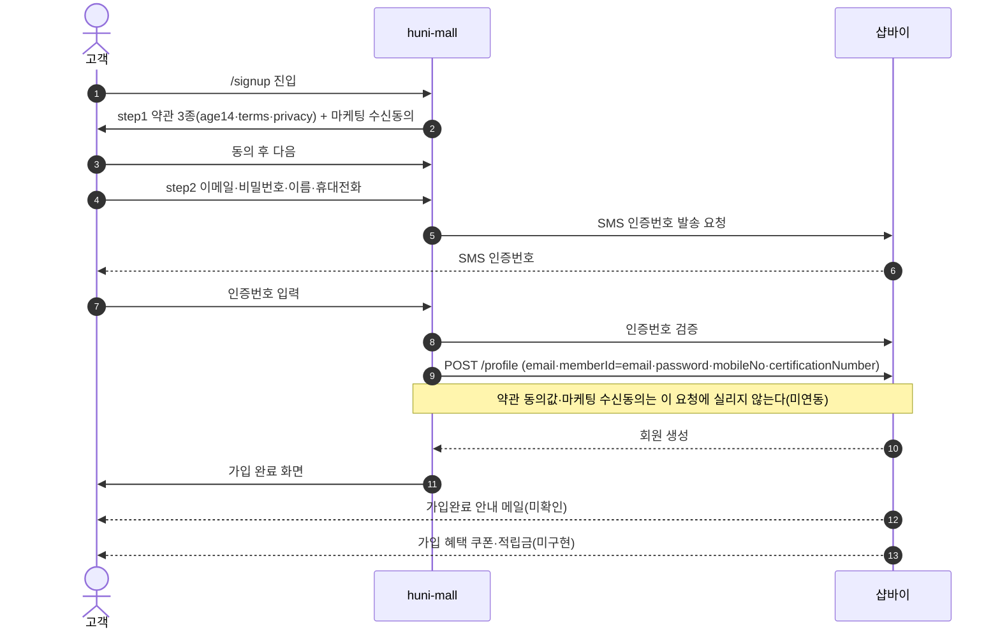
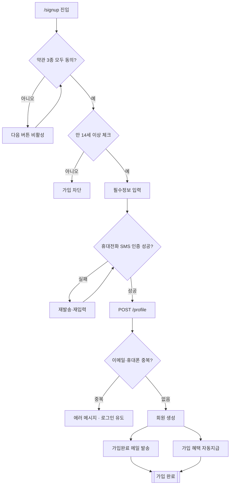

# P01 회원가입(이메일 식별자)

> 카드 `t62` · L1 **회원·인증** · L2 **가입** · 기능 행 8개

## 1. 한줄정의 · 시작/끝 · 등장인물

**한줄정의** — 처음 온 고객이 약관에 동의하고 휴대전화 본인인증을 거쳐 huni-mall 계정을 만들고, 가입 혜택까지 받는 한 흐름.

- **시작**: 고객이 `/signup` 진입
- **끝**: 샵바이에 회원 생성 + 가입완료 메일·쿠폰/적립금 지급

**등장인물**

- 고객
- huni-mall(`/signup`)
- 샵바이(member-shop `POST /profile`)
- 운영자(셀러어드민 — 약관·혜택 설정)

## 2. 흐름(sequence)

## 3. 분기(flowchart) — 실패·비회원·취소 포함

## 4. 단계표

| 단계 | 시스템 | 담당자 | 원장 row_id | 상태 | 근거 |
|---|---|---|---|---|---|
| 0. 로그인 식별자 정책 확정(선행) | 결정(PM·지니) | 김동학 | `STD-MEM-022` | 미착수 | https://shopby.huniprinting.co.kr/login 테스트회원 ID 입력 → 「올바른 이메일 형식이 아닙니다」 @ 2026-09-16 21:30 |
| 1. 약관 동의·전체동의 | huni-mall | 김동학 | `STD-MEM-002` | 부분 | [L4b보강] huni-skin-shopby/src/components/auth/signup-form.tsx:24-25,75-76 |
| 2. 만 14세 미만 가입 제한 | huni-mall | 김동학 | `STD-MEM-004` | 작동 | https://shopby.huniprinting.co.kr/signup@2026-09-16 21:27 |
| 3. 휴대전화 본인인증(SMS/PASS) | huni-mall → 샵바이 | 김동학 | `STD-MEM-003` | 부분 | SB-043 absent(인증 SDK·API 호출 지점 0건) · L2 service-dependency D-17 endpoint='(호출 지점 없음)' |
| 4. 1인 1계정 중복가입 제한 | 샵바이 | 김동학 | `STD-MEM-005` | 부분 | huni-skin-shopby/src/app/api/auth/signup/route.ts:8-33 |
| 5. 회원가입 생성 | huni-mall → 샵바이 | 김동학 | `STD-MEM-001` | 작동 | https://shopby.huniprinting.co.kr/signup@2026-09-16 21:33 |
| 6. 가입완료 안내 메일 발송 | 샵바이 | 최숙진 | `STD-MEM-021` | 미착수 | https://shopby.huniprinting.co.kr/signup 2단계(정보입력) @ 2026-09-16 21:33 |
| 7. 가입완료 혜택 자동지급(쿠폰+적립금) | 샵바이 | 최숙진 | `STD-MEM-006` ↔ 프로모션 P19(쿠폰 발행)와 맞물림 — 같은 카드 t62 안 | 미착수 | print-kb/wiki/policy/membership-auth.md#MEM-07 · L4 사유: L2 인벤토리에 가입완료 혜택 지급 행 없음. X-SHOPBY-NATIVE-01 가입완료 메일 native 범위 미확인. |

## 5. 빠진 곳

| 종류 | 내용 | 제안 담당 | 선행 |
|---|---|---|---|
| **다 — 코드는 있는데 연결 안 됨** | 약관 동의값(`joinTermsAgreements`)·마케팅 수신동의(`smsAgreed`·`directMailAgreed`)를 폼이 수집하지만 가입 요청에 싣지 않는다 — 몰 약관 ID 매핑이 없다. 샵바이 `POST /profile` 스펙에는 세 필드가 모두 있다. | 김동학 | 운영자가 셀러어드민에서 약관 ID 확정 |
| **나 — 행은 있는데 코드 0** | 가입완료 혜택 자동지급(`STD-MEM-006`) 행은 있으나 코드·설정 지점을 찾지 못했다 — 샵바이 네이티브 혜택인지 별도 구현인지 미확정. | 최숙진 | 쿠폰 발행 설계(P19) 확정 |
| **라 — 결정 미정** | 로그인 식별자 정책(이메일 전용 vs 아이디)이 미확정 — 현재 코드는 `memberId = email` 로 고정돼 있다. | 지니·신우진 | 없음 |

## 6. 채우는 방법

- 김동학: 셀러어드민 약관 목록에서 약관 ID를 받아 `signup/route.ts` 의 `shopbySignup` 호출에 `joinTermsAgreements`·`smsAgreed`·`directMailAgreed` 를 추가한다.
- 최숙진: 셀러어드민에서 가입완료 쿠폰·적립금 자동지급 설정이 가능한지 확인하고, 불가하면 `/coupons/issues` 호출 잡을 요청한다.
- 지니·신우진: 식별자 정책을 확정해 `STD-MEM-022` 를 닫는다.

## 7. 확인 못 한 것

- 가입완료 안내 메일이 샵바이 네이티브로 자동 발송되는지 — 셀러어드민 메일 템플릿 설정을 확인하지 못했다.
- 몰 설정의 "가입 시 본인인증 필수" 값 — 코드 주석이 두 경우를 모두 대비하고 있어 실제 설정을 확인하지 못했다.
