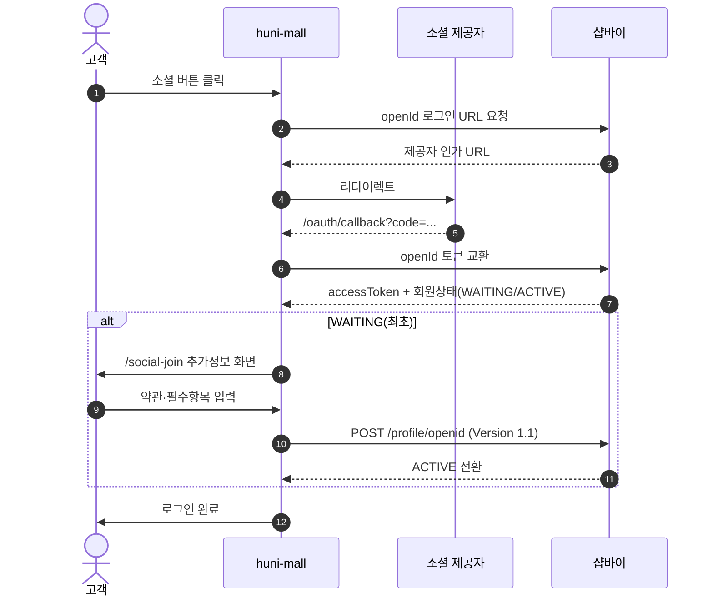
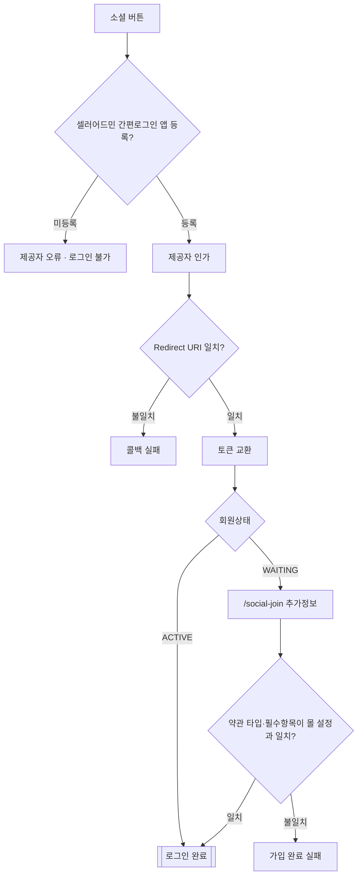

# P02 소셜 로그인 가입·연결

> 카드 `t62` · L1 **회원·인증** · L2 **로그인** · 기능 행 5개

## 1. 한줄정의 · 시작/끝 · 등장인물

**한줄정의** — 고객이 카카오·네이버·구글·애플 계정으로 최초 로그인해 추가정보를 채우고 정회원(ACTIVE)이 되는 흐름.

- **시작**: 고객이 로그인 화면에서 소셜 버튼 클릭
- **끝**: `POST /profile/openid` 로 WAITING → ACTIVE 전환

**등장인물**

- 고객
- huni-mall(`/oauth/callback`·`/social-join`)
- 샵바이(member-shop `/profile/openid`)
- 운영자(셀러어드민 간편로그인 앱 등록)

## 2. 흐름(sequence)

## 3. 분기(flowchart) — 실패·비회원·취소 포함

## 4. 단계표

| 단계 | 시스템 | 담당자 | 원장 row_id | 상태 | 근거 |
|---|---|---|---|---|---|
| 0. 간편로그인 앱 등록·Redirect URI 등록(전제) | 운영자(셀러어드민·제공자 개발자센터) | 최숙진 | `STD-MEM-023` | 미착수 | commit 13ed106 본문 「⚠ 동작 전제(코드 외)」 · huni-skin-shopby/src/components/auth/sns-buttons.tsx:66-67 |
| 1. 카카오 소셜 로그인 | huni-mall | 김동학 | `STD-MEM-010` | 부분 | SB-041 stub — huni-skin-shopby/src/components/auth/sns-buttons.tsx:74-80 (토스트만·signIn 미호출) · D-16 providers 빈 배열 |
| 2. 네이버 소셜 로그인 | huni-mall | 김동학 | `STD-MEM-011` | 부분 | SB-041 stub — sns-buttons.tsx:74-80 · D-16 |
| 3. 구글/애플 소셜 로그인 | huni-mall | 김동학 | `STD-MEM-012` | 부분 | SB-041 stub — sns-buttons.tsx:74-80 · D-16 |
| 4. 최초 로그인 가입완료(WAITING→ACTIVE) 추가정보 | huni-mall → 샵바이 | 김동학 | `STD-MEM-024` | 미착수 | commit 4f33a67 · huni-skin-shopby/src/app/api/auth/social-join/route.ts:1-9 · https://shopby.huniprinting.co.kr/social-join 200 「추가정보 입력」 @ 2026-09-16 22:00 |

## 5. 빠진 곳

| 종류 | 내용 | 제안 담당 | 선행 |
|---|---|---|---|
| **나 — 행은 있는데 코드 0** | `STD-MEM-023`(앱 등록·Redirect URI `{origin}/oauth/callback`)은 코드가 아니라 설정 작업 — 셀러어드민과 각 개발자센터에서 등록됐는지 확인하지 못했다. | 최숙진 | 몰 도메인(origin) 확정 |
| **라 — 결정 미정** | 소셜 계정 연결 해제(unlink)·같은 이메일의 일반가입 계정과의 병합 정책이 원장에 없고 결정도 없다. | 신우진 | 식별자 정책(`STD-MEM-022`) 확정 |

## 6. 채우는 방법

- 최숙진: 셀러어드민 간편로그인 앱 3종 등록 상태와 각 개발자센터 Redirect URI 를 캡처로 확인한다.
- 김동학: `/social-join` 의 약관 타입·필수항목을 몰 설정과 대조해 실검증한다(`STD-MEM-024`).

## 7. 확인 못 한 것

- 애플 로그인이 실제로 활성인지 — 코드의 `SOCIAL_PROVIDER_MAP` 에는 있으나 몰 설정을 확인하지 못했다.
