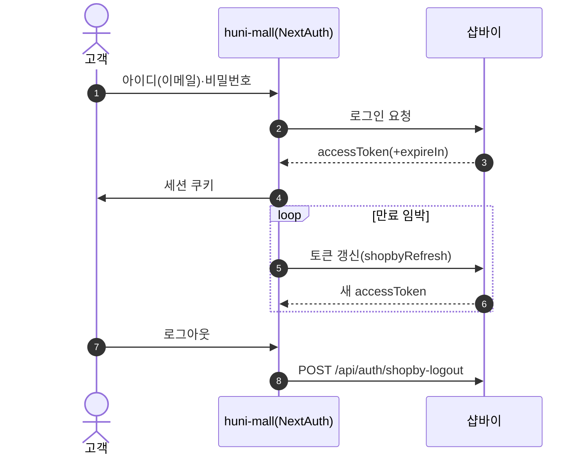
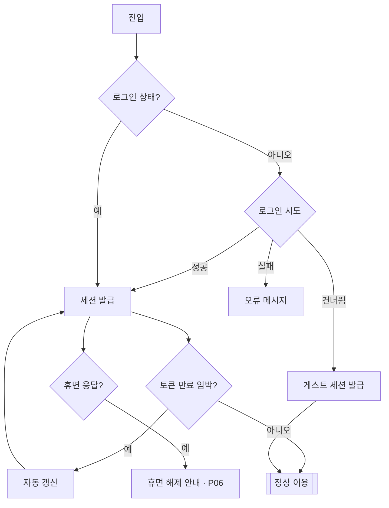

# P03 로그인·세션 유지·비회원 세션

> 카드 `t62` · L1 **회원·인증** · L2 **로그인·세션** · 기능 행 3개

## 1. 한줄정의 · 시작/끝 · 등장인물

**한줄정의** — 회원이 로그인해 토큰을 유지하고, 로그인하지 않은 고객도 장바구니·주문까지 갈 수 있게 게스트 세션을 잡아주는 흐름.

- **시작**: 고객이 `/login` 진입 또는 비회원으로 상품 담기
- **끝**: 세션 유효(자동 갱신) 또는 게스트 식별자 발급

**등장인물**

- 고객
- huni-mall(NextAuth)
- 샵바이(로그인·토큰 갱신)

## 2. 흐름(sequence)

## 3. 분기(flowchart) — 실패·비회원·취소 포함

## 4. 단계표

| 단계 | 시스템 | 담당자 | 원장 row_id | 상태 | 근거 |
|---|---|---|---|---|---|
| 1. 아이디/비밀번호 로그인 | huni-mall → 샵바이 | 김동학 | `STD-MEM-007` | 부분 | huni-skin-shopby/src/lib/auth/auth.config.ts:12-22 · src/lib/auth/shopby-auth.ts:1 |
| 2. 로그인 세션 유지·자동 갱신 | huni-mall | 김동학 | `STD-MEM-013` | 부분 | SB-040 done — huni-skin-shopby/src/lib/auth/auth.config.ts:18-22 · src/app/api/shop/[...path]/route.ts:20-27 |
| 3. 비회원 게스트 세션 처리 | huni-mall | 김동학 | `STD-MEM-014` ↔ t63 장바구니·주문(비회원 주문) | 작동 | https://shopby.huniprinting.co.kr/cart@2026-09-16 21:27 |

## 5. 빠진 곳

| 종류 | 내용 | 제안 담당 | 선행 |
|---|---|---|---|
| **다 — 코드는 있는데 연결 안 됨** | 휴면(dormant) 응답 필드(`expireIn`)를 타입에는 두었으나 휴면 안내·해제 화면으로 이어지는 분기를 찾지 못했다 — P06 과 끊겨 있다. | 김동학 | 휴면 정책(`STD-MEM-019`) 확정 |

## 6. 채우는 방법

- 김동학: 로그인 응답이 휴면일 때 `/profile/dormancy` 해제 화면으로 보내는 분기를 추가한다.

## 7. 확인 못 한 것

- 게스트 세션이 주문까지 어디서 끊기는지 — 비회원 주문 경로는 t63(장바구니·주문) 범위라 여기서 끝까지 따라가지 않았다.
