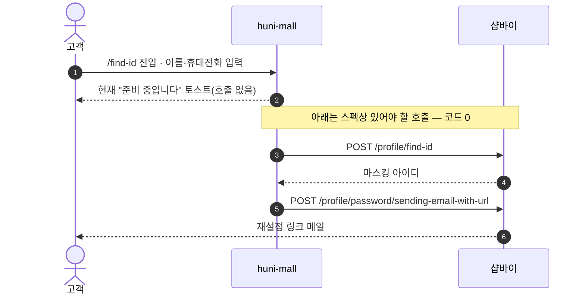
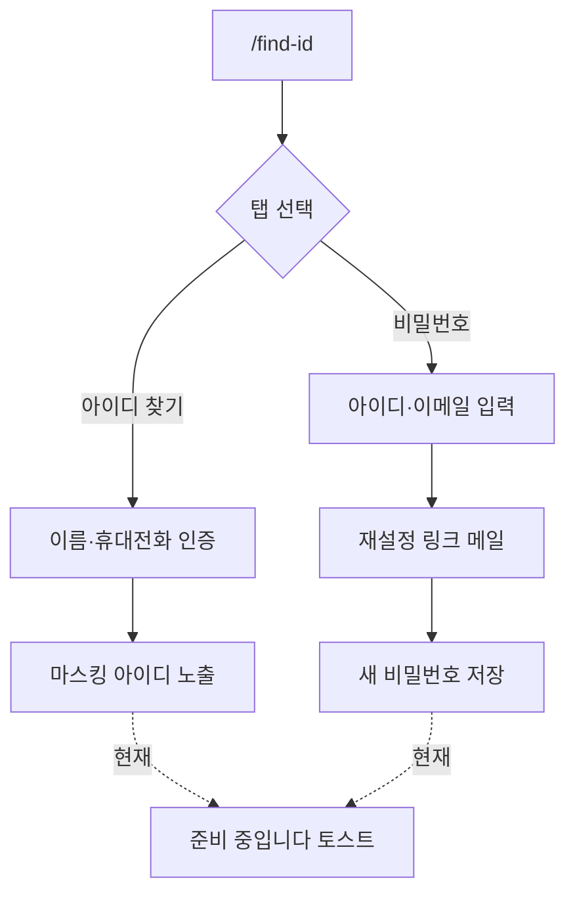

# P04 계정 찾기(아이디·비밀번호)

> 카드 `t62` · L1 **회원·인증** · L2 **로그인** · 기능 행 2개

## 1. 한줄정의 · 시작/끝 · 등장인물

**한줄정의** — 로그인하지 못하는 고객이 아이디를 마스킹된 형태로 찾거나, 이메일 링크로 비밀번호를 재설정하는 흐름.

- **시작**: 고객이 `/find-id` 진입
- **끝**: 마스킹 아이디 노출 또는 재설정 메일 발송

**등장인물**

- 고객
- huni-mall(`/find-id`)
- 샵바이(member-shop `/profile/find-id`·`/profile/find-password`)

## 2. 흐름(sequence)

## 3. 분기(flowchart) — 실패·비회원·취소 포함

## 4. 단계표

| 단계 | 시스템 | 담당자 | 원장 row_id | 상태 | 근거 |
|---|---|---|---|---|---|
| 1. 아이디 찾기(마스킹) | huni-mall → 샵바이 | 김동학 | `STD-MEM-008` | 미착수 | SB-042 stub — huni-skin-shopby/src/components/auth/find-id-form.tsx:50-56 (토스트 '준비 중') |
| 2. 비밀번호 재설정(이메일 링크) | huni-mall → 샵바이 | 김동학 | `STD-MEM-009` | 미착수 | SB-042 stub — find-id-form.tsx:50-56 |

## 5. 빠진 곳

| 종류 | 내용 | 제안 담당 | 선행 |
|---|---|---|---|
| **나 — 행은 있는데 코드 0** | 화면·폼은 있으나 두 기능 모두 "준비 중입니다" 토스트로 끝난다. 샵바이 shop API 에는 `/profile/find-id`·`/profile/find-password`·`/profile/password/sending-email-with-url` 이 모두 있다 — 배선만 남았다. | 김동학 | 없음 |

## 6. 채우는 방법

- 김동학: `find-id-form.tsx` 의 두 분기를 샵바이 shop API 호출로 교체한다. 본인확인 방식(SMS vs 이메일)은 `/profile/password/no-authentication/certificated-by-sms|email` 중 몰 설정에 맞는 쪽을 고른다.

## 7. 확인 못 한 것

- 아이디 찾기의 본인확인 수단(SMS·CI·이메일) 중 어떤 것이 몰 설정에서 허용되는지 확인하지 못했다.
