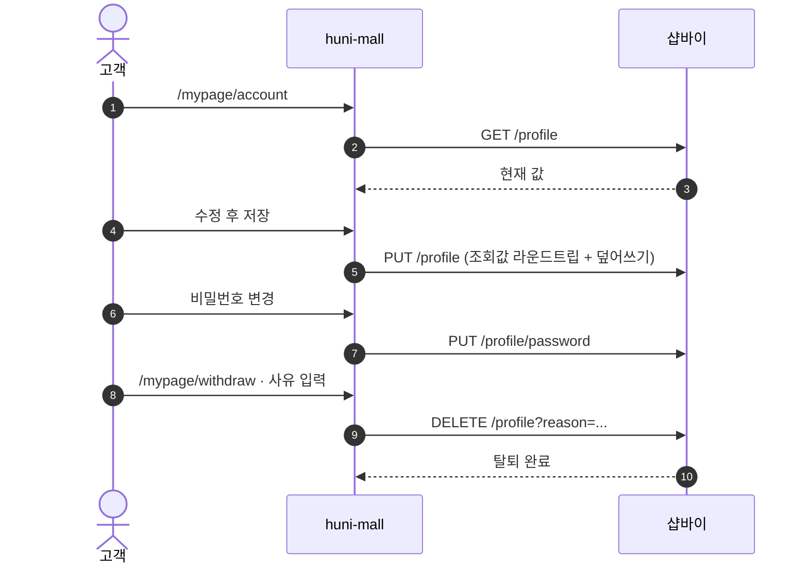
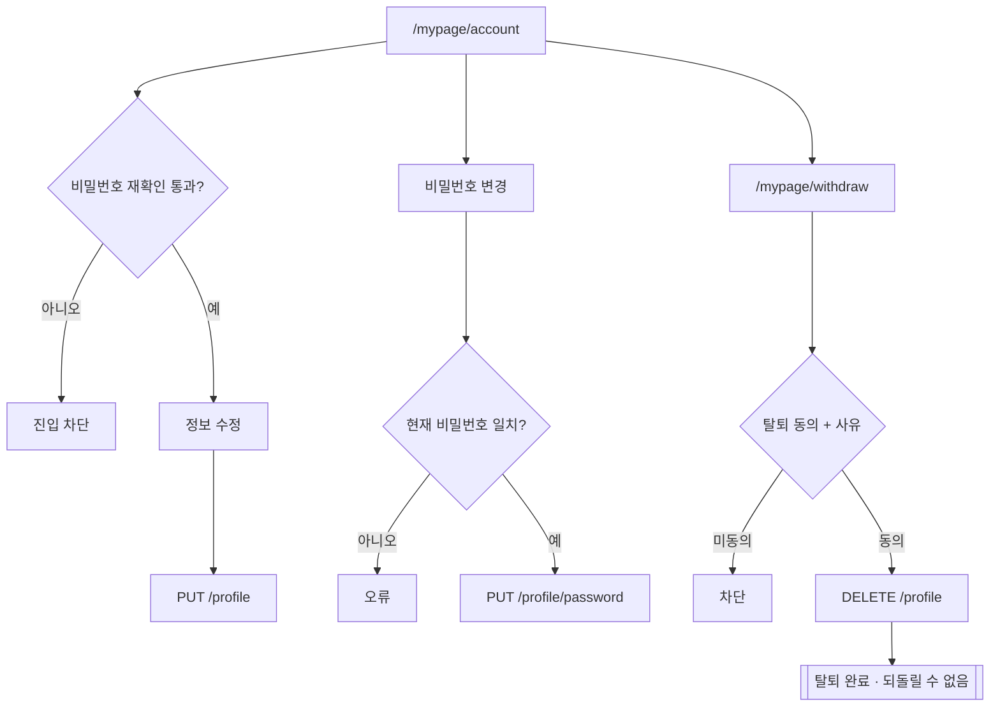

# P05 회원정보 변경·탈퇴

> 카드 `t62` · L1 **회원·인증** · L2 **회원** · 기능 행 3개

## 1. 한줄정의 · 시작/끝 · 등장인물

**한줄정의** — 회원이 내 정보를 고치고, 비밀번호를 바꾸고, 필요하면 탈퇴하는 흐름.

- **시작**: 마이페이지 → 회원정보
- **끝**: 정보 갱신 또는 탈퇴 완료(되돌릴 수 없음)

**등장인물**

- 고객
- huni-mall(`/mypage/account`·`/mypage/withdraw`)
- 샵바이(`GET/PUT/DELETE /profile`)

## 2. 흐름(sequence)

## 3. 분기(flowchart) — 실패·비회원·취소 포함

## 4. 단계표

| 단계 | 시스템 | 담당자 | 원장 row_id | 상태 | 근거 |
|---|---|---|---|---|---|
| 1. 회원정보 수정(비밀번호 재확인) | huni-mall → 샵바이 | 김동학 | `STD-MEM-015` | 부분 | huni-skin-shopby/src/lib/api/hooks/use-profile.ts:42 |
| 2. 비밀번호 변경 | huni-mall → 샵바이 | 김동학 | `STD-MEM-016` | 부분 | huni-skin-shopby/src/lib/api/hooks/use-profile.ts:42 |
| 3. 회원탈퇴 | huni-mall → 샵바이 | 김동학 | `STD-MEM-017` ↔ P10 프린팅머니(잔액 처리 미정) | 부분 | huni-skin-shopby/src/lib/api/hooks/use-profile.ts:112 · src/components/mypage/withdraw-section.tsx:4 |

## 5. 빠진 곳

| 종류 | 내용 | 제안 담당 | 선행 |
|---|---|---|---|
| **다 — 코드는 있는데 연결 안 됨** | 비밀번호 재확인 게이트(`/profile/check-password`)가 샵바이 스펙에는 있으나 `/mypage/account` 진입에 걸려 있는지 확인하지 못했다. | 김동학 | 없음 |
| **라 — 결정 미정** | 탈퇴 시 프린팅머니 잔액·미사용 쿠폰 처리 규칙이 원장에도 결정에도 없다. | 최숙진·신우진 | 프린트머니 원장 소유 결정(`STD-MYP-051`) |

## 6. 채우는 방법

- 김동학: `/mypage/account` 진입 전 `/profile/check-password` 를 태우고, 탈퇴 전 잔액 경고를 붙인다(정책 확정 후).
- 최숙진: 탈퇴 시 잔액·쿠폰 처리 규칙을 정해 원장 행으로 올린다(gaps 제안).

## 7. 확인 못 한 것

- 탈퇴 후 재가입 제한 기간이 몰 설정에 있는지 확인하지 못했다.
