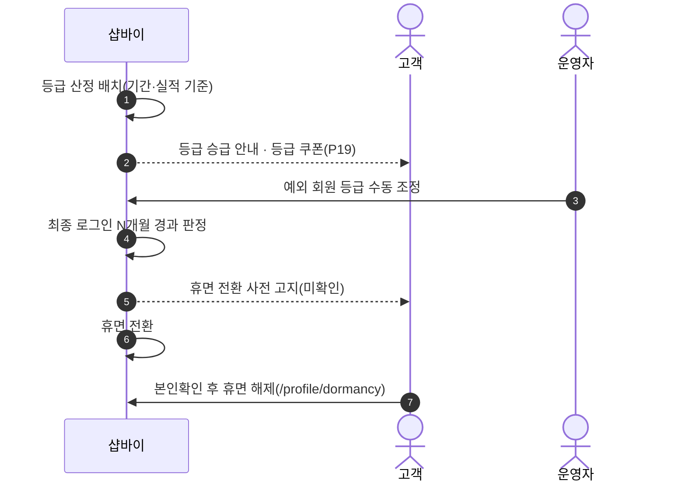
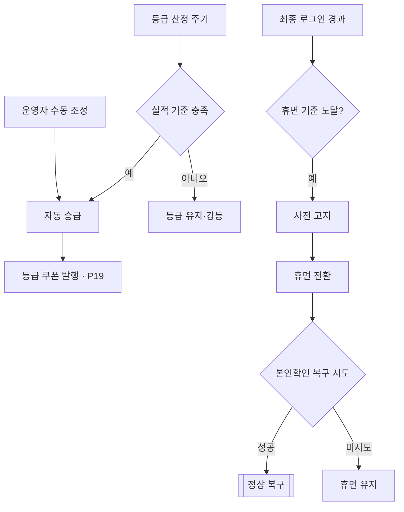

# P06 회원등급·휴면 생애주기

> 카드 `t62` · L1 **회원·인증** · L2 **회원** · 기능 행 3개

## 1. 한줄정의 · 시작/끝 · 등장인물

**한줄정의** — 구매 실적에 따라 등급이 오르내리고, 오래 쓰지 않으면 휴면으로 내려갔다가 본인확인으로 돌아오는 흐름.

- **시작**: 등급 산정 배치 또는 최종 로그인 후 경과
- **끝**: 등급 갱신·혜택 지급 또는 휴면 전환·복구

**등장인물**

- 고객
- 샵바이(`/grades`·`/profile/grades`·`/profile/dormant`)
- 운영자(셀러어드민 — 수동 조정)

## 2. 흐름(sequence)

## 3. 분기(flowchart) — 실패·비회원·취소 포함

## 4. 단계표

| 단계 | 시스템 | 담당자 | 원장 row_id | 상태 | 근거 |
|---|---|---|---|---|---|
| 1. 회원등급 산정·자동 승급 | 샵바이 | 서희항 | `STD-MEM-018` ↔ P19 쿠폰 발행(등급 쿠폰) | 미착수 | [L4b보강] huni-skin-shopby/src/lib/api/hooks/use-profile.ts:39 (memberGradeName 표시 필드만) |
| 2. 회원등급 수동 조정 | 운영자(셀러어드민) | 김동학 | `STD-ADC-002` | 미착수 | print-kb/wiki/policy/membership-auth.md#MEM-06 · L4 사유: grade_cd ↔ 샵바이 memberGrade 매핑이 미결(X-DEC-GRADE) — 등급가가 걸려 돈 영향 |
| 3. 휴면계정 전환·복구 | 샵바이 | 최숙진 | `STD-MEM-019` | 미착수 | [L4b보강] huni-skin-shopby/src/lib/auth/shopby-auth.ts:28 (휴면 응답 주석만·전환/복구 화면 0건) |

## 5. 빠진 곳

| 종류 | 내용 | 제안 담당 | 선행 |
|---|---|---|---|
| **나 — 행은 있는데 코드 0** | 등급·휴면 모두 샵바이 server API(`/grades`·`/profile/grades`·`/profile/dormant`·`/profile/dormant-release`)와 shop API(`/member-grades`·`/profile/dormancy`)가 있으나 huni-mall·webadmin 어디에서도 호출 지점을 찾지 못했다. | 서희항·최숙진 | 등급 체계(등급 수·기준) 확정 |
| **라 — 결정 미정** | 등급 체계 자체(몇 등급·기준 금액·혜택)가 원장에도 결정 문서에도 없다. | 지니·최숙진 | 없음 |
| **가 — 원장에 행 없음** | 휴면 전환 사전 고지(메일·SMS) 발송이 원장에 행으로 없다 — 정보통신망법상 사전 통지가 필요하다. | 최숙진 | 휴면 정책 확정 |

## 6. 채우는 방법

- 최숙진: 셀러어드민 등급·휴면 설정 화면을 캡처해 현 설정을 확정한다.
- 김동학: 휴면 로그인 응답 → `/profile/dormancy` 해제 화면 분기를 붙인다(P03 과 같은 결함).

## 7. 확인 못 한 것

- 등급 산정이 샵바이 네이티브 배치로 도는지, 별도 호출이 필요한지 확인하지 못했다.
