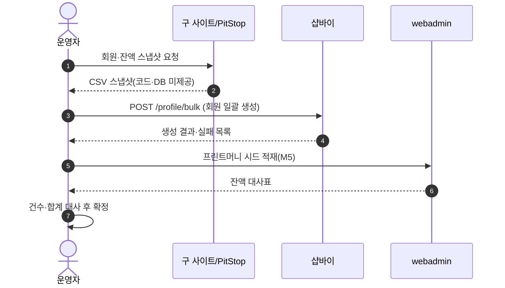
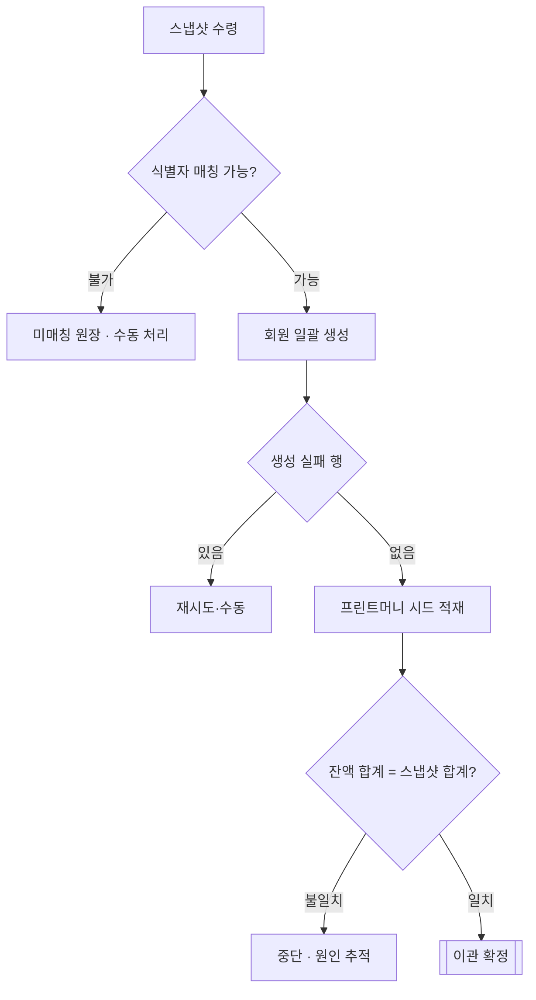

# P07 구 사이트 회원·프린트머니 잔액 이관

> 카드 `t62` · L1 **회원·인증** · L2 **회원** · 기능 행 5개

## 1. 한줄정의 · 시작/끝 · 등장인물

**한줄정의** — 구 ASP 사이트의 회원과 프린트머니 잔액을 새 몰로 한 번에 옮기는, 되돌릴 수 없는 일회성 흐름.

- **시작**: 구 사이트 회원·잔액 스냅샷 수령
- **끝**: 샵바이 회원 생성 + 프린트머니 시드 적재 + 대사(reconcile)

**등장인물**

- 운영자
- 샵바이(`/profile/bulk`)
- webadmin(프린트머니 원장)
- PitStop Server(구 잔액 원천)

## 2. 흐름(sequence)

## 3. 분기(flowchart) — 실패·비회원·취소 포함

## 4. 단계표

| 단계 | 시스템 | 담당자 | 원장 row_id | 상태 | 근거 |
|---|---|---|---|---|---|
| 0. 구 ASP 코드·DB 미제공 전제 확정 | 결정(최숙진) | 최숙진 | `STD-MYP-026` | 미착수 | 후니정기미팅 정리260915.html §프린팅머니 · 확정 4 |
| 1. 이관·PitStop 연동 담당 확정 | 결정(미정) | 미정 | `STD-MYP-024` | 미착수 | 후니정기미팅 정리260915.html §개발 역할 분담 · 미결 4 |
| 2. 기존 회원 데이터 이관 | 운영자 → 샵바이 | 서희항 | `STD-MEM-020` ↔ t65 시스템·플랫폼(컷오버 일정) | 미착수 | print-kb/wiki/policy/membership-auth.md#MEM-01 마이그레이션 이슈 명시 · L4 사유: 돈 걸림. 구 DB 미접근(X-OLDDB-ACCESS-01)이 20개 질문의 공통 선행 블로커. 이관 리허설 미실행. |
| 3. 기존 프린트머니 잔액 이관 | webadmin | 서희항 | `STD-MYP-009` | 미착수 | print-kb/wiki/policy/mypage.md#MYP-02 · print-kb/wiki/policy/custom-dev.md#CST-04 · L4 사유: 돈 걸림. 컷오버 대사 불일치 시 즉시 NO-GO 게이트. |
| 4. 프린트머니 M5 — 마이그레이션 시드 실행 | webadmin | 미정 | `STD-MYP-047` | 미착수 | _workspace/huni-shopby/17_prepaid-money/prepaid-money-design-260915.md:293 |

## 5. 빠진 곳

| 종류 | 내용 | 제안 담당 | 선행 |
|---|---|---|---|
| **라 — 결정 미정** | 이관·PitStop 연동 담당이 `미정` 이다(`STD-MYP-024`). 담당이 없으면 시작할 수 없다. | 신우진 | 없음 |
| **나 — 행은 있는데 코드 0** | 프린트머니 시드를 받을 그릇(`t_pm_charge_txn`)이 webadmin 에 없다 — 저장소 전체 검색에서 한 건도 찾지 못했다. | 서희항 | `STD-MYP-043`(M1 원장 생성) |
| **라 — 결정 미정** | 이관 시점의 잔액 기준일·동결 구간(구 사이트 사용 중지 시각)이 정해져 있지 않다. | 신우진·지니 | 컷오버 일정 |

## 6. 채우는 방법

- 신우진: `STD-MYP-024`·`STD-MYP-023` 담당을 배정한다.
- 서희항: `t_pm_charge_txn` 을 먼저 만들고(P10 M1), 그 위에 시드를 적재한다.
- 최숙진: 구 사이트 잔액 스냅샷의 포맷·전달 시점을 확정한다.

## 7. 확인 못 한 것

- PitStop Server 가 잔액 원천인지, 구 ASP DB 가 원천인지 — 두 표현이 원장에 섞여 있고 실물을 확인하지 못했다.
- 구 회원의 비밀번호 이관 가능 여부(해시 호환) — 확인하지 못했다.
